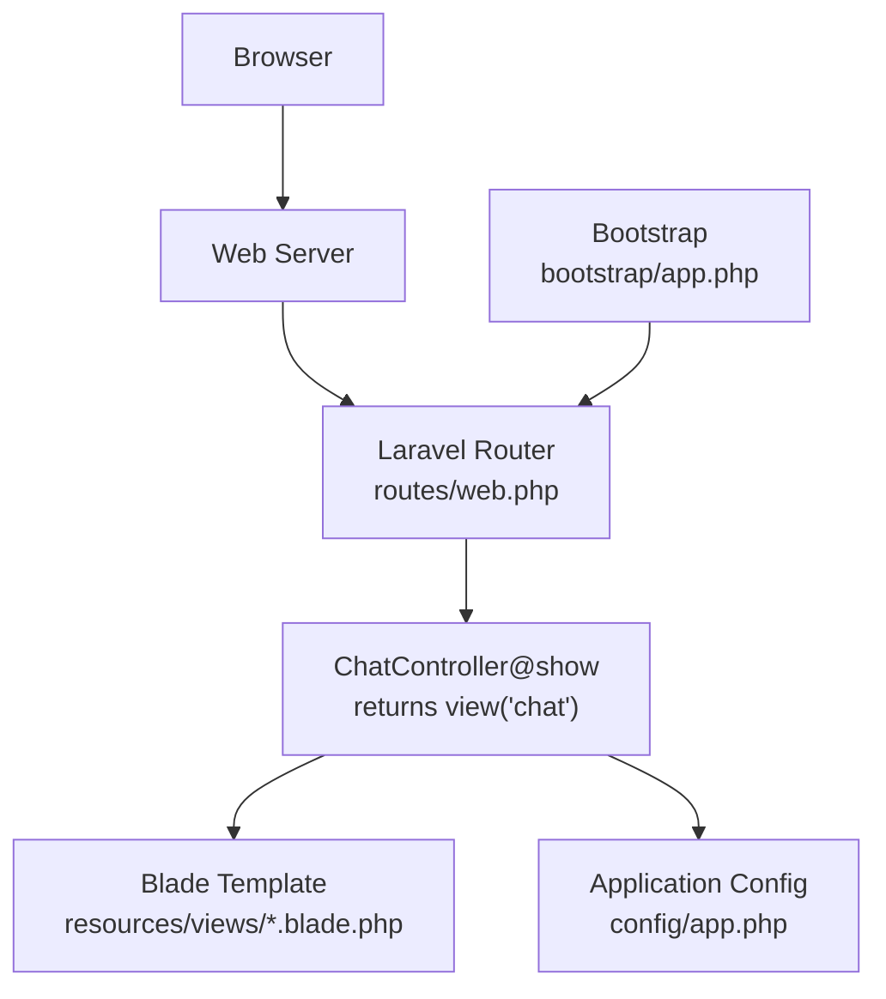
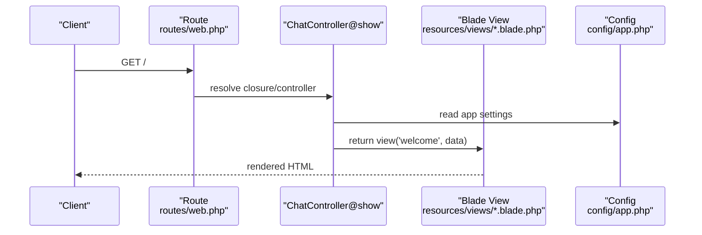
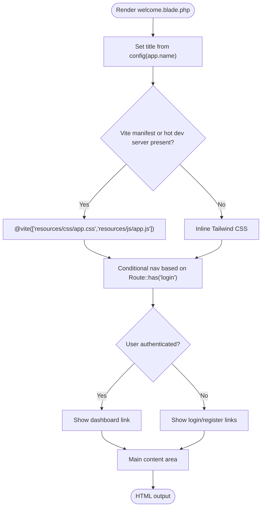
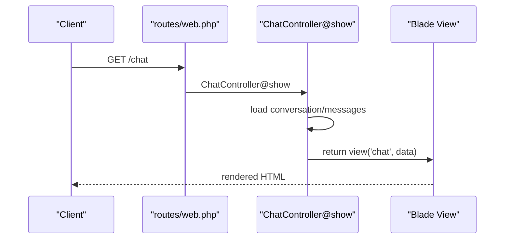
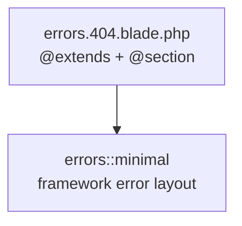
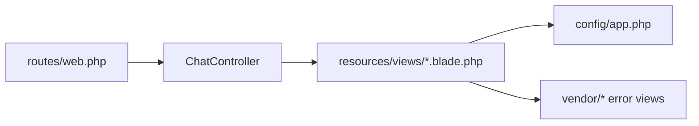

# Blade Templating

<cite>
**Referenced Files in This Document**
- [welcome.blade.php](file://resources/views/welcome.blade.php)
- [web.php](file://routes/web.php)
- [ChatController.php](file://app/Http/Controllers/ChatController.php)
- [app.php](file://config/app.php)
- [app.php](file://bootstrap/app.php)
- [blade-views.md](file://.agents/skills/laravel-best-practices/rules/blade-views.md)
- [db-performance.md](file://.agents/skills/laravel-best-practices/rules/db-performance.md)
- [404.blade.php](file://vendor/laravel/framework/src/Illuminate/Foundation/Exceptions/views/404.blade.php)
</cite>

## Table of Contents
1. [Introduction](#introduction)
2. [Project Structure](#project-structure)
3. [Core Components](#core-components)
4. [Architecture Overview](#architecture-overview)
5. [Detailed Component Analysis](#detailed-component-analysis)
6. [Dependency Analysis](#dependency-analysis)
7. [Performance Considerations](#performance-considerations)
8. [Troubleshooting Guide](#troubleshooting-guide)
9. [Conclusion](#conclusion)
10. [Appendices](#appendices)

## Introduction
This document explains Blade templating in Laravel with a focus on server-side rendering and the template system. It covers template inheritance, component composition, and data passing mechanisms. It documents Blade syntax, directives, and conditional rendering patterns, and demonstrates practical examples such as template composition, partial inclusion, and layout management. It also addresses integration with frontend assets, asset URL generation, environment-specific rendering, performance optimization, caching strategies, security considerations (including XSS prevention), progressive enhancement, SEO optimization, and maintainable template architecture for large applications.

## Project Structure
The repository includes a minimal Laravel skeleton with a welcome page implemented in Blade. Routes define the homepage and a chat endpoint. Controllers render views and pass data. Configuration files define application metadata and environment settings. Blade best practices are documented in skill guides.

**Diagram sources**
- [web.php:6-8](file://routes/web.php#L6-L8)
- [ChatController.php:17-30](file://app/Http/Controllers/ChatController.php#L17-L30)
- [app.php:16](file://config/app.php#L16)
- [app.php:7-18](file://bootstrap/app.php#L7-L18)

**Section sources**
- [web.php:1-12](file://routes/web.php#L1-L12)
- [ChatController.php:1-92](file://app/Http/Controllers/ChatController.php#L1-L92)
- [app.php:1-127](file://config/app.php#L1-L127)
- [app.php:1-19](file://bootstrap/app.php#L1-L19)

## Core Components
- Blade templates: Server-side rendered HTML with embedded PHP-like syntax and directives.
- Route-to-view binding: Routes return Blade views directly (e.g., homepage).
- Controller-driven data: Controllers fetch data and pass it to views.
- Configuration-driven environment: Application name, URL, locale, and environment are configured centrally.

Key capabilities demonstrated:
- Embedding configuration values into templates.
- Conditional rendering using route helpers.
- Asset integration via Vite and fallback styles.
- Environment-aware rendering (e.g., dark mode classes).

**Section sources**
- [welcome.blade.php:7](file://resources/views/welcome.blade.php#L7)
- [welcome.blade.php:14-20](file://resources/views/welcome.blade.php#L14-L20)
- [welcome.blade.php:22-50](file://resources/views/welcome.blade.php#L22-L50)
- [web.php:6-8](file://routes/web.php#L6-L8)
- [ChatController.php:26-29](file://app/Http/Controllers/ChatController.php#L26-L29)
- [app.php:16](file://config/app.php#L16)
- [app.php:29](file://config/app.php#L29)

## Architecture Overview
Blade integrates tightly with Laravel’s routing and controller layers. Requests hit routes, controllers prepare data, and views render HTML. Configuration influences runtime behavior such as application name, URL, and environment.

**Diagram sources**
- [web.php:6-8](file://routes/web.php#L6-L8)
- [ChatController.php:17-30](file://app/Http/Controllers/ChatController.php#L17-L30)
- [app.php:16](file://config/app.php#L16)

## Detailed Component Analysis

### Welcome Page Template
The welcome page demonstrates:
- Using configuration values for the page title.
- Conditional asset loading with Vite and fallback styles.
- Conditional navigation based on route availability.
- Environment-aware classes (e.g., dark mode).
- SVG-based branding and animations.

**Diagram sources**
- [welcome.blade.php:7](file://resources/views/welcome.blade.php#L7)
- [welcome.blade.php:14-20](file://resources/views/welcome.blade.php#L14-L20)
- [welcome.blade.php:22-50](file://resources/views/welcome.blade.php#L22-L50)

**Section sources**
- [welcome.blade.php:1-226](file://resources/views/welcome.blade.php#L1-L226)

### Route and Controller Interaction
- The homepage route returns the welcome view directly.
- The chat controller prepares conversation and message data and returns a view with that data.

**Diagram sources**
- [web.php:10-11](file://routes/web.php#L10-L11)
- [ChatController.php:17-30](file://app/Http/Controllers/ChatController.php#L17-L30)

**Section sources**
- [web.php:1-12](file://routes/web.php#L1-L12)
- [ChatController.php:1-92](file://app/Http/Controllers/ChatController.php#L1-L92)

### Blade Syntax and Directives
Common patterns visible in the repository:
- Echo expressions for dynamic content.
- Conditional directives for environment-aware rendering.
- Asset directives for frontend integration.
- Route helpers for navigation.

Practical usage examples:
- Dynamic title and meta values.
- Conditional asset inclusion.
- Conditional navigation blocks.
- Environment-specific classes.

**Section sources**
- [welcome.blade.php:7](file://resources/views/welcome.blade.php#L7)
- [welcome.blade.php:14-20](file://resources/views/welcome.blade.php#L14-L20)
- [welcome.blade.php:22-50](file://resources/views/welcome.blade.php#L22-L50)

### Template Composition and Partials
While the repository does not include explicit partials, the best practices guide recommends:
- Prefer Blade components over include for encapsulation and explicit props.
- Use push/pushOnce to avoid duplicate scripts in components.
- Use view composers for shared data across views.

These patterns support modular, reusable templates and cleaner composition.

**Section sources**
- [blade-views.md:17-20](file://.agents/skills/laravel-best-practices/rules/blade-views.md#L17-L20)
- [blade-views.md:13-16](file://.agents/skills/laravel-best-practices/rules/blade-views.md#L13-L16)
- [blade-views.md:21-24](file://.agents/skills/laravel-best-practices/rules/blade-views.md#L21-L24)

### Layout Management and Inheritance
The framework provides a standard mechanism for layout inheritance. An example error view extends a minimal layout and injects title, code, and message sections. This pattern supports consistent layouts across pages.

**Diagram sources**
- [404.blade.php:1-6](file://vendor/laravel/framework/src/Illuminate/Foundation/Exceptions/views/404.blade.php#L1-L6)

**Section sources**
- [404.blade.php:1-6](file://vendor/laravel/framework/src/Illuminate/Foundation/Exceptions/views/404.blade.php#L1-L6)

### Frontend Asset Integration and Environment-Specific Rendering
- Vite directive is used conditionally based on the presence of a manifest or hot dev server.
- Inline CSS fallback ensures the page renders even without compiled assets.
- Environment variables influence dark mode and other theme-related classes.

**Section sources**
- [welcome.blade.php:14-20](file://resources/views/welcome.blade.php#L14-L20)
- [welcome.blade.php:22](file://resources/views/welcome.blade.php#L22)

### Security Considerations (XSS Prevention)
- Never execute queries in Blade templates; pass pre-fetched data from controllers.
- Keep logic out of templates to reduce risk surfaces.

**Section sources**
- [db-performance.md:170-192](file://.agents/skills/laravel-best-practices/rules/db-performance.md#L170-L192)

## Dependency Analysis
Blade templates depend on:
- Route resolution to select the appropriate view.
- Controller-provided data arrays.
- Configuration values for application metadata and environment.
- Vendor-provided error templates for consistent error pages.

**Diagram sources**
- [web.php:1-12](file://routes/web.php#L1-L12)
- [ChatController.php:1-92](file://app/Http/Controllers/ChatController.php#L1-L92)
- [app.php:1-127](file://config/app.php#L1-L127)

**Section sources**
- [web.php:1-12](file://routes/web.php#L1-L12)
- [ChatController.php:1-92](file://app/Http/Controllers/ChatController.php#L1-L92)
- [app.php:1-127](file://config/app.php#L1-L127)

## Performance Considerations
- Avoid queries in templates; fetch and eager-load data in controllers.
- Use generators for memory-efficient iteration on large datasets.
- Prefer Blade components for encapsulation and reuse.
- Use pushOnce to prevent duplicate script injection in components.
- Centralize shared data with view composers to avoid duplication.

**Section sources**
- [db-performance.md:152-192](file://.agents/skills/laravel-best-practices/rules/db-performance.md#L152-L192)
- [blade-views.md:13-16](file://.agents/skills/laravel-best-practices/rules/blade-views.md#L13-L16)
- [blade-views.md:21-24](file://.agents/skills/laravel-best-practices/rules/blade-views.md#L21-L24)

## Troubleshooting Guide
- Error pages use Blade layouts; ensure your error templates extend the correct minimal layout and define required sections.
- Verify route helpers used in templates match defined routes.
- Confirm configuration values (e.g., app name, URL) are set appropriately for the environment.

**Section sources**
- [404.blade.php:1-6](file://vendor/laravel/framework/src/Illuminate/Foundation/Exceptions/views/404.blade.php#L1-L6)
- [web.php:1-12](file://routes/web.php#L1-L12)
- [app.php:16](file://config/app.php#L16)

## Conclusion
Blade provides a powerful, expressive way to build server-rendered UIs in Laravel. By combining route-driven view resolution, controller-managed data, and configuration-driven behavior, applications can deliver fast, secure, and maintainable experiences. Following best practices around componentization, asset integration, performance, and security ensures scalable, robust templates for large applications.

## Appendices
- Practical examples in this repository:
  - Homepage rendering a Blade view.
  - Conditional asset loading and navigation.
  - Environment-aware theming and classes.

**Section sources**
- [web.php:6-8](file://routes/web.php#L6-L8)
- [welcome.blade.php:1-226](file://resources/views/welcome.blade.php#L1-L226)