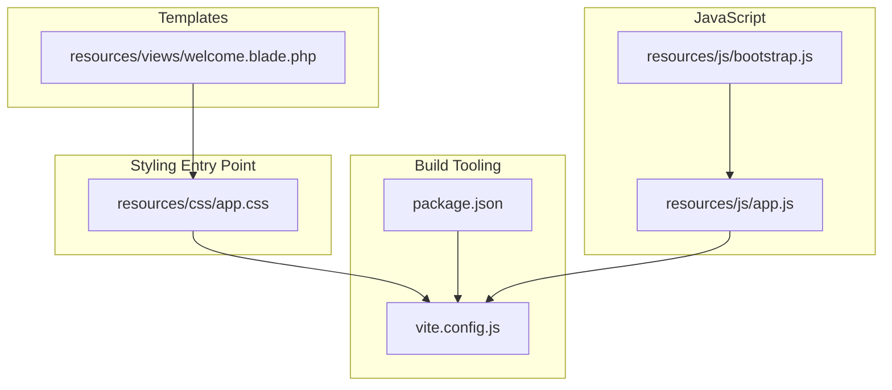
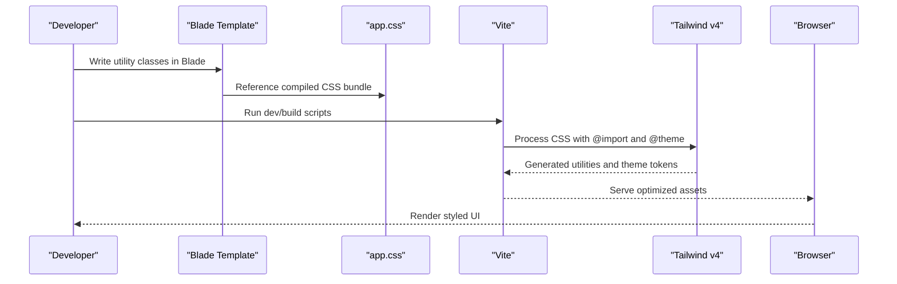
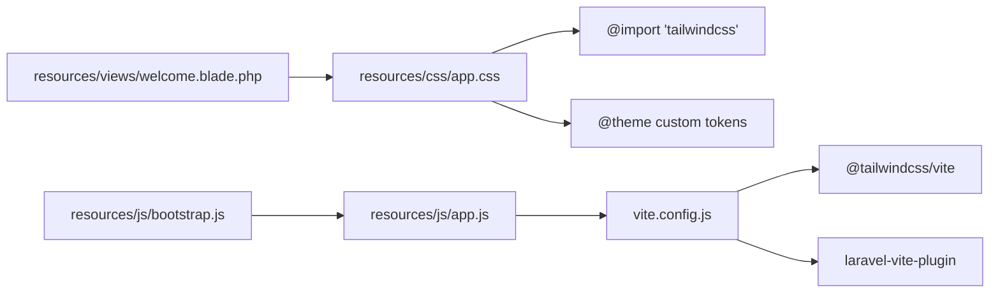

# CSS Styling System

<cite>
**Referenced Files in This Document**
- [app.css](file://resources/css/app.css)
- [welcome.blade.php](file://resources/views/welcome.blade.php)
- [package.json](file://package.json)
- [vite.config.js](file://vite.config.js)
- [app.js](file://resources/js/app.js)
- [bootstrap.js](file://resources/js/bootstrap.js)
- [SKILL.md](file://.agents/skills/tailwindcss-development/SKILL.md)
</cite>

## Table of Contents
1. [Introduction](#introduction)
2. [Project Structure](#project-structure)
3. [Core Components](#core-components)
4. [Architecture Overview](#architecture-overview)
5. [Detailed Component Analysis](#detailed-component-analysis)
6. [Dependency Analysis](#dependency-analysis)
7. [Performance Considerations](#performance-considerations)
8. [Troubleshooting Guide](#troubleshooting-guide)
9. [Conclusion](#conclusion)

## Introduction
This document describes the CSS Styling System built around Tailwind CSS v4 in the Laravel Assistant project. It explains the Tailwind configuration, custom theme setup, responsive design patterns, utility-first styling strategies, and the integration between Tailwind utilities and custom CSS. It also covers dark mode implementation, performance optimization via source discovery, and practical guidance for maintaining a scalable, team-friendly styling architecture.

## Project Structure
The styling system centers on a single entry CSS file that imports Tailwind v4 and defines a custom theme. Blade templates apply Tailwind utilities directly to markup, while Vite compiles assets during development and production builds.

**Diagram sources**
- [app.css:1-12](file://resources/css/app.css#L1-L12)
- [vite.config.js:1-19](file://vite.config.js#L1-L19)
- [package.json:1-18](file://package.json#L1-L18)
- [welcome.blade.php:1-226](file://resources/views/welcome.blade.php#L1-L226)
- [app.js:1-2](file://resources/js/app.js#L1-L2)
- [bootstrap.js:1-5](file://resources/js/bootstrap.js#L1-L5)

**Section sources**
- [app.css:1-12](file://resources/css/app.css#L1-L12)
- [vite.config.js:1-19](file://vite.config.js#L1-L19)
- [package.json:1-18](file://package.json#L1-L18)
- [welcome.blade.php:1-226](file://resources/views/welcome.blade.php#L1-L226)
- [app.js:1-2](file://resources/js/app.js#L1-L2)
- [bootstrap.js:1-5](file://resources/js/bootstrap.js#L1-L5)

## Core Components
- Tailwind v4 import and theme customization: The stylesheet imports Tailwind and defines a custom font stack via the `@theme` directive.
- Source discovery for purging: The `@source` directives inform Tailwind which files to scan for class usage, enabling safe purging in production.
- Blade-driven utility classes: Templates apply Tailwind utilities directly to elements, leveraging responsive, dark mode, and interactive variants.
- Build pipeline: Vite integrates Tailwind via the official Vite plugin and Laravel Vite Plugin for asset compilation and hot reloading.

Key implementation references:
- Tailwind import and theme: [app.css:1-12](file://resources/css/app.css#L1-L12)
- Source discovery: [app.css:3-6](file://resources/css/app.css#L3-L6)
- Blade utilities and dark mode: [welcome.blade.php:22-225](file://resources/views/welcome.blade.php#L22-L225)
- Build configuration: [vite.config.js:1-19](file://vite.config.js#L1-L19), [package.json:1-18](file://package.json#L1-L18)

**Section sources**
- [app.css:1-12](file://resources/css/app.css#L1-L12)
- [welcome.blade.php:22-225](file://resources/views/welcome.blade.php#L22-L225)
- [vite.config.js:1-19](file://vite.config.js#L1-L19)
- [package.json:1-18](file://package.json#L1-L18)

## Architecture Overview
The styling architecture follows a CSS-first configuration model with Tailwind v4. The build pipeline processes the CSS entry file, applies Tailwind transformations, and emits optimized assets. Blade templates consume the resulting styles directly.

**Diagram sources**
- [app.css:1-12](file://resources/css/app.css#L1-L12)
- [vite.config.js:1-19](file://vite.config.js#L1-L19)
- [package.json:1-18](file://package.json#L1-L18)
- [welcome.blade.php:22-225](file://resources/views/welcome.blade.php#L22-L225)

## Detailed Component Analysis

### Tailwind Configuration and Theme
- CSS-first configuration: Uses `@import 'tailwindcss'` and `@theme` to define design tokens without a separate config file.
- Custom font stack: The theme defines a system-safe font family chain for improved accessibility and performance.
- Purge sources: Explicit `@source` declarations ensure Tailwind scans Blade and JS files for class usage, supporting safe purging.

Implementation references:
- Import and theme: [app.css:1-12](file://resources/css/app.css#L1-L12)
- Source discovery: [app.css:3-6](file://resources/css/app.css#L3-L6)

**Section sources**
- [app.css:1-12](file://resources/css/app.css#L1-L12)

### Utility Classes and Component Styling Strategies
- Utility-first composition: Components are composed from small, single-purpose utilities for consistency and reuse.
- Responsive variants: Breakpoint-specific utilities adapt layouts across device sizes.
- Interactive states: Hover, focus, and active variants enhance interactivity without custom CSS.
- Dark mode variants: Dark-specific utilities switch styles based on the color scheme.

Examples in the welcome template:
- Body and layout: [welcome.blade.php:22](file://resources/views/welcome.blade.php#L22)
- Navigation and buttons: [welcome.blade.php:23-50](file://resources/views/welcome.blade.php#L23-L50)
- Content card and shadows: [welcome.blade.php:54](file://resources/views/welcome.blade.php#L54)
- Dark mode variants: [welcome.blade.php:22-225](file://resources/views/welcome.blade.php#L22-L225)

**Section sources**
- [welcome.blade.php:22-225](file://resources/views/welcome.blade.php#L22-L225)

### Design System Implementation
- Typography scale: The theme establishes a consistent scale for font sizes and line heights.
- Color palette: Semantic color tokens enable consistent branding and accessibility.
- Spacing system: A spacing unit drives margin, padding, and gap utilities for rhythm.
- Border radii and shadows: Standardized corner radii and shadow scales unify component appearance.

References:
- Typography and spacing tokens: [app.css:8-11](file://resources/css/app.css#L8-L11)
- Dark mode color usage: [welcome.blade.php:22-225](file://resources/views/welcome.blade.php#L22-L225)

**Section sources**
- [app.css:8-11](file://resources/css/app.css#L8-L11)
- [welcome.blade.php:22-225](file://resources/views/welcome.blade.php#L22-L225)

### Layout Patterns
- Flexbox centering: Used for page-level vertical and horizontal centering.
- Responsive grids: Flexible column layouts adapt to breakpoints.
- Aspect ratios and containers: Maintain visual balance and consistent widths.

References:
- Centering and flex layout: [welcome.blade.php:52-53](file://resources/views/welcome.blade.php#L52-L53)
- Container and aspect utilities: [welcome.blade.php:142-152](file://resources/views/welcome.blade.php#L142-L152)

**Section sources**
- [welcome.blade.php:52-53](file://resources/views/welcome.blade.php#L52-L53)
- [welcome.blade.php:142-152](file://resources/views/welcome.blade.php#L142-L152)

### Dark Mode Implementation
- Automatic dark adaptation: Dark variants switch backgrounds, borders, and text colors based on the user's preference.
- Blend modes and transitions: Enhance visual polish during mode switches.
- Masked illustrations: Dynamic stroke colors adapt to dark backgrounds.

References:
- Dark body classes: [welcome.blade.php:22](file://resources/views/welcome.blade.php#L22)
- Dark variants and blend modes: [welcome.blade.php:168-214](file://resources/views/welcome.blade.php#L168-L214)

**Section sources**
- [welcome.blade.php:22](file://resources/views/welcome.blade.php#L22)
- [welcome.blade.php:168-214](file://resources/views/welcome.blade.php#L168-L214)

### CSS Preprocessing Workflow and Integration
- Vite integration: Tailwind is integrated via the official Vite plugin and Laravel Vite Plugin.
- Hot module replacement: Development server watches for changes and updates assets in real time.
- Production builds: Assets are compiled and optimized for deployment.

References:
- Plugin configuration: [vite.config.js:6-12](file://vite.config.js#L6-L12)
- Scripts and dependencies: [package.json:5-16](file://package.json#L5-L16)

**Section sources**
- [vite.config.js:6-12](file://vite.config.js#L6-L12)
- [package.json:5-16](file://package.json#L5-L16)

### Custom Property Usage
- CSS custom properties: The theme defines reusable tokens for fonts, spacing, breakpoints, and typography scales.
- Property-based animations: Tailwind v4 introduces `@property` declarations for smooth transitions and transforms.

References:
- Theme tokens: [app.css:8-11](file://resources/css/app.css#L8-L11)
- Property declarations: [welcome.blade.php:17-18](file://resources/views/welcome.blade.php#L17-L18)

**Section sources**
- [app.css:8-11](file://resources/css/app.css#L8-L11)
- [welcome.blade.php:17-18](file://resources/views/welcome.blade.php#L17-L18)

### Cross-Browser Compatibility Strategies
- Modern CSS features: Uses Tailwind v4 utilities and properties designed for broad browser support.
- System font fallbacks: Ensures readable defaults across platforms.
- Vendor-neutral transitions: Leverages Tailwind's standardized transition utilities.

References:
- Font stack and base styles: [app.css:8-11](file://resources/css/app.css#L8-L11)
- Transition utilities: [welcome.blade.php:52](file://resources/views/welcome.blade.php#L52)

**Section sources**
- [app.css:8-11](file://resources/css/app.css#L8-L11)
- [welcome.blade.php:52](file://resources/views/welcome.blade.php#L52)

## Dependency Analysis
The styling system depends on Tailwind v4 and Vite for preprocessing, with Blade templates consuming the compiled output. The build configuration integrates Tailwind via the Vite plugin and Laravel Vite Plugin.

**Diagram sources**
- [app.css:1-12](file://resources/css/app.css#L1-L12)
- [vite.config.js:1-19](file://vite.config.js#L1-L19)
- [welcome.blade.php:1-226](file://resources/views/welcome.blade.php#L1-L226)
- [app.js:1-2](file://resources/js/app.js#L1-L2)
- [bootstrap.js:1-5](file://resources/js/bootstrap.js#L1-L5)

**Section sources**
- [app.css:1-12](file://resources/css/app.css#L1-L12)
- [vite.config.js:1-19](file://vite.config.js#L1-L19)
- [welcome.blade.php:1-226](file://resources/views/welcome.blade.php#L1-L226)
- [app.js:1-2](file://resources/js/app.js#L1-L2)
- [bootstrap.js:1-5](file://resources/js/bootstrap.js#L1-L5)

## Performance Considerations
- Purge optimization: The `@source` directives guide Tailwind to scan Blade and JS files, enabling aggressive purging of unused styles in production.
- Minimal custom CSS: The design relies on Tailwind utilities and theme tokens, reducing custom CSS overhead.
- Efficient transitions: Property-based animations and standardized transition utilities minimize layout thrashing.

References:
- Purge sources: [app.css:3-6](file://resources/css/app.css#L3-L6)
- Transition utilities: [welcome.blade.php:52](file://resources/views/welcome.blade.php#L52)

**Section sources**
- [app.css:3-6](file://resources/css/app.css#L3-L6)
- [welcome.blade.php:52](file://resources/views/welcome.blade.php#L52)

## Troubleshooting Guide
Common issues and resolutions:
- Deprecated v3 utilities: Ensure all utilities align with Tailwind v4 replacements (e.g., opacity utilities, flex helpers).
- Missing dark mode variants: Add dark variants consistently when dark mode is enabled.
- Incorrect import syntax: Use `@import 'tailwindcss'` instead of `@tailwind` directives.
- Purging unexpected styles: Verify `@source` globs cover all template and script locations.

References:
- Tailwind v4 guidance: [SKILL.md:21-119](file://.agents/skills/tailwindcss-development/SKILL.md#L21-L119)
- Source discovery: [app.css:3-6](file://resources/css/app.css#L3-L6)

**Section sources**
- [SKILL.md:21-119](file://.agents/skills/tailwindcss-development/SKILL.md#L21-L119)
- [app.css:3-6](file://resources/css/app.css#L3-L6)

## Conclusion
The CSS Styling System leverages Tailwind CSS v4's CSS-first configuration and utility-first philosophy to deliver a maintainable, responsive, and performant design system. By centralizing theme tokens, composing components with utilities, and integrating Vite for asset compilation, the project achieves scalability and consistency. Following the documented patterns ensures team alignment and long-term maintainability.