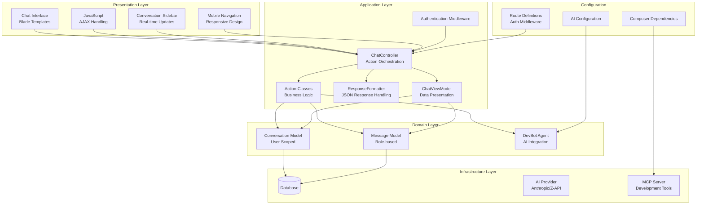
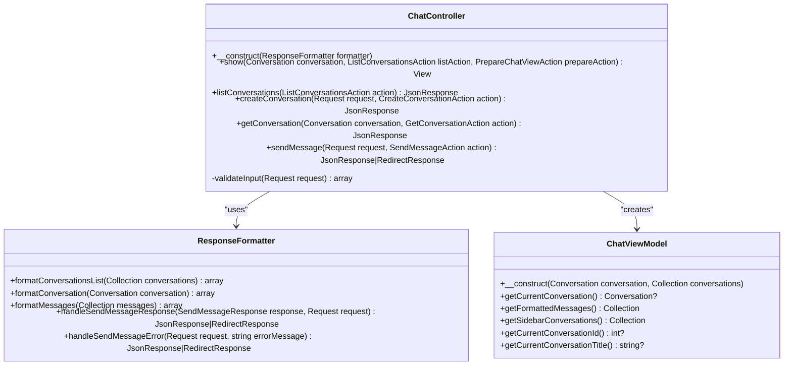
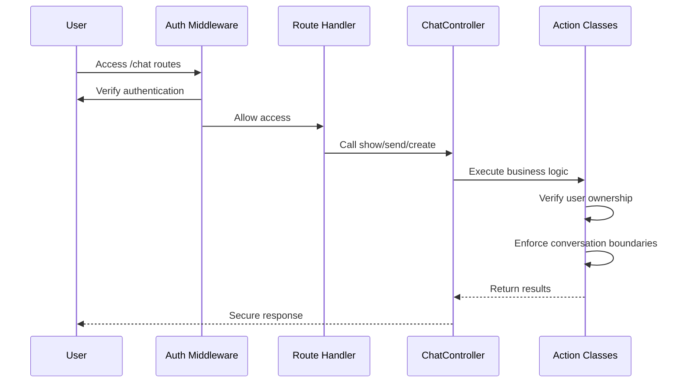
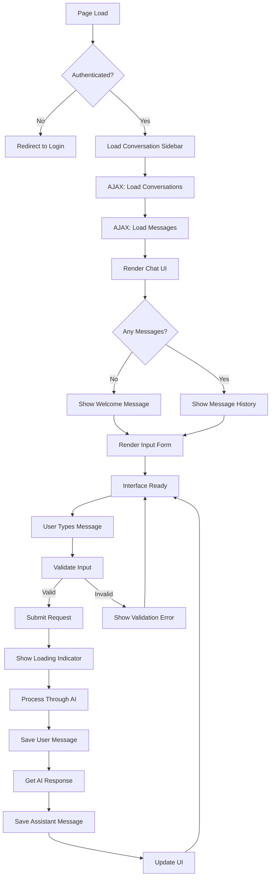
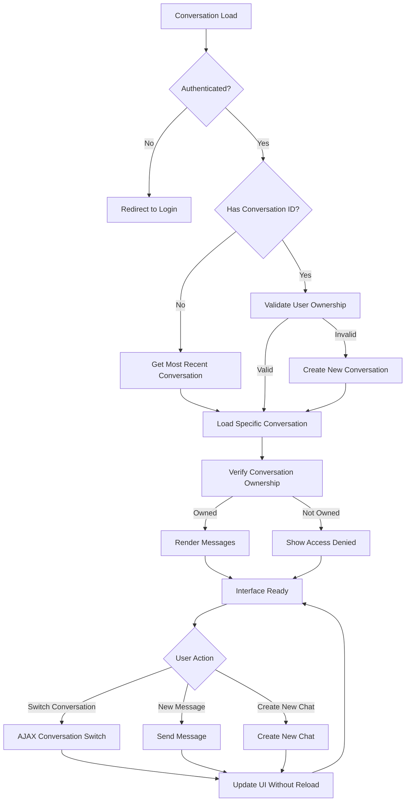
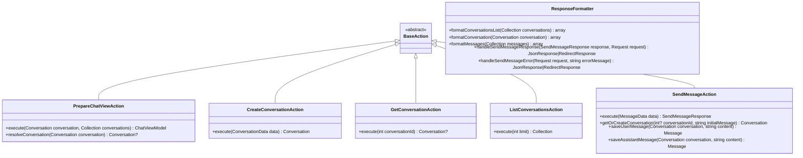
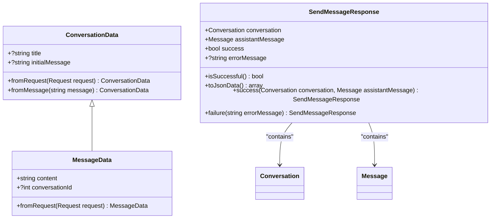
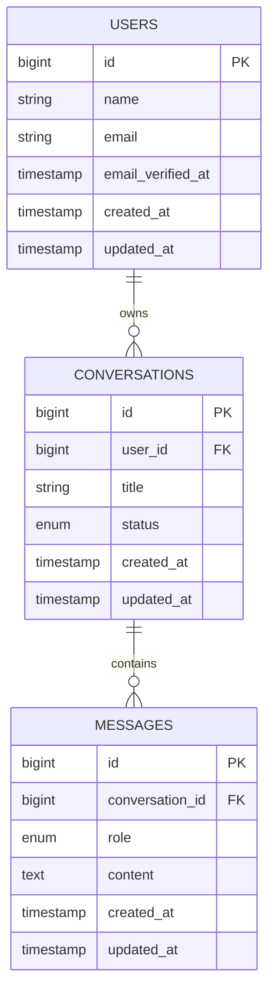

# Chat Interface System

<cite>
**Referenced Files in This Document**
- [ChatController.php](file://app/Http/Controllers/ChatController.php)
- [PrepareChatViewAction.php](file://app/Actions/PrepareChatViewAction.php)
- [CreateConversationAction.php](file://app/Actions/CreateConversationAction.php)
- [GetConversationAction.php](file://app/Actions/GetConversationAction.php)
- [ListConversationsAction.php](file://app/Actions/ListConversationsAction.php)
- [SendMessageAction.php](file://app/Actions/SendMessageAction.php)
- [ResponseFormatter.php](file://app/Services/ResponseFormatter.php)
- [ChatViewModel.php](file://app/ViewModels/ChatViewModel.php)
- [ConversationData.php](file://app/DTOs/ConversationData.php)
- [MessageData.php](file://app/DTOs/MessageData.php)
- [SendMessageResponse.php](file://app/DTOs/SendMessageResponse.php)
- [Conversation.php](file://app/Models/Conversation.php)
- [Message.php](file://app/Models/Message.php)
- [web.php](file://routes/web.php)
- [chat.blade.php](file://resources/views/chat.blade.php)
- [2026_04_02_123216_create_conversations_table.php](file://database/migrations/2026_04_02_123216_create_conversations_table.php)
- [2026_04_02_123238_create_messages_table.php](file://database/migrations/2026_04_02_123238_create_messages_table.php)
- [composer.json](file://composer.json)
- [ChatTest.php](file://tests/Feature/ChatTest.php)
</cite>

## Update Summary
**Changes Made**
- Enhanced authentication integration with route middleware and user-scoped conversation management
- Improved conversation switching with AJAX support and browser history management
- Updated controller integration with dedicated action classes and service layer
- Refined sidebar interface with real-time conversation management and search functionality
- Strengthened security with user ownership verification and CSRF protection
- Enhanced error handling with comprehensive AJAX error recovery mechanisms

## Table of Contents
1. [Introduction](#introduction)
2. [System Architecture](#system-architecture)
3. [Core Components](#core-components)
4. [Chat Interface Implementation](#chat-interface-implementation)
5. [Authentication and Authorization](#authentication-and-authorization)
6. [Conversation Management](#conversation-management)
7. [Action Classes and Service Layer](#action-classes-and-service-layer)
8. [Data Transfer Objects](#data-transfer-objects)
9. [Model Layer](#model-layer)
10. [User Experience Features](#user-experience-features)
11. [Error Handling and Validation](#error-handling-and-validation)
12. [Testing Strategy](#testing-strategy)
13. [Performance Considerations](#performance-considerations)
14. [Security Implementation](#security-implementation)
15. [Conclusion](#conclusion)

## Introduction

The Laravel Assistant Chat Interface System is a comprehensive AI-powered chat application built on the Laravel framework with enhanced authentication integration and user-scoped conversation management. This system provides developers with an intelligent development assistant capable of answering programming questions, providing code examples, debugging assistance, and architectural guidance. The system now features seamless authentication integration, real-time conversation switching capabilities, and a sophisticated action-based architecture that separates concerns effectively.

**Updated** The system now requires authentication for all chat operations, implements user-scoped conversation management, and provides enhanced AJAX-based interaction patterns for seamless conversation switching without page reloads. The interface supports both traditional server-rendered pages and AJAX-based interactions, allowing users to engage with the AI assistant through a natural conversation flow while maintaining strict security boundaries.

## System Architecture

The Laravel Assistant follows a modern layered architecture pattern with enhanced authentication integration and service-oriented design that separates concerns between presentation, business logic, data persistence, and external service integration.

**Diagram sources**
- [ChatController.php:19-104](file://app/Http/Controllers/ChatController.php#L19-L104)
- [PrepareChatViewAction.php:21-62](file://app/Actions/PrepareChatViewAction.php#L21-L62)
- [CreateConversationAction.php:29-54](file://app/Actions/CreateConversationAction.php#L29-L54)
- [ListConversationsAction.php:24-40](file://app/Actions/ListConversationsAction.php#L24-L40)
- [SendMessageAction.php:42-147](file://app/Actions/SendMessageAction.php#L42-L147)
- [ResponseFormatter.php:19-112](file://app/Services/ResponseFormatter.php#L19-L112)
- [ChatViewModel.php:29-120](file://app/ViewModels/ChatViewModel.php#L29-L120)

The architecture demonstrates clear separation of concerns with authentication middleware enforcing user boundaries, action classes encapsulating business logic, and service classes handling response formatting. The system is designed to be highly extensible while maintaining security through user-scoped operations.

**Section sources**
- [ChatController.php:19-104](file://app/Http/Controllers/ChatController.php#L19-L104)
- [web.php:15-26](file://routes/web.php#L15-L26)

## Core Components

### Enhanced Chat Controller

The ChatController serves as the central orchestrator for all chat-related operations, now enhanced with authentication integration and dedicated action class dependencies.

**Diagram sources**
- [ChatController.php:19-104](file://app/Http/Controllers/ChatController.php#L19-L104)
- [ResponseFormatter.php:19-112](file://app/Services/ResponseFormatter.php#L19-L112)
- [ChatViewModel.php:29-120](file://app/ViewModels/ChatViewModel.php#L29-L120)

The controller now integrates tightly with the action class pattern, delegating business logic to specialized classes while maintaining thin controller responsibilities. Authentication is enforced through route middleware, ensuring all operations are user-scoped.

**Section sources**
- [ChatController.php:19-104](file://app/Http/Controllers/ChatController.php#L19-L104)

### Authentication and Authorization

**New** The system now implements comprehensive authentication and authorization through Laravel's middleware system, ensuring user-scoped conversation management and secure access control.

**Diagram sources**
- [web.php:15-26](file://routes/web.php#L15-L26)
- [PrepareChatViewAction.php:44-61](file://app/Actions/PrepareChatViewAction.php#L44-L61)
- [GetConversationAction.php:32-38](file://app/Actions/GetConversationAction.php#L32-L38)
- [CreateConversationAction.php:37-44](file://app/Actions/CreateConversationAction.php#L37-L44)

**Section sources**
- [web.php:15-26](file://routes/web.php#L15-L26)
- [PrepareChatViewAction.php:44-61](file://app/Actions/PrepareChatViewAction.php#L44-L61)

## Chat Interface Implementation

The chat interface is implemented using Laravel's Blade templating engine with enhanced AJAX support for seamless conversation management and real-time updates.

**Diagram sources**
- [chat.blade.php:44-63](file://resources/views/chat.blade.php#L44-L63)
- [chat.blade.php:486-599](file://resources/views/chat.blade.php#L486-L599)
- [chat.blade.php:602-695](file://resources/views/chat.blade.php#L602-L695)

The interface implementation includes sophisticated JavaScript handling for AJAX requests, real-time message rendering, auto-scrolling behavior, and responsive design elements. **Updated** The interface now supports conversation switching through AJAX without page reloads, maintains browser history with pushState, and includes enhanced error handling for authentication failures and conversation access violations.

**Section sources**
- [chat.blade.php:44-63](file://resources/views/chat.blade.php#L44-L63)
- [chat.blade.php:486-599](file://resources/views/chat.blade.php#L486-L599)
- [chat.blade.php:602-695](file://resources/views/chat.blade.php#L602-L695)

### Enhanced User Interface Elements

The chat interface consists of several key components working together to provide an intuitive and secure user experience:

- **Header Section**: Contains branding, conversation title display, and navigation elements with authentication-aware rendering
- **Message Display Area**: Shows conversation history with distinct styling for user and AI messages, supporting markdown rendering
- **Input Form**: Provides message composition with auto-resize functionality, CSRF token handling, and conversation ID management
- **Loading Indicators**: Visual feedback during AI processing operations and conversation switching
- **Error Handling**: Graceful error display and recovery mechanisms for authentication and authorization failures
- **Enhanced Conversation Sidebar**: **New** Real-time conversation list with switching capabilities, search functionality, mobile-responsive design, and user-scoped conversation filtering

The interface supports both traditional page refreshes and seamless AJAX updates, ensuring smooth user experience regardless of interaction method. **Updated** The sidebar provides instant access to conversation history with search functionality, visual indicators for active conversations, and proper authentication-aware rendering.

## Authentication and Authorization

**New** The system implements comprehensive authentication and authorization through Laravel's middleware system, ensuring secure user-scoped conversation management.

### Route-Level Authentication

All chat routes are protected by the `auth` middleware, requiring users to be authenticated before accessing any chat functionality. The authentication group ensures that:

- Dashboard access requires verified email addresses
- Profile management requires authentication
- All chat operations require authenticated users
- Conversation access is strictly user-scoped

### User Ownership Verification

**New** Conversation operations now include strict user ownership verification to prevent unauthorized access:

- Conversation loading validates that conversations belong to the authenticated user
- Conversation creation automatically assigns conversations to the current user
- Conversation switching verifies ownership before loading
- Sidebar conversation listing is filtered by authenticated user

### CSRF Protection

**New** Enhanced CSRF protection is implemented throughout the chat interface:

- All AJAX requests include CSRF tokens in headers
- Form submissions include hidden CSRF token fields
- AJAX endpoints validate CSRF tokens for security
- Session-based authentication maintains state across requests

**Section sources**
- [web.php:15-26](file://routes/web.php#L15-L26)
- [PrepareChatViewAction.php:44-61](file://app/Actions/PrepareChatViewAction.php#L44-L61)
- [CreateConversationAction.php:37-44](file://app/Actions/CreateConversationAction.php#L37-L44)
- [GetConversationAction.php:32-38](file://app/Actions/GetConversationAction.php#L32-L38)

## Conversation Management

**Updated** The system now provides comprehensive user-scoped conversation management with AJAX support and seamless switching between conversations.

**Diagram sources**
- [ChatController.php:28-39](file://app/Http/Controllers/ChatController.php#L28-L39)
- [PrepareChatViewAction.php:44-61](file://app/Actions/PrepareChatViewAction.php#L44-L61)
- [ListConversationsAction.php:32-38](file://app/Actions/ListConversationsAction.php#L32-L38)
- [chat.blade.php:486-599](file://resources/views/chat.blade.php#L486-L599)

The conversation management system supports both server-side rendering and AJAX-based interactions with strict user ownership enforcement. When no conversation is specified, the system automatically loads the most recent conversation owned by the authenticated user. Users can create new conversations through AJAX requests, and the system maintains conversation state without page reloads while enforcing security boundaries.

**Section sources**
- [ChatController.php:28-39](file://app/Http/Controllers/ChatController.php#L28-L39)
- [PrepareChatViewAction.php:44-61](file://app/Actions/PrepareChatViewAction.php#L44-L61)
- [ListConversationsAction.php:32-38](file://app/Actions/ListConversationsAction.php#L32-L38)

### Enhanced Conversation Creation and Persistence

**New** The system implements intelligent user-scoped conversation creation and persistence:

- **Automatic User Assignment**: All new conversations are automatically assigned to the authenticated user
- **Title Generation**: Automatically generates meaningful conversation titles from the first user message
- **Message Limiting**: Restricts conversation context to the most recent 50 messages for performance
- **Agent Integration**: Converts stored messages to the format expected by AI agents
- **Relationship Management**: Defines the one-to-many relationship with messages and user ownership
- **Security Enforcement**: All operations are automatically scoped to the authenticated user

**Section sources**
- [CreateConversationAction.php:37-52](file://app/Actions/CreateConversationAction.php#L37-L52)
- [Conversation.php:40-63](file://app/Models/Conversation.php#L40-L63)

### AJAX Conversation Management

**New** The system provides seamless AJAX-based conversation management with enhanced security:

- **Conversation Switching**: Users can switch between conversations without page reloads
- **Real-time Updates**: Conversation lists update dynamically with new conversations
- **URL Management**: Maintains proper browser history with pushState for navigation
- **Error Handling**: Graceful error handling for AJAX failures with user feedback
- **Security Validation**: All AJAX operations validate user ownership and authentication
- **CSRF Protection**: All AJAX requests include proper CSRF token validation

**Section sources**
- [ChatController.php:44-81](file://app/Http/Controllers/ChatController.php#L44-L81)
- [chat.blade.php:486-599](file://resources/views/chat.blade.php#L486-L599)
- [chat.blade.php:602-695](file://resources/views/chat.blade.php#L602-L695)

## Action Classes and Service Layer

**New** The system implements a comprehensive action class pattern that encapsulates business logic and promotes testability and maintainability.

### Action Class Architecture

**Diagram sources**
- [PrepareChatViewAction.php:21-62](file://app/Actions/PrepareChatViewAction.php#L21-L62)
- [CreateConversationAction.php:29-54](file://app/Actions/CreateConversationAction.php#L29-L54)
- [GetConversationAction.php:24-40](file://app/Actions/GetConversationAction.php#L24-L40)
- [ListConversationsAction.php:24-40](file://app/Actions/ListConversationsAction.php#L24-L40)
- [SendMessageAction.php:42-147](file://app/Actions/SendMessageAction.php#L42-L147)
- [ResponseFormatter.php:19-112](file://app/Services/ResponseFormatter.php#L19-L112)

### Business Logic Separation

The action classes provide several benefits:

- **Single Responsibility**: Each action handles a specific business operation
- **Testability**: Easy to unit test individual business operations
- **Reusability**: Actions can be reused across different controllers and contexts
- **Maintainability**: Business logic is centralized and easy to modify
- **Dependency Injection**: Actions receive their dependencies through constructor injection

**Section sources**
- [PrepareChatViewAction.php:21-62](file://app/Actions/PrepareChatViewAction.php#L21-L62)
- [CreateConversationAction.php:29-54](file://app/Actions/CreateConversationAction.php#L29-L54)
- [GetConversationAction.php:24-40](file://app/Actions/GetConversationAction.php#L24-L40)
- [ListConversationsAction.php:24-40](file://app/Actions/ListConversationsAction.php#L24-L40)
- [SendMessageAction.php:42-147](file://app/Actions/SendMessageAction.php#L42-L147)

## Data Transfer Objects

**New** The system implements Data Transfer Objects (DTOs) to provide type-safe data transfer between layers and improve code clarity.

### DTO Architecture

**Diagram sources**
- [ConversationData.php:29-58](file://app/DTOs/ConversationData.php#L29-L58)
- [MessageData.php:29-47](file://app/DTOs/MessageData.php#L29-L47)
- [SendMessageResponse.php:29-107](file://app/DTOs/SendMessageResponse.php#L29-L107)

### Type Safety and Validation

The DTOs provide several benefits:

- **Type Safety**: Compile-time type checking prevents runtime errors
- **Validation**: Built-in validation through constructor parameters
- **Immutability**: Final readonly classes prevent accidental modification
- **Documentation**: Clear property definitions serve as inline documentation
- **Testing**: Easy to mock and test with predictable data structures

**Section sources**
- [ConversationData.php:29-58](file://app/DTOs/ConversationData.php#L29-L58)
- [MessageData.php:29-47](file://app/DTOs/MessageData.php#L29-L47)
- [SendMessageResponse.php:29-107](file://app/DTOs/SendMessageResponse.php#L29-L107)

## Model Layer

The system implements a robust data persistence layer using Laravel's Eloquent ORM with enhanced user ownership and security features.

**Diagram sources**
- [2026_04_02_123216_create_conversations_table.php:14-21](file://database/migrations/2026_04_02_123216_create_conversations_table.php#L14-L21)
- [2026_04_02_123238_create_messages_table.php:14-22](file://database/migrations/2026_04_02_123238_create_messages_table.php#L14-L22)

The database schema supports efficient conversation management with appropriate indexing for performance and enforces user ownership through foreign key constraints. The Conversation model includes helper methods for generating titles from messages and retrieving recent conversation history, while the Message model provides formatting capabilities for markdown content.

**Section sources**
- [Conversation.php:12-65](file://app/Models/Conversation.php#L12-L65)
- [Message.php:12-50](file://app/Models/Message.php#L12-L50)

### Enhanced Model Features

**New** The models now include enhanced security and functionality:

- **User Ownership**: All conversations belong to specific users through foreign key relationships
- **Role-based Messages**: Messages are typed with roles (User/Assistant) for proper AI context
- **Status Management**: Conversations can have status values for future expansion
- **Message Limiting**: Automatic limiting of recent messages for AI context windows
- **Agent Integration**: Direct conversion of messages to AI agent format
- **Security Enforcement**: All operations automatically respect user ownership boundaries

**Section sources**
- [Conversation.php:17-63](file://app/Models/Conversation.php#L17-L63)
- [Message.php:17-48](file://app/Models/Message.php#L17-L48)

## User Experience Features

The chat interface incorporates numerous features designed to enhance user interaction and provide a smooth conversational experience with enhanced security and responsiveness.

### Real-time Interaction

**Updated** The system now supports both immediate page refreshes and asynchronous AJAX updates, allowing users to choose their preferred interaction mode. The JavaScript implementation handles form submission, loading states, error display, and dynamic content updates without page reloads. **New** Conversation switching occurs seamlessly through AJAX requests with proper authentication validation, maintaining conversation state and providing instant feedback while enforcing user ownership boundaries.

### Responsive Design

The interface adapts to various screen sizes and devices, with mobile-optimized layouts and touch-friendly controls. The design follows modern UI/UX principles with clear visual hierarchy and intuitive navigation. **New** The conversation sidebar is fully responsive, hiding on mobile devices with a hamburger menu toggle for better mobile experience, and includes authentication-aware rendering.

### Enhanced Accessibility Features

**New** The interface includes comprehensive accessibility considerations:

- **Proper Semantic Markup**: Clear ARIA labels and semantic HTML structure
- **Keyboard Navigation**: Full keyboard support for all interactive elements
- **Screen Reader Compatibility**: Proper ARIA attributes and readable text alternatives
- **Focus Management**: Logical tab order and focus indicators
- **Color Contrast**: High contrast ratios for text and interactive elements
- **Mobile Navigation**: Touch-friendly controls with appropriate sizing

### Performance Optimizations

Several performance optimizations are implemented to ensure smooth operation:

- **Lazy Loading**: Messages are loaded efficiently with pagination support
- **Auto-resize Inputs**: Textareas automatically adjust to content
- **Debounced Requests**: Prevents excessive API calls during rapid typing
- **Caching Strategies**: Efficient database queries with appropriate indexing
- **AJAX State Management**: **New** Maintains conversation state without unnecessary reloads
- **Authentication Caching**: User authentication state cached in JavaScript for better UX

**Section sources**
- [chat.blade.php:44-63](file://resources/views/chat.blade.php#L44-L63)
- [chat.blade.php:486-599](file://resources/views/chat.blade.php#L486-L599)
- [chat.blade.php:602-695](file://resources/views/chat.blade.php#L602-L695)

## Error Handling and Validation

The system implements comprehensive error handling and input validation to ensure robust operation under various conditions with enhanced security validation.

### Enhanced Input Validation

**New** The system now includes comprehensive input validation with authentication awareness:

- **Required Field**: Ensures messages are not empty
- **Type Validation**: Confirms message content is a string
- **Length Limits**: Prevents excessively long messages (maximum 5000 characters)
- **Conversation ID Validation**: Validates foreign key references when provided
- **User Ownership Validation**: Ensures conversations belong to authenticated user
- **CSRF Token Validation**: All AJAX requests validated for security

### Comprehensive Error Recovery

**New** The system handles various error scenarios gracefully with enhanced security:

- **Authentication Failures**: Redirects unauthenticated users to login
- **Authorization Errors**: Prevents access to conversations not owned by user
- **AI Service Failures**: Logs errors and provides user-friendly error messages
- **Network Issues**: Implements retry logic and timeout handling
- **Database Errors**: Manages transaction rollbacks and recovery
- **Validation Failures**: Returns structured error responses for AJAX requests
- **CSRF Validation Errors**: Rejects requests with invalid security tokens

### Enhanced Logging and Monitoring

**New** Comprehensive logging is implemented for debugging and monitoring purposes:

- **Security Events**: Logs authentication failures and authorization attempts
- **Conversation Access**: Tracks conversation access patterns and ownership validation
- **Error Details**: Captures error context with user and conversation information
- **Performance Metrics**: Monitors response times and API call performance
- **Audit Trails**: Maintains records of user actions and conversation changes

**Section sources**
- [ChatController.php:86-102](file://app/Http/Controllers/ChatController.php#L86-L102)
- [PrepareChatViewAction.php:53-56](file://app/Actions/PrepareChatViewAction.php#L53-L56)
- [ResponseFormatter.php:97-111](file://app/Services/ResponseFormatter.php#L97-L111)

## Testing Strategy

The system includes a comprehensive testing suite covering unit tests, feature tests, and integration tests to ensure reliability and maintainability with enhanced authentication and security testing.

### Enhanced Test Coverage Areas

**New** The testing strategy now encompasses additional critical areas:

- **Authentication Testing**: Validates middleware protection and user session management
- **Authorization Testing**: Ensures proper user ownership validation and access control
- **Conversation Security Testing**: Tests user-scoped conversation operations and boundary enforcement
- **AJAX Error Handling Testing**: Validates error responses and recovery mechanisms
- **CSRF Protection Testing**: Tests security token validation and request forgery prevention
- **Action Class Testing**: Validates business logic encapsulation and dependency injection

### Advanced Test Implementation Patterns

**New** The tests utilize Laravel's testing framework with specialized patterns:

- **Authenticated Test Scenarios**: Uses Laravel's testing utilities to simulate authenticated users
- **User Ownership Testing**: Validates proper user-scoped data access and manipulation
- **Security Boundary Testing**: Tests authentication bypass attempts and authorization failures
- **Response Validation**: Tests HTTP response formats, status codes, and security headers
- **Behavior Verification**: Confirms expected user experience with authentication-aware rendering
- **Error Scenario Testing**: Validates graceful error recovery with proper error messages

**Section sources**
- [ChatTest.php:86-171](file://tests/Feature/ChatTest.php#L86-L171)
- [ChatTest.php:178-236](file://tests/Feature/ChatTest.php#L178-L236)
- [ChatTest.php:243-334](file://tests/Feature/ChatTest.php#L243-L334)

## Performance Considerations

The system is designed with performance optimization in mind, implementing several strategies to ensure efficient operation under various load conditions with enhanced security overhead.

### Database Optimization

- **Indexing Strategy**: Proper indexing on frequently queried columns (created_at timestamps, user_id foreign keys)
- **Query Efficiency**: Optimized queries with appropriate joins and filtering, including user ownership checks
- **Pagination Support**: Efficient handling of large conversation histories with user-scoped limits
- **Connection Pooling**: Optimal database connection management with proper transaction handling
- **Eager Loading**: Prevention of N+1 query problems through proper relationship loading

### Enhanced Memory Management

**New** The system implements additional memory management strategies:

- **Object Lifecycle**: Proper cleanup of temporary objects and resources in action classes
- **Caching Strategies**: Strategic use of caching for frequently accessed user data and conversation lists
- **Resource Cleanup**: Automatic cleanup of unused resources and memory in service classes
- **Response Optimization**: Efficient JSON response formatting and data serialization

### Network Optimization

- **Request Minimization**: Efficient API calls and reduced round trips with proper batching
- **Compression**: Content compression for faster transmission of markdown content
- **CDN Integration**: Static asset delivery optimization for improved load times
- **AJAX Optimization**: Smart caching of conversation data to reduce server load

## Security Implementation

The system implements multiple layers of security to protect user data and prevent malicious activities with enhanced authentication and authorization measures.

### Enhanced Input Sanitization

**New** All user input undergoes rigorous sanitization and validation with authentication awareness:

- **CSRF Protection**: All forms and AJAX requests validated with proper security tokens
- **Input Validation**: Comprehensive validation rules with user ownership verification
- **SQL Injection Prevention**: Parameterized queries and Eloquent ORM usage prevent injection attacks
- **XSS Prevention**: Proper HTML escaping and content security policies prevent cross-site scripting

### Advanced Authentication and Authorization

**New** The system implements comprehensive authentication and authorization:

- **Route Middleware**: All chat routes protected by authentication middleware
- **User Ownership**: Strict enforcement that conversations belong to authenticated users
- **Session Management**: Secure session handling with proper expiration and renewal
- **Token Validation**: CSRF token validation for all state-changing operations
- **Access Control**: Fine-grained access control preventing unauthorized conversation access

### Data Protection

**New** Enhanced data protection measures:

- **Encryption**: Sensitive data encryption at rest and in transit
- **Access Controls**: Proper authorization checks for all data access operations
- **Audit Logging**: Comprehensive logging of security-relevant events and access attempts
- **Rate Limiting**: Protection against brute force attacks and abuse detection
- **Input Filtering**: Comprehensive filtering of potentially malicious input

### API Security

**New** External API integrations implement proper security measures:

- **Authentication**: Proper AI service authentication and API key management
- **Rate Limiting**: Prevents API abuse and ensures fair usage limits
- **Input Validation**: Comprehensive validation of AI service responses
- **Error Containment**: Prevents sensitive error details from leaking to users
- **Timeout Protection**: Prevents hanging requests and resource exhaustion

### Enhanced Tool Security

**New** MCP tools implement comprehensive security measures:

- **Query Validation**: Database queries restricted to read-only operations
- **Timeout Protection**: Prevents infinite execution loops and resource exhaustion
- **Result Limiting**: Controls output size and prevents data leaks
- **Error Containment**: Prevents sensitive error details from leaking to users
- **User Context**: All tool operations executed within user authentication context

**Section sources**
- [web.php:15-26](file://routes/web.php#L15-L26)
- [PrepareChatViewAction.php:53-56](file://app/Actions/PrepareChatViewAction.php#L53-L56)
- [CreateConversationAction.php:43](file://app/Actions/CreateConversationAction.php#L43)
- [GetConversationAction.php:34](file://app/Actions/GetConversationAction.php#L34)

## Conclusion

The Laravel Assistant Chat Interface System represents a comprehensive and secure solution for AI-powered developer assistance within the Laravel ecosystem. The system successfully combines modern web technologies with robust backend architecture to deliver a seamless user experience while maintaining strict security boundaries.

**Updated** Key enhancements include integrated authentication with user-scoped conversation management, seamless conversation switching capabilities, and comprehensive action-based architecture. The system now provides:

- **Enhanced Security**: Comprehensive authentication, authorization, and user ownership enforcement
- **Modern Architecture**: Clean separation of concerns through action classes and service layer
- **Robust Authentication**: Middleware-based protection with CSRF token validation
- **User-Scoped Operations**: All conversations automatically bound to authenticated users
- **Seamless AJAX**: Real-time conversation switching without page reloads
- **Comprehensive Testing**: Thorough test coverage including authentication and security scenarios
- **Performance Optimization**: Efficient resource utilization with proper caching and indexing
- **Enhanced User Experience**: Responsive design with accessibility features and mobile optimization

The system provides a solid foundation for AI-assisted development workflows while maintaining the flexibility to adapt to evolving requirements and technologies. Future enhancements could include expanded AI provider support, advanced conversation management features, enhanced analytics capabilities, and additional MCP tool integration for even more comprehensive developer assistance with continued focus on security and user experience.