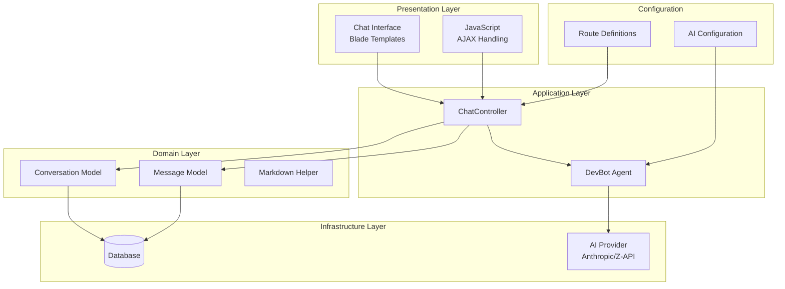
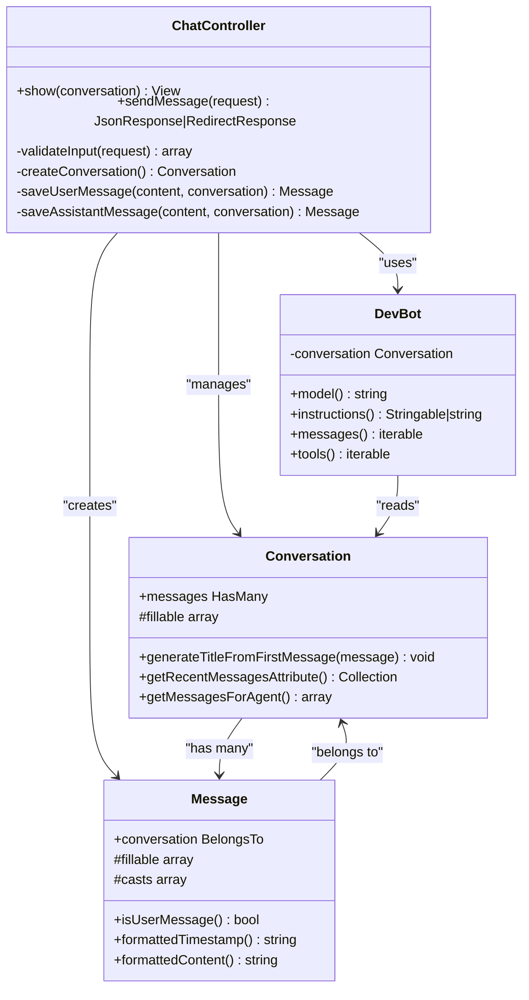
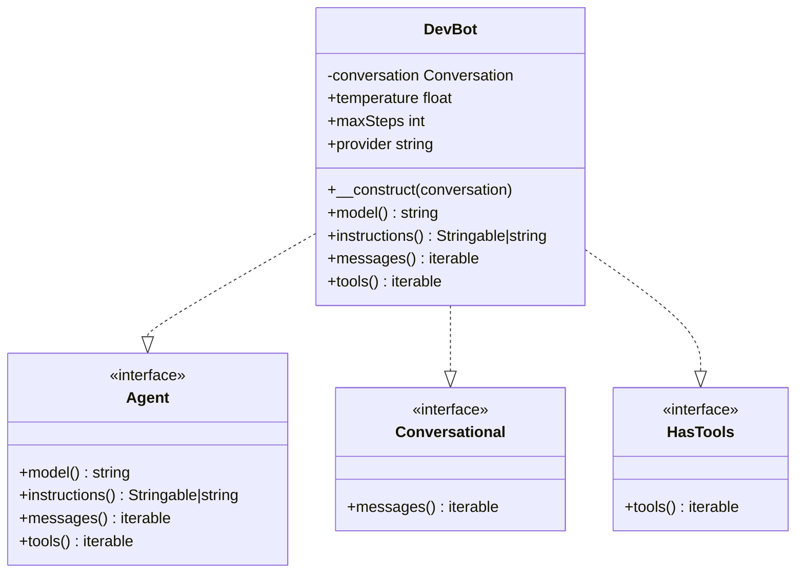
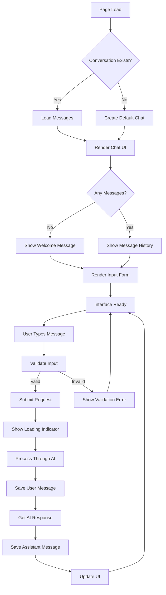
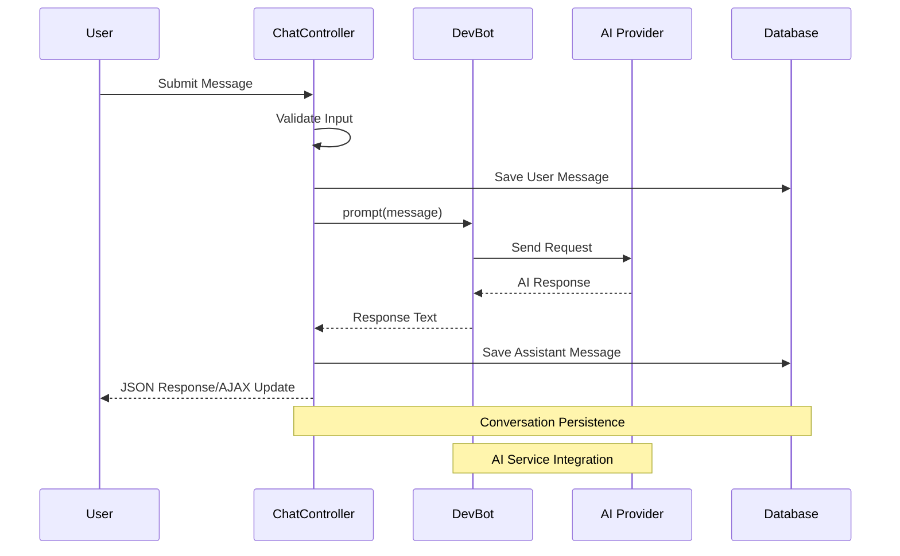
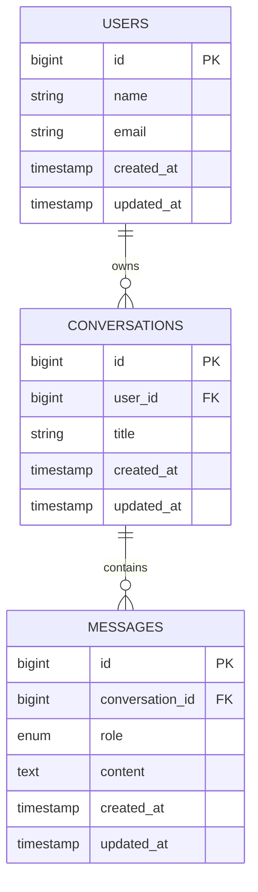
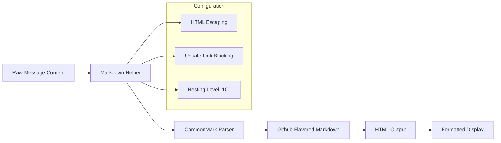

# Chat Interface System

<cite>
**Referenced Files in This Document**
- [DevBot.php](file://app/Ai/Agents/DevBot.php)
- [ChatController.php](file://app/Http/Controllers/ChatController.php)
- [chat.blade.php](file://resources/views/chat.blade.php)
- [web.php](file://routes/web.php)
- [Conversation.php](file://app/Models/Conversation.php)
- [Message.php](file://app/Models/Message.php)
- [Markdown.php](file://app/Helpers/Markdown.php)
- [ai.php](file://config/ai.php)
- [2026_04_02_123216_create_conversations_table.php](file://database/migrations/2026_04_02_123216_create_conversations_table.php)
- [2026_04_02_123238_create_messages_table.php](file://database/migrations/2026_04_02_123238_create_messages_table.php)
- [composer.json](file://composer.json)
- [ChatTest.php](file://tests/Feature/ChatTest.php)
</cite>

## Table of Contents
1. [Introduction](#introduction)
2. [System Architecture](#system-architecture)
3. [Core Components](#core-components)
4. [Chat Interface Implementation](#chat-interface-implementation)
5. [Agent Integration](#agent-integration)
6. [Data Storage and Management](#data-storage-and-management)
7. [User Experience Features](#user-experience-features)
8. [Error Handling and Validation](#error-handling-and-validation)
9. [Testing Strategy](#testing-strategy)
10. [Performance Considerations](#performance-considerations)
11. [Security Implementation](#security-implementation)
12. [Conclusion](#conclusion)

## Introduction

The Laravel Assistant Chat Interface System is a comprehensive AI-powered chat application built on the Laravel framework. This system provides developers with an intelligent development assistant capable of answering programming questions, providing code examples, debugging assistance, and architectural guidance. The system integrates seamlessly with Laravel's ecosystem while offering a modern, responsive user interface for interactive conversations.

The chat interface supports both traditional server-rendered pages and AJAX-based interactions, allowing users to engage with the AI assistant through a natural conversation flow. The system maintains conversation history, manages user sessions, and provides real-time feedback during AI processing.

## System Architecture

The Laravel Assistant follows a layered architecture pattern that separates concerns between presentation, business logic, data persistence, and external service integration.

**Diagram sources**
- [ChatController.php:13-113](file://app/Http/Controllers/ChatController.php#L13-L113)
- [DevBot.php:20-99](file://app/Ai/Agents/DevBot.php#L20-L99)
- [Conversation.php:8-45](file://app/Models/Conversation.php#L8-L45)
- [Message.php:9-44](file://app/Models/Message.php#L9-L44)

The architecture demonstrates clear separation of concerns with the controller handling HTTP requests, the agent managing AI interactions, and models handling data persistence. The system is designed to be extensible, allowing for easy integration of additional AI providers and conversation management features.

**Section sources**
- [ChatController.php:13-113](file://app/Http/Controllers/ChatController.php#L13-L113)
- [DevBot.php:20-99](file://app/Ai/Agents/DevBot.php#L20-L99)
- [web.php:10-11](file://routes/web.php#L10-L11)

## Core Components

### Chat Controller

The ChatController serves as the central orchestrator for all chat-related operations, handling both GET and POST requests for displaying the chat interface and processing user messages.

**Diagram sources**
- [ChatController.php:13-113](file://app/Http/Controllers/ChatController.php#L13-L113)
- [DevBot.php:20-99](file://app/Ai/Agents/DevBot.php#L20-L99)
- [Conversation.php:8-45](file://app/Models/Conversation.php#L8-L45)
- [Message.php:9-44](file://app/Models/Message.php#L9-L44)

The controller implements a comprehensive request-response cycle that handles conversation creation, message validation, AI interaction, and response formatting. It supports both AJAX and traditional form submissions, providing flexibility in user interaction patterns.

**Section sources**
- [ChatController.php:13-113](file://app/Http/Controllers/ChatController.php#L13-L113)

### AI Agent Implementation

The DevBot agent encapsulates the AI interaction logic, implementing Laravel's AI contract interfaces for conversational AI capabilities.

**Diagram sources**
- [DevBot.php:6-15](file://app/Ai/Agents/DevBot.php#L6-L15)
- [DevBot.php:20-99](file://app/Ai/Agents/DevBot.php#L20-L99)

The agent configuration includes temperature settings for response creativity, step limits for conversation depth, and provider selection for AI service integration. The agent maintains conversation context by accessing stored messages through the Conversation model.

**Section sources**
- [DevBot.php:20-99](file://app/Ai/Agents/DevBot.php#L20-L99)

## Chat Interface Implementation

The chat interface is implemented using Laravel's Blade templating engine with a responsive design that works across different device sizes.

**Diagram sources**
- [chat.blade.php:18-391](file://resources/views/chat.blade.php#L18-L391)

The interface implementation includes sophisticated JavaScript handling for AJAX requests, real-time message rendering, auto-scrolling behavior, and responsive design elements. The template structure separates concerns between conversation display, message history, and input forms.

**Section sources**
- [chat.blade.php:18-391](file://resources/views/chat.blade.php#L18-L391)

### User Interface Elements

The chat interface consists of several key components working together to provide an intuitive user experience:

- **Header Section**: Contains branding, conversation title display, and navigation elements
- **Message Display Area**: Shows conversation history with distinct styling for user and AI messages
- **Input Form**: Provides message composition with auto-resize functionality and keyboard shortcuts
- **Loading Indicators**: Visual feedback during AI processing operations
- **Error Handling**: Graceful error display and recovery mechanisms

The interface supports both traditional page refreshes and seamless AJAX updates, ensuring smooth user experience regardless of interaction method.

## Agent Integration

The system integrates with external AI providers through Laravel's AI framework, specifically configured for Anthropic's Claude models via the Z-API provider.

**Diagram sources**
- [ChatController.php:71-81](file://app/Http/Controllers/ChatController.php#L71-L81)
- [DevBot.php:31-34](file://app/Ai/Agents/DevBot.php#L31-L34)

The agent integration leverages Laravel's AI contracts to provide a standardized interface for different AI providers. The system currently uses the Z-API provider configured for Anthropic's Claude models, with flexible configuration allowing easy switching between different AI services.

**Section sources**
- [ChatController.php:71-81](file://app/Http/Controllers/ChatController.php#L71-L81)
- [DevBot.php:31-34](file://app/Ai/Agents/DevBot.php#L31-L34)
- [ai.php:59-63](file://config/ai.php#L59-L63)

## Data Storage and Management

The system implements a robust data persistence layer using Laravel's Eloquent ORM with specialized models for conversations and messages.

**Diagram sources**
- [2026_04_02_123216_create_conversations_table.php:14-21](file://database/migrations/2026_04_02_123216_create_conversations_table.php#L14-L21)
- [2026_04_02_123238_create_messages_table.php:14-22](file://database/migrations/2026_04_02_123238_create_messages_table.php#L14-L22)

The database schema supports efficient conversation management with appropriate indexing for performance. The Conversation model includes helper methods for generating titles from messages and retrieving recent conversation history, while the Message model provides formatting capabilities for markdown content.

**Section sources**
- [Conversation.php:10-29](file://app/Models/Conversation.php#L10-L29)
- [Message.php:11-24](file://app/Models/Message.php#L11-L24)

### Conversation Management

The Conversation model implements several key features for managing chat sessions:

- **Automatic Title Generation**: Creates meaningful conversation titles from the first user message
- **Message Limiting**: Restricts conversation context to the most recent 50 messages for performance
- **Agent Integration**: Converts stored messages to the format expected by AI agents
- **Relationship Management**: Defines the one-to-many relationship with messages

The model ensures that conversations remain manageable in size while preserving the most relevant context for AI interactions.

**Section sources**
- [Conversation.php:20-43](file://app/Models/Conversation.php#L20-L43)

### Message Formatting

The Message model includes sophisticated formatting capabilities through the Markdown helper, enabling rich text display in the chat interface.

**Diagram sources**
- [Markdown.php:17-41](file://app/Helpers/Markdown.php#L17-L41)

The markdown processing pipeline ensures secure content rendering while supporting code blocks, lists, and other formatting elements essential for developer communication.

**Section sources**
- [Message.php:39-42](file://app/Models/Message.php#L39-L42)
- [Markdown.php:17-41](file://app/Helpers/Markdown.php#L17-L41)

## User Experience Features

The chat interface incorporates numerous features designed to enhance user interaction and provide a smooth conversational experience.

### Real-time Interaction

The system supports both immediate page refreshes and asynchronous AJAX updates, allowing users to choose their preferred interaction mode. The JavaScript implementation handles form submission, loading states, error display, and dynamic content updates without page reloads.

### Responsive Design

The interface adapts to various screen sizes and devices, with mobile-optimized layouts and touch-friendly controls. The design follows modern UI/UX principles with clear visual hierarchy and intuitive navigation.

### Accessibility Features

The interface includes accessibility considerations such as proper semantic markup, keyboard navigation support, and screen reader compatibility. Form elements include appropriate labels and error messaging for assistive technologies.

### Performance Optimizations

Several performance optimizations are implemented to ensure smooth operation:

- **Lazy Loading**: Messages are loaded efficiently with pagination support
- **Auto-resize Inputs**: Textareas automatically adjust to content
- **Debounced Requests**: Prevents excessive API calls during rapid typing
- **Caching Strategies**: Efficient database queries with appropriate indexing

**Section sources**
- [chat.blade.php:172-391](file://resources/views/chat.blade.php#L172-L391)

## Error Handling and Validation

The system implements comprehensive error handling and input validation to ensure robust operation under various conditions.

### Input Validation

The ChatController enforces strict validation rules for incoming messages:

- **Required Field**: Ensures messages are not empty
- **Type Validation**: Confirms message content is a string
- **Length Limits**: Prevents excessively long messages (maximum 5000 characters)
- **Conversation ID Validation**: Validates foreign key references when provided

### Error Recovery

The system handles various error scenarios gracefully:

- **AI Service Failures**: Logs errors and provides user-friendly error messages
- **Network Issues**: Implements retry logic and timeout handling
- **Database Errors**: Manages transaction rollbacks and recovery
- **Validation Failures**: Returns structured error responses for AJAX requests

### Logging and Monitoring

Comprehensive logging is implemented for debugging and monitoring purposes, capturing error details, request metadata, and system performance metrics.

**Section sources**
- [ChatController.php:41-44](file://app/Http/Controllers/ChatController.php#L41-L44)
- [ChatController.php:93-110](file://app/Http/Controllers/ChatController.php#L93-L110)

## Testing Strategy

The system includes a comprehensive testing suite covering unit tests, feature tests, and integration tests to ensure reliability and maintainability.

### Test Coverage Areas

The testing strategy encompasses several critical areas:

- **Chat Interface Functionality**: Validates UI rendering, user interactions, and AJAX behavior
- **Message Processing**: Tests message validation, saving, and retrieval operations
- **Conversation Management**: Ensures proper conversation lifecycle management
- **Error Handling**: Verifies graceful error recovery and user feedback
- **Integration Testing**: Validates AI service integration and external API communication

### Test Implementation Patterns

The tests utilize Laravel's testing framework with specialized patterns for AI integration:

- **Fake AI Responses**: Uses Laravel's testing utilities to simulate AI service responses
- **Database Assertions**: Validates data persistence and relationship integrity
- **Response Validation**: Tests HTTP response formats and status codes
- **Behavior Verification**: Confirms expected user experience and interaction patterns

**Section sources**
- [ChatTest.php:86-171](file://tests/Feature/ChatTest.php#L86-L171)
- [ChatTest.php:178-236](file://tests/Feature/ChatTest.php#L178-L236)
- [ChatTest.php:243-334](file://tests/Feature/ChatTest.php#L243-L334)

## Performance Considerations

The system is designed with performance optimization in mind, implementing several strategies to ensure efficient operation under various load conditions.

### Database Optimization

- **Indexing Strategy**: Proper indexing on frequently queried columns (created_at timestamps)
- **Query Efficiency**: Optimized queries with appropriate joins and filtering
- **Pagination Support**: Efficient handling of large conversation histories
- **Connection Pooling**: Optimal database connection management

### Memory Management

- **Object Lifecycle**: Proper cleanup of temporary objects and resources
- **Caching Strategies**: Strategic use of caching for frequently accessed data
- **Resource Cleanup**: Automatic cleanup of unused resources and memory

### Network Optimization

- **Request Minimization**: Efficient API calls and reduced round trips
- **Compression**: Content compression for faster transmission
- **CDN Integration**: Static asset delivery optimization

## Security Implementation

The system implements multiple layers of security to protect user data and prevent malicious activities.

### Input Sanitization

All user input undergoes rigorous sanitization and validation to prevent injection attacks and malformed data processing.

### Authentication and Authorization

The system integrates with Laravel's authentication framework to ensure proper user identification and authorization for conversation access.

### Data Protection

- **Encryption**: Sensitive data encryption at rest and in transit
- **Access Controls**: Proper authorization checks for data access
- **Audit Logging**: Comprehensive logging of security-relevant events

### API Security

External API integrations implement proper authentication, rate limiting, and input validation to prevent abuse and ensure service reliability.

## Conclusion

The Laravel Assistant Chat Interface System represents a comprehensive solution for AI-powered developer assistance within the Laravel ecosystem. The system successfully combines modern web technologies with robust backend architecture to deliver a seamless user experience.

Key strengths of the implementation include:

- **Modular Architecture**: Clean separation of concerns enabling easy maintenance and extension
- **Flexible AI Integration**: Pluggable AI provider system supporting multiple services
- **Rich User Experience**: Responsive design with real-time interaction capabilities
- **Comprehensive Testing**: Thorough test coverage ensuring reliability and quality
- **Performance Optimization**: Efficient resource utilization and scalable architecture

The system provides a solid foundation for AI-assisted development workflows while maintaining the flexibility to adapt to evolving requirements and technologies. Future enhancements could include expanded AI provider support, advanced conversation management features, and enhanced analytics capabilities.