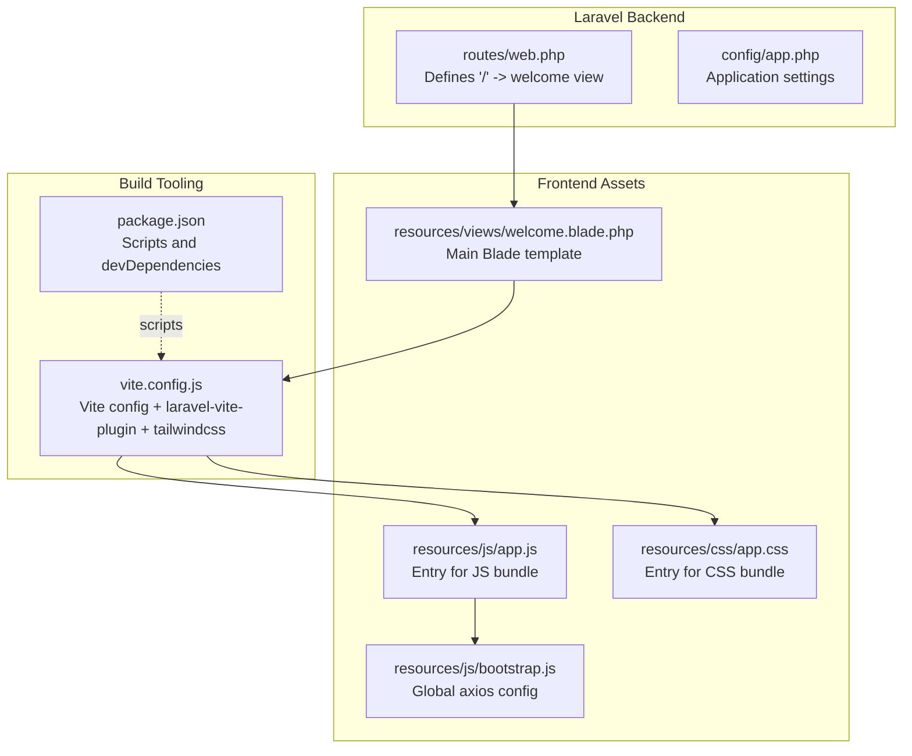
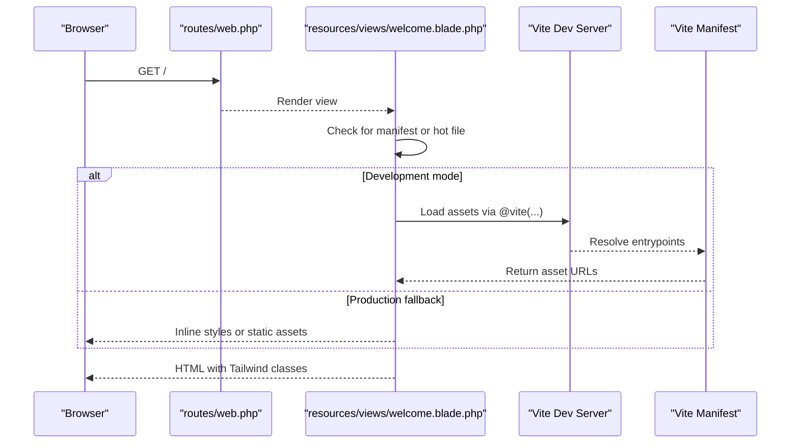
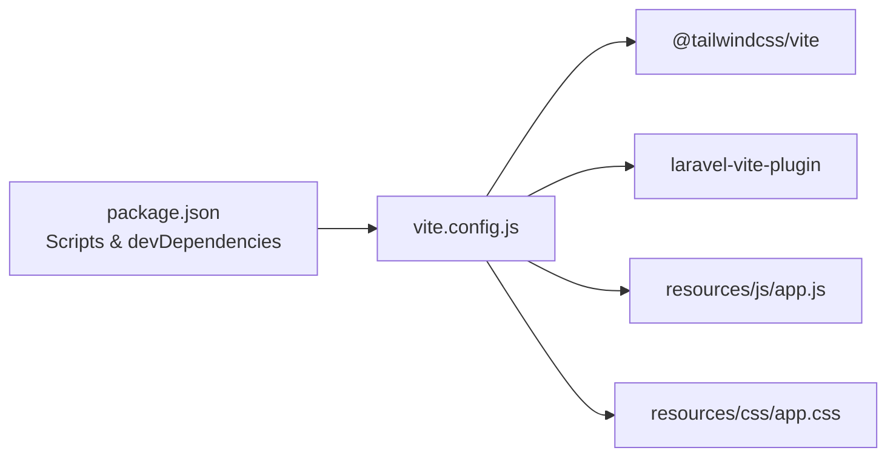

# Frontend Development

<cite>
**Referenced Files in This Document**
- [vite.config.js](file://vite.config.js)
- [package.json](file://package.json)
- [resources/js/app.js](file://resources/js/app.js)
- [resources/js/bootstrap.js](file://resources/js/bootstrap.js)
- [resources/css/app.css](file://resources/css/app.css)
- [resources/views/welcome.blade.php](file://resources/views/welcome.blade.php)
- [routes/web.php](file://routes/web.php)
- [composer.json](file://composer.json)
- [config/app.php](file://config/app.php)
</cite>

## Table of Contents
1. [Introduction](#introduction)
2. [Project Structure](#project-structure)
3. [Core Components](#core-components)
4. [Architecture Overview](#architecture-overview)
5. [Detailed Component Analysis](#detailed-component-analysis)
6. [Dependency Analysis](#dependency-analysis)
7. [Performance Considerations](#performance-considerations)
8. [Troubleshooting Guide](#troubleshooting-guide)
9. [Conclusion](#conclusion)
10. [Appendices](#appendices)

## Introduction
This document explains the modern frontend toolchain and asset management system used in this Laravel project. It covers the Vite build configuration, JavaScript module system, and CSS preprocessing setup with Tailwind CSS. It also documents the Blade templating system, template inheritance, and data passing patterns, along with practical guidance for performance optimization, asset bundling, and production builds. The goal is to make the frontend workflow approachable for newcomers while providing sufficient technical depth for experienced developers.

## Project Structure
The frontend assets live under resources/js and resources/css, with Blade templates under resources/views. The Vite build tool orchestrates asset compilation and development hot reloading. The Laravel application exposes a single web route that renders the welcome Blade view.

**Diagram sources**
- [routes/web.php:1-8](file://routes/web.php#L1-L8)
- [resources/views/welcome.blade.php:1-226](file://resources/views/welcome.blade.php#L1-L226)
- [vite.config.js:1-19](file://vite.config.js#L1-L19)
- [package.json:1-18](file://package.json#L1-L18)
- [resources/js/app.js:1-2](file://resources/js/app.js#L1-L2)
- [resources/js/bootstrap.js:1-5](file://resources/js/bootstrap.js#L1-L5)
- [resources/css/app.css:1-12](file://resources/css/app.css#L1-L12)
- [config/app.php:1-127](file://config/app.php#L1-L127)

**Section sources**
- [routes/web.php:1-8](file://routes/web.php#L1-L8)
- [resources/views/welcome.blade.php:1-226](file://resources/views/welcome.blade.php#L1-L226)
- [vite.config.js:1-19](file://vite.config.js#L1-L19)
- [package.json:1-18](file://package.json#L1-L18)
- [resources/js/app.js:1-2](file://resources/js/app.js#L1-L2)
- [resources/js/bootstrap.js:1-5](file://resources/js/bootstrap.js#L1-L5)
- [resources/css/app.css:1-12](file://resources/css/app.css#L1-L12)
- [config/app.php:1-127](file://config/app.php#L1-L127)

## Core Components
- Vite configuration with laravel-vite-plugin and Tailwind CSS integration for asset compilation and development server features.
- JavaScript module system: a small entry that imports a shared bootstrap module for global defaults.
- CSS preprocessing with Tailwind directives and theme customization.
- Blade templating that conditionally loads Vite-managed assets during development or falls back to prebuilt static assets.

Key implementation references:
- Vite plugin chain and server watch exclusions: [vite.config.js:5-17](file://vite.config.js#L5-L17)
- Build and dev scripts: [package.json:5-8](file://package.json#L5-L8)
- JS entry and axios bootstrap: [resources/js/app.js:1-2](file://resources/js/app.js#L1-L2), [resources/js/bootstrap.js:1-5](file://resources/js/bootstrap.js#L1-L5)
- Tailwind directives and theme customization: [resources/css/app.css:1-12](file://resources/css/app.css#L1-L12)
- Conditional asset loading in Blade: [resources/views/welcome.blade.php:14-20](file://resources/views/welcome.blade.php#L14-L20)

**Section sources**
- [vite.config.js:1-19](file://vite.config.js#L1-L19)
- [package.json:1-18](file://package.json#L1-L18)
- [resources/js/app.js:1-2](file://resources/js/app.js#L1-L2)
- [resources/js/bootstrap.js:1-5](file://resources/js/bootstrap.js#L1-L5)
- [resources/css/app.css:1-12](file://resources/css/app.css#L1-L12)
- [resources/views/welcome.blade.php:14-20](file://resources/views/welcome.blade.php#L14-L20)

## Architecture Overview
The frontend pipeline integrates Laravel’s server-side rendering with Vite’s client-side development and build tooling. During development, Blade injects Vite’s script and manifest-based assets. In production, the Blade template can fall back to static assets when Vite’s manifest is absent.

**Diagram sources**
- [routes/web.php:5-7](file://routes/web.php#L5-L7)
- [resources/views/welcome.blade.php:14-20](file://resources/views/welcome.blade.php#L14-L20)
- [vite.config.js:13-17](file://vite.config.js#L13-L17)

**Section sources**
- [routes/web.php:1-8](file://routes/web.php#L1-L8)
- [resources/views/welcome.blade.php:1-226](file://resources/views/welcome.blade.php#L1-L226)
- [vite.config.js:1-19](file://vite.config.js#L1-L19)

## Detailed Component Analysis

### Vite Build Configuration
- Plugins:
  - laravel-vite-plugin registers entrypoints for CSS and JS and enables HMR/refresh.
  - @tailwindcss/vite integrates Tailwind’s compiler with Vite.
- Server watch configuration excludes compiled view caches to avoid unnecessary rebuilds.
- Inputs define the primary entrypoints consumed by Blade via @vite.

Implementation references:
- Plugin registration and inputs: [vite.config.js:6-11](file://vite.config.js#L6-L11)
- Server watch exclusions: [vite.config.js:13-17](file://vite.config.js#L13-L17)
- Entrypoints referenced by Blade: [resources/css/app.css:1-12](file://resources/css/app.css#L1-L12), [resources/js/app.js:1-2](file://resources/js/app.js#L1-L2)

**Section sources**
- [vite.config.js:1-19](file://vite.config.js#L1-L19)
- [resources/css/app.css:1-12](file://resources/css/app.css#L1-L12)
- [resources/js/app.js:1-2](file://resources/js/app.js#L1-L2)

### JavaScript Module System
- resources/js/app.js acts as the JS entrypoint and imports the shared bootstrap module.
- resources/js/bootstrap.js sets up axios globally with common defaults, enabling consistent client-side HTTP behavior across components.

Implementation references:
- JS entrypoint: [resources/js/app.js:1-2](file://resources/js/app.js#L1-L2)
- Axios bootstrap: [resources/js/bootstrap.js:1-5](file://resources/js/bootstrap.js#L1-L5)

**Section sources**
- [resources/js/app.js:1-2](file://resources/js/app.js#L1-L2)
- [resources/js/bootstrap.js:1-5](file://resources/js/bootstrap.js#L1-L5)

### CSS Preprocessing and Tailwind Integration
- resources/css/app.css imports Tailwind and configures scanning sources for Tailwind to discover utilities in Blade and JS files.
- Theme customization defines font families and other design tokens.

Implementation references:
- Tailwind import and theme customization: [resources/css/app.css:1-12](file://resources/css/app.css#L1-L12)

Tailwind class usage in practice:
- Utility-first classes appear throughout the Blade template for layout, spacing, typography, colors, and responsive variants.

Implementation references:
- Tailwind utilities in Blade: [resources/views/welcome.blade.php:22-224](file://resources/views/welcome.blade.php#L22-L224)

**Section sources**
- [resources/css/app.css:1-12](file://resources/css/app.css#L1-L12)
- [resources/views/welcome.blade.php:22-224](file://resources/views/welcome.blade.php#L22-L224)

### Blade Templating and Asset Loading
- The welcome Blade view conditionally loads Vite assets when the manifest exists or hot file is present; otherwise, it inlines a prebuilt Tailwind stylesheet.
- The template demonstrates responsive design patterns using Tailwind breakpoints and dark mode variants.

Implementation references:
- Conditional asset injection: [resources/views/welcome.blade.php:14-20](file://resources/views/welcome.blade.php#L14-L20)
- Responsive and dark mode utilities: [resources/views/welcome.blade.php:22-224](file://resources/views/welcome.blade.php#L22-L224)

**Section sources**
- [resources/views/welcome.blade.php:1-226](file://resources/views/welcome.blade.php#L1-L226)

### Laravel Route and Template Rendering
- The root route returns the welcome Blade view, establishing the single entrypoint for frontend rendering.

Implementation references:
- Root route definition: [routes/web.php:5-7](file://routes/web.php#L5-L7)

**Section sources**
- [routes/web.php:1-8](file://routes/web.php#L1-L8)

## Dependency Analysis
The frontend toolchain relies on Vite and Tailwind CSS configured via dedicated plugins. The Laravel application integrates with NPM scripts and Composer scripts to orchestrate development and build workflows.

**Diagram sources**
- [package.json:5-16](file://package.json#L5-L16)
- [vite.config.js:1-12](file://vite.config.js#L1-L12)
- [resources/js/app.js:1-2](file://resources/js/app.js#L1-L2)
- [resources/css/app.css:1-12](file://resources/css/app.css#L1-L12)

**Section sources**
- [package.json:1-18](file://package.json#L1-L18)
- [vite.config.js:1-19](file://vite.config.js#L1-L19)
- [resources/js/app.js:1-2](file://resources/js/app.js#L1-L2)
- [resources/css/app.css:1-12](file://resources/css/app.css#L1-L12)

## Performance Considerations
- Prefer Tailwind utility classes for rapid iteration; avoid excessive custom CSS to keep the bundle lean.
- Keep entrypoints minimal; only include what is needed for the current page.
- Use Vite’s built-in code splitting and lazy loading for non-critical features.
- Enable production builds to benefit from minification and tree shaking.
- Monitor asset sizes and remove unused utilities by ensuring Tailwind scans the correct sources.

[No sources needed since this section provides general guidance]

## Troubleshooting Guide
Common issues and resolutions:
- Vite manifest missing in production:
  - Ensure the production build generates the manifest and assets directory. The Blade template falls back to inline styles when the manifest is absent.
  - Reference: [resources/views/welcome.blade.php:14-20](file://resources/views/welcome.blade.php#L14-L20)
- Hot reload not triggering:
  - Verify Vite server watch exclusions do not block your working directory.
  - Reference: [vite.config.js:13-17](file://vite.config.js#L13-L17)
- Axios defaults not applied:
  - Confirm the bootstrap module is imported by the JS entrypoint.
  - Reference: [resources/js/app.js:1-2](file://resources/js/app.js#L1-L2), [resources/js/bootstrap.js:1-5](file://resources/js/bootstrap.js#L1-L5)
- Tailwind utilities not generated:
  - Ensure Tailwind scans the correct sources and theme is configured.
  - Reference: [resources/css/app.css:3-7](file://resources/css/app.css#L3-L7), [resources/css/app.css:8-12](file://resources/css/app.css#L8-L12)

**Section sources**
- [resources/views/welcome.blade.php:14-20](file://resources/views/welcome.blade.php#L14-L20)
- [vite.config.js:13-17](file://vite.config.js#L13-L17)
- [resources/js/app.js:1-2](file://resources/js/app.js#L1-L2)
- [resources/js/bootstrap.js:1-5](file://resources/js/bootstrap.js#L1-L5)
- [resources/css/app.css:3-12](file://resources/css/app.css#L3-L12)

## Conclusion
This project combines Laravel’s Blade templating with Vite and Tailwind CSS to deliver a modern, efficient frontend workflow. The configuration keeps development fast with hot module replacement and integrates Tailwind for utility-first styling and responsive design. By following the outlined practices—minimal entrypoints, careful asset loading, and production builds—you can maintain a robust and performant frontend system.

[No sources needed since this section summarizes without analyzing specific files]

## Appendices

### Appendix A: Scripts and Commands
- Development server and asset watcher:
  - Command: npm run dev
  - Reference: [package.json:7-7](file://package.json#L7-L7)
- Production build:
  - Command: npm run build
  - Reference: [package.json:6-6](file://package.json#L6-L6)
- Combined Laravel and Vite dev process:
  - Composer script runs Laravel server, queue, log tail, and Vite concurrently.
  - Reference: [composer.json:48-51](file://composer.json#L48-L51)

**Section sources**
- [package.json:1-18](file://package.json#L1-L18)
- [composer.json:48-51](file://composer.json#L48-L51)