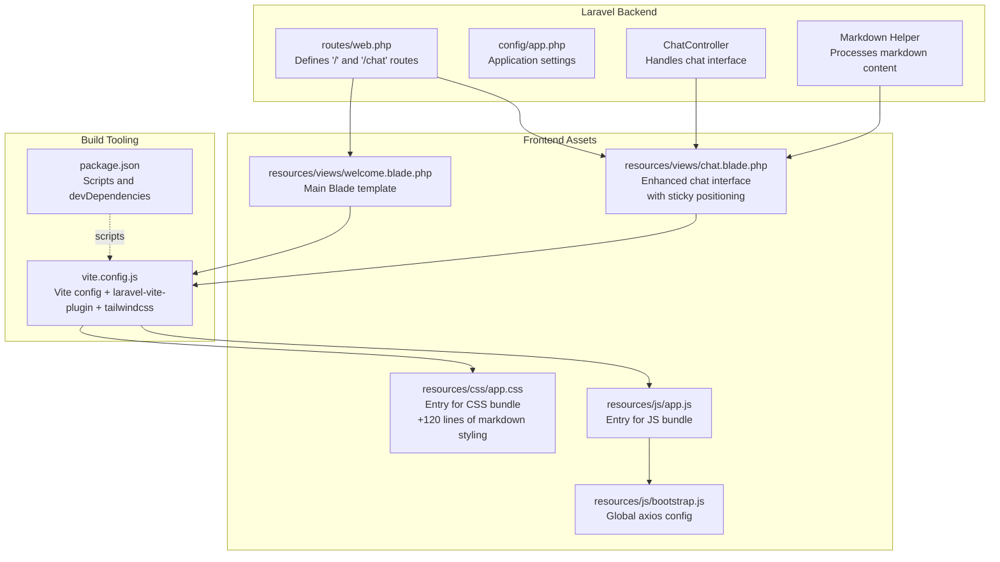
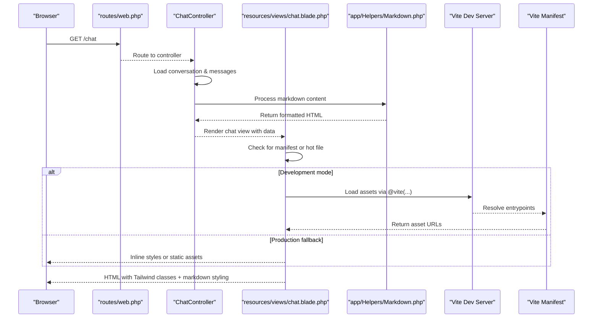
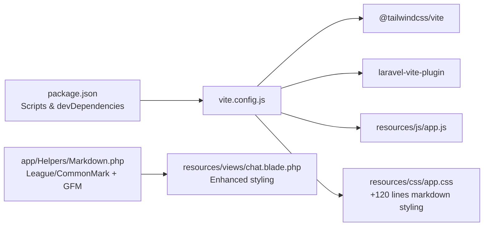

# Frontend Development

<cite>
**Referenced Files in This Document**
- [vite.config.js](file://vite.config.js)
- [package.json](file://package.json)
- [resources/js/app.js](file://resources/js/app.js)
- [resources/js/bootstrap.js](file://resources/js/bootstrap.js)
- [resources/css/app.css](file://resources/css/app.css)
- [resources/views/chat.blade.php](file://resources/views/chat.blade.php)
- [resources/views/welcome.blade.php](file://resources/views/welcome.blade.php)
- [routes/web.php](file://routes/web.php)
- [app/Helpers/Markdown.php](file://app/Helpers/Markdown.php)
- [composer.json](file://composer.json)
- [config/app.php](file://config/app.php)
</cite>

## Update Summary
**Changes Made**
- Added comprehensive documentation for the new markdown content styling system with 120+ lines of CSS rules
- Updated chat interface styling section with overflow handling and sticky positioning
- Enhanced responsive design patterns documentation
- Added detailed coverage of the markdown processing pipeline and styling integration
- Updated architecture diagrams to reflect the enhanced chat interface

## Table of Contents
1. [Introduction](#introduction)
2. [Project Structure](#project-structure)
3. [Core Components](#core-components)
4. [Architecture Overview](#architecture-overview)
5. [Detailed Component Analysis](#detailed-component-analysis)
6. [Dependency Analysis](#dependency-analysis)
7. [Performance Considerations](#performance-considerations)
8. [Troubleshooting Guide](#troubleshooting-guide)
9. [Conclusion](#conclusion)
10. [Appendices](#appendices)

## Introduction
This document explains the modern frontend toolchain and asset management system used in this Laravel project. It covers the Vite build configuration, JavaScript module system, and CSS preprocessing setup with Tailwind CSS. It also documents the Blade templating system, template inheritance, and data passing patterns, along with practical guidance for performance optimization, asset bundling, and production builds. The project now features an enhanced markdown styling system with comprehensive CSS rules for code blocks, tables, lists, and responsive design patterns.

## Project Structure
The frontend assets live under resources/js and resources/css, with Blade templates under resources/views. The Vite build tool orchestrates asset compilation and development hot reloading. The Laravel application exposes web routes that render both the welcome view and the chat interface with enhanced styling capabilities.

**Diagram sources**
- [routes/web.php:1-12](file://routes/web.php#L1-L12)
- [resources/views/chat.blade.php:1-391](file://resources/views/chat.blade.php#L1-L391)
- [resources/views/welcome.blade.php:1-226](file://resources/views/welcome.blade.php#L1-L226)
- [vite.config.js:1-19](file://vite.config.js#L1-L19)
- [package.json:1-18](file://package.json#L1-L18)
- [resources/js/app.js:1-2](file://resources/js/app.js#L1-L2)
- [resources/js/bootstrap.js:1-5](file://resources/js/bootstrap.js#L1-L5)
- [resources/css/app.css:1-141](file://resources/css/app.css#L1-L141)
- [config/app.php:1-127](file://config/app.php#L1-L127)

**Section sources**
- [routes/web.php:1-12](file://routes/web.php#L1-L12)
- [resources/views/chat.blade.php:1-391](file://resources/views/chat.blade.php#L1-L391)
- [resources/views/welcome.blade.php:1-226](file://resources/views/welcome.blade.php#L1-L226)
- [vite.config.js:1-19](file://vite.config.js#L1-L19)
- [package.json:1-18](file://package.json#L1-L18)
- [resources/js/app.js:1-2](file://resources/js/app.js#L1-L2)
- [resources/js/bootstrap.js:1-5](file://resources/js/bootstrap.js#L1-L5)
- [resources/css/app.css:1-141](file://resources/css/app.css#L1-L141)
- [config/app.php:1-127](file://config/app.php#L1-L127)

## Core Components
- Vite configuration with laravel-vite-plugin and Tailwind CSS integration for asset compilation and development server features.
- JavaScript module system: a small entry that imports a shared bootstrap module for global defaults.
- CSS preprocessing with Tailwind directives and extensive markdown styling system covering 120+ lines of CSS rules.
- Blade templating that conditionally loads Vite-managed assets during development or falls back to prebuilt static assets.
- Enhanced chat interface with sticky positioning, overflow handling, and responsive design patterns.

Key implementation references:
- Vite plugin chain and server watch exclusions: [vite.config.js:5-17](file://vite.config.js#L5-L17)
- Build and dev scripts: [package.json:5-8](file://package.json#L5-L8)
- JS entry and axios bootstrap: [resources/js/app.js:1-2](file://resources/js/app.js#L1-L2), [resources/js/bootstrap.js:1-5](file://resources/js/bootstrap.js#L1-L5)
- Tailwind directives and comprehensive markdown styling: [resources/css/app.css:1-141](file://resources/css/app.css#L1-L141)
- Conditional asset loading in Blade: [resources/views/welcome.blade.php:14-20](file://resources/views/welcome.blade.php#L14-L20)
- Enhanced chat interface with sticky positioning: [resources/views/chat.blade.php:133](file://resources/views/chat.blade.php#L133)

**Section sources**
- [vite.config.js:1-19](file://vite.config.js#L1-L19)
- [package.json:1-18](file://package.json#L1-L18)
- [resources/js/app.js:1-2](file://resources/js/app.js#L1-L2)
- [resources/js/bootstrap.js:1-5](file://resources/js/bootstrap.js#L1-L5)
- [resources/css/app.css:1-141](file://resources/css/app.css#L1-L141)
- [resources/views/welcome.blade.php:14-20](file://resources/views/welcome.blade.php#L14-L20)
- [resources/views/chat.blade.php:133](file://resources/views/chat.blade.php#L133)

## Architecture Overview
The frontend pipeline integrates Laravel's server-side rendering with Vite's client-side development and build tooling. During development, Blade injects Vite's script and manifest-based assets. In production, the Blade template can fall back to static assets when Vite's manifest is absent. The enhanced chat interface now features sticky positioning for the message input area and comprehensive markdown styling.

**Diagram sources**
- [routes/web.php:10-11](file://routes/web.php#L10-L11)
- [resources/views/chat.blade.php:18-31](file://resources/views/chat.blade.php#L18-L31)
- [app/Helpers/Markdown.php:36-41](file://app/Helpers/Markdown.php#L36-L41)
- [resources/views/chat.blade.php:105](file://resources/views/chat.blade.php#L105)
- [resources/views/chat.blade.php:14-20](file://resources/views/chat.blade.php#L14-L20)

**Section sources**
- [routes/web.php:1-12](file://routes/web.php#L1-L12)
- [resources/views/chat.blade.php:1-391](file://resources/views/chat.blade.php#L1-L391)
- [app/Helpers/Markdown.php:1-62](file://app/Helpers/Markdown.php#L1-L62)
- [vite.config.js:1-19](file://vite.config.js#L1-L19)

## Detailed Component Analysis

### Vite Build Configuration
- Plugins:
  - laravel-vite-plugin registers entrypoints for CSS and JS and enables HMR/refresh.
  - @tailwindcss/vite integrates Tailwind's compiler with Vite.
- Server watch configuration excludes compiled view caches to avoid unnecessary rebuilds.
- Inputs define the primary entrypoints consumed by Blade via @vite.

Implementation references:
- Plugin registration and inputs: [vite.config.js:6-11](file://vite.config.js#L6-L11)
- Server watch exclusions: [vite.config.js:13-17](file://vite.config.js#L13-L17)
- Entrypoints referenced by Blade: [resources/css/app.css:1-141](file://resources/css/app.css#L1-L141), [resources/js/app.js:1-2](file://resources/js/app.js#L1-L2)

**Section sources**
- [vite.config.js:1-19](file://vite.config.js#L1-L19)
- [resources/css/app.css:1-141](file://resources/css/app.css#L1-L141)
- [resources/js/app.js:1-2](file://resources/js/app.js#L1-L2)

### JavaScript Module System
- resources/js/app.js acts as the JS entrypoint and imports the shared bootstrap module.
- resources/js/bootstrap.js sets up axios globally with common defaults, enabling consistent client-side HTTP behavior across components.

Implementation references:
- JS entrypoint: [resources/js/app.js:1-2](file://resources/js/app.js#L1-L2)
- Axios bootstrap: [resources/js/bootstrap.js:1-5](file://resources/js/bootstrap.js#L1-L5)

**Section sources**
- [resources/js/app.js:1-2](file://resources/js/app.js#L1-L2)
- [resources/js/bootstrap.js:1-5](file://resources/js/bootstrap.js#L1-L5)

### CSS Preprocessing and Tailwind Integration
- resources/css/app.css imports Tailwind and configures scanning sources for Tailwind to discover utilities in Blade and JS files.
- Theme customization defines font families and other design tokens.
- **Enhanced** with comprehensive markdown styling system covering 120+ lines of CSS rules for code blocks, tables, lists, headings, and inline code.

Implementation references:
- Tailwind import and theme customization: [resources/css/app.css:1-12](file://resources/css/app.css#L1-L12)
- Comprehensive markdown styling: [resources/css/app.css:13-141](file://resources/css/app.css#L13-L141)

Markdown styling system highlights:
- Code blocks with dark theme styling and horizontal scrolling
- Inline code with proper spacing and typography
- Headings with consistent sizing and spacing
- Lists with proper indentation and spacing
- Blockquotes with styled borders and typography
- Tables with proper borders and padding
- Links with hover effects and proper styling

**Section sources**
- [resources/css/app.css:1-141](file://resources/css/app.css#L1-L141)

### Enhanced Chat Interface Styling
The chat interface features comprehensive styling with responsive design and overflow handling:

- **Sticky positioning**: Message input area uses `sticky bottom-0 z-10` for persistent input
- **Overflow handling**: Messages container uses `overflow-y-auto` with smooth scrolling
- **Responsive design**: Flexbox layouts adapt to different screen sizes
- **Prose styling**: User messages use `prose prose-invert` for dark mode compatibility
- **Markdown integration**: Assistant messages use `markdown-content` class for comprehensive styling

Implementation references:
- Sticky input area: [resources/views/chat.blade.php:133](file://resources/views/chat.blade.php#L133)
- Overflow handling: [resources/views/chat.blade.php:49](file://resources/views/chat.blade.php#L49)
- Responsive layouts: [resources/views/chat.blade.php:11](file://resources/views/chat.blade.php#L11)
- Prose styling: [resources/views/chat.blade.php:89](file://resources/views/chat.blade.php#L89)
- Markdown integration: [resources/views/chat.blade.php:105](file://resources/views/chat.blade.php#L105)

**Section sources**
- [resources/views/chat.blade.php:133](file://resources/views/chat.blade.php#L133)
- [resources/views/chat.blade.php:49](file://resources/views/chat.blade.php#L49)
- [resources/views/chat.blade.php:11](file://resources/views/chat.blade.php#L11)
- [resources/views/chat.blade.php:89](file://resources/views/chat.blade.php#L89)
- [resources/views/chat.blade.php:105](file://resources/views/chat.blade.php#L105)

### Markdown Processing Pipeline
The application includes a comprehensive markdown processing system that converts markdown content to styled HTML:

- **Markdown helper**: Uses League/CommonMark with GitHub Flavored Markdown extension
- **Configuration**: Safe HTML input, max nesting level, and configurable options
- **Integration**: Processes assistant messages with proper styling classes
- **Security**: Escapes HTML input and prevents unsafe links

Implementation references:
- Markdown conversion: [app/Helpers/Markdown.php:36-41](file://app/Helpers/Markdown.php#L36-L41)
- GitHub Flavored Markdown: [app/Helpers/Markdown.php:26-27](file://app/Helpers/Markdown.php#L26-L27)
- Security configuration: [app/Helpers/Markdown.php:20-23](file://app/Helpers/Markdown.php#L20-L23)

**Section sources**
- [app/Helpers/Markdown.php:1-62](file://app/Helpers/Markdown.php#L1-L62)

### Blade Templating and Asset Loading
- The welcome Blade view conditionally loads Vite assets when the manifest exists or hot file is present; otherwise, it inlines a prebuilt Tailwind stylesheet.
- The chat Blade view includes enhanced styling with markdown content and responsive design patterns.
- Both templates demonstrate responsive design patterns using Tailwind breakpoints and dark mode variants.

Implementation references:
- Conditional asset injection: [resources/views/welcome.blade.php:14-20](file://resources/views/welcome.blade.php#L14-L20)
- Enhanced chat template: [resources/views/chat.blade.php:1-391](file://resources/views/chat.blade.php#L1-L391)
- Responsive and dark mode utilities: [resources/views/chat.blade.php:22-224](file://resources/views/chat.blade.php#L22-L224)

**Section sources**
- [resources/views/welcome.blade.php:1-226](file://resources/views/welcome.blade.php#L1-L226)
- [resources/views/chat.blade.php:1-391](file://resources/views/chat.blade.php#L1-L391)

### Laravel Routes and Template Rendering
- The root route returns the welcome Blade view, establishing the single entrypoint for frontend rendering.
- The chat route returns the enhanced chat Blade view with markdown styling and responsive design.

Implementation references:
- Root route definition: [routes/web.php:6-8](file://routes/web.php#L6-L8)
- Chat route definitions: [routes/web.php:10-11](file://routes/web.php#L10-L11)

**Section sources**
- [routes/web.php:1-12](file://routes/web.php#L1-L12)

## Dependency Analysis
The frontend toolchain relies on Vite and Tailwind CSS configured via dedicated plugins. The Laravel application integrates with NPM scripts and Composer scripts to orchestrate development and build workflows. The enhanced chat interface adds markdown processing dependencies.

**Diagram sources**
- [package.json:5-16](file://package.json#L5-L16)
- [vite.config.js:1-12](file://vite.config.js#L1-L12)
- [resources/js/app.js:1-2](file://resources/js/app.js#L1-L2)
- [resources/css/app.css:1-141](file://resources/css/app.css#L1-L141)
- [app/Helpers/Markdown.php:5-8](file://app/Helpers/Markdown.php#L5-L8)
- [resources/views/chat.blade.php:105](file://resources/views/chat.blade.php#L105)

**Section sources**
- [package.json:1-18](file://package.json#L1-L18)
- [vite.config.js:1-19](file://vite.config.js#L1-L19)
- [resources/js/app.js:1-2](file://resources/js/app.js#L1-L2)
- [resources/css/app.css:1-141](file://resources/css/app.css#L1-L141)
- [app/Helpers/Markdown.php:1-62](file://app/Helpers/Markdown.php#L1-L62)

## Performance Considerations
- Prefer Tailwind utility classes for rapid iteration; avoid excessive custom CSS to keep the bundle lean.
- Keep entrypoints minimal; only include what is needed for the current page.
- Use Vite's built-in code splitting and lazy loading for non-critical features.
- Enable production builds to benefit from minification and tree shaking.
- Monitor asset sizes and remove unused utilities by ensuring Tailwind scans the correct sources.
- **Enhanced**: The comprehensive markdown styling system is optimized for performance with efficient selectors and minimal specificity.
- **Enhanced**: Sticky positioning for chat input reduces layout thrashing during scrolling.

## Troubleshooting Guide
Common issues and resolutions:
- Vite manifest missing in production:
  - Ensure the production build generates the manifest and assets directory. The Blade template falls back to inline styles when the manifest is absent.
  - Reference: [resources/views/welcome.blade.php:14-20](file://resources/views/welcome.blade.php#L14-L20)
- Hot reload not triggering:
  - Verify Vite server watch exclusions do not block your working directory.
  - Reference: [vite.config.js:13-17](file://vite.config.js#L13-L17)
- Axios defaults not applied:
  - Confirm the bootstrap module is imported by the JS entrypoint.
  - Reference: [resources/js/app.js:1-2](file://resources/js/app.js#L1-L2), [resources/js/bootstrap.js:1-5](file://resources/js/bootstrap.js#L1-L5)
- Tailwind utilities not generated:
  - Ensure Tailwind scans the correct sources and theme is configured.
  - Reference: [resources/css/app.css:3-7](file://resources/css/app.css#L3-L7), [resources/css/app.css:8-12](file://resources/css/app.css#L8-L12)
- **Enhanced**: Markdown styling not applied:
  - Ensure markdown content is processed through the helper and rendered with proper classes.
  - Reference: [app/Helpers/Markdown.php:36-41](file://app/Helpers/Markdown.php#L36-L41), [resources/views/chat.blade.php:105](file://resources/views/chat.blade.php#L105)
- **Enhanced**: Chat interface overflow issues:
  - Verify overflow properties are correctly applied to message containers.
  - Reference: [resources/views/chat.blade.php:49](file://resources/views/chat.blade.php#L49), [resources/views/chat.blade.php:133](file://resources/views/chat.blade.php#L133)

**Section sources**
- [resources/views/welcome.blade.php:14-20](file://resources/views/welcome.blade.php#L14-L20)
- [vite.config.js:13-17](file://vite.config.js#L13-L17)
- [resources/js/app.js:1-2](file://resources/js/app.js#L1-L2)
- [resources/js/bootstrap.js:1-5](file://resources/js/bootstrap.js#L1-L5)
- [resources/css/app.css:3-12](file://resources/css/app.css#L3-L12)
- [app/Helpers/Markdown.php:36-41](file://app/Helpers/Markdown.php#L36-L41)
- [resources/views/chat.blade.php:105](file://resources/views/chat.blade.php#L105)
- [resources/views/chat.blade.php:49](file://resources/views/chat.blade.php#L49)
- [resources/views/chat.blade.php:133](file://resources/views/chat.blade.php#L133)

## Conclusion
This project combines Laravel's Blade templating with Vite and Tailwind CSS to deliver a modern, efficient frontend workflow. The enhanced chat interface features comprehensive markdown styling with 120+ lines of CSS rules, sticky positioning for improved user experience, and responsive design patterns. The integration of markdown processing ensures rich content presentation while maintaining security and performance. The configuration keeps development fast with hot module replacement and integrates Tailwind for utility-first styling and responsive design. By following the outlined practices—minimal entrypoints, careful asset loading, and production builds—you can maintain a robust and performant frontend system.

## Appendices

### Appendix A: Scripts and Commands
- Development server and asset watcher:
  - Command: npm run dev
  - Reference: [package.json:7-7](file://package.json#L7-L7)
- Production build:
  - Command: npm run build
  - Reference: [package.json:6-6](file://package.json#L6-L6)
- Combined Laravel and Vite dev process:
  - Composer script runs Laravel server, queue, log tail, and Vite concurrently.
  - Reference: [composer.json:48-51](file://composer.json#L48-L51)

**Section sources**
- [package.json:1-18](file://package.json#L1-L18)
- [composer.json:48-51](file://composer.json#L48-L51)

### Appendix B: Markdown Styling System
The comprehensive markdown styling system provides consistent, readable formatting for various content types:

**Typography and Spacing**
- Paragraphs with consistent margins and line heights
- Proper spacing for headings hierarchy
- List items with appropriate indentation and spacing

**Code Formatting**
- Dark-themed code blocks with syntax highlighting support
- Inline code with proper spacing and typography
- Monospace font family for code elements

**Content Elements**
- Blockquotes with styled borders and typography
- Links with hover effects and proper styling
- Horizontal rules for content separation
- Tables with proper borders and padding

**Responsive Design**
- Mobile-first approach with appropriate font sizing
- Flexible layouts that adapt to different screen sizes
- Touch-friendly interactive elements

**Section sources**
- [resources/css/app.css:13-141](file://resources/css/app.css#L13-L141)