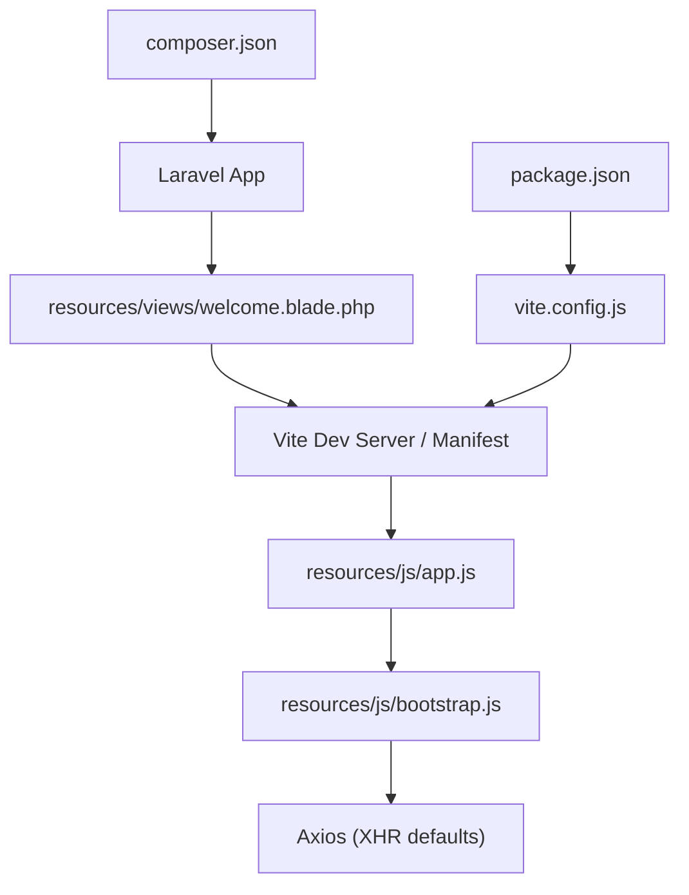
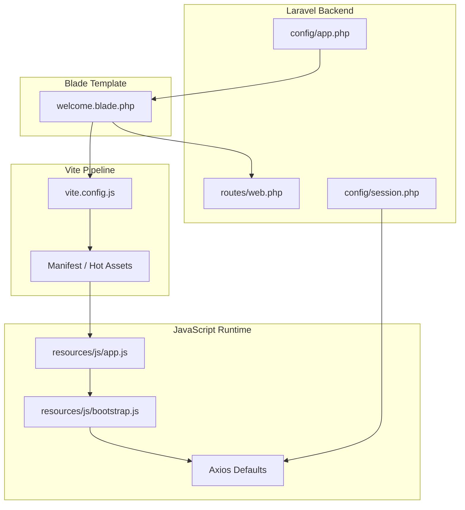
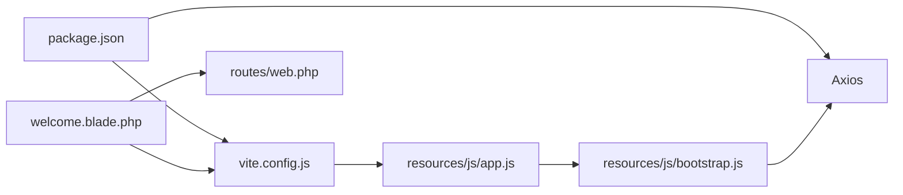

# JavaScript Development

<cite>
**Referenced Files in This Document**
- [resources/js/app.js](file://resources/js/app.js)
- [resources/js/bootstrap.js](file://resources/js/bootstrap.js)
- [vite.config.js](file://vite.config.js)
- [package.json](file://package.json)
- [composer.json](file://composer.json)
- [resources/views/welcome.blade.php](file://resources/views/welcome.blade.php)
- [routes/web.php](file://routes/web.php)
- [config/session.php](file://config/session.php)
- [config/app.php](file://config/app.php)
- [bootstrap/providers.php](file://bootstrap/providers.php)
</cite>

## Table of Contents
1. [Introduction](#introduction)
2. [Project Structure](#project-structure)
3. [Core Components](#core-components)
4. [Architecture Overview](#architecture-overview)
5. [Detailed Component Analysis](#detailed-component-analysis)
6. [Dependency Analysis](#dependency-analysis)
7. [Performance Considerations](#performance-considerations)
8. [Troubleshooting Guide](#troubleshooting-guide)
9. [Conclusion](#conclusion)
10. [Appendices](#appendices)

## Introduction
This document explains JavaScript development in this Laravel project, focusing on the modern JavaScript toolchain and module system. It covers ES6+ module patterns, import/export usage, dependency management via npm, Vite-based asset pipeline, and integration with Laravel’s CSRF protection and Blade rendering. It also provides practical guidance on component development, event handling, DOM manipulation, form validation, and performance optimization, while connecting frontend JavaScript to Laravel’s server-side features.

## Project Structure
The JavaScript assets are organized under resources/js with a small bootstrap entry that wires Axios globally. The Vite configuration defines the input entrypoints and enables hot module replacement and Tailwind CSS integration. The Blade template renders the page and conditionally loads Vite assets during development or prebuilt assets in production.

**Diagram sources**
- [resources/views/welcome.blade.php:14-20](file://resources/views/welcome.blade.php#L14-L20)
- [resources/js/app.js:1-2](file://resources/js/app.js#L1-L2)
- [resources/js/bootstrap.js:1-5](file://resources/js/bootstrap.js#L1-L5)
- [vite.config.js:1-19](file://vite.config.js#L1-L19)
- [package.json:1-18](file://package.json#L1-L18)
- [composer.json:1-93](file://composer.json#L1-L93)

**Section sources**
- [resources/js/app.js:1-2](file://resources/js/app.js#L1-L2)
- [resources/js/bootstrap.js:1-5](file://resources/js/bootstrap.js#L1-L5)
- [vite.config.js:1-19](file://vite.config.js#L1-L19)
- [package.json:1-18](file://package.json#L1-L18)
- [resources/views/welcome.blade.php:14-20](file://resources/views/welcome.blade.php#L14-L20)

## Core Components
- Application entry point: resources/js/app.js imports the bootstrap module to initialize the runtime environment.
- Bootstrap module: resources/js/bootstrap.js installs Axios globally and sets a default header for XHR requests.
- Asset pipeline: vite.config.js configures Vite with Laravel plugin and Tailwind CSS, pointing to resources/js/app.js and resources/css/app.css.
- Package management: package.json declares Vite, Axios, Tailwind CSS, and related devDependencies, and defines scripts for dev/build.
- Blade integration: resources/views/welcome.blade.php conditionally injects Vite assets during development or falls back to prebuilt styles.

Key implementation references:
- [resources/js/app.js:1](file://resources/js/app.js#L1)
- [resources/js/bootstrap.js:1-5](file://resources/js/bootstrap.js#L1-L5)
- [vite.config.js:7-11](file://vite.config.js#L7-L11)
- [package.json:5-8](file://package.json#L5-L8)
- [resources/views/welcome.blade.php:14-20](file://resources/views/welcome.blade.php#L14-L20)

**Section sources**
- [resources/js/app.js:1-2](file://resources/js/app.js#L1-L2)
- [resources/js/bootstrap.js:1-5](file://resources/js/bootstrap.js#L1-L5)
- [vite.config.js:1-19](file://vite.config.js#L1-L19)
- [package.json:1-18](file://package.json#L1-L18)
- [resources/views/welcome.blade.php:14-20](file://resources/views/welcome.blade.php#L14-L20)

## Architecture Overview
The frontend architecture follows a modern toolchain:
- Vite compiles TypeScript/JS and CSS, enabling fast development with HMR.
- Laravel’s Blade renders the HTML and injects Vite-managed assets.
- Axios is globally available for AJAX requests.
- Laravel’s CSRF and session configuration integrate with browser cookies and headers.

**Diagram sources**
- [resources/views/welcome.blade.php:14-20](file://resources/views/welcome.blade.php#L14-L20)
- [vite.config.js:1-19](file://vite.config.js#L1-L19)
- [resources/js/app.js:1-2](file://resources/js/app.js#L1-L2)
- [resources/js/bootstrap.js:1-5](file://resources/js/bootstrap.js#L1-L5)
- [routes/web.php:5-7](file://routes/web.php#L5-L7)
- [config/session.php:159-215](file://config/session.php#L159-L215)
- [config/app.php:16](file://config/app.php#L16)

## Detailed Component Analysis

### ES6+ Modules and Import/Export Patterns
- Entry point: resources/js/app.js imports the bootstrap module, establishing a single initialization point.
- Bootstrap: resources/js/bootstrap.js imports Axios and exposes it globally, then sets a default header for XMLHttpRequests. This pattern centralizes HTTP configuration and makes Axios available across modules.
- Module boundaries: Keep feature-specific logic in separate modules imported by app.js to maintain clean separation of concerns.

Implementation references:
- [resources/js/app.js:1](file://resources/js/app.js#L1)
- [resources/js/bootstrap.js:1-5](file://resources/js/bootstrap.js#L1-L5)

**Section sources**
- [resources/js/app.js:1-2](file://resources/js/app.js#L1-L2)
- [resources/js/bootstrap.js:1-5](file://resources/js/bootstrap.js#L1-L5)

### Dependency Management with npm
- Dev toolchain: Vite, Tailwind CSS, and laravel-vite-plugin are declared in package.json.
- Scripts: npm run dev starts Vite dev server; npm run build produces optimized assets.
- Version constraints: Axios is pinned to a specific semver range to ensure stability.

References:
- [package.json:9-16](file://package.json#L9-L16)
- [package.json:5-8](file://package.json#L5-L8)

**Section sources**
- [package.json:1-18](file://package.json#L1-L18)

### Application Entry Point Setup and Global Configuration
- Entry point: resources/js/app.js imports the bootstrap module to initialize the runtime.
- Global Axios: resources/js/bootstrap.js assigns Axios to window.axios and sets a default header for XHR requests.
- Blade integration: resources/views/welcome.blade.php uses @vite to load assets during development and falls back to prebuilt styles otherwise.

References:
- [resources/js/app.js:1](file://resources/js/app.js#L1)
- [resources/js/bootstrap.js:1-5](file://resources/js/bootstrap.js#L1-L5)
- [resources/views/welcome.blade.php:14-20](file://resources/views/welcome.blade.php#L14-L20)

**Section sources**
- [resources/js/app.js:1-2](file://resources/js/app.js#L1-L2)
- [resources/js/bootstrap.js:1-5](file://resources/js/bootstrap.js#L1-L5)
- [resources/views/welcome.blade.php:14-20](file://resources/views/welcome.blade.php#L14-L20)

### Library Integration Patterns (Axios)
- Centralized HTTP client: Assign Axios to window.axios in bootstrap.js to make it universally available.
- Default headers: A consistent X-Requested-With header is set to aid server-side detection of AJAX requests.
- Usage: Other modules can import Axios directly or rely on the global instance initialized here.

References:
- [resources/js/bootstrap.js:1-5](file://resources/js/bootstrap.js#L1-L5)

**Section sources**
- [resources/js/bootstrap.js:1-5](file://resources/js/bootstrap.js#L1-L5)

### Component Development, Event Handling, and DOM Manipulation
- Blade-to-JavaScript data passing: Use data-* attributes on DOM elements to pass serialized server data to JavaScript modules. This avoids inline script blocks and keeps concerns separated.
- Event handling: Attach event listeners to elements initialized by Blade-rendered markup. Keep handlers modular and importable from app.js.
- DOM updates: Prefer declarative updates via data attributes and minimal imperative DOM manipulation to reduce coupling.

References:
- [resources/views/welcome.blade.php:106-108](file://resources/views/welcome.blade.php#L106-L108)

**Section sources**
- [resources/views/welcome.blade.php:106-108](file://resources/views/welcome.blade.php#L106-L108)

### Integration with Laravel CSRF Protection and Session Cookies
- CSRF token in forms: Laravel’s @csrf directive generates a hidden input containing a CSRF token. Axios respects cookies and SameSite policies configured by Laravel.
- Session configuration: config/session.php controls SameSite, Secure, HttpOnly, and Partitioned cookie attributes. These influence how cookies are sent with Axios requests.
- Cross-site request safety: The SameSite policy affects whether cookies are included in cross-site requests, impacting AJAX behavior.

References:
- [config/session.php:159-215](file://config/session.php#L159-L215)

**Section sources**
- [config/session.php:159-215](file://config/session.php#L159-L215)

### AJAX Request Handling and Form Validation
- AJAX requests: Use the globally available Axios instance to send requests. Configure headers as needed; the default X-Requested-With header helps identify AJAX traffic.
- Form submission: For CSRF-protected endpoints, ensure forms include @csrf and submit via Axios. On success, update the DOM without full page reloads.
- Validation feedback: On validation errors, surface messages in the UI using DOM updates or a lightweight component.

References:
- [resources/js/bootstrap.js:1-5](file://resources/js/bootstrap.js#L1-L5)

**Section sources**
- [resources/js/bootstrap.js:1-5](file://resources/js/bootstrap.js#L1-L5)

### Modern JavaScript Features, Polyfills, and Browser Compatibility
- Module type: package.json sets type: module, enabling ES modules across the project.
- Toolchain: Vite compiles modern JavaScript to browser-compatible bundles. Add polyfills only when targeting legacy browsers not supported by your audience.
- Recommendations: Use native features where possible; add targeted polyfills for missing APIs (e.g., fetch, Promise) only if necessary.

References:
- [package.json:4](file://package.json#L4)

**Section sources**
- [package.json:1-18](file://package.json#L1-L18)

### Relationship Between Server-Side Laravel Features and Client-Side JavaScript
- Routing: routes/web.php defines the homepage route that renders the Blade template.
- Configuration: config/app.php provides application metadata (e.g., name) used in Blade output.
- Provider registration: bootstrap/providers.php registers service providers, ensuring backend services are available to the frontend via API responses or Blade-rendered data.

References:
- [routes/web.php:5-7](file://routes/web.php#L5-L7)
- [config/app.php:16](file://config/app.php#L16)
- [bootstrap/providers.php:5-7](file://bootstrap/providers.php#L5-L7)

**Section sources**
- [routes/web.php:1-8](file://routes/web.php#L1-L8)
- [config/app.php:1-127](file://config/app.php#L1-L127)
- [bootstrap/providers.php:1-8](file://bootstrap/providers.php#L1-L8)

## Dependency Analysis
The JavaScript runtime depends on Axios for HTTP and Vite for asset compilation. The Blade template depends on Laravel’s asset pipeline and routing.

**Diagram sources**
- [package.json:1-18](file://package.json#L1-L18)
- [vite.config.js:1-19](file://vite.config.js#L1-L19)
- [resources/js/app.js:1-2](file://resources/js/app.js#L1-L2)
- [resources/js/bootstrap.js:1-5](file://resources/js/bootstrap.js#L1-L5)
- [resources/views/welcome.blade.php:14-20](file://resources/views/welcome.blade.php#L14-L20)
- [routes/web.php:5-7](file://routes/web.php#L5-L7)

**Section sources**
- [package.json:1-18](file://package.json#L1-L18)
- [vite.config.js:1-19](file://vite.config.js#L1-L19)
- [resources/js/app.js:1-2](file://resources/js/app.js#L1-L2)
- [resources/js/bootstrap.js:1-5](file://resources/js/bootstrap.js#L1-L5)
- [resources/views/welcome.blade.php:14-20](file://resources/views/welcome.blade.php#L14-L20)
- [routes/web.php:5-7](file://routes/web.php#L5-L7)

## Performance Considerations
- Build optimization: Use npm run build to produce optimized assets for production.
- Asset loading: Prefer lazy-loading non-critical modules and defer heavy computations until after initial render.
- Network efficiency: Minimize the number of Axios requests by batching or caching where appropriate.
- Bundle size: Keep app.js minimal and split feature logic into smaller modules to improve tree-shaking and initial load performance.

[No sources needed since this section provides general guidance]

## Troubleshooting Guide
- Axios not found: Ensure resources/js/bootstrap.js runs before other modules and that resources/js/app.js imports the bootstrap module.
- CSRF failures: Verify forms include @csrf and that Laravel’s session configuration aligns with SameSite and cookie policies.
- Vite dev server issues: Confirm Vite dev script is running and that @vite is present in the Blade template during development.

References:
- [resources/js/bootstrap.js:1-5](file://resources/js/bootstrap.js#L1-L5)
- [resources/js/app.js:1](file://resources/js/app.js#L1)
- [resources/views/welcome.blade.php:14-20](file://resources/views/welcome.blade.php#L14-L20)
- [config/session.php:159-215](file://config/session.php#L159-L215)

**Section sources**
- [resources/js/bootstrap.js:1-5](file://resources/js/bootstrap.js#L1-L5)
- [resources/js/app.js:1-2](file://resources/js/app.js#L1-L2)
- [resources/views/welcome.blade.php:14-20](file://resources/views/welcome.blade.php#L14-L20)
- [config/session.php:159-215](file://config/session.php#L159-L215)

## Conclusion
This project establishes a clean, modern JavaScript development foundation using ES6+ modules, Vite, and Axios. The Blade template integrates seamlessly with the asset pipeline, while Laravel’s CSRF and session configuration ensures secure AJAX interactions. Following the patterns outlined here will help maintain a scalable, performant, and secure frontend architecture aligned with Laravel’s backend capabilities.

[No sources needed since this section summarizes without analyzing specific files]

## Appendices

### Practical Workflow: Adding a New Feature Module
- Create a new module under resources/js/<feature>.js.
- Import it from resources/js/app.js.
- Use data-* attributes in Blade to pass server data to the module.
- Handle events and update the DOM declaratively.

References:
- [resources/js/app.js:1](file://resources/js/app.js#L1)
- [resources/views/welcome.blade.php:106-108](file://resources/views/welcome.blade.php#L106-L108)

**Section sources**
- [resources/js/app.js:1-2](file://resources/js/app.js#L1-L2)
- [resources/views/welcome.blade.php:106-108](file://resources/views/welcome.blade.php#L106-L108)