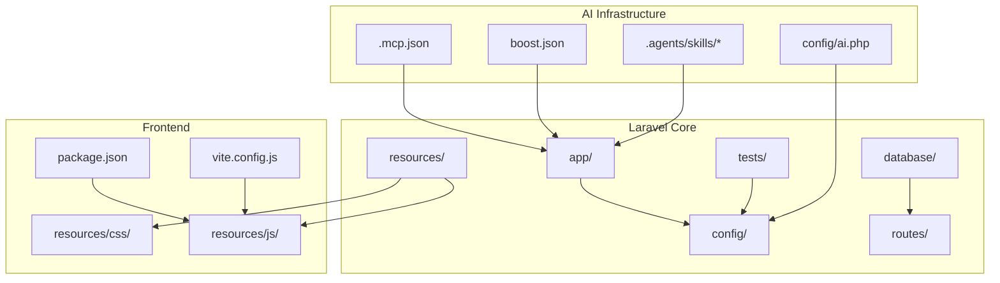
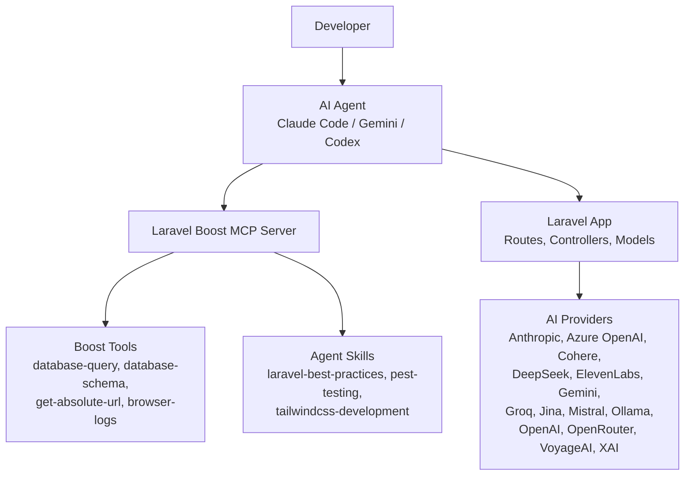
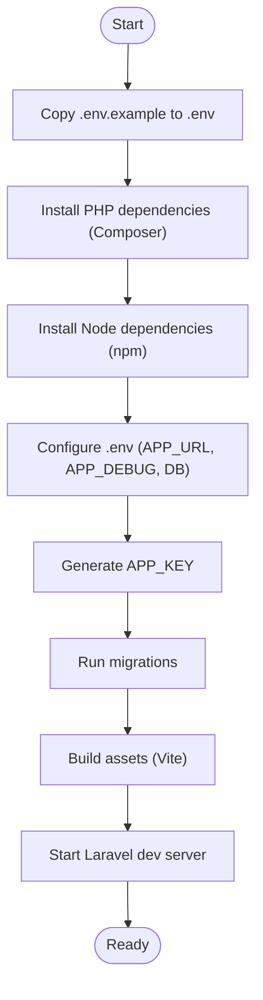
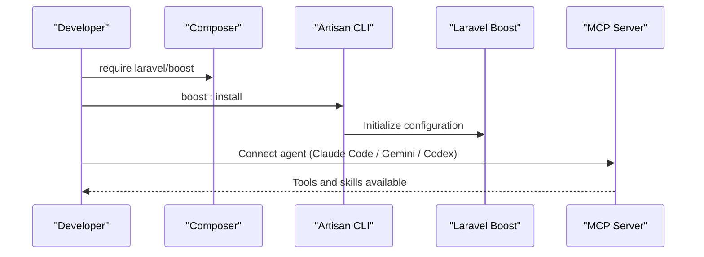
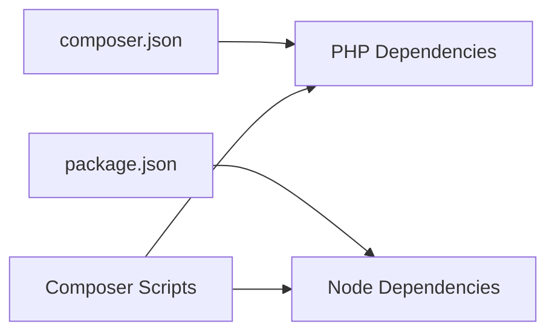

# Getting Started

<cite>
**Referenced Files in This Document**
- [README.md](file://README.md)
- [composer.json](file://composer.json)
- [package.json](file://package.json)
- [config/app.php](file://config/app.php)
- [config/ai.php](file://config/ai.php)
- [boost.json](file://boost.json)
- [.mcp.json](file://.mcp.json)
- [AGENTS.md](file://AGENTS.md)
- [CLAUDE.md](file://CLAUDE.md)
- [GEMINI.md](file://GEMINI.md)
- [.agents/skills/laravel-best-practices/SKILL.md](file://.agents/skills/laravel-best-practices/SKILL.md)
- [.agents/skills/pest-testing/SKILL.md](file://.agents/skills/pest-testing/SKILL.md)
- [.agents/skills/tailwindcss-development/SKILL.md](file://.agents/skills/tailwindcss-development/SKILL.md)
- [routes/web.php](file://routes/web.php)
- [resources/views/welcome.blade.php](file://resources/views/welcome.blade.php)
- [database/migrations/2026_04_02_115916_create_agent_conversations_table.php](file://database/migrations/2026_04_02_115916_create_agent_conversations_table.php)
- [bootstrap/providers.php](file://bootstrap/providers.php)
</cite>

## Table of Contents
1. [Introduction](#introduction)
2. [Project Structure](#project-structure)
3. [Core Components](#core-components)
4. [Architecture Overview](#architecture-overview)
5. [Detailed Component Analysis](#detailed-component-analysis)
6. [Dependency Analysis](#dependency-analysis)
7. [Performance Considerations](#performance-considerations)
8. [Troubleshooting Guide](#troubleshooting-guide)
9. [Conclusion](#conclusion)

## Introduction
Laravel Assistant is an AI-powered Laravel 13 application scaffold designed to accelerate development through multi-provider AI integration and agent-based workflows. It combines Laravel’s conventions with modern AI tools to streamline common development tasks, enforce best practices, and improve productivity for both beginners and experienced Laravel developers transitioning to AI-assisted development.

Key capabilities include:
- Multi-provider AI integration for text, images, audio, embeddings, and reranking
- Agent-based development with Laravel Boost, Claude Code, Gemini, and Codex
- Built-in skills for Laravel best practices, Pest testing, and Tailwind CSS development
- Preconfigured development environment with Vite, database migrations, and queue workers

This Getting Started guide walks you through installation, environment setup, and initial development workflow, including Laravel Boost installation and AI agent integration.

## Project Structure
At a high level, the project follows Laravel conventions with additional AI scaffolding:
- Laravel core: app/, config/, database/, routes/, resources/, tests/
- AI configuration: config/ai.php, .mcp.json, boost.json
- Agent skills: .agents/skills/*
- Frontend tooling: package.json, vite.config.js, resources/css/, resources/js/
- Bootstrap and providers: bootstrap/app.php, bootstrap/providers.php

**Diagram sources**
- [config/ai.php:1-132](file://config/ai.php#L1-L132)
- [.mcp.json:1-11](file://.mcp.json#L1-L11)
- [boost.json:1-17](file://boost.json#L1-L17)
- [package.json:1-18](file://package.json#L1-L18)
- [vite.config.js](file://vite.config.js)

**Section sources**
- [config/ai.php:1-132](file://config/ai.php#L1-L132)
- [.mcp.json:1-11](file://.mcp.json#L1-L11)
- [boost.json:1-17](file://boost.json#L1-L17)
- [package.json:1-18](file://package.json#L1-L18)

## Core Components
- Laravel 13 application with framework defaults and conventions
- Laravel AI SDK for multi-provider AI operations
- Laravel Boost with MCP server and skills for agent-assisted development
- Pest for testing and Tailwind CSS v4 for styling
- Vite for asset bundling and development server

Installation and setup are automated via Composer scripts, ensuring a consistent developer experience across environments.

**Section sources**
- [composer.json:1-93](file://composer.json#L1-L93)
- [README.md:32-42](file://README.md#L32-L42)

## Architecture Overview
The AI-assisted development architecture centers on Laravel Boost as the MCP server, exposing tools and skills to agents. Agents can leverage:
- Laravel Boost tools for database introspection, configuration inspection, and URL resolution
- Domain-specific skills for Laravel best practices, testing, and Tailwind CSS
- Laravel AI SDK for provider-agnostic AI operations

**Diagram sources**
- [AGENTS.md:63-96](file://AGENTS.md#L63-L96)
- [config/ai.php:52-129](file://config/ai.php#L52-L129)
- [boost.json:2-15](file://boost.json#L2-L15)

**Section sources**
- [AGENTS.md:63-96](file://AGENTS.md#L63-L96)
- [config/ai.php:52-129](file://config/ai.php#L52-L129)
- [boost.json:2-15](file://boost.json#L2-L15)

## Detailed Component Analysis

### Installation and Initial Setup
Follow these steps to install and launch the project locally:

1. Prerequisites
- PHP 8.3+
- Composer
- Node.js and npm
- A compatible database (SQLite included by default)

2. Clone and install dependencies
- Install PHP dependencies: Composer handles autoloaders and dev tools
- Install Node dependencies: npm installs Vite and Tailwind tooling

3. Environment configuration
- Copy .env.example to .env if missing
- Generate application key
- Configure APP_URL and APP_DEBUG as needed

4. Database initialization
- Run migrations to set up tables (including agent conversations)
- Seed the database if needed

5. Frontend assets
- Build assets with Vite or run the dev server

6. Development server
- Launch the Laravel development server
- Optionally run queue workers and logs watcher for AI features

**Diagram sources**
- [composer.json:40-71](file://composer.json#L40-L71)
- [package.json:5-8](file://package.json#L5-L8)
- [config/app.php:16-100](file://config/app.php#L16-L100)
- [database/migrations/2026_04_02_115916_create_agent_conversations_table.php:1-51](file://database/migrations/2026_04_02_115916_create_agent_conversations_table.php#L1-L51)

**Section sources**
- [composer.json:40-71](file://composer.json#L40-L71)
- [package.json:5-8](file://package.json#L5-L8)
- [config/app.php:16-100](file://config/app.php#L16-L100)
- [database/migrations/2026_04_02_115916_create_agent_conversations_table.php:1-51](file://database/migrations/2026_04_02_115916_create_agent_conversations_table.php#L1-L51)

### Laravel Boost Installation and AI Agent Integration
Laravel Boost integrates with your AI agents to provide tools and skills tailored to Laravel development. Install and configure Boost as follows:

1. Install Laravel Boost
- Require the development dependency via Composer
- Run the Boost installer to initialize configuration

2. Configure Boost
- Enable agents (Claude Code, Gemini, Codex)
- Activate skills (Laravel best practices, Pest testing, Tailwind CSS)
- Enable guidelines and MCP server

3. Start the MCP server
- Laravel Boost exposes an MCP server that agents can connect to
- The MCP configuration points to the Laravel Boost command

4. Use Boost tools and skills
- Use Boost tools for database introspection, configuration inspection, URL resolution, and browser logs
- Leverage skills for Laravel best practices, testing, and Tailwind CSS development

**Diagram sources**
- [README.md:34-42](file://README.md#L34-L42)
- [composer.json:19-19](file://composer.json#L19-L19)
- [boost.json:2-15](file://boost.json#L2-L15)
- [.mcp.json:1-11](file://.mcp.json#L1-L11)

**Section sources**
- [README.md:34-42](file://README.md#L34-L42)
- [composer.json:19-19](file://composer.json#L19-L19)
- [boost.json:2-15](file://boost.json#L2-L15)
- [.mcp.json:1-11](file://.mcp.json#L1-L11)

### Practical Development Scenarios
Common development tasks powered by Laravel Boost and AI skills:

- Writing and refactoring Laravel code
- Applying Laravel best practices consistently
- Generating tests with Pest
- Building responsive UIs with Tailwind CSS v4
- Inspecting database schema and running safe queries
- Resolving URLs and diagnosing browser-side issues

These scenarios are guided by the Boost guidelines and skills, ensuring adherence to Laravel conventions and best practices.

**Section sources**
- [AGENTS.md:24-30](file://AGENTS.md#L24-L30)
- [AGENTS.md:63-96](file://AGENTS.md#L63-L96)
- [.agents/skills/laravel-best-practices/SKILL.md:1-190](file://.agents/skills/laravel-best-practices/SKILL.md#L1-L190)
- [.agents/skills/pest-testing/SKILL.md:1-157](file://.agents/skills/pest-testing/SKILL.md#L1-L157)
- [.agents/skills/tailwindcss-development/SKILL.md:1-119](file://.agents/skills/tailwindcss-development/SKILL.md#L1-L119)

### Relationship Between Laravel Conventions and AI-Assisted Development
Laravel Assistant aligns AI assistance with Laravel’s conventions:
- Use Artisan commands to create files and inspect configuration
- Follow Laravel’s routing, controllers, models, and testing patterns
- Maintain consistent naming and structure across the codebase
- Apply Laravel best practices enforced by the agent skill

This alignment ensures that AI agents understand and enhance your application without disrupting established conventions.

**Section sources**
- [AGENTS.md:111-127](file://AGENTS.md#L111-L127)
- [AGENTS.md:129-133](file://AGENTS.md#L129-L133)
- [bootstrap/providers.php:1-8](file://bootstrap/providers.php#L1-L8)

## Dependency Analysis
The project’s dependencies are organized into PHP and Node.js components, with Composer scripts orchestrating setup and development workflows.

**Diagram sources**
- [composer.json:11-26](file://composer.json#L11-L26)
- [package.json:9-16](file://package.json#L9-L16)
- [composer.json:39-74](file://composer.json#L39-L74)

**Section sources**
- [composer.json:11-26](file://composer.json#L11-L26)
- [package.json:9-16](file://package.json#L9-L16)
- [composer.json:39-74](file://composer.json#L39-L74)

## Performance Considerations
- Use Laravel AI SDK caching for embeddings and other expensive operations
- Optimize database queries with eager loading and indexing
- Keep frontend assets optimized with Vite and Tailwind CSS v4 utilities
- Monitor queue workers and logs during AI-assisted development

[No sources needed since this section provides general guidance]

## Troubleshooting Guide
Common issues and resolutions during setup and development:

- Missing .env or APP_KEY
- Database connection errors
- Vite manifest errors requiring build or dev server restart
- Agent MCP connectivity issues

Use the Boost guidelines for resolving environment and tooling problems, and consult the Laravel documentation for framework-specific troubleshooting.

**Section sources**
- [AGENTS.md:135-137](file://AGENTS.md#L135-L137)
- [resources/views/welcome.blade.php:135-137](file://resources/views/welcome.blade.php#L135-L137)

## Conclusion
Laravel Assistant provides a robust, AI-enhanced Laravel 13 development environment. By combining multi-provider AI integration, Laravel Boost, and domain-specific agent skills, it accelerates development while maintaining adherence to Laravel conventions. Use this Getting Started guide to install the project, configure AI agents, and begin building with confidence.

[No sources needed since this section summarizes without analyzing specific files]