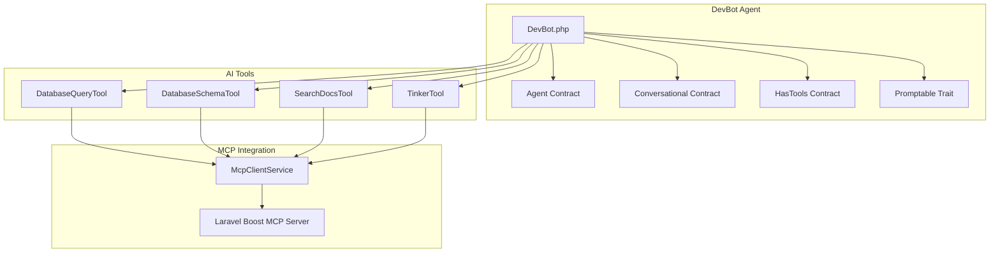
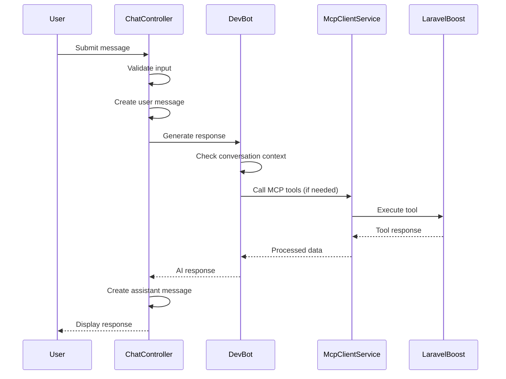

# Getting Started

<cite>
**Referenced Files in This Document**
- [README.md](file://README.md)
- [composer.json](file://composer.json)
- [package.json](file://package.json)
- [config/app.php](file://config/app.php)
- [config/ai.php](file://config/ai.php)
- [boost.json](file://boost.json)
- [.mcp.json](file://.mcp.json)
- [AGENTS.md](file://AGENTS.md)
- [CLAUDE.md](file://CLAUDE.md)
- [GEMINI.md](file://GEMINI.md)
- [.agents/skills/laravel-best-practices/SKILL.md](file://.agents/skills/laravel-best-practices/SKILL.md)
- [.agents/skills/pest-testing/SKILL.md](file://.agents/skills/pest-testing/SKILL.md)
- [.agents/skills/tailwindcss-development/SKILL.md](file://.agents/skills/tailwindcss-development/SKILL.md)
- [routes/web.php](file://routes/web.php)
- [resources/views/chat.blade.php](file://resources/views/chat.blade.php)
- [database/migrations/2026_04_02_115916_create_agent_conversations_table.php](file://database/migrations/2026_04_02_115916_create_agent_conversations_table.php)
- [bootstrap/providers.php](file://bootstrap/providers.php)
- [app/Ai/Agents/DevBot.php](file://app/Ai/Agents/DevBot.php)
- [app/Services/McpClientService.php](file://app/Services/McpClientService.php)
- [app/Http/Controllers/ChatController.php](file://app/Http/Controllers/ChatController.php)
- [app/Ai/Tools/DatabaseQueryTool.php](file://app/Ai/Tools/DatabaseQueryTool.php)
- [app/Ai/Tools/DatabaseSchemaTool.php](file://app/Ai/Tools/DatabaseSchemaTool.php)
- [app/Ai/Tools/SearchDocsTool.php](file://app/Ai/Tools/SearchDocsTool.php)
- [app/Ai/Tools/TinkerTool.php](file://app/Ai/Tools/TinkerTool.php)
</cite>

## Update Summary
**Changes Made**
- Complete rewrite of installation section with comprehensive quick start and manual installation procedures
- Added detailed AI provider configuration and MCP client setup instructions
- Expanded development workflow documentation with Laravel Boost integration
- Enhanced chat interface usage instructions and conversation management
- Updated architecture diagrams to reflect DevBot agent implementation
- Added practical development scenarios with MCP tool integration examples
- Improved troubleshooting section with specific error handling guidance

## Table of Contents
1. [Introduction](#introduction)
2. [Quick Start Installation](#quick-start-installation)
3. [Manual Installation](#manual-installation)
4. [AI Provider Configuration](#ai-provider-configuration)
5. [MCP Client Setup](#mcp-client-setup)
6. [Development Workflow](#development-workflow)
7. [Chat Interface Usage](#chat-interface-usage)
8. [Practical Development Scenarios](#practical-development-scenarios)
9. [Architecture Overview](#architecture-overview)
10. [Troubleshooting Guide](#troubleshooting-guide)
11. [Conclusion](#conclusion)

## Introduction
DevBot is an AI-powered development assistant built with Laravel that provides an interactive chat interface for developers to get help with programming questions, code review, debugging, architecture decisions, and best practices. The application combines Laravel's conventions with modern AI tools to streamline common development tasks while maintaining adherence to Laravel's framework standards.

Key capabilities include:
- **Interactive Chat Interface** - Modern, responsive UI with real-time messaging and conversation persistence
- **Multi-Provider AI Integration** - Support for Anthropic, OpenAI, Gemini, Azure OpenAI, and other providers
- **MCP Tool Integration** - Connects to Laravel Boost MCP server for enhanced capabilities including database queries, schema inspection, documentation search, and PHP code execution
- **Conversation Management** - Create, switch, and search through conversation history with SQLite persistence
- **Agent-Based Development** - Uses DevBot agent with Laravel AI SDK for intelligent responses
- **Domain-Specific Skills** - Pre-configured skills for Laravel best practices, Pest testing, and Tailwind CSS development

**Section sources**
- [README.md:1-308](file://README.md#L1-L308)
- [app/Ai/Agents/DevBot.php:21-77](file://app/Ai/Agents/DevBot.php#L21-L77)

## Quick Start Installation

### One-Command Setup
The fastest way to get DevBot up and running is with the automated setup script:

```bash
# Clone the repository
git clone <repository-url> laravel-assistant
cd laravel-assistant

# Run comprehensive setup (installs dependencies, generates key, migrates database, builds assets)
composer run setup
```

This single command performs all necessary setup steps automatically, including:
- Installing PHP dependencies via Composer
- Copying environment configuration
- Generating application key
- Running database migrations
- Installing Node.js dependencies
- Building frontend assets with Vite

### Alternative Quick Start
If you prefer more control over the process, you can run the setup steps individually:

```bash
# Install PHP dependencies
composer install

# Install Node.js dependencies  
npm install

# Set up environment
cp .env.example .env
php artisan key:generate

# Set up database
php artisan migrate

# Build frontend assets
npm run build
```

**Section sources**
- [README.md:37-68](file://README.md#L37-L68)
- [composer.json:41-49](file://composer.json#L41-L49)

## Manual Installation

### Prerequisites
Before installing DevBot, ensure your system meets the following requirements:
- **PHP 8.3+** - Required for Laravel 13 compatibility
- **Composer** - PHP dependency manager
- **Node.js 18+** & NPM - For frontend asset compilation
- **SQLite** - Default database (configurable)
- **Git** - For cloning the repository

### Step-by-Step Installation Process

#### 1. Clone and Install Dependencies
```bash
# Clone the repository
git clone <repository-url> laravel-assistant
cd laravel-assistant

# Install PHP dependencies
composer install

# Install Node.js dependencies
npm install
```

#### 2. Environment Configuration
```bash
# Copy environment example to .env
cp .env.example .env

# Generate application key
php artisan key:generate
```

#### 3. Database Setup
```bash
# Run database migrations
php artisan migrate
```

#### 4. Frontend Asset Compilation
```bash
# Build production assets
npm run build

# Or start development server for live reloading
npm run dev
```

#### 5. Development Server Startup
```bash
# Start Laravel development server
php artisan serve

# Or use concurrent development with all services
composer run dev
```

**Section sources**
- [README.md:30-68](file://README.md#L30-L68)
- [composer.json:41-76](file://composer.json#L41-L76)

## AI Provider Configuration

### Supported AI Providers
DevBot supports multiple AI providers through the Laravel AI SDK. The configuration allows you to choose the provider that best fits your needs and budget.

| Provider | Driver | Environment Variable | Default URL |
|----------|--------|---------------------|-------------|
| Anthropic | `anthropic` | `ANTHROPIC_API_KEY` | `https://api.anthropic.com/v1` |
| Z.ai Proxy | `anthropic` | `Z_API_KEY` | `https://api.z.ai/api/anthropic/v1` |
| Azure OpenAI | `azure` | `AZURE_OPENAI_API_KEY` | Configurable |
| Cohere | `cohere` | `COHERE_API_KEY` | N/A |
| DeepSeek | `deepseek` | `DEEPSEEK_API_KEY` | N/A |
| ElevenLabs | `eleven` | `ELEVENLABS_API_KEY` | N/A |
| Google Gemini | `gemini` | `GEMINI_API_KEY` | N/A |
| Groq | `groq` | `GROQ_API_KEY` | N/A |
| Jina | `jina` | `JINA_API_KEY` | N/A |
| Mistral | `mistral` | `MISTRAL_API_KEY` | N/A |
| Ollama | `ollama` | `OLLAMA_API_KEY` | `http://localhost:11434` |
| OpenAI | `openai` | `OPENAI_API_KEY` | `https://api.openai.com/v1` |
| OpenRouter | `openrouter` | `OPENROUTER_API_KEY` | N/A |
| VoyageAI | `voyageai` | `VOYAGEAI_API_KEY` | N/A |
| X.AI | `xai` | `XAI_API_KEY` | N/A |

### Provider Selection Strategy
DevBot uses different providers for different AI operations:

```php
// config/ai.php - Default provider assignments
'default' => 'z',                    // General text operations
'default_for_images' => 'gemini',   // Image generation
'default_for_audio' => 'openai',    // Audio operations
'default_for_embeddings' => 'openai',// Embedding generation
'default_for_reranking' => 'cohere', // Document ranking
```

### Configuration Examples

#### Using Z.ai Proxy (Recommended for Development)
```env
# Z.ai proxy provides Anthropic models with simplified authentication
Z_API_KEY=your_z_ai_api_key_here
Z_URL=https://api.z.ai/api/anthropic/v1
```

#### Direct Anthropic Integration
```env
ANTHROPIC_API_KEY=your_anthropic_api_key_here
```

#### OpenAI Integration
```env
OPENAI_API_KEY=your_openai_api_key_here
```

#### Azure OpenAI Integration
```env
AZURE_OPENAI_API_KEY=your_azure_key
AZURE_OPENAI_URL=https://your-resource.openai.azure.com
AZURE_OPENAI_API_VERSION=2024-10-21
AZURE_OPENAI_DEPLOYMENT=gpt-4o
AZURE_OPENAI_EMBEDDING_DEPLOYMENT=text-embedding-3-small
```

**Section sources**
- [README.md:70-105](file://README.md#L70-L105)
- [config/ai.php:16-135](file://config/ai.php#L16-L135)

## MCP Client Setup

### What is MCP?
MCP (Model Context Protocol) enables DevBot to access your Laravel application's internal tools and knowledge. The MCP client connects to Laravel Boost to provide capabilities like database introspection, documentation search, and PHP code execution.

### Laravel Boost Installation
Laravel Boost provides the MCP server that DevBot connects to:

```bash
# Install Laravel Boost as a development dependency
composer require laravel/boost --dev

# Run the Boost installer to initialize configuration
php artisan boost:install
```

### Boost Configuration
The Boost configuration file (`boost.json`) controls which agents and skills are enabled:

```json
{
    "agents": ["claude_code", "gemini", "codex"],
    "guidelines": true,
    "mcp": true,
    "nightwatch_mcp": false,
    "sail": false,
    "skills": [
        "laravel-best-practices",
        "pest-testing", 
        "tailwindcss-development"
    ]
}
```

### MCP Client Configuration
Configure the MCP client in your environment:

```env
# Override default MCP client settings
MCP_CLIENT_COMMAND=php artisan boost:mcp
MCP_CLIENT_TIMEOUT=60
MCP_CLIENT_MAX_RETRIES=3
MCP_CLIENT_RETRY_DELAY=1000
```

### MCP Tools Available
Once connected, DevBot can use these MCP tools:

- **Database Query Tool** - Execute read-only SQL queries safely
- **Database Schema Tool** - Inspect table structure and relationships  
- **Search Docs Tool** - Search Laravel and package documentation
- **Tinker Tool** - Execute PHP code in application context

**Section sources**
- [README.md:96-105](file://README.md#L96-L105)
- [boost.json:1-17](file://boost.json#L1-17)
- [AGENTS.md:63-96](file://AGENTS.md#L63-L96)

## Development Workflow

### Concurrent Development Services
DevBot provides a convenient way to start all development services simultaneously:

```bash
# Start server, queue worker, logs watcher, and Vite dev server
composer run dev
```

This command runs four services concurrently with colored output and automatic restart on changes:
- Laravel development server
- Queue listener for background processing
- Pail logs watcher for real-time logging
- Vite dev server for hot module replacement

### Individual Service Control
For more granular control, start services separately:

```bash
# Laravel development server
php artisan serve

# Frontend hot reload
npm run dev

# Queue worker
php artisan queue:listen --tries=1 --timeout=0

# Real-time logs
php artisan pail
```

### Artisan Commands
Useful Artisan commands for development:

```bash
# List all available commands
php artisan list

# View application routes
php artisan route:list

# Check AI provider configuration
php artisan config:show ai.providers

# Run tests
composer run test

# Format code with Laravel Pint
vendor/bin/pint --dirty
```

### Testing Workflow
DevBot includes comprehensive testing setup with Pest:

```bash
# Run full test suite
composer run test

# Run specific test
php artisan test --filter=ChatTest

# Run tests in compact mode
php artisan test --compact
```

**Section sources**
- [README.md:107-212](file://README.md#L107-L212)
- [composer.json:50-57](file://composer.json#L50-L57)

## Chat Interface Usage

### Accessing the Application
After starting the development server:

1. Navigate to `http://localhost:8000`
2. Click "New Chat" to start a conversation
3. Ask questions about Laravel, PHP, or development topics

### Chat Features
The chat interface provides a comprehensive development assistant experience:

- **Real-time Messaging** - Instant responses from DevBot
- **Conversation History** - Browse and manage previous conversations
- **Responsive Design** - Works on desktop and mobile devices
- **Markdown Support** - Rich formatting for code blocks and technical content
- **Loading Indicators** - Visual feedback during AI processing

### Conversation Management
Manage your conversations through the sidebar:

- **Create New Chats** - Start fresh conversations
- **Switch Between Chats** - Quickly toggle between ongoing discussions  
- **Search Conversations** - Find specific conversations by title
- **Persistent Storage** - All conversations saved in SQLite database

### Message Submission
Submit messages via the chat interface:

```javascript
// AJAX request structure
{
    "_token": "csrf_token",
    "message": "Your development question here",
    "conversation_id": "optional_existing_conversation_id"
}
```

**Section sources**
- [README.md:127-143](file://README.md#L127-L143)
- [resources/views/chat.blade.php:182-216](file://resources/views/chat.blade.php#L182-L216)

## Practical Development Scenarios

### Common Development Tasks
DevBot assists with typical Laravel development workflows:

#### Code Review and Best Practices
- Request code reviews with Laravel best practices
- Get suggestions for improving Eloquent queries
- Receive guidance on security patterns and authorization
- Learn about caching strategies and performance optimization

#### Testing Assistance
- Generate Pest test cases for new features
- Fix failing tests with suggested improvements
- Learn advanced testing patterns and mocking techniques
- Convert PHPUnit tests to Pest format

#### UI/UX Development
- Create responsive layouts with Tailwind CSS
- Implement complex component structures
- Apply dark mode and accessibility patterns
- Optimize for mobile-first design

#### Database Operations
- Write efficient Eloquent queries
- Design optimal database schemas
- Debug slow-running queries
- Plan migration strategies

### MCP Tool Integration Examples
When DevBot needs additional information, it can use MCP tools:

#### Database Schema Inspection
```javascript
// DevBot might ask to inspect database structure
await mcpClient.callTool('database-schema', {
    table: 'users'
});
```

#### Documentation Search
```javascript
// Search Laravel documentation for solutions
await mcpClient.callTool('search-docs', {
    queries: ['middleware configuration', 'route model binding'],
    token_limit: 3000
});
```

#### PHP Code Execution
```javascript
// Execute code in application context for debugging
await mcpClient.callTool('tinker', {
    code: 'App\\Models\\User::count()',
    timeout: 30
});
```

**Section sources**
- [README.md:257-264](file://README.md#L257-L264)
- [AGENTS.md:24-31](file://AGENTS.md#L24-L31)
- [app/Ai/Tools/DatabaseQueryTool.php:26-69](file://app/Ai/Tools/DatabaseQueryTool.php#L26-L69)

## Architecture Overview

### DevBot Agent Implementation
DevBot is implemented as a specialized AI agent that follows Laravel AI contracts:



**Diagram sources**
- [app/Ai/Agents/DevBot.php:24-107](file://app/Ai/Agents/DevBot.php#L24-L107)
- [app/Services/McpClientService.php:20-279](file://app/Services/McpClientService.php#L20-L279)

### Conversation Flow
The chat interaction follows a structured flow:



**Diagram sources**
- [app/Http/Controllers/ChatController.php:107-180](file://app/Http/Controllers/ChatController.php#L107-L180)
- [app/Ai/Agents/DevBot.php:84-91](file://app/Ai/Agents/DevBot.php#L84-L91)

**Section sources**
- [app/Ai/Agents/DevBot.php:24-107](file://app/Ai/Agents/DevBot.php#L24-L107)
- [app/Services/McpClientService.php:20-279](file://app/Services/McpClientService.php#L20-L279)
- [app/Http/Controllers/ChatController.php:107-180](file://app/Http/Controllers/ChatController.php#L107-L180)

## Troubleshooting Guide

### Common Installation Issues

#### Missing Dependencies
**Problem**: Composer or npm installation fails
**Solution**: 
```bash
# Update Composer dependencies
composer install --prefer-dist

# Clear Composer cache
composer clear-cache

# Update npm dependencies
npm install --legacy-peer-deps
```

#### Database Connection Errors
**Problem**: Migration fails with database connection issues
**Solution**:
```bash
# Check database configuration
php artisan config:show database

# Reset database (loose data)
php artisan migrate:fresh

# Create SQLite database file if missing
touch database/database.sqlite
```

#### Vite Asset Errors
**Problem**: "Unable to locate file in Vite manifest" error
**Solution**:
```bash
# Rebuild assets
npm run build

# Or start development server
npm run dev

# Clear Vite cache
rm -rf node_modules/.vite
```

### AI Provider Issues

#### API Key Configuration
**Problem**: DevBot returns provider errors
**Solution**:
```bash
# Verify environment variables are set
cat .env | grep -E "^(ANTHROPIC|OPENAI|GEMINI|Z_)"

# Check provider configuration
php artisan config:show ai.providers

# Test provider connectivity
php artisan tinker
>>> App::make(Laravel\Ai\Contracts\Provider::class)->models()
```

#### Model Selection Issues
**Problem**: Wrong AI model being used
**Solution**:
```bash
# Set custom model in .env
DEVBOT_MODEL=claude-haiku-4-5-20251001

# Verify model availability
php artisan tinker
>>> App::make(Laravel\Ai\Contracts\Provider::class)->models('anthropic')
```

### MCP Client Problems

#### Connection Failures
**Problem**: MCP tools not responding
**Solution**:
```bash
# Check Laravel Boost installation
php artisan boost:status

# Verify MCP server is running
php artisan boost:mcp --status

# Check logs for errors
php artisan pail

# Restart services
composer run dev
```

#### Tool Execution Errors
**Problem**: Specific MCP tools failing
**Solution**:
```bash
# Test individual tools
php artisan tinker
>>> App::make(App\Services\McpClientService::class)->callTool('database-schema')

# Check tool permissions
php artisan boost:permissions
```

### Development Server Issues

#### Port Conflicts
**Problem**: Port 8000 already in use
**Solution**:
```bash
# Use different port
php artisan serve --port=8080

# Kill processes using port 8000
lsof -ti:8000 | xargs kill -9
```

#### Hot Reload Not Working
**Problem**: Changes not reflecting in browser
**Solution**:
```bash
# Restart Vite dev server
npm run dev

# Clear browser cache
# Hard refresh (Ctrl+F5)

# Check firewall settings
```

**Section sources**
- [README.md:265-291](file://README.md#L265-L291)
- [AGENTS.md:135-137](file://AGENTS.md#L135-L137)

## Conclusion
DevBot provides a comprehensive AI-powered development environment built on Laravel's proven framework. By combining interactive chat capabilities, multi-provider AI integration, and MCP tool connectivity, it accelerates development while maintaining strict adherence to Laravel conventions.

The installation process is streamlined through automated setup scripts, while the manual installation approach gives developers full control over each component. The chat interface offers a modern, responsive experience for real-time development assistance, and the MCP integration provides powerful capabilities for database operations, documentation search, and code execution.

Whether you're new to Laravel or an experienced developer looking to enhance your workflow with AI assistance, DevBot offers a solid foundation for intelligent, efficient development. The comprehensive documentation, testing setup, and troubleshooting guides ensure you can quickly become productive with the platform.

Start with the quick installation for immediate results, or dive into the manual setup to understand each component. Explore the practical development scenarios to see how DevBot can assist with common Laravel development tasks, and leverage the MCP tools for advanced capabilities that go beyond traditional development assistance.