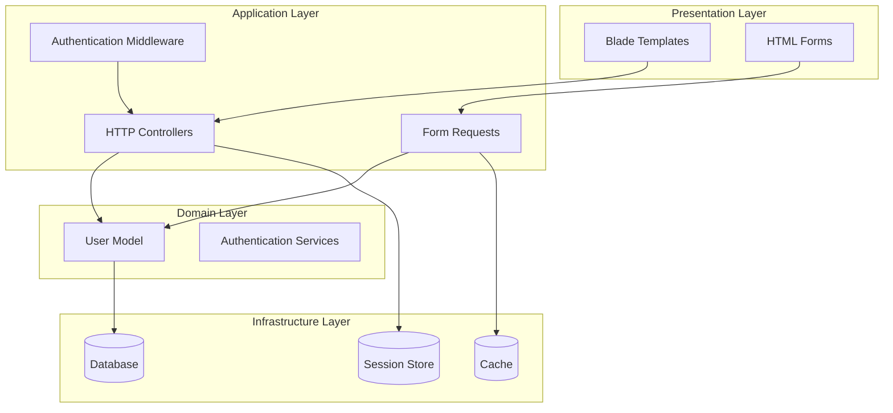
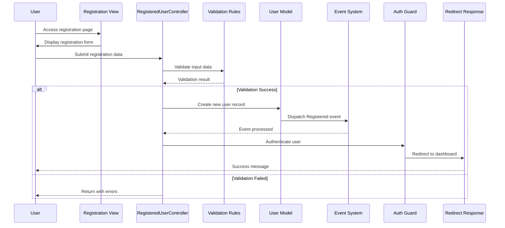
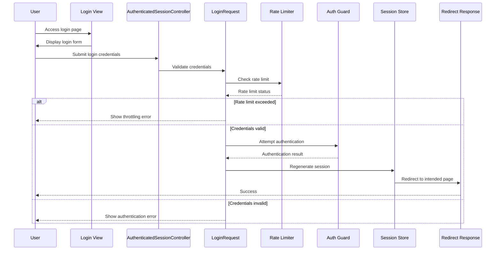
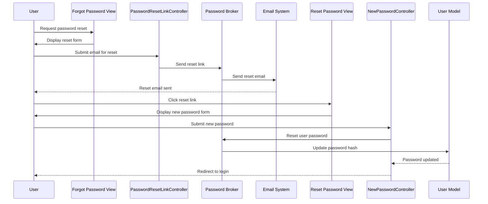
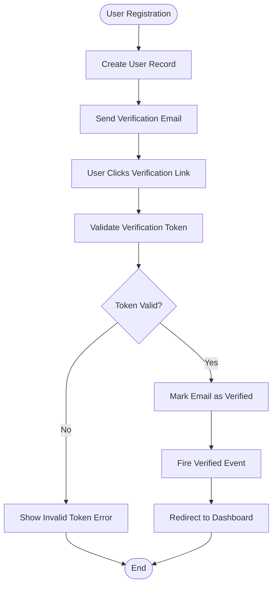
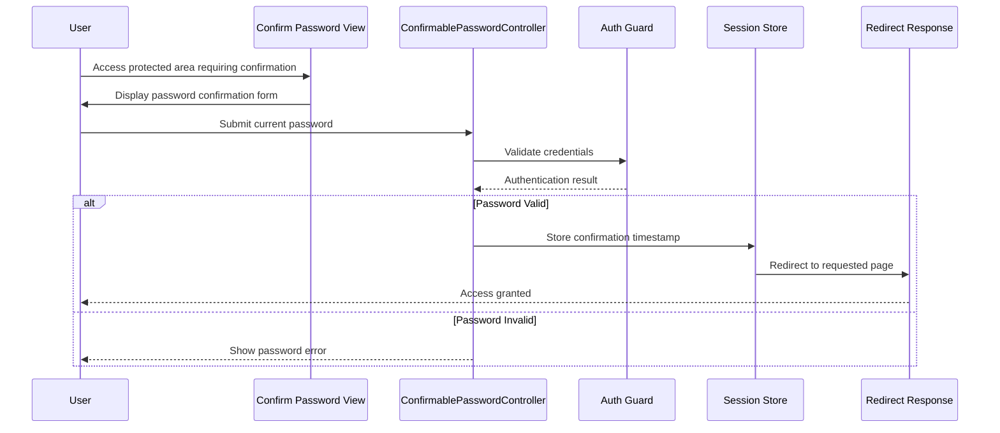

# Authentication System

<cite>
**Referenced Files in This Document**
- [AuthenticatedSessionController.php](file://app/Http/Controllers/Auth/AuthenticatedSessionController.php)
- [RegisteredUserController.php](file://app/Http/Controllers/Auth/RegisteredUserController.php)
- [LoginRequest.php](file://app/Http/Requests/Auth/LoginRequest.php)
- [PasswordResetLinkController.php](file://app/Http/Controllers/Auth/PasswordResetLinkController.php)
- [NewPasswordController.php](file://app/Http/Controllers/Auth/NewPasswordController.php)
- [VerifyEmailController.php](file://app/Http/Controllers/Auth/VerifyEmailController.php)
- [ConfirmablePasswordController.php](file://app/Http/Controllers/Auth/ConfirmablePasswordController.php)
- [PasswordController.php](file://app/Http/Controllers/Auth/PasswordController.php)
- [EmailVerificationPromptController.php](file://app/Http/Controllers/Auth/EmailVerificationPromptController.php)
- [EmailVerificationNotificationController.php](file://app/Http/Controllers/Auth/EmailVerificationNotificationController.php)
- [auth.php](file://config/auth.php)
- [auth.php](file://routes/auth.php)
- [login.blade.php](file://resources/views/auth/login.blade.php)
- [register.blade.php](file://resources/views/auth/register.blade.php)
- [User.php](file://app/Models/User.php)
</cite>

## Table of Contents
1. [Introduction](#introduction)
2. [System Architecture](#system-architecture)
3. [Core Authentication Components](#core-authentication-components)
4. [Registration Flow](#registration-flow)
5. [Login Flow](#login-flow)
6. [Password Reset System](#password-reset-system)
7. [Email Verification](#email-verification)
8. [Password Confirmation](#password-confirmation)
9. [Security Features](#security-features)
10. [Configuration](#configuration)
11. [Troubleshooting Guide](#troubleshooting-guide)
12. [Conclusion](#conclusion)

## Introduction

The Laravel Assistant authentication system provides a comprehensive set of authentication features built on Laravel's native authentication capabilities. This system handles user registration, login, password management, email verification, and secure session management. The implementation follows Laravel's best practices and provides a robust foundation for user authentication in web applications.

The authentication system is designed with security as a primary concern, implementing rate limiting, CSRF protection, password hashing, and secure session management. It leverages Laravel's Eloquent ORM for user management and integrates seamlessly with the application's routing and middleware infrastructure.

## System Architecture

The authentication system follows a layered architecture pattern with clear separation of concerns:

**Diagram sources**
- [AuthenticatedSessionController.php:12-47](file://app/Http/Controllers/Auth/AuthenticatedSessionController.php#L12-L47)
- [RegisteredUserController.php:16-51](file://app/Http/Controllers/Auth/RegisteredUserController.php#L16-L51)
- [User.php:16-51](file://app/Models/User.php#L16-L51)

The architecture ensures that authentication logic is centralized in controllers while maintaining loose coupling between components through well-defined interfaces and abstractions.

## Core Authentication Components

### Authentication Controllers

The authentication system consists of several specialized controllers, each handling specific authentication scenarios:

```mermaid
classDiagram
class AuthenticatedSessionController {
+create() View
+store(LoginRequest) RedirectResponse
+destroy(Request) RedirectResponse
}
class RegisteredUserController {
+create() View
+store(Request) RedirectResponse
}
class PasswordResetLinkController {
+create() View
+store(Request) RedirectResponse
}
class NewPasswordController {
+create(Request) View
+store(Request) RedirectResponse
}
class VerifyEmailController {
+__invoke(EmailVerificationRequest) RedirectResponse
}
class ConfirmablePasswordController {
+show() View
+store(Request) RedirectResponse
}
class PasswordController {
+update(Request) RedirectResponse
}
class EmailVerificationPromptController {
+__invoke(Request) View|RedirectResponse
}
class EmailVerificationNotificationController {
+store(Request) RedirectResponse
}
AuthenticatedSessionController --> LoginRequest : validates
RegisteredUserController --> User : manages
NewPasswordController --> User : updates
VerifyEmailController --> User : verifies
ConfirmablePasswordController --> User : confirms
PasswordController --> User : updates
```

**Diagram sources**
- [AuthenticatedSessionController.php:12-47](file://app/Http/Controllers/Auth/AuthenticatedSessionController.php#L12-L47)
- [RegisteredUserController.php:16-51](file://app/Http/Controllers/Auth/RegisteredUserController.php#L16-L51)
- [NewPasswordController.php:17-63](file://app/Http/Controllers/Auth/NewPasswordController.php#L17-L63)
- [VerifyEmailController.php:10-27](file://app/Http/Controllers/Auth/VerifyEmailController.php#L10-L27)
- [ConfirmablePasswordController.php:12-40](file://app/Http/Controllers/Auth/ConfirmablePasswordController.php#L12-L40)
- [PasswordController.php:11-29](file://app/Http/Controllers/Auth/PasswordController.php#L11-L29)
- [EmailVerificationPromptController.php:10-21](file://app/Http/Controllers/Auth/EmailVerificationPromptController.php#L10-L21)
- [EmailVerificationNotificationController.php:9-24](file://app/Http/Controllers/Auth/EmailVerificationNotificationController.php#L9-L24)

Each controller implements the Single Responsibility Principle, focusing on specific authentication workflows while delegating common functionality to shared services and utilities.

**Section sources**
- [AuthenticatedSessionController.php:12-47](file://app/Http/Controllers/Auth/AuthenticatedSessionController.php#L12-L47)
- [RegisteredUserController.php:16-51](file://app/Http/Controllers/Auth/RegisteredUserController.php#L16-L51)
- [PasswordResetLinkController.php:12-45](file://app/Http/Controllers/Auth/PasswordResetLinkController.php#L12-L45)
- [NewPasswordController.php:17-63](file://app/Http/Controllers/Auth/NewPasswordController.php#L17-L63)
- [VerifyEmailController.php:10-27](file://app/Http/Controllers/Auth/VerifyEmailController.php#L10-L27)
- [ConfirmablePasswordController.php:12-40](file://app/Http/Controllers/Auth/ConfirmablePasswordController.php#L12-L40)
- [PasswordController.php:11-29](file://app/Http/Controllers/Auth/PasswordController.php#L11-L29)
- [EmailVerificationPromptController.php:10-21](file://app/Http/Controllers/Auth/EmailVerificationPromptController.php#L10-L21)
- [EmailVerificationNotificationController.php:9-24](file://app/Http/Controllers/Auth/EmailVerificationNotificationController.php#L9-L24)

## Registration Flow

The user registration process follows a secure and validated workflow:

**Diagram sources**
- [RegisteredUserController.php:31-49](file://app/Http/Controllers/Auth/RegisteredUserController.php#L31-L49)
- [register.blade.php:1-53](file://resources/views/auth/register.blade.php#L1-L53)

The registration flow includes comprehensive input validation, secure password hashing, automatic user authentication, and proper error handling. The system ensures data integrity through strict validation rules and provides immediate feedback for invalid submissions.

**Section sources**
- [RegisteredUserController.php:16-51](file://app/Http/Controllers/Auth/RegisteredUserController.php#L16-L51)
- [register.blade.php:1-53](file://resources/views/auth/register.blade.php#L1-L53)

## Login Flow

The login process implements robust security measures including rate limiting and credential validation:

**Diagram sources**
- [AuthenticatedSessionController.php:25-31](file://app/Http/Controllers/Auth/AuthenticatedSessionController.php#L25-L31)
- [LoginRequest.php:41-54](file://app/Http/Requests/Auth/LoginRequest.php#L41-L54)
- [login.blade.php:1-48](file://resources/views/auth/login.blade.php#L1-L48)

The login system includes automatic rate limiting to prevent brute force attacks, session regeneration for security, and proper error handling. The implementation leverages Laravel's built-in authentication mechanisms while providing custom validation logic.

**Section sources**
- [AuthenticatedSessionController.php:12-47](file://app/Http/Controllers/Auth/AuthenticatedSessionController.php#L12-L47)
- [LoginRequest.php:13-86](file://app/Http/Requests/Auth/LoginRequest.php#L13-L86)
- [login.blade.php:1-48](file://resources/views/auth/login.blade.php#L1-L48)

## Password Reset System

The password reset functionality provides a secure mechanism for users to recover access to their accounts:

**Diagram sources**
- [PasswordResetLinkController.php:12-45](file://app/Http/Controllers/Auth/PasswordResetLinkController.php#L12-L45)
- [NewPasswordController.php:17-63](file://app/Http/Controllers/Auth/NewPasswordController.php#L17-L63)

The password reset system implements token-based authentication with expiration controls, secure password hashing, and proper validation. The system ensures that reset tokens are time-limited and that password changes are properly secured.

**Section sources**
- [PasswordResetLinkController.php:12-45](file://app/Http/Controllers/Auth/PasswordResetLinkController.php#L12-L45)
- [NewPasswordController.php:17-63](file://app/Http/Controllers/Auth/NewPasswordController.php#L17-L63)

## Email Verification

The email verification system ensures that user email addresses are legitimate and verified:

**Diagram sources**
- [VerifyEmailController.php:15-26](file://app/Http/Controllers/Auth/VerifyEmailController.php#L15-L26)
- [EmailVerificationPromptController.php:15-20](file://app/Http/Controllers/Auth/EmailVerificationPromptController.php#L15-L20)
- [EmailVerificationNotificationController.php:14-23](file://app/Http/Controllers/Auth/EmailVerificationNotificationController.php#L14-L23)

The email verification system includes token validation, signed URL generation, and rate limiting to prevent abuse. Users receive verification emails with secure, time-limited links that confirm their email addresses.

**Section sources**
- [VerifyEmailController.php:10-27](file://app/Http/Controllers/Auth/VerifyEmailController.php#L10-L27)
- [EmailVerificationPromptController.php:10-21](file://app/Http/Controllers/Auth/EmailVerificationPromptController.php#L10-L21)
- [EmailVerificationNotificationController.php:9-24](file://app/Http/Controllers/Auth/EmailVerificationNotificationController.php#L9-L24)

## Password Confirmation

The password confirmation system provides an additional layer of security for sensitive operations:

**Diagram sources**
- [ConfirmablePasswordController.php:25-39](file://app/Http/Controllers/Auth/ConfirmablePasswordController.php#L25-L39)

The password confirmation system temporarily validates user credentials for sensitive operations and stores a confirmation timestamp in the session. This provides security without requiring users to re-authenticate for every operation.

**Section sources**
- [ConfirmablePasswordController.php:12-40](file://app/Http/Controllers/Auth/ConfirmablePasswordController.php#L12-L40)

## Security Features

The authentication system implements multiple layers of security:

### Rate Limiting
The system includes automatic rate limiting for login attempts, password reset requests, and email verification to prevent brute force attacks and abuse.

### CSRF Protection
All authentication forms include CSRF tokens to prevent cross-site request forgery attacks.

### Secure Password Handling
Passwords are hashed using Laravel's built-in hashing mechanisms with appropriate salt generation and iteration counts.

### Session Security
Sessions are regenerated after authentication to prevent session fixation attacks. Session data is properly managed and invalidated upon logout.

### Input Validation
Comprehensive input validation ensures that all user-submitted data meets security requirements before processing.

**Section sources**
- [LoginRequest.php:61-77](file://app/Http/Requests/Auth/LoginRequest.php#L61-L77)
- [PasswordResetLinkController.php:29-31](file://app/Http/Controllers/Auth/PasswordResetLinkController.php#L29-L31)
- [EmailVerificationNotificationController.php:14-23](file://app/Http/Controllers/Auth/EmailVerificationNotificationController.php#L14-L23)

## Configuration

The authentication system is configured through the `config/auth.php` file, which defines the authentication guards, user providers, and password reset settings.

### Authentication Guards
The system uses a session-based authentication guard with Eloquent user provider, providing a solid foundation for web application authentication.

### User Providers
The Eloquent user provider connects the authentication system to the User model, enabling seamless integration with the application's data layer.

### Password Reset Configuration
Password reset functionality includes token storage configuration, expiration times, and rate limiting to ensure secure password recovery.

**Section sources**
- [auth.php:18-117](file://config/auth.php#L18-L117)

## Troubleshooting Guide

### Common Authentication Issues

**Login Failures**
- Verify that user credentials match exactly (case-sensitive)
- Check rate limiting status if multiple failed attempts occur
- Ensure session cookies are enabled in the browser

**Registration Problems**
- Review validation error messages for missing or invalid fields
- Verify email uniqueness requirements
- Check password strength requirements

**Password Reset Issues**
- Confirm that reset emails are being delivered
- Verify token expiration and validity
- Check email configuration settings

**Session Management**
- Clear browser cookies and cache if experiencing persistent login issues
- Verify session storage configuration
- Check for concurrent session limitations

### Debugging Authentication Flow

Enable Laravel's debug mode to trace authentication events and identify bottlenecks in the authentication process. Monitor the application logs for authentication-related errors and warnings.

**Section sources**
- [AuthenticatedSessionController.php:37-46](file://app/Http/Controllers/Auth/AuthenticatedSessionController.php#L37-L46)
- [RegisteredUserController.php:33-49](file://app/Http/Controllers/Auth/RegisteredUserController.php#L33-L49)
- [LoginRequest.php:41-54](file://app/Http/Requests/Auth/LoginRequest.php#L41-L54)

## Conclusion

The Laravel Assistant authentication system provides a comprehensive, secure, and maintainable solution for user authentication needs. The implementation follows Laravel's best practices while adding custom validation and security enhancements where appropriate.

Key strengths of the system include:

- **Security Focus**: Comprehensive rate limiting, CSRF protection, and secure password handling
- **User Experience**: Smooth authentication flows with proper error handling and user feedback
- **Maintainability**: Clean separation of concerns with dedicated controllers for each authentication scenario
- **Extensibility**: Modular design that allows for easy customization and extension

The system serves as a solid foundation for web applications requiring robust user authentication capabilities, providing both security and usability in equal measure.