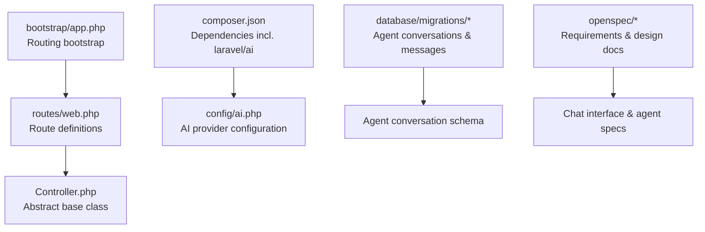
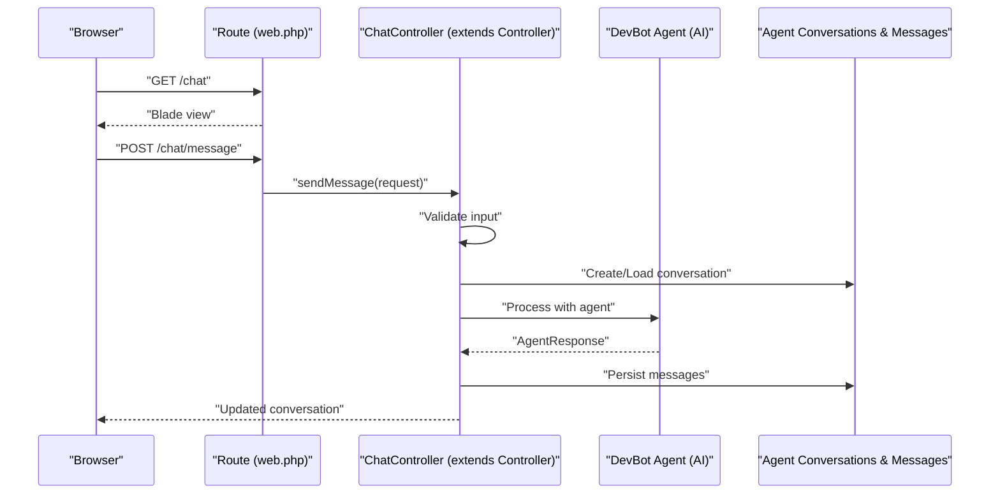
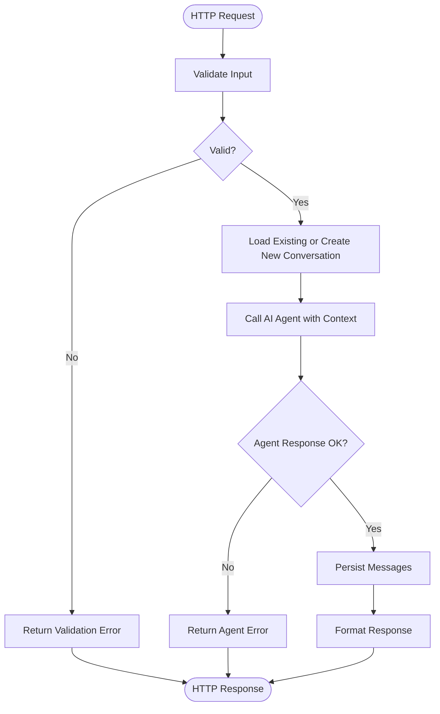
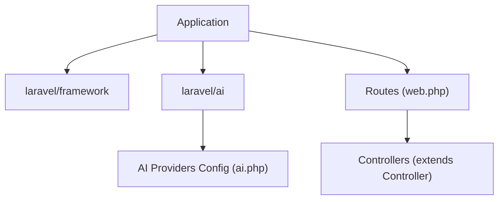

# Controllers

<cite>
**Referenced Files in This Document**
- [Controller.php](file://app/Http/Controllers/Controller.php)
- [web.php](file://routes/web.php)
- [bootstrap/app.php](file://bootstrap/app.php)
- [ai.php](file://config/ai.php)
- [composer.json](file://composer.json)
- [2026_04_02_115916_create_agent_conversations_table.php](file://database/migrations/2026_04_02_115916_create_agent_conversations_table.php)
- [design.md](file://openspec/changes/devbot-ai-agent/design.md)
- [proposal.md](file://openspec/changes/devbot-ai-agent/proposal.md)
- [tasks.md](file://openspec/changes/devbot-ai-agent/tasks.md)
- [spec.md](file://openspec/changes/devbot-ai-agent/specs/chat-interface/spec.md)
- [Middleware.php](file://vendor/laravel/framework/src/Illuminate/Routing/Controllers/Middleware.php)
- [HasMiddleware.php](file://vendor/laravel/framework/src/Illuminate/Routing/Controllers/HasMiddleware.php)
</cite>

## Table of Contents
1. [Introduction](#introduction)
2. [Project Structure](#project-structure)
3. [Core Components](#core-components)
4. [Architecture Overview](#architecture-overview)
5. [Detailed Component Analysis](#detailed-component-analysis)
6. [Dependency Analysis](#dependency-analysis)
7. [Performance Considerations](#performance-considerations)
8. [Troubleshooting Guide](#troubleshooting-guide)
9. [Conclusion](#conclusion)
10. [Appendices](#appendices)

## Introduction
This document explains the Laravel controller implementation within the assistant project, focusing on the abstract Controller base class, controller inheritance patterns, and HTTP request handling conventions. It also documents how controllers interact with the AI system for agent-based workflows, including request processing for AI-enabled endpoints. Practical examples demonstrate controller creation, route-to-controller mapping, and dependency injection patterns. Middleware integration, validation handling, and error response formatting are covered, along with Laravel controller best practices, performance optimization, and security considerations. Finally, it clarifies the relationship between traditional controllers and AI-enhanced request processing patterns.

## Project Structure
The assistant project follows a standard Laravel 13 application structure with the Laravel AI SDK already installed and configured. The routing is bootstrapped via the application configuration, and controllers inherit from the abstract base class located under the Http\Controllers namespace. The AI configuration defines providers and defaults, while database migrations establish the schema for agent conversations and messages.

**Diagram sources**
- [bootstrap/app.php:8-12](file://bootstrap/app.php#L8-L12)
- [web.php:5-7](file://routes/web.php#L5-L7)
- [Controller.php:5-8](file://app/Http/Controllers/Controller.php#L5-L8)
- [composer.json:13](file://composer.json#L13)
- [ai.php:16](file://config/ai.php#L16)
- [2026_04_02_115916_create_agent_conversations_table.php:14-21](file://database/migrations/2026_04_02_115916_create_agent_conversations_table.php#L14-L21)
- [design.md:1-108](file://openspec/changes/devbot-ai-agent/design.md#L1-L108)

**Section sources**
- [bootstrap/app.php:8-12](file://bootstrap/app.php#L8-L12)
- [web.php:5-7](file://routes/web.php#L5-L7)
- [composer.json:13](file://composer.json#L13)
- [ai.php:16](file://config/ai.php#L16)

## Core Components
- Abstract Controller base class: Provides a shared foundation for all application controllers. It establishes a consistent namespace and serves as the parent class for any custom controllers.
- Route registration: Routes are registered in the web router and map HTTP verbs to closures or controller actions.
- AI configuration: The AI configuration file defines default providers and provider-specific settings, enabling controllers to integrate with AI agents.
- Middleware contracts: Laravel’s controller middleware system supports applying middleware to controller methods via a dedicated interface and middleware definition class.

Key implementation references:
- Abstract base class definition: [Controller.php:5-8](file://app/Http/Controllers/Controller.php#L5-L8)
- Route registration pattern: [web.php:5-7](file://routes/web.php#L5-L7)
- AI provider defaults: [ai.php:16](file://config/ai.php#L16)
- Middleware definition class: [Middleware.php:11-22](file://vendor/laravel/framework/src/Illuminate/Routing/Controllers/Middleware.php#L11-L22)
- Middleware interface: [HasMiddleware.php:5-13](file://vendor/laravel/framework/src/Illuminate/Routing/Controllers/HasMiddleware.php#L5-L13)

**Section sources**
- [Controller.php:5-8](file://app/Http/Controllers/Controller.php#L5-L8)
- [web.php:5-7](file://routes/web.php#L5-L7)
- [ai.php:16](file://config/ai.php#L16)
- [Middleware.php:11-22](file://vendor/laravel/framework/src/Illuminate/Routing/Controllers/Middleware.php#L11-L22)
- [HasMiddleware.php:5-13](file://vendor/laravel/framework/src/Illuminate/Routing/Controllers/HasMiddleware.php#L5-L13)

## Architecture Overview
The assistant project integrates controllers with AI workflows by leveraging the Laravel AI SDK. Controllers inherit from the abstract base class, receive HTTP requests, optionally validate and transform input, and delegate AI-related processing to agents configured in the AI configuration. Responses are returned in a consistent format suitable for web views or APIs.

**Diagram sources**
- [web.php:5-7](file://routes/web.php#L5-L7)
- [Controller.php:5-8](file://app/Http/Controllers/Controller.php#L5-L8)
- [ai.php:16](file://config/ai.php#L16)
- [2026_04_02_115916_create_agent_conversations_table.php:14-39](file://database/migrations/2026_04_02_115916_create_agent_conversations_table.php#L14-L39)
- [design.md:100-107](file://openspec/changes/devbot-ai-agent/design.md#L100-L107)

## Detailed Component Analysis

### Abstract Controller Base Class
- Purpose: Establishes a common parent class for all controllers, ensuring consistent namespace and inheritance patterns.
- Usage: Custom controllers should extend this base class to benefit from shared behavior and conventions.
- Relationship to AI: While the base class is minimal, it enables controllers to seamlessly integrate with AI agents by providing a stable foundation for dependency injection and middleware application.

Implementation reference:
- [Controller.php:5-8](file://app/Http/Controllers/Controller.php#L5-L8)

**Section sources**
- [Controller.php:5-8](file://app/Http/Controllers/Controller.php#L5-L8)

### Route-to-Controller Mapping
- The web router registers routes that map HTTP verbs to closures or controller actions. In this project, a simple home route demonstrates the pattern.
- For AI-enabled endpoints, routes are planned to serve the chat interface and handle message submissions.

Implementation references:
- [web.php:5-7](file://routes/web.php#L5-L7)
- [proposal.md:10](file://openspec/changes/devbot-ai-agent/proposal.md#L10)
- [tasks.md:23-29](file://openspec/changes/devbot-ai-agent/tasks.md#L23-L29)

**Section sources**
- [web.php:5-7](file://routes/web.php#L5-L7)
- [proposal.md:10](file://openspec/changes/devbot-ai-agent/proposal.md#L10)
- [tasks.md:23-29](file://openspec/changes/devbot-ai-agent/tasks.md#L23-L29)

### Controller Method Naming Conventions and Parameter Binding
- Method naming: Methods should be named descriptively and consistently with Laravel conventions (e.g., action verbs for resource-like operations).
- Parameter binding: Parameters are resolved via Laravel’s service container and route model binding. For AI-enabled controllers, parameters often include request data, optional conversation identifiers, and injected agent instances.
- Response formatting: Responses should be consistent—render Blade views for HTML or return JSON for API-style interactions.

References:
- [design.md:100-107](file://openspec/changes/devbot-ai-agent/design.md#L100-L107)
- [spec.md:25-32](file://openspec/changes/devbot-ai-agent/specs/chat-interface/spec.md#L25-L32)

**Section sources**
- [design.md:100-107](file://openspec/changes/devbot-ai-agent/design.md#L100-L107)
- [spec.md:25-32](file://openspec/changes/devbot-ai-agent/specs/chat-interface/spec.md#L25-L32)

### Middleware Integration
- Middleware can be applied to controllers using the HasMiddleware interface and the Middleware definition class. This allows scoping middleware to specific methods or excluding certain methods.
- For AI-enabled controllers, middleware can enforce authentication, rate limiting, and input validation.

Implementation references:
- [HasMiddleware.php:5-13](file://vendor/laravel/framework/src/Illuminate/Routing/Controllers/HasMiddleware.php#L5-L13)
- [Middleware.php:11-22](file://vendor/laravel/framework/src/Illuminate/Routing/Controllers/Middleware.php#L11-L22)

**Section sources**
- [HasMiddleware.php:5-13](file://vendor/laravel/framework/src/Illuminate/Routing/Controllers/HasMiddleware.php#L5-L13)
- [Middleware.php:11-22](file://vendor/laravel/framework/src/Illuminate/Routing/Controllers/Middleware.php#L11-L22)

### Validation Handling
- Validation ensures robust request processing. For AI-enabled endpoints, validate message content, presence of conversation identifiers, and user permissions.
- Validation errors should return appropriate HTTP status codes and user-friendly messages.

References:
- [spec.md:35-39](file://openspec/changes/devbot-ai-agent/specs/chat-interface/spec.md#L35-L39)

**Section sources**
- [spec.md:35-39](file://openspec/changes/devbot-ai-agent/specs/chat-interface/spec.md#L35-L39)

### Error Response Formatting
- Error responses should be consistent and informative. For AI-enabled controllers, wrap errors from agent interactions and present user-friendly messages while preserving actionable context.
- Consider returning structured JSON for API endpoints and Blade errors for web views.

References:
- [design.md:73-96](file://openspec/changes/devbot-ai-agent/design.md#L73-L96)

**Section sources**
- [design.md:73-96](file://openspec/changes/devbot-ai-agent/design.md#L73-L96)

### AI-Enhanced Request Processing Patterns
- Agent configuration: Use the AI configuration to select providers and tailor model settings for development-focused assistance.
- Conversation persistence: Leverage the agent conversation schema to store and retrieve conversation history, enabling context-aware AI responses.
- Synchronous processing: For simplicity, initial implementations rely on synchronous HTTP requests with potential enhancements to asynchronous processing.

Implementation references:
- [ai.php:16](file://config/ai.php#L16)
- [2026_04_02_115916_create_agent_conversations_table.php:14-39](file://database/migrations/2026_04_02_115916_create_agent_conversations_table.php#L14-L39)
- [design.md:25-29](file://openspec/changes/devbot-ai-agent/design.md#L25-L29)

**Section sources**
- [ai.php:16](file://config/ai.php#L16)
- [2026_04_02_115916_create_agent_conversations_table.php:14-39](file://database/migrations/2026_04_02_115916_create_agent_conversations_table.php#L14-L39)
- [design.md:25-29](file://openspec/changes/devbot-ai-agent/design.md#L25-L29)

### Practical Examples

#### Creating a Controller
- Extend the abstract base class and implement methods for displaying the chat interface and handling message submissions.
- Apply middleware via the HasMiddleware interface and the Middleware definition class.

References:
- [Controller.php:5-8](file://app/Http/Controllers/Controller.php#L5-L8)
- [HasMiddleware.php:5-13](file://vendor/laravel/framework/src/Illuminate/Routing/Controllers/HasMiddleware.php#L5-L13)
- [Middleware.php:11-22](file://vendor/laravel/framework/src/Illuminate/Routing/Controllers/Middleware.php#L11-L22)

**Section sources**
- [Controller.php:5-8](file://app/Http/Controllers/Controller.php#L5-L8)
- [HasMiddleware.php:5-13](file://vendor/laravel/framework/src/Illuminate/Routing/Controllers/HasMiddleware.php#L5-L13)
- [Middleware.php:11-22](file://vendor/laravel/framework/src/Illuminate/Routing/Controllers/Middleware.php#L11-L22)

#### Route-to-Controller Mapping
- Define routes for the chat interface and message submission endpoints.
- Map routes to controller actions that handle AI-enabled workflows.

References:
- [web.php:5-7](file://routes/web.php#L5-L7)
- [proposal.md:10](file://openspec/changes/devbot-ai-agent/proposal.md#L10)
- [tasks.md:23-29](file://openspec/changes/devbot-ai-agent/tasks.md#L23-L29)

**Section sources**
- [web.php:5-7](file://routes/web.php#L5-L7)
- [proposal.md:10](file://openspec/changes/devbot-ai-agent/proposal.md#L10)
- [tasks.md:23-29](file://openspec/changes/devbot-ai-agent/tasks.md#L23-L29)

#### Dependency Injection Patterns
- Inject the AI agent into controller methods or constructors to encapsulate AI logic.
- Use configuration-driven provider selection to keep controllers decoupled from provider specifics.

References:
- [composer.json:13](file://composer.json#L13)
- [ai.php:16](file://config/ai.php#L16)

**Section sources**
- [composer.json:13](file://composer.json#L13)
- [ai.php:16](file://config/ai.php#L16)

### Conceptual Overview
The following conceptual flow illustrates how a request moves through a controller into an AI agent and back to the client, including persistence and error handling.

[No sources needed since this diagram shows conceptual workflow, not actual code structure]

## Dependency Analysis
The assistant project relies on the Laravel AI SDK for agent orchestration and the Laravel framework for routing and controllers. Composer manages dependencies, while the AI configuration centralizes provider settings.

**Diagram sources**
- [composer.json:13](file://composer.json#L13)
- [ai.php:16](file://config/ai.php#L16)
- [web.php:5-7](file://routes/web.php#L5-L7)
- [Controller.php:5-8](file://app/Http/Controllers/Controller.php#L5-L8)

**Section sources**
- [composer.json:13](file://composer.json#L13)
- [ai.php:16](file://config/ai.php#L16)
- [web.php:5-7](file://routes/web.php#L5-L7)
- [Controller.php:5-8](file://app/Http/Controllers/Controller.php#L5-L8)

## Performance Considerations
- Synchronous processing: Initial implementations use synchronous HTTP requests to simplify development and reduce infrastructure overhead.
- Rate limiting and cost control: Mitigate API rate limits and token costs by limiting context length and considering caching strategies.
- Background processing: For long-running AI operations, consider offloading to queues to improve responsiveness.

References:
- [design.md:25-29](file://openspec/changes/devbot-ai-agent/design.md#L25-L29)
- [design.md:73-96](file://openspec/changes/devbot-ai-agent/design.md#L73-L96)

**Section sources**
- [design.md:25-29](file://openspec/changes/devbot-ai-agent/design.md#L25-L29)
- [design.md:73-96](file://openspec/changes/devbot-ai-agent/design.md#L73-L96)

## Troubleshooting Guide
- Middleware application: Ensure middleware is properly declared via the HasMiddleware interface and scoped to intended methods.
- Validation failures: Confirm validation rules match request payloads and return appropriate HTTP status codes.
- Agent errors: Wrap agent exceptions and return user-friendly messages while logging actionable details.
- Conversation persistence: Verify migrations are applied and relationships between conversations and messages are correctly indexed.

References:
- [HasMiddleware.php:5-13](file://vendor/laravel/framework/src/Illuminate/Routing/Controllers/HasMiddleware.php#L5-L13)
- [spec.md:35-39](file://openspec/changes/devbot-ai-agent/specs/chat-interface/spec.md#L35-L39)
- [design.md:73-96](file://openspec/changes/devbot-ai-agent/design.md#L73-L96)
- [2026_04_02_115916_create_agent_conversations_table.php:14-39](file://database/migrations/2026_04_02_115916_create_agent_conversations_table.php#L14-L39)

**Section sources**
- [HasMiddleware.php:5-13](file://vendor/laravel/framework/src/Illuminate/Routing/Controllers/HasMiddleware.php#L5-L13)
- [spec.md:35-39](file://openspec/changes/devbot-ai-agent/specs/chat-interface/spec.md#L35-L39)
- [design.md:73-96](file://openspec/changes/devbot-ai-agent/design.md#L73-L96)
- [2026_04_02_115916_create_agent_conversations_table.php:14-39](file://database/migrations/2026_04_02_115916_create_agent_conversations_table.php#L14-L39)

## Conclusion
Controllers in the assistant project inherit from a minimal abstract base class and integrate tightly with the Laravel AI SDK. By following Laravel’s controller conventions, applying middleware thoughtfully, validating inputs rigorously, and persisting conversation history, controllers can deliver robust AI-enhanced experiences. The design emphasizes simplicity and scalability, with room to evolve toward asynchronous processing and advanced agent features.

## Appendices

### Best Practices for Controllers
- Keep controllers thin: Move business logic into services or agents.
- Use dependency injection: Inject agents and repositories to improve testability.
- Apply middleware selectively: Scope middleware to specific methods to minimize overhead.
- Validate early: Fail fast with clear validation errors.
- Return consistent responses: Use standardized formats for both HTML and API consumers.

References:
- [HasMiddleware.php:5-13](file://vendor/laravel/framework/src/Illuminate/Routing/Controllers/HasMiddleware.php#L5-L13)
- [design.md:100-107](file://openspec/changes/devbot-ai-agent/design.md#L100-L107)

**Section sources**
- [HasMiddleware.php:5-13](file://vendor/laravel/framework/src/Illuminate/Routing/Controllers/HasMiddleware.php#L5-L13)
- [design.md:100-107](file://openspec/changes/devbot-ai-agent/design.md#L100-L107)