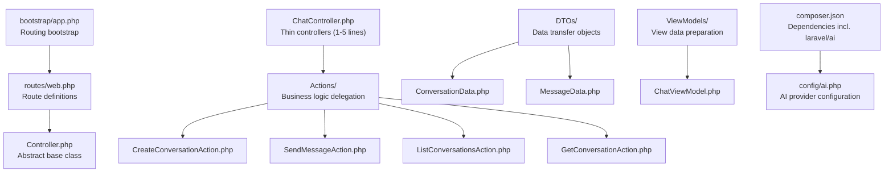
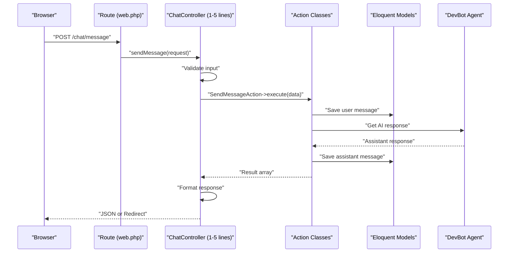
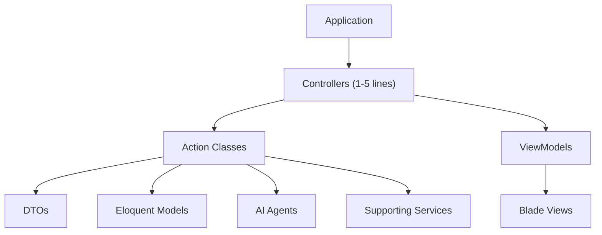

# Controllers

<cite>
**Referenced Files in This Document**
- [Controller.php](file://app/Http/Controllers/Controller.php)
- [ChatController.php](file://app/Http/Controllers/ChatController.php)
- [BaseAction.php](file://app/Actions/BaseAction.php)
- [CreateConversationAction.php](file://app/Actions/CreateConversationAction.php)
- [GetConversationAction.php](file://app/Actions/GetConversationAction.php)
- [ListConversationsAction.php](file://app/Actions/ListConversationsAction.php)
- [SendMessageAction.php](file://app/Actions/SendMessageAction.php)
- [ConversationData.php](file://app/DTOs/ConversationData.php)
- [MessageData.php](file://app/DTOs/MessageData.php)
- [ChatViewModel.php](file://app/ViewModels/ChatViewModel.php)
- [web.php](file://routes/web.php)
- [bootstrap/app.php](file://bootstrap/app.php)
- [ai.php](file://config/ai.php)
- [composer.json](file://composer.json)
- [2026_04_02_115916_create_agent_conversations_table.php](file://database/migrations/2026_04_02_115916_create_agent_conversations_table.php)
- [design.md](file://openspec/changes/devbot-ai-agent/design.md)
- [proposal.md](file://openspec/changes/devbot-ai-agent/proposal.md)
- [tasks.md](file://openspec/changes/devbot-ai-agent/tasks.md)
- [spec.md](file://openspec/changes/devbot-ai-agent/specs/chat-interface/spec.md)
- [Middleware.php](file://vendor/laravel/framework/src/Illuminate/Routing/Controllers/Middleware.php)
- [HasMiddleware.php](file://vendor/laravel/framework/src/Illuminate/Routing/Controllers/HasMiddleware.php)
</cite>

## Update Summary
**Changes Made**
- Updated architecture overview to reflect the new thin controller pattern
- Added comprehensive documentation for Action classes and the single responsibility pattern
- Documented the new DTO (Data Transfer Object) pattern for request handling
- Added ViewModel documentation for view data preparation
- Updated practical examples to demonstrate the thin controller implementation
- Revised controller method examples to show 1-5 line implementations
- Enhanced documentation on dependency injection patterns with Actions

## Table of Contents
1. [Introduction](#introduction)
2. [Project Structure](#project-structure)
3. [Core Components](#core-components)
4. [Architecture Overview](#architecture-overview)
5. [Detailed Component Analysis](#detailed-component-analysis)
6. [Thin Controller Pattern Implementation](#thin-controller-pattern-implementation)
7. [Action Classes and Business Logic](#action-classes-and-business-logic)
8. [Data Transfer Objects (DTOs)](#data-transfer-objects-dtos)
9. [ViewModel Pattern](#viewmodel-pattern)
10. [Dependency Analysis](#dependency-analysis)
11. [Performance Considerations](#performance-considerations)
12. [Troubleshooting Guide](#troubleshooting-guide)
13. [Conclusion](#conclusion)
14. [Appendices](#appendices)

## Introduction
This document explains the Laravel controller implementation within the assistant project, focusing on the new thin controller pattern where controllers delegate business logic to Action classes. The project has evolved from monolithic controllers to a clean separation of concerns, with controllers serving as HTTP-facing entry points that coordinate Action classes for business logic execution. This architectural shift emphasizes single responsibility, testability, and maintainability while preserving the AI-enhanced chat functionality.

## Project Structure
The assistant project follows a modern Laravel 13 architecture with the thin controller pattern. Controllers are extremely lightweight (1-5 lines each) and delegate all business logic to specialized Action classes. The structure includes dedicated directories for Actions, DTOs, ViewModels, and supporting components, creating a clear separation between HTTP concerns and business logic.



**Diagram sources**
- [bootstrap/app.php:8-12](file://bootstrap/app.php#L8-L12)
- [web.php:5-7](file://routes/web.php#L5-L7)
- [Controller.php:5-8](file://app/Http/Controllers/Controller.php#L5-L8)
- [ChatController.php:19-154](file://app/Http/Controllers/ChatController.php#L19-L154)
- [composer.json:13](file://composer.json#L13)
- [ai.php:16](file://config/ai.php#L16)

**Section sources**
- [bootstrap/app.php:8-12](file://bootstrap/app.php#L8-L12)
- [web.php:5-7](file://routes/web.php#L5-L7)
- [composer.json:13](file://composer.json#L13)
- [ai.php:16](file://config/ai.php#L16)

## Core Components
The thin controller pattern introduces several key architectural components that work together to achieve clean separation of concerns:

- **Thin Controllers**: Extremely lightweight controllers (1-5 lines) that handle HTTP concerns and coordinate Action classes
- **Action Classes**: Single-responsibility business logic classes that encapsulate complex operations
- **Data Transfer Objects (DTOs)**: Immutable data containers that standardize data flow between layers
- **ViewModels**: Specialized classes that prepare data for views with presentation logic
- **Base Action Class**: Common error handling and execution patterns for all Action classes

Key implementation references:
- Thin controller example: [ChatController.php:24-43](file://app/Http/Controllers/ChatController.php#L24-L43)
- Action class pattern: [BaseAction.php:28-57](file://app/Actions/BaseAction.php#L28-L57)
- DTO pattern: [ConversationData.php:29-57](file://app/DTOs/ConversationData.php#L29-L57)
- ViewModel usage: [ChatController.php:35](file://app/Http/Controllers/ChatController.php#L35)

**Section sources**
- [ChatController.php:24-43](file://app/Http/Controllers/ChatController.php#L24-L43)
- [BaseAction.php:28-57](file://app/Actions/BaseAction.php#L28-L57)
- [ConversationData.php:29-57](file://app/DTOs/ConversationData.php#L29-L57)

## Architecture Overview
The assistant project implements a sophisticated thin controller architecture where controllers act as orchestrators, delegating all business logic to Action classes. This pattern provides clear separation between HTTP concerns and business operations, improving testability and maintainability.



**Diagram sources**
- [web.php:15](file://routes/web.php#L15)
- [ChatController.php:117-152](file://app/Http/Controllers/ChatController.php#L117-L152)
- [SendMessageAction.php:55-86](file://app/Actions/SendMessageAction.php#L55-L86)

## Detailed Component Analysis

### Abstract Controller Base Class
The abstract base class remains minimal, providing only the foundational structure for all controllers. This simplicity enables the thin controller pattern by reducing controller responsibilities to HTTP concerns only.

Implementation reference:
- [Controller.php:5-8](file://app/Http/Controllers/Controller.php#L5-L8)

**Section sources**
- [Controller.php:5-8](file://app/Http/Controllers/Controller.php#L5-L8)

### Route-to-Controller Mapping
Routes are defined in the web router and map to specific controller methods. The thin controller pattern maintains clean route definitions while allowing controllers to remain extremely lightweight.

Implementation references:
- [web.php:10-15](file://routes/web.php#L10-L15)

**Section sources**
- [web.php:10-15](file://routes/web.php#L10-L15)

### Controller Method Naming Conventions and Parameter Binding
The thin controller pattern emphasizes descriptive method names that clearly indicate their purpose. Parameter binding leverages Laravel's dependency injection system to automatically resolve Action classes and other dependencies.

References:
- [ChatController.php:24](file://app/Http/Controllers/ChatController.php#L24)
- [ChatController.php:48](file://app/Http/Controllers/ChatController.php#L48)

**Section sources**
- [ChatController.php:24](file://app/Http/Controllers/ChatController.php#L24)
- [ChatController.php:48](file://app/Http/Controllers/ChatController.php#L48)

### Middleware Integration
Middleware can be applied to controllers using Laravel's HasMiddleware interface and Middleware definition class, maintaining the same pattern while controllers remain thin.

Implementation references:
- [HasMiddleware.php:5-13](file://vendor/laravel/framework/src/Illuminate/Routing/Controllers/HasMiddleware.php#L5-L13)
- [Middleware.php:11-22](file://vendor/laravel/framework/src/Illuminate/Routing/Controllers/Middleware.php#L11-L22)

**Section sources**
- [HasMiddleware.php:5-13](file://vendor/laravel/framework/src/Illuminate/Routing/Controllers/HasMiddleware.php#L5-L13)
- [Middleware.php:11-22](file://vendor/laravel/framework/src/Illuminate/Routing/Controllers/Middleware.php#L11-L22)

### Validation Handling
Validation occurs at the controller level using Laravel's built-in validation system. The thin controller pattern keeps validation logic concise while delegating business logic to Action classes.

References:
- [ChatController.php:119-122](file://app/Http/Controllers/ChatController.php#L119-L122)

**Section sources**
- [ChatController.php:119-122](file://app/Http/Controllers/ChatController.php#L119-L122)

### Error Response Formatting
Error handling follows Laravel's standard patterns, with controllers catching exceptions and returning appropriate HTTP responses. The thin controller pattern ensures error handling remains centralized and consistent.

References:
- [ChatController.php:140-151](file://app/Http/Controllers/ChatController.php#L140-L151)

**Section sources**
- [ChatController.php:140-151](file://app/Http/Controllers/ChatController.php#L140-L151)

## Thin Controller Pattern Implementation

### Controller Responsibilities
In the thin controller pattern, controllers focus exclusively on HTTP concerns:
- Request validation and transformation
- Response formatting and serialization
- Route parameter resolution
- Session and redirect handling
- Error response formatting

### Example: Thin Controller Methods
The ChatController demonstrates the thin controller pattern with methods that are 1-5 lines each:

**Show Method** - Loads conversation and prepares view data
```php
public function show(?Conversation $conversation, ListConversationsAction $listAction): View
{
    // Load conversation or get latest
    // Prepare ViewModel with conversations
    return view('chat', compact('viewModel', 'conversation', 'messages', 'conversations'));
}
```

**Send Message Method** - Validates input and delegates to Action class
```php
public function sendMessage(Request $request, SendMessageAction $action): JsonResponse|RedirectResponse
{
    $validated = $request->validate([...]);
    $data = MessageData::fromRequest($request);
    return $action->execute($data);
}
```

**Section sources**
- [ChatController.php:24-43](file://app/Http/Controllers/ChatController.php#L24-L43)
- [ChatController.php:117-152](file://app/Http/Controllers/ChatController.php#L117-L152)

### Benefits of Thin Controllers
- **Single Responsibility**: Each controller method handles exactly one HTTP concern
- **Improved Testability**: Simple methods are easier to unit test
- **Better Maintainability**: Clear separation between HTTP and business logic
- **Enhanced Reusability**: Action classes can be reused across different controllers
- **Simplified Debugging**: Clear boundaries between layers

## Action Classes and Business Logic

### Base Action Pattern
The BaseAction class provides common patterns for all Action classes, including error handling and execution wrapping:

```php
abstract class BaseAction
{
    protected function run(callable $callback): mixed
    {
        try {
            return $callback();
        } catch (Throwable $exception) {
            $this->handleException($exception);
        }
    }
    
    protected function handleException(Throwable $exception): never
    {
        throw $exception;
    }
}
```

### Action Class Responsibilities
Action classes encapsulate specific business operations:
- **Single Responsibility**: Each Action handles exactly one business operation
- **Test Isolation**: Easy to unit test with predictable inputs and outputs
- **Reusability**: Can be called from multiple controllers or contexts
- **Error Handling**: Centralized exception handling patterns

### Example: CreateConversationAction
```php
class CreateConversationAction extends BaseAction
{
    public function execute(ConversationData $data): Conversation
    {
        $conversation = Conversation::create(['title' => $title]);
        if ($data->initialMessage && $title === 'New Chat') {
            $conversation->generateTitleFromFirstMessage($data->initialMessage);
        }
        return $conversation;
    }
}
```

**Section sources**
- [BaseAction.php:28-57](file://app/Actions/BaseAction.php#L28-L57)
- [CreateConversationAction.php:29-52](file://app/Actions/CreateConversationAction.php#L29-L52)

### Action Class Benefits
- **Clear Contracts**: Each Action has a well-defined execute method signature
- **Consistent Error Handling**: Shared error handling patterns across all Actions
- **Easy Mocking**: Simple interfaces for testing and mocking
- **Scalable Architecture**: New business operations can be added without modifying controllers

## Data Transfer Objects (DTOs)

### DTO Purpose and Benefits
DTOs provide immutable data containers that standardize data flow between layers:
- **Type Safety**: Compile-time type checking for data properties
- **Documentation**: Clear property definitions and expected values
- **Validation**: Centralized validation logic in DTO constructors
- **Testability**: Predictable data structures for unit testing

### ConversationData DTO
The ConversationData DTO encapsulates conversation creation data:

```php
final readonly class ConversationData
{
    public function __construct(
        public ?string $title = null,
        public ?string $initialMessage = null,
    ) {}
    
    public static function fromRequest(Request $request): self
    {
        return new self(
            title: $request->input('title'),
            initialMessage: $request->input('message'),
        );
    }
}
```

### MessageData DTO
The MessageData DTO standardizes message data flow:

```php
final readonly class MessageData
{
    public function __construct(
        public string $content,
        public ?int $conversationId = null,
    ) {}
    
    public static function fromRequest(Request $request): self
    {
        return new self(
            content: $request->input('message'),
            conversationId: $request->integer('conversation_id'),
        );
    }
}
```

**Section sources**
- [ConversationData.php:29-57](file://app/DTOs/ConversationData.php#L29-L57)
- [MessageData.php:29-46](file://app/DTOs/MessageData.php#L29-L46)

### DTO Best Practices
- **Immutability**: Use readonly properties to prevent accidental mutations
- **Type Declarations**: Always declare property types for better IDE support
- **Factory Methods**: Provide fromRequest and other factory methods for easy instantiation
- **Validation**: Consider adding validation logic in DTO constructors for fail-fast behavior

## ViewModel Pattern

### ViewModel Purpose
ViewModels prepare data specifically for view rendering, encapsulating presentation logic and data formatting. They replace the need for complex view logic in templates.

### ChatViewModel Implementation
The ChatViewModel prepares conversation and sidebar data for the chat interface:

```php
class ChatViewModel
{
    public function __construct(
        private Conversation $conversation,
        private Collection $conversations
    ) {}
    
    public function getSidebarConversations(): Collection
    {
        return $this->conversations->map(function ($conversation) {
            return [
                'id' => $conversation->id,
                'title' => $conversation->title,
                'created_at' => $conversation->created_at->diffForHumans(),
                'updated_at' => $conversation->updated_at->diffForHumans(),
            ];
        });
    }
}
```

### ViewModel Benefits
- **Presentation Logic**: Moves formatting and presentation logic out of views
- **Testability**: ViewModel methods can be unit tested independently
- **Reusability**: Same ViewModel can be used across different controllers
- **Clean Views**: Templates become simpler and more focused on presentation

**Section sources**
- [ChatViewModel.php](file://app/ViewModels/ChatViewModel.php)

## Dependency Analysis
The thin controller architecture creates clear dependency relationships that emphasize separation of concerns and maintainability.



**Diagram sources**
- [ChatController.php:5-12](file://app/Http/Controllers/ChatController.php#L5-L12)
- [BaseAction.php:5](file://app/Actions/BaseAction.php#L5)
- [ConversationData.php:5](file://app/DTOs/ConversationData.php#L5)

**Section sources**
- [ChatController.php:5-12](file://app/Http/Controllers/ChatController.php#L5-L12)
- [BaseAction.php:5](file://app/Actions/BaseAction.php#L5)
- [ConversationData.php:5](file://app/DTOs/ConversationData.php#L5)

## Performance Considerations
The thin controller pattern offers several performance benefits while maintaining simplicity:

- **Reduced Memory Footprint**: Controllers are extremely lightweight, consuming minimal memory
- **Improved Cache Efficiency**: Action classes can be cached and reused efficiently
- **Better Test Performance**: Simple controller methods are faster to execute in tests
- **Optimized Database Queries**: Action classes can implement efficient query patterns
- **Lazy Loading**: Dependencies are resolved only when needed through Laravel's service container

References:
- [design.md:127-133](file://openspec/changes/professional-laravel-architecture/design.md#L127-L133)

**Section sources**
- [design.md:127-133](file://openspec/changes/professional-laravel-architecture/design.md#L127-L133)

## Troubleshooting Guide
Common issues and solutions when working with thin controllers and Action classes:

### Controller Method Issues
- **Method Too Complex**: If a controller method exceeds 5 lines, consider extracting logic to an Action class
- **Missing Dependencies**: Ensure all Action class dependencies are properly type-hinted in controller methods
- **Response Formatting**: Verify that controller methods return appropriate response types (View, JsonResponse, RedirectResponse)

### Action Class Issues
- **Execution Method Signature**: Ensure all Action classes implement the required execute method with proper return types
- **Error Handling**: Check that BaseAction error handling patterns are followed consistently
- **Dependency Resolution**: Verify that Action classes properly utilize Laravel's dependency injection

### DTO Issues
- **Property Types**: Ensure DTO properties have correct type declarations
- **Factory Method Usage**: Use fromRequest factory methods for consistent data transformation
- **Validation**: Implement appropriate validation logic in DTO constructors or Form Requests

**Section sources**
- [ChatController.php:24-43](file://app/Http/Controllers/ChatController.php#L24-L43)
- [BaseAction.php:49-56](file://app/Actions/BaseAction.php#L49-L56)
- [ConversationData.php:31-34](file://app/DTOs/ConversationData.php#L31-L34)

## Conclusion
The thin controller pattern in the assistant project represents a mature architectural approach that prioritizes separation of concerns, testability, and maintainability. By keeping controllers extremely lightweight (1-5 lines) and delegating all business logic to Action classes, the application achieves clarity and scalability while preserving the AI-enhanced chat functionality. The combination of Action classes, DTOs, and ViewModels creates a robust foundation for future feature development and architectural evolution.

## Appendices

### Best Practices for Thin Controllers
- **Keep Methods Minimal**: Aim for 1-5 lines per controller method
- **Delegate Everything**: Move all business logic to Action classes
- **Use Type Hints**: Leverage Laravel's dependency injection for automatic resolution
- **Centralize Validation**: Handle validation at the controller level only
- **Return Appropriate Responses**: Match response types to request expectations

### Action Class Development Guidelines
- **Single Responsibility**: Each Action handles exactly one business operation
- **Consistent Signatures**: All Actions implement execute() with clear parameters and return types
- **Error Handling**: Follow BaseAction patterns for consistent exception handling
- **Test Coverage**: Write comprehensive unit tests for all Action classes
- **Documentation**: Include clear PHPDoc blocks explaining purpose and usage

### DTO Design Principles
- **Immutability**: Use readonly properties for data integrity
- **Type Safety**: Declare all property types for better IDE support
- **Factory Methods**: Provide fromRequest and other convenience methods
- **Validation**: Consider validation logic in constructors for fail-fast behavior
- **Consistency**: Follow naming conventions and patterns across all DTOs

**Section sources**
- [ChatController.php:24-43](file://app/Http/Controllers/ChatController.php#L24-L43)
- [BaseAction.php:28-57](file://app/Actions/BaseAction.php#L28-L57)
- [ConversationData.php:29-57](file://app/DTOs/ConversationData.php#L29-L57)