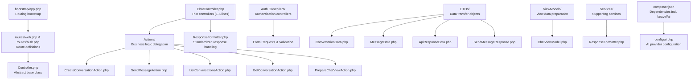
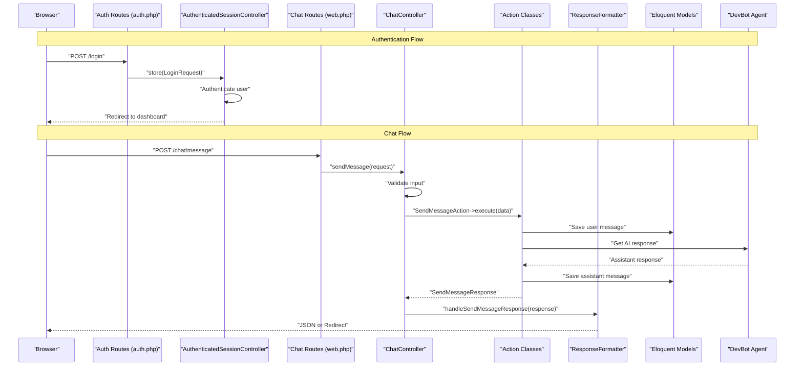
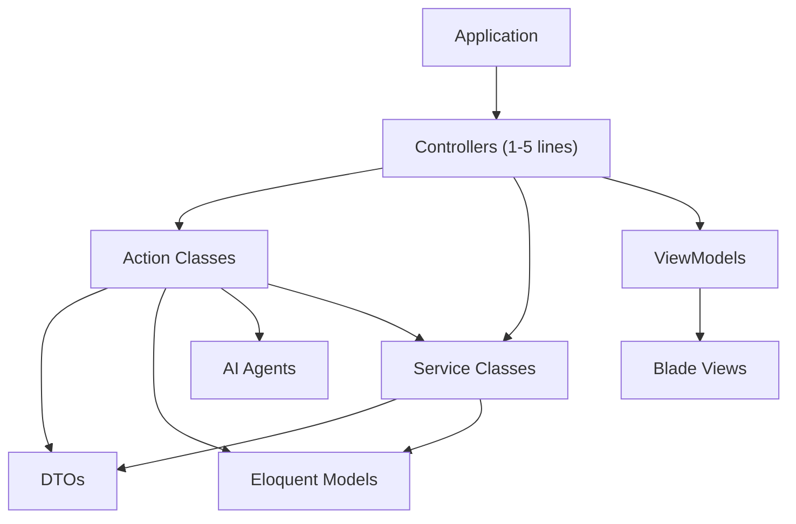

# Controllers

<cite>
**Referenced Files in This Document**
- [Controller.php](file://app/Http/Controllers/Controller.php)
- [ChatController.php](file://app/Http/Controllers/ChatController.php)
- [AuthenticatedSessionController.php](file://app/Http/Controllers/Auth/AuthenticatedSessionController.php)
- [BaseAction.php](file://app/Actions/BaseAction.php)
- [PrepareChatViewAction.php](file://app/Actions/PrepareChatViewAction.php)
- [CreateConversationAction.php](file://app/Actions/CreateConversationAction.php)
- [GetConversationAction.php](file://app/Actions/GetConversationAction.php)
- [ListConversationsAction.php](file://app/Actions/ListConversationsAction.php)
- [SendMessageAction.php](file://app/Actions/SendMessageAction.php)
- [ConversationData.php](file://app/DTOs/ConversationData.php)
- [MessageData.php](file://app/DTOs/MessageData.php)
- [ApiResponseData.php](file://app/DTOs/ApiResponseData.php)
- [SendMessageResponse.php](file://app/DTOs/SendMessageResponse.php)
- [ChatViewModel.php](file://app/ViewModels/ChatViewModel.php)
- [ResponseFormatter.php](file://app/Services/ResponseFormatter.php)
- [web.php](file://routes/web.php)
- [auth.php](file://routes/auth.php)
- [bootstrap/app.php](file://bootstrap/app.php)
- [ai.php](file://config/ai.php)
- [composer.json](file://composer.json)
- [2026_04_02_115916_create_agent_conversations_table.php](file://database/migrations/2026_04_02_115916_create_agent_conversations_table.php)
- [design.md](file://openspec/changes/devbot-ai-agent/design.md)
- [proposal.md](file://openspec/changes/devbot-ai-agent/proposal.md)
- [tasks.md](file://openspec/changes/devbot-ai-agent/tasks.md)
- [spec.md](file://openspec/changes/devbot-ai-agent/specs/chat-interface/spec.md)
- [Middleware.php](file://vendor/laravel/framework/src/Illuminate/Routing/Controllers/Middleware.php)
- [HasMiddleware.php](file://vendor/laravel/framework/src/Illuminate/Routing/Controllers/HasMiddleware.php)
</cite>

## Update Summary
**Changes Made**
- Updated architecture overview to reflect comprehensive action-based architecture implementation
- Added documentation for new DTO patterns including ApiResponseData and SendMessageResponse
- Integrated ViewModel documentation with enhanced ChatViewModel capabilities
- Added authentication controller documentation with complete auth flow coverage
- Enhanced ResponseFormatter service documentation for standardized response handling
- Updated practical examples to demonstrate new DTO patterns and enhanced controller implementations
- Revised controller method examples to show 1-5 line implementations with new response patterns
- Enhanced documentation on dependency injection patterns with Actions and Services

## Table of Contents
1. [Introduction](#introduction)
2. [Project Structure](#project-structure)
3. [Core Components](#core-components)
4. [Architecture Overview](#architecture-overview)
5. [Detailed Component Analysis](#detailed-component-analysis)
6. [Thin Controller Pattern Implementation](#thin-controller-pattern-implementation)
7. [Action Classes and Business Logic](#action-classes-and-business-logic)
8. [Data Transfer Objects (DTOs)](#data-transfer-objects-dtos)
9. [ViewModel Pattern](#viewmodel-pattern)
10. [Response Formatting and Standardization](#response-formatting-and-standardization)
11. [Authentication Controller Implementation](#authentication-controller-implementation)
12. [Dependency Analysis](#dependency-analysis)
13. [Performance Considerations](#performance-considerations)
14. [Troubleshooting Guide](#troubleshooting-guide)
15. [Conclusion](#conclusion)
16. [Appendices](#appendices)

## Introduction
This document explains the Laravel controller implementation within the assistant project, focusing on the comprehensive action-based architecture that has evolved from monolithic controllers to a sophisticated thin controller pattern. The project now features specialized controllers for both chat functionality and authentication, with each controller delegating business logic to dedicated Action classes. The architecture emphasizes single responsibility, testability, maintainability, and standardized response formatting while preserving the AI-enhanced chat functionality with comprehensive DTO patterns and ViewModel integration.

## Project Structure
The assistant project follows a modern Laravel 13 architecture with a comprehensive thin controller pattern. Controllers are extremely lightweight (1-5 lines each) and delegate all business logic to specialized Action classes. The structure includes dedicated directories for Actions, DTOs, ViewModels, Services, and supporting components, creating a clear separation between HTTP concerns and business logic. The architecture now includes separate controller namespaces for authentication and chat functionality.



**Diagram sources**
- [bootstrap/app.php:8-12](file://bootstrap/app.php#L8-L12)
- [web.php:5-7](file://routes/web.php#L5-L7)
- [auth.php:1-60](file://routes/auth.php#L1-L60)
- [Controller.php:5-8](file://app/Http/Controllers/Controller.php#L5-L8)
- [ChatController.php:19-104](file://app/Http/Controllers/ChatController.php#L19-L104)
- [AuthenticatedSessionController.php:12-48](file://app/Http/Controllers/Auth/AuthenticatedSessionController.php#L12-L48)
- [composer.json:13](file://composer.json#L13)
- [ai.php:16](file://config/ai.php#L16)

**Section sources**
- [bootstrap/app.php:8-12](file://bootstrap/app.php#L8-L12)
- [web.php:5-7](file://routes/web.php#L5-L7)
- [auth.php:1-60](file://routes/auth.php#L1-L60)
- [composer.json:13](file://composer.json#L13)
- [ai.php:16](file://config/ai.php#L16)

## Core Components
The comprehensive thin controller architecture introduces several key architectural components that work together to achieve clean separation of concerns:

- **Thin Controllers**: Extremely lightweight controllers (1-5 lines) that handle HTTP concerns and coordinate Action classes
- **Action Classes**: Single-responsibility business logic classes that encapsulate complex operations
- **Data Transfer Objects (DTOs)**: Immutable data containers that standardize data flow between layers
- **ViewModels**: Specialized classes that prepare data for views with presentation logic
- **Response Formatters**: Services that standardize response formatting across different controller types
- **Authentication Controllers**: Dedicated controllers for user authentication flows
- **Base Action Class**: Common error handling and execution patterns for all Action classes

Key implementation references:
- Thin controller example: [ChatController.php:28-39](file://app/Http/Controllers/ChatController.php#L28-L39)
- Authentication controller: [AuthenticatedSessionController.php:17-31](file://app/Http/Controllers/Auth/AuthenticatedSessionController.php#L17-L31)
- Action class pattern: [BaseAction.php:28-57](file://app/Actions/BaseAction.php#L28-L57)
- DTO pattern: [ConversationData.php:29-57](file://app/DTOs/ConversationData.php#L29-L57)
- ViewModel usage: [ChatController.php:31](file://app/Http/Controllers/ChatController.php#L31)

**Section sources**
- [ChatController.php:28-39](file://app/Http/Controllers/ChatController.php#L28-L39)
- [AuthenticatedSessionController.php:17-31](file://app/Http/Controllers/Auth/AuthenticatedSessionController.php#L17-L31)
- [BaseAction.php:28-57](file://app/Actions/BaseAction.php#L28-L57)
- [ConversationData.php:29-57](file://app/DTOs/ConversationData.php#L29-L57)

## Architecture Overview
The assistant project implements a sophisticated comprehensive thin controller architecture where controllers act as orchestrators, delegating all business logic to Action classes. This pattern provides clear separation between HTTP concerns and business operations, improving testability and maintainability. The architecture now includes specialized controllers for different functional domains.



**Diagram sources**
- [auth.php:14-36](file://routes/auth.php#L14-L36)
- [AuthenticatedSessionController.php:25-31](file://app/Http/Controllers/Auth/AuthenticatedSessionController.php#L25-L31)
- [web.php:14-18](file://routes/web.php#L14-L18)
- [ChatController.php:86-102](file://app/Http/Controllers/ChatController.php#L86-L102)
- [SendMessageAction.php:55-86](file://app/Actions/SendMessageAction.php#L55-L86)
- [ResponseFormatter.php:88-95](file://app/Services/ResponseFormatter.php#L88-L95)

## Detailed Component Analysis

### Abstract Controller Base Class
The abstract base class remains minimal, providing only the foundational structure for all controllers. This simplicity enables the thin controller pattern by reducing controller responsibilities to HTTP concerns only.

Implementation reference:
- [Controller.php:5-8](file://app/Http/Controllers/Controller.php#L5-L8)

**Section sources**
- [Controller.php:5-8](file://app/Http/Controllers/Controller.php#L5-L8)

### Route-to-Controller Mapping
Routes are defined in both web and auth routers, mapping to specific controller methods. The thin controller pattern maintains clean route definitions while allowing controllers to remain extremely lightweight.

Implementation references:
- [web.php:14-18](file://routes/web.php#L14-L18)
- [auth.php:14-36](file://routes/auth.php#L14-L36)

**Section sources**
- [web.php:14-18](file://routes/web.php#L14-L18)
- [auth.php:14-36](file://routes/auth.php#L14-L36)

### Controller Method Naming Conventions and Parameter Binding
The thin controller pattern emphasizes descriptive method names that clearly indicate their purpose. Parameter binding leverages Laravel's dependency injection system to automatically resolve Action classes, Services, and other dependencies.

References:
- [ChatController.php:28](file://app/Http/Controllers/ChatController.php#L28)
- [ChatController.php:86](file://app/Http/Controllers/ChatController.php#L86)
- [AuthenticatedSessionController.php:25](file://app/Http/Controllers/Auth/AuthenticatedSessionController.php#L25)

**Section sources**
- [ChatController.php:28](file://app/Http/Controllers/ChatController.php#L28)
- [ChatController.php:86](file://app/Http/Controllers/ChatController.php#L86)
- [AuthenticatedSessionController.php:25](file://app/Http/Controllers/Auth/AuthenticatedSessionController.php#L25)

### Middleware Integration
Middleware can be applied to controllers using Laravel's HasMiddleware interface and Middleware definition class, maintaining the same pattern while controllers remain thin.

Implementation references:
- [HasMiddleware.php:5-13](file://vendor/laravel/framework/src/Illuminate/Routing/Controllers/HasMiddleware.php#L5-L13)
- [Middleware.php:11-22](file://vendor/laravel/framework/src/Illuminate/Routing/Controllers/Middleware.php#L11-L22)

**Section sources**
- [HasMiddleware.php:5-13](file://vendor/laravel/framework/src/Illuminate/Routing/Controllers/HasMiddleware.php#L5-L13)
- [Middleware.php:11-22](file://vendor/laravel/framework/src/Illuminate/Routing/Controllers/Middleware.php#L11-L22)

### Validation Handling
Validation occurs at the controller level using Laravel's built-in validation system and Form Requests. The thin controller pattern keeps validation logic concise while delegating business logic to Action classes.

References:
- [AuthenticatedSessionController.php:25](file://app/Http/Controllers/Auth/AuthenticatedSessionController.php#L25)
- [ChatController.php:88-91](file://app/Http/Controllers/ChatController.php#L88-L91)

**Section sources**
- [AuthenticatedSessionController.php:25](file://app/Http/Controllers/Auth/AuthenticatedSessionController.php#L25)
- [ChatController.php:88-91](file://app/Http/Controllers/ChatController.php#L88-L91)

### Error Response Formatting
Error handling follows Laravel's standard patterns, with controllers catching exceptions and returning appropriate HTTP responses. The thin controller pattern ensures error handling remains centralized and consistent.

References:
- [ChatController.php:95-101](file://app/Http/Controllers/ChatController.php#L95-L101)
- [AuthenticatedSessionController.php:37-46](file://app/Http/Controllers/Auth/AuthenticatedSessionController.php#L37-L46)

**Section sources**
- [ChatController.php:95-101](file://app/Http/Controllers/ChatController.php#L95-L101)
- [AuthenticatedSessionController.php:37-46](file://app/Http/Controllers/Auth/AuthenticatedSessionController.php#L37-L46)

## Thin Controller Pattern Implementation

### Controller Responsibilities
In the thin controller pattern, controllers focus exclusively on HTTP concerns:
- Request validation and transformation
- Response formatting and serialization
- Route parameter resolution
- Session and redirect handling
- Error response formatting
- Service coordination for standardized responses

### Example: Thin Controller Methods
The ChatController demonstrates the thin controller pattern with methods that are 1-5 lines each:

**Show Method** - Loads conversation and prepares view data
```php
public function show(?Conversation $conversation, ListConversationsAction $listAction, PrepareChatViewAction $prepareAction): View
{
    $conversations = $listAction->execute(50);
    $viewModel = $prepareAction->execute($conversation, $conversations);

    return view('chat', [
        'viewModel' => $viewModel,
        'conversation' => $viewModel->getCurrentConversation(),
        'messages' => $viewModel->getCurrentConversation()?->messages ?? collect(),
        'conversations' => $conversations,
    ]);
}
```

**Send Message Method** - Validates input and delegates to Action class
```php
public function sendMessage(Request $request, SendMessageAction $action): JsonResponse|RedirectResponse
{
    $validated = $request->validate([...]);
    $data = MessageData::fromRequest($request);

    try {
        $response = $action->execute($data);
        return $this->formatter->handleSendMessageResponse($response, $request);
    } catch (Exception $e) {
        return $this->formatter->handleSendMessageError($request, $e->getMessage());
    }
}
```

**Section sources**
- [ChatController.php:28-39](file://app/Http/Controllers/ChatController.php#L28-L39)
- [ChatController.php:86-102](file://app/Http/Controllers/ChatController.php#L86-L102)

### Benefits of Thin Controllers
- **Single Responsibility**: Each controller method handles exactly one HTTP concern
- **Improved Testability**: Simple methods are easier to unit test
- **Better Maintainability**: Clear separation between HTTP and business logic
- **Enhanced Reusability**: Action classes can be reused across different controllers
- **Simplified Debugging**: Clear boundaries between layers
- **Standardized Responses**: Consistent response formatting across all controllers

## Action Classes and Business Logic

### Base Action Pattern
The BaseAction class provides common patterns for all Action classes, including error handling and execution wrapping:

```php
abstract class BaseAction
{
    protected function run(callable $callback): mixed
    {
        try {
            return $callback();
        } catch (Throwable $exception) {
            $this->handleException($exception);
        }
    }
    
    protected function handleException(Throwable $exception): never
    {
        throw $exception;
    }
}
```

### Action Class Responsibilities
Action classes encapsulate specific business operations:
- **Single Responsibility**: Each Action handles exactly one business operation
- **Test Isolation**: Easy to unit test with predictable inputs and outputs
- **Reusability**: Can be called from multiple controllers or contexts
- **Error Handling**: Centralized exception handling patterns

### Example: PrepareChatViewAction
```php
class PrepareChatViewAction extends BaseAction
{
    public function execute(?Conversation $conversation, Collection $conversations): ChatViewModel
    {
        $conversation = $this->resolveConversation($conversation);
        return new ChatViewModel($conversation, $conversations);
    }

    protected function resolveConversation(?Conversation $conversation): ?Conversation
    {
        if (! $conversation || ! $conversation->exists) {
            return Conversation::with('messages')->latest()->first();
        }

        $conversation->load('messages');
        return $conversation;
    }
}
```

**Section sources**
- [BaseAction.php:28-57](file://app/Actions/BaseAction.php#L28-L57)
- [PrepareChatViewAction.php:30-52](file://app/Actions/PrepareChatViewAction.php#L30-L52)

### Action Class Benefits
- **Clear Contracts**: Each Action has a well-defined execute method signature
- **Consistent Error Handling**: Shared error handling patterns across all Actions
- **Easy Mocking**: Simple interfaces for testing and mocking
- **Scalable Architecture**: New business operations can be added without modifying controllers

## Data Transfer Objects (DTOs)

### DTO Purpose and Benefits
DTOs provide immutable data containers that standardize data flow between layers:
- **Type Safety**: Compile-time type checking for data properties
- **Documentation**: Clear property definitions and expected values
- **Validation**: Centralized validation logic in DTO constructors
- **Testability**: Predictable data structures for unit testing

### Enhanced DTO Patterns
The project now includes comprehensive DTO patterns for different use cases:

**ApiResponseData DTO** - Standardizes all API responses
```php
final readonly class ApiResponseData
{
    public function __construct(
        public bool $success,
        public mixed $data = null,
        public ?string $message = null,
        public array $meta = [],
        public int $statusCode = 200,
    ) {}

    public static function success(
        mixed $data = null,
        ?string $message = null,
        array $meta = [],
        int $statusCode = 200,
    ): self {
        return new self(true, $data, $message, $meta, $statusCode);
    }

    public static function error(
        string $message,
        int $statusCode = 400,
        mixed $data = null,
        array $meta = [],
    ): self {
        return new self(false, $data, $message, $meta, $statusCode);
    }

    public function toArray(): array
    {
        return array_filter([
            'success' => $this->success,
            'data' => $this->data,
            'message' => $this->message,
            'meta' => $this->meta,
        ], fn ($value) => $value !== null);
    }
}
```

**SendMessageResponse DTO** - Specialized response for message operations
```php
class SendMessageResponse
{
    public function __construct(
        public readonly Conversation $conversation,
        public readonly Message $assistantMessage,
        public readonly bool $success = true,
        public readonly ?string $errorMessage = null,
    ) {}

    public function isSuccessful(): bool
    {
        return $this->success;
    }

    public function toJsonData(): array
    {
        if (! $this->success) {
            return [
                'success' => false,
                'message' => $this->errorMessage ?? 'An error occurred processing your message.',
            ];
        }

        return [
            'success' => true,
            'response' => $this->assistantMessage->formattedContent(),
            'conversation_id' => $this->conversation->id,
            'conversation_title' => $this->conversation->title,
        ];
    }

    public static function success(Conversation $conversation, Message $assistantMessage): self
    {
        return new self($conversation, $assistantMessage, true);
    }

    public static function failure(string $errorMessage): self
    {
        return new self(new Conversation, new Message, false, $errorMessage);
    }
}
```

**Section sources**
- [ApiResponseData.php:31-89](file://app/DTOs/ApiResponseData.php#L31-L89)
- [SendMessageResponse.php:29-106](file://app/DTOs/SendMessageResponse.php#L29-L106)

### DTO Best Practices
- **Immutability**: Use readonly properties to prevent accidental mutations
- **Type Declarations**: Always declare property types for better IDE support
- **Factory Methods**: Provide fromRequest and other factory methods for easy instantiation
- **Validation**: Consider adding validation logic in DTO constructors for fail-fast behavior
- **Standardization**: Use ApiResponseData for consistent API response formatting

## ViewModel Pattern

### ViewModel Purpose
ViewModels prepare data specifically for view rendering, encapsulating presentation logic and data formatting. They replace the need for complex view logic in templates.

### Enhanced ChatViewModel Implementation
The ChatViewModel prepares conversation and sidebar data for the chat interface with comprehensive formatting capabilities:

```php
class ChatViewModel
{
    public function __construct(
        protected ?Conversation $conversation = null,
        protected ?Collection $conversations = null,
    ) {
        $this->conversations = $conversations ?? collect();
    }

    public function getCurrentConversation(): ?Conversation
    {
        return $this->conversation;
    }

    public function getFormattedMessages(): Collection
    {
        if (! $this->conversation) {
            return collect();
        }

        return $this->conversation->messages
            ->sortBy('created_at')
            ->map(function ($message) {
                return [
                    'id' => $message->id,
                    'role' => $message->role->value,
                    'role_label' => $message->role->label(),
                    'content' => $message->role->isAssistant()
                        ? $message->formattedContent()
                        : $message->content,
                    'created_at' => $message->created_at->format('g:i A'),
                ];
            });
    }

    public function getSidebarConversations(): Collection
    {
        return $this->conversations->map(function ($conversation) {
            return [
                'id' => $conversation->id,
                'title' => $conversation->title,
                'created_at' => $conversation->created_at->diffForHumans(),
                'updated_at' => $conversation->updated_at->diffForHumans(),
                'is_active' => $this->conversation?->id === $conversation->id,
            ];
        });
    }

    public function getCurrentConversationId(): ?int
    {
        return $this->conversation?->id;
    }

    public function getCurrentConversationTitle(): ?string
    {
        return $this->conversation?->title;
    }
}
```

### ViewModel Benefits
- **Presentation Logic**: Moves formatting and presentation logic out of views
- **Testability**: ViewModel methods can be unit tested independently
- **Reusability**: Same ViewModel can be used across different controllers
- **Clean Views**: Templates become simpler and more focused on presentation
- **Computed Properties**: Provides convenient accessors for derived data

**Section sources**
- [ChatViewModel.php:29-119](file://app/ViewModels/ChatViewModel.php#L29-L119)

## Response Formatting and Standardization

### ResponseFormatter Service
The ResponseFormatter service centralizes response formatting logic, keeping controllers extremely thin and focused on request orchestration.

```php
class ResponseFormatter
{
    public function formatConversationsList(Collection $conversations): array
    {
        return $conversations->map(function (Conversation $conversation): array {
            return [
                'id' => $conversation->id,
                'title' => $conversation->title,
                'created_at' => $conversation->created_at->diffForHumans(),
                'updated_at' => $conversation->updated_at->diffForHumans(),
            ];
        })->all();
    }

    public function handleSendMessageResponse(SendMessageResponse $response, Request $request): JsonResponse|RedirectResponse
    {
        if ($request->expectsJson() || $request->ajax()) {
            return response()->json($response->toJsonData());
        }

        return redirect()->route('chat.show.conversation', ['conversation' => $response->conversation]);
    }

    public function handleSendMessageError(Request $request, string $errorMessage): JsonResponse|RedirectResponse
    {
        if ($request->expectsJson() || $request->ajax()) {
            return response()->json([
                'success' => false,
                'message' => 'Failed to get a response from DevBot. Please try again later.',
            ], 500);
        }

        return redirect()->back()->with('error', 'Failed to get a response from DevBot. Please try again later.');
    }
}
```

### Benefits of Centralized Response Formatting
- **Consistency**: All controllers use the same response patterns
- **Flexibility**: Supports both JSON APIs and HTML redirects
- **Maintainability**: Single place to modify response formats
- **Testability**: Easy to mock and test response formatting logic

**Section sources**
- [ResponseFormatter.php:19-111](file://app/Services/ResponseFormatter.php#L19-L111)

## Authentication Controller Implementation

### Authentication Flow
The project includes comprehensive authentication controllers that handle all user authentication scenarios while maintaining the thin controller pattern.

### AuthenticatedSessionController
Handles user login, logout, and session management:

```php
class AuthenticatedSessionController extends Controller
{
    public function create(): View
    {
        return view('auth.login');
    }

    public function store(LoginRequest $request): RedirectResponse
    {
        $request->authenticate();

        $request->session()->regenerate();

        return redirect()->intended(route('dashboard', absolute: false));
    }

    public function destroy(Request $request): RedirectResponse
    {
        Auth::guard('web')->logout();

        $request->session()->invalidate();
        $request->session()->regenerateToken();

        return redirect('/');
    }
}
```

### Complete Authentication Controller Suite
The project includes a comprehensive set of authentication controllers:

- **RegisteredUserController**: User registration flow
- **PasswordResetLinkController**: Password reset request handling
- **NewPasswordController**: Password reset completion
- **EmailVerificationPromptController**: Email verification initiation
- **VerifyEmailController**: Email verification completion
- **ConfirmablePasswordController**: Password confirmation for sensitive actions
- **PasswordController**: Password updates
- **EmailVerificationNotificationController**: Resending verification emails

### Authentication Benefits
- **Separation of Concerns**: Each controller handles specific authentication scenarios
- **Security**: Proper session management and CSRF protection
- **User Experience**: Smooth authentication flows with appropriate redirects
- **Extensibility**: Easy to add new authentication features

**Section sources**
- [AuthenticatedSessionController.php:12-48](file://app/Http/Controllers/Auth/AuthenticatedSessionController.php#L12-L48)

## Dependency Analysis
The comprehensive thin controller architecture creates clear dependency relationships that emphasize separation of concerns and maintainability.



**Diagram sources**
- [ChatController.php:5-23](file://app/Http/Controllers/ChatController.php#L5-L23)
- [AuthenticatedSessionController.php:5](file://app/Http/Controllers/Auth/AuthenticatedSessionController.php#L5)
- [BaseAction.php:5](file://app/Actions/BaseAction.php#L5)
- [ResponseFormatter.php:19](file://app/Services/ResponseFormatter.php#L19)

**Section sources**
- [ChatController.php:5-23](file://app/Http/Controllers/ChatController.php#L5-L23)
- [AuthenticatedSessionController.php:5](file://app/Http/Controllers/Auth/AuthenticatedSessionController.php#L5)
- [BaseAction.php:5](file://app/Actions/BaseAction.php#L5)
- [ResponseFormatter.php:19](file://app/Services/ResponseFormatter.php#L19)

## Performance Considerations
The comprehensive thin controller pattern offers several performance benefits while maintaining simplicity:

- **Reduced Memory Footprint**: Controllers are extremely lightweight, consuming minimal memory
- **Improved Cache Efficiency**: Action classes can be cached and reused efficiently
- **Better Test Performance**: Simple controller methods are faster to execute in tests
- **Optimized Database Queries**: Action classes can implement efficient query patterns
- **Lazy Loading**: Dependencies are resolved only when needed through Laravel's service container
- **Response Caching**: ResponseFormatter can implement caching strategies for repeated requests
- **DTO Optimization**: Immutable DTOs reduce memory overhead and improve garbage collection

References:
- [design.md:127-133](file://openspec/changes/professional-laravel-architecture/design.md#L127-L133)

**Section sources**
- [design.md:127-133](file://openspec/changes/professional-laravel-architecture/design.md#L127-L133)

## Troubleshooting Guide
Common issues and solutions when working with thin controllers, Action classes, and comprehensive DTO patterns:

### Controller Method Issues
- **Method Too Complex**: If a controller method exceeds 5 lines, consider extracting logic to an Action class
- **Missing Dependencies**: Ensure all Action class dependencies are properly type-hinted in controller methods
- **Response Formatting**: Verify that controller methods return appropriate response types (View, JsonResponse, RedirectResponse)
- **Service Injection**: Ensure ResponseFormatter and other services are properly injected via constructor

### Action Class Issues
- **Execution Method Signature**: Ensure all Action classes implement the required execute method with proper return types
- **Error Handling**: Check that BaseAction error handling patterns are followed consistently
- **Dependency Resolution**: Verify that Action classes properly utilize Laravel's dependency injection
- **ViewModel Creation**: Ensure Action classes return proper ViewModel instances for view controllers

### DTO Issues
- **Property Types**: Ensure DTO properties have correct type declarations
- **Factory Method Usage**: Use fromRequest factory methods for consistent data transformation
- **Validation**: Implement appropriate validation logic in DTO constructors or Form Requests
- **ApiResponseData Usage**: Use standardized response DTOs for consistent API responses

### Authentication Controller Issues
- **Route Grouping**: Ensure authentication routes are properly grouped with appropriate middleware
- **Form Request Validation**: Verify that authentication controllers use proper Form Request classes
- **Session Management**: Check that logout properly invalidates sessions and regenerates tokens
- **Redirect Logic**: Ensure authentication flows redirect to appropriate destinations

**Section sources**
- [ChatController.php:28-39](file://app/Http/Controllers/ChatController.php#L28-L39)
- [AuthenticatedSessionController.php:25-31](file://app/Http/Controllers/Auth/AuthenticatedSessionController.php#L25-L31)
- [BaseAction.php:49-56](file://app/Actions/BaseAction.php#L49-L56)
- [ConversationData.php:31-34](file://app/DTOs/ConversationData.php#L31-L34)

## Conclusion
The comprehensive thin controller pattern in the assistant project represents a mature architectural approach that prioritizes separation of concerns, testability, maintainability, and standardized response handling. By keeping controllers extremely lightweight (1-5 lines) and delegating all business logic to Action classes, the application achieves clarity and scalability while preserving the AI-enhanced chat functionality. The addition of comprehensive DTO patterns, ViewModel integration, and authentication controllers creates a robust foundation for future feature development and architectural evolution. The centralized ResponseFormatter service ensures consistent response handling across all controller types, while the specialized authentication controllers provide complete user management functionality.

## Appendices

### Best Practices for Thin Controllers
- **Keep Methods Minimal**: Aim for 1-5 lines per controller method
- **Delegate Everything**: Move all business logic to Action classes
- **Use Type Hints**: Leverage Laravel's dependency injection for automatic resolution
- **Centralize Validation**: Handle validation at the controller level only
- **Return Appropriate Responses**: Match response types to request expectations
- **Inject Services**: Use constructor injection for ResponseFormatter and other services
- **Handle Errors Gracefully**: Use ResponseFormatter for consistent error responses

### Action Class Development Guidelines
- **Single Responsibility**: Each Action handles exactly one business operation
- **Consistent Signatures**: All Actions implement execute() with clear parameters and return types
- **Error Handling**: Follow BaseAction patterns for consistent exception handling
- **Test Coverage**: Write comprehensive unit tests for all Action classes
- **Documentation**: Include clear PHPDoc blocks explaining purpose and usage
- **ViewModel Integration**: Return proper ViewModel instances for view controllers
- **DTO Usage**: Use appropriate DTOs for input and output data

### DTO Design Principles
- **Immutability**: Use readonly properties for data integrity
- **Type Safety**: Declare all property types for better IDE support
- **Factory Methods**: Provide fromRequest and other convenience methods
- **Validation**: Consider validation logic in constructors for fail-fast behavior
- **Standardization**: Use ApiResponseData for consistent API response formatting
- **Specialization**: Create specific DTOs for different use cases (MessageData, ConversationData)
- **Compatibility**: Ensure DTOs work seamlessly with Eloquent models and collections

### Authentication Controller Guidelines
- **Security First**: Always use appropriate middleware (auth, guest)
- **Form Requests**: Use dedicated Form Request classes for validation
- **Session Management**: Properly handle session regeneration and invalidation
- **Redirect Logic**: Implement appropriate redirects after authentication actions
- **Error Handling**: Provide clear error messages for authentication failures
- **CSRF Protection**: Rely on Laravel's built-in CSRF protection
- **Route Organization**: Keep authentication routes in separate auth.php file

**Section sources**
- [ChatController.php:28-39](file://app/Http/Controllers/ChatController.php#L28-L39)
- [AuthenticatedSessionController.php:17-31](file://app/Http/Controllers/Auth/AuthenticatedSessionController.php#L17-L31)
- [BaseAction.php:28-57](file://app/Actions/BaseAction.php#L28-L57)
- [ConversationData.php:29-57](file://app/DTOs/ConversationData.php#L29-L57)
- [ApiResponseData.php:31-89](file://app/DTOs/ApiResponseData.php#L31-L89)
- [SendMessageResponse.php:29-106](file://app/DTOs/SendMessageResponse.php#L29-L106)
- [ChatViewModel.php:29-119](file://app/ViewModels/ChatViewModel.php#L29-L119)
- [ResponseFormatter.php:19-111](file://app/Services/ResponseFormatter.php#L19-L111)