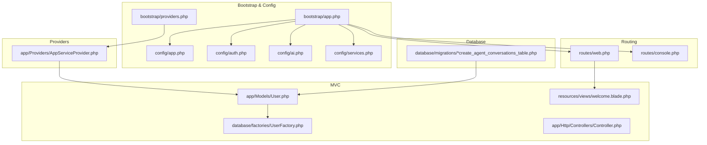
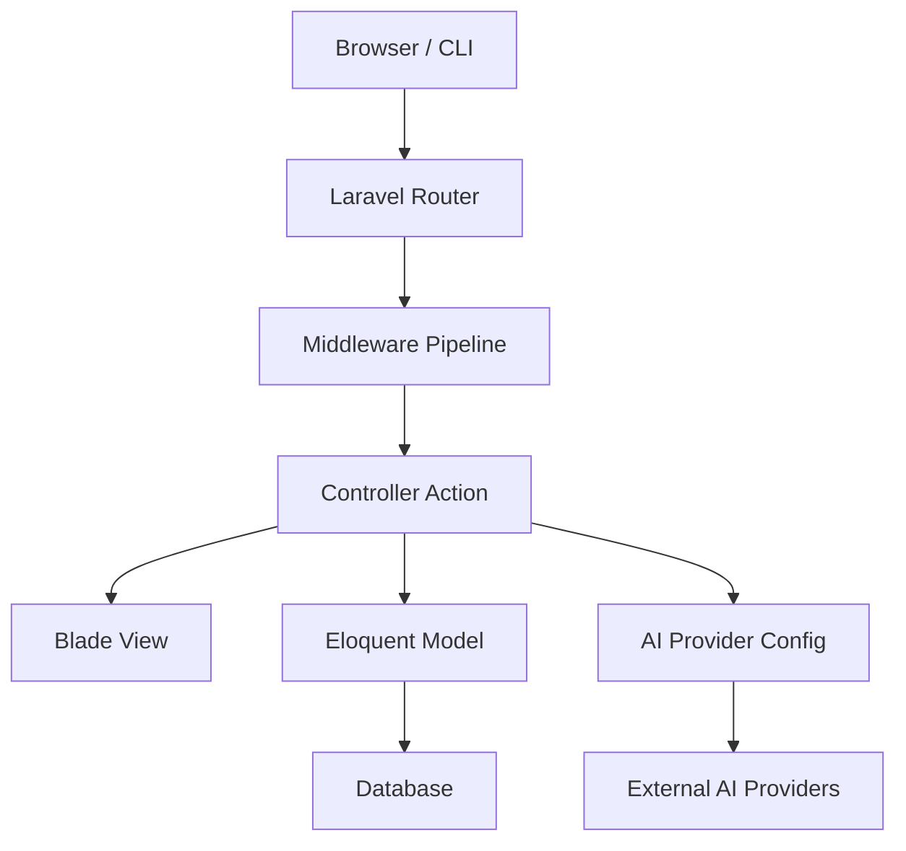
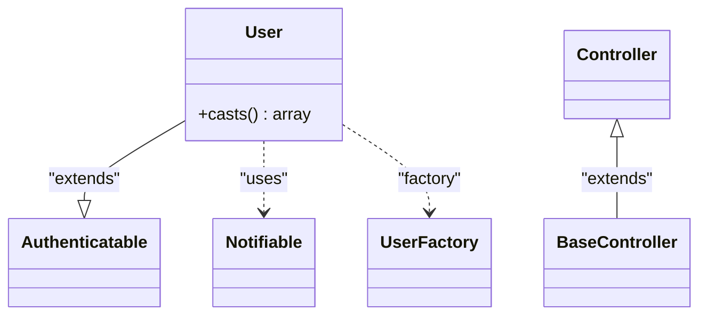
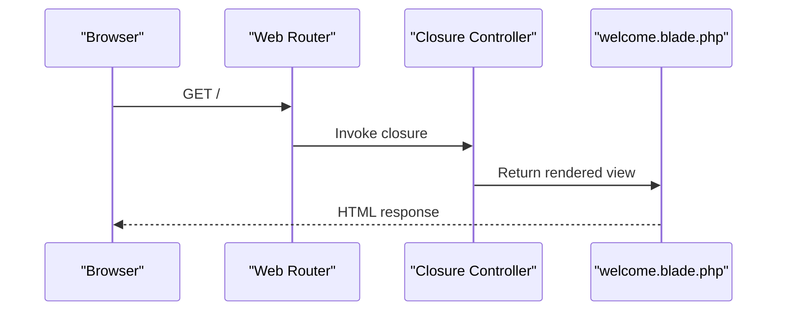
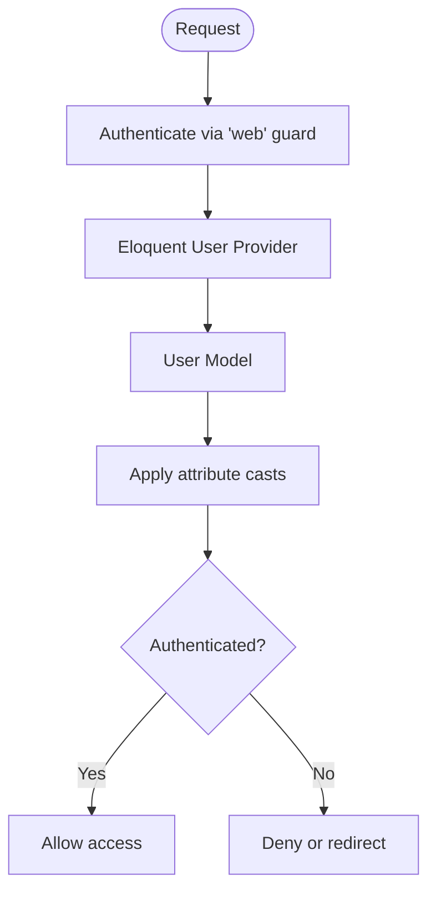
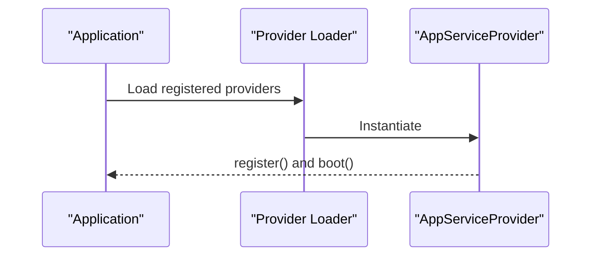
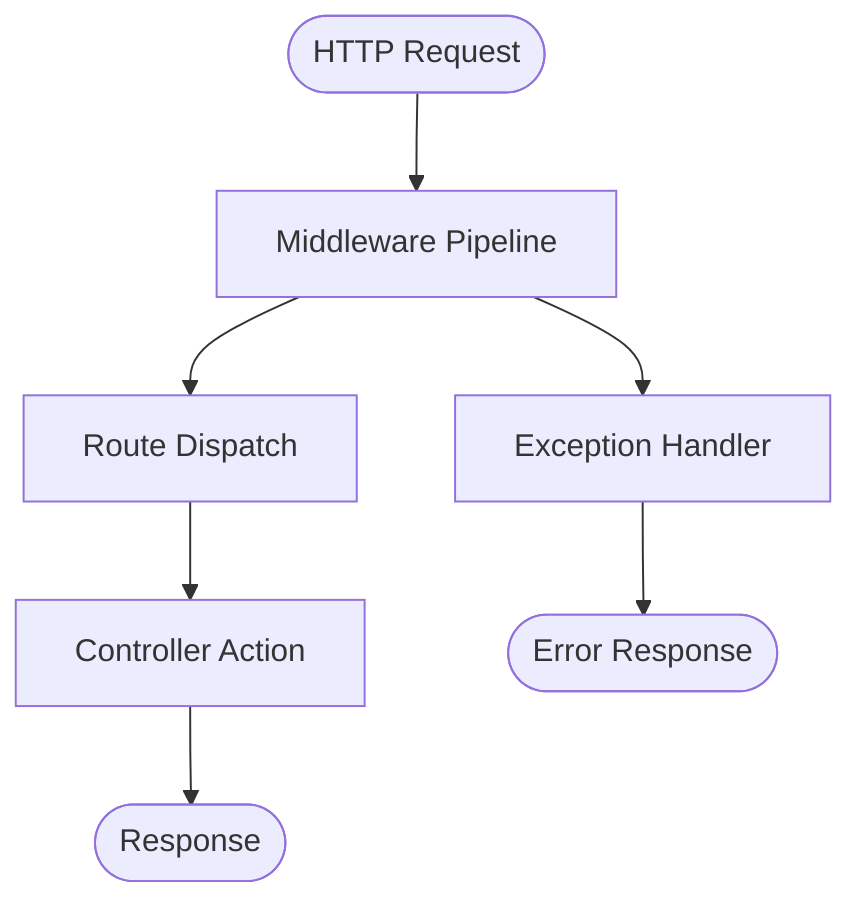
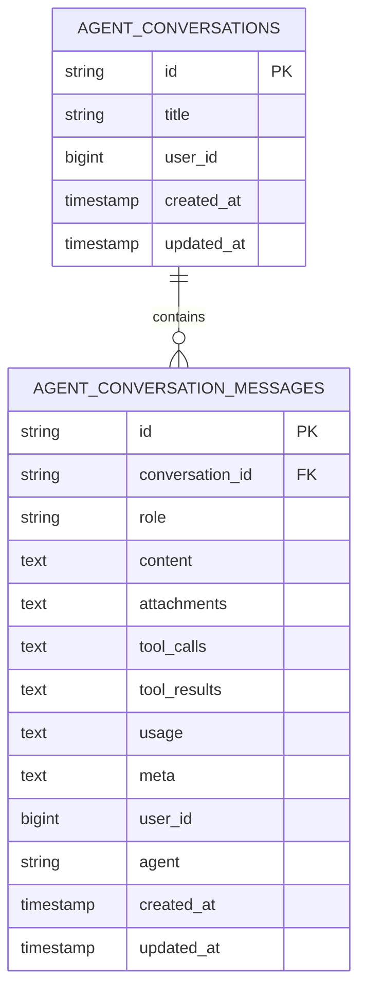
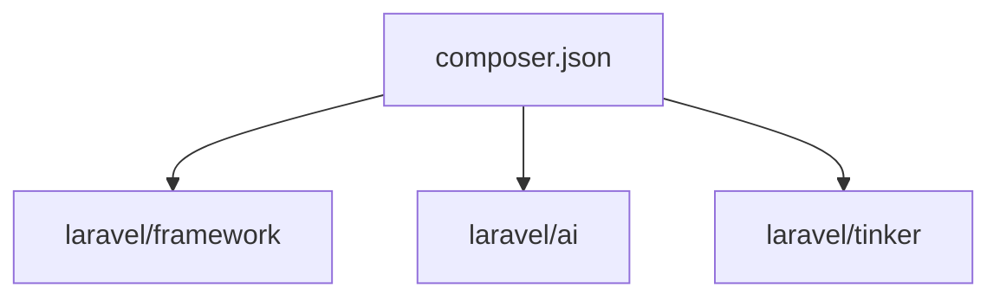

# Laravel Application Components

<cite>
**Referenced Files in This Document**
- [bootstrap/app.php](file://bootstrap/app.php)
- [routes/web.php](file://routes/web.php)
- [routes/console.php](file://routes/console.php)
- [app/Http/Controllers/Controller.php](file://app/Http/Controllers/Controller.php)
- [app/Models/User.php](file://app/Models/User.php)
- [app/Providers/AppServiceProvider.php](file://app/Providers/AppServiceProvider.php)
- [config/auth.php](file://config/auth.php)
- [config/app.php](file://config/app.php)
- [config/ai.php](file://config/ai.php)
- [config/services.php](file://config/services.php)
- [database/migrations/2026_04_02_115916_create_agent_conversations_table.php](file://database/migrations/2026_04_02_115916_create_agent_conversations_table.php)
- [database/factories/UserFactory.php](file://database/factories/UserFactory.php)
- [bootstrap/providers.php](file://bootstrap/providers.php)
- [composer.json](file://composer.json)
- [resources/views/welcome.blade.php](file://resources/views/welcome.blade.php)
</cite>

## Table of Contents
1. [Introduction](#introduction)
2. [Project Structure](#project-structure)
3. [Core Components](#core-components)
4. [Architecture Overview](#architecture-overview)
5. [Detailed Component Analysis](#detailed-component-analysis)
6. [Dependency Analysis](#dependency-analysis)
7. [Performance Considerations](#performance-considerations)
8. [Troubleshooting Guide](#troubleshooting-guide)
9. [Conclusion](#conclusion)
10. [Appendices](#appendices)

## Introduction
This document explains the Laravel Application Components within the assistant project, focusing on the MVC architecture, controllers, models, routing, authentication, service providers, middleware, exception handling, and how these components integrate with AI workflows. It also highlights Laravel conventions, dependency injection, service container usage, best practices, performance considerations, and security implementations.

## Project Structure
The assistant project follows Laravel’s standard structure with a focus on AI-enabled conversations and agent messaging. Key areas:
- Bootstrap and configuration orchestration
- Routing for web and console commands
- MVC components (models, controllers, views)
- Authentication and user management
- AI configuration and migrations for agent conversations
- Service provider registration

**Diagram sources**
- [bootstrap/app.php:1-19](file://bootstrap/app.php#L1-L19)
- [bootstrap/providers.php:1-8](file://bootstrap/providers.php#L1-L8)
- [config/app.php:1-127](file://config/app.php#L1-L127)
- [config/auth.php:1-118](file://config/auth.php#L1-L118)
- [config/ai.php:1-132](file://config/ai.php#L1-L132)
- [config/services.php:1-39](file://config/services.php#L1-L39)
- [routes/web.php:1-8](file://routes/web.php#L1-L8)
- [routes/console.php:1-9](file://routes/console.php#L1-L9)
- [app/Models/User.php:1-33](file://app/Models/User.php#L1-L33)
- [database/factories/UserFactory.php:1-46](file://database/factories/UserFactory.php#L1-L46)
- [app/Http/Controllers/Controller.php:1-9](file://app/Http/Controllers/Controller.php#L1-L9)
- [resources/views/welcome.blade.php:1-226](file://resources/views/welcome.blade.php#L1-L226)
- [app/Providers/AppServiceProvider.php:1-25](file://app/Providers/AppServiceProvider.php#L1-L25)
- [database/migrations/2026_04_02_115916_create_agent_conversations_table.php:1-51](file://database/migrations/2026_04_02_115916_create_agent_conversations_table.php#L1-L51)

**Section sources**
- [bootstrap/app.php:1-19](file://bootstrap/app.php#L1-L19)
- [routes/web.php:1-8](file://routes/web.php#L1-L8)
- [routes/console.php:1-9](file://routes/console.php#L1-L9)
- [app/Http/Controllers/Controller.php:1-9](file://app/Http/Controllers/Controller.php#L1-L9)
- [app/Models/User.php:1-33](file://app/Models/User.php#L1-L33)
- [app/Providers/AppServiceProvider.php:1-25](file://app/Providers/AppServiceProvider.php#L1-L25)
- [config/auth.php:1-118](file://config/auth.php#L1-L118)
- [config/app.php:1-127](file://config/app.php#L1-L127)
- [config/ai.php:1-132](file://config/ai.php#L1-L132)
- [config/services.php:1-39](file://config/services.php#L1-L39)
- [database/migrations/2026_04_02_115916_create_agent_conversations_table.php:1-51](file://database/migrations/2026_04_02_115916_create_agent_conversations_table.php#L1-L51)
- [database/factories/UserFactory.php:1-46](file://database/factories/UserFactory.php#L1-L46)
- [bootstrap/providers.php:1-8](file://bootstrap/providers.php#L1-L8)
- [composer.json:1-93](file://composer.json#L1-L93)
- [resources/views/welcome.blade.php:1-226](file://resources/views/welcome.blade.php#L1-L226)

## Core Components
- Base Controller: Minimal abstract base class extending Laravel’s controller foundation.
- User Model: Eloquent model with authentication traits, notifications, factory usage, and attribute casting.
- App Service Provider: Placeholder for registering and bootstrapping application services.
- Authentication Configuration: Guard/provider setup pointing to the User model.
- Routing: Web routes returning a Blade view; console command registered via Artisan.
- AI Configuration: Provider definitions and defaults for AI operations.
- Agent Conversation Schema: Migrations for agent conversations and messages with indexing for performance.

Practical examples:
- MVC pattern: Route responds with a Blade view, leveraging the framework’s rendering pipeline.
- Authentication: Guard “web” uses session driver with Eloquent provider targeting the User model.
- AI integration: AI provider configuration supports multiple providers and default selections per content type.
- Data modeling: User model uses attributes for fillable and hidden fields, and casts for sensitive data.

**Section sources**
- [app/Http/Controllers/Controller.php:1-9](file://app/Http/Controllers/Controller.php#L1-L9)
- [app/Models/User.php:1-33](file://app/Models/User.php#L1-L33)
- [app/Providers/AppServiceProvider.php:1-25](file://app/Providers/AppServiceProvider.php#L1-L25)
- [config/auth.php:1-118](file://config/auth.php#L1-L118)
- [routes/web.php:1-8](file://routes/web.php#L1-L8)
- [routes/console.php:1-9](file://routes/console.php#L1-L9)
- [config/ai.php:1-132](file://config/ai.php#L1-L132)
- [database/migrations/2026_04_02_115916_create_agent_conversations_table.php:1-51](file://database/migrations/2026_04_02_115916_create_agent_conversations_table.php#L1-L51)

## Architecture Overview
The application initializes routing, middleware, and exception handling through the bootstrap Application configuration. Controllers handle requests, models encapsulate data and authentication, and Blade views render the UI. AI configuration enables provider-driven capabilities, while migrations define agent conversation storage.

**Diagram sources**
- [bootstrap/app.php:1-19](file://bootstrap/app.php#L1-L19)
- [routes/web.php:1-8](file://routes/web.php#L1-L8)
- [app/Http/Controllers/Controller.php:1-9](file://app/Http/Controllers/Controller.php#L1-L9)
- [resources/views/welcome.blade.php:1-226](file://resources/views/welcome.blade.php#L1-L226)
- [app/Models/User.php:1-33](file://app/Models/User.php#L1-L33)
- [config/ai.php:1-132](file://config/ai.php#L1-L132)

## Detailed Component Analysis

### MVC Architecture Implementation
- Model: The User model extends the framework’s authenticatable base, uses factory traits, notifications, and attribute casting for secure handling of sensitive fields.
- Controller: The base Controller class provides a foundation for application controllers.
- View: The welcome view demonstrates Blade templating, route helpers, and responsive design.

**Diagram sources**
- [app/Models/User.php:1-33](file://app/Models/User.php#L1-L33)
- [app/Http/Controllers/Controller.php:1-9](file://app/Http/Controllers/Controller.php#L1-L9)
- [database/factories/UserFactory.php:1-46](file://database/factories/UserFactory.php#L1-L46)

**Section sources**
- [app/Models/User.php:1-33](file://app/Models/User.php#L1-L33)
- [app/Http/Controllers/Controller.php:1-9](file://app/Http/Controllers/Controller.php#L1-L9)
- [resources/views/welcome.blade.php:1-226](file://resources/views/welcome.blade.php#L1-L226)

### Routing Configuration
- Web routing: A single GET route returns the welcome Blade view.
- Console routing: An Artisan command is registered with a purpose statement.

**Diagram sources**
- [routes/web.php:1-8](file://routes/web.php#L1-L8)
- [resources/views/welcome.blade.php:1-226](file://resources/views/welcome.blade.php#L1-L226)

**Section sources**
- [routes/web.php:1-8](file://routes/web.php#L1-L8)
- [routes/console.php:1-9](file://routes/console.php#L1-L9)

### Authentication and User Model
- Authentication guards and providers are configured to use the User model with session-based authentication.
- The User model leverages Eloquent attributes for fillable and hidden fields and applies casting for timestamps and hashed passwords.

**Diagram sources**
- [config/auth.php:1-118](file://config/auth.php#L1-L118)
- [app/Models/User.php:1-33](file://app/Models/User.php#L1-L33)

**Section sources**
- [config/auth.php:1-118](file://config/auth.php#L1-L118)
- [app/Models/User.php:1-33](file://app/Models/User.php#L1-L33)

### Service Provider Registration
- The AppServiceProvider is registered during bootstrap and can be extended to bind interfaces, register services, or configure integrations.
- Providers are loaded from the bootstrap providers list.

**Diagram sources**
- [bootstrap/providers.php:1-8](file://bootstrap/providers.php#L1-L8)
- [app/Providers/AppServiceProvider.php:1-25](file://app/Providers/AppServiceProvider.php#L1-L25)
- [bootstrap/app.php:1-19](file://bootstrap/app.php#L1-L19)

**Section sources**
- [bootstrap/providers.php:1-8](file://bootstrap/providers.php#L1-L8)
- [app/Providers/AppServiceProvider.php:1-25](file://app/Providers/AppServiceProvider.php#L1-L25)
- [bootstrap/app.php:1-19](file://bootstrap/app.php#L1-L19)

### Middleware and Exception Handling
- Middleware and exception handlers are configured in the bootstrap Application configuration. While empty placeholders exist, they can be extended to add global middleware and customize exception responses.

**Diagram sources**
- [bootstrap/app.php:1-19](file://bootstrap/app.php#L1-L19)

**Section sources**
- [bootstrap/app.php:1-19](file://bootstrap/app.php#L1-L19)

### AI Integration and Agent Workflows
- AI configuration defines default providers and per-capability defaults (text, images, audio, embeddings, reranking).
- Agent conversation schema includes tables for conversations and messages with indexes optimized for querying by user and timestamps.

**Diagram sources**
- [database/migrations/2026_04_02_115916_create_agent_conversations_table.php:1-51](file://database/migrations/2026_04_02_115916_create_agent_conversations_table.php#L1-L51)
- [config/ai.php:1-132](file://config/ai.php#L1-L132)

**Section sources**
- [config/ai.php:1-132](file://config/ai.php#L1-L132)
- [database/migrations/2026_04_02_115916_create_agent_conversations_table.php:1-51](file://database/migrations/2026_04_02_115916_create_agent_conversations_table.php#L1-L51)

### Dependency Injection and Service Container
- The application uses Composer autoloading for PSR-4 namespaces and Laravel’s service container for resolving bindings.
- Service providers are the primary mechanism to register and resolve dependencies.

Practical usage patterns:
- Bind interfaces to implementations in a service provider’s register method.
- Resolve dependencies via constructor injection in controllers and jobs.
- Use facades or helper functions for configuration and services.

**Section sources**
- [composer.json:1-93](file://composer.json#L1-L93)
- [app/Providers/AppServiceProvider.php:1-25](file://app/Providers/AppServiceProvider.php#L1-L25)

## Dependency Analysis
Key external dependencies include the Laravel framework, Laravel AI, Tinker, and development tools. The AI configuration centralizes provider credentials and defaults, enabling flexible switching and fallback strategies.

**Diagram sources**
- [composer.json:1-93](file://composer.json#L1-L93)

**Section sources**
- [composer.json:1-93](file://composer.json#L1-L93)
- [config/ai.php:1-132](file://config/ai.php#L1-L132)

## Performance Considerations
- Database indexing: Agent conversation tables include composite indexes on user and updated_at to optimize queries for user-scoped lists and recent updates.
- Attribute casting: Casting sensitive fields reduces overhead and ensures consistent types.
- Middleware and exceptions: Keep middleware lightweight and centralized; avoid heavy operations in global middleware.
- Views: Blade rendering is efficient; minimize complex logic in views and leverage components for reuse.

**Section sources**
- [database/migrations/2026_04_02_115916_create_agent_conversations_table.php:1-51](file://database/migrations/2026_04_02_115916_create_agent_conversations_table.php#L1-L51)
- [app/Models/User.php:1-33](file://app/Models/User.php#L1-L33)
- [bootstrap/app.php:1-19](file://bootstrap/app.php#L1-L19)

## Troubleshooting Guide
- Authentication failures: Verify guard configuration and that the User model is correctly referenced in the provider.
- Missing environment variables: Ensure AI provider keys and application keys are present in the environment configuration.
- Migration issues: Confirm migrations are executed and the agent conversation schema matches the defined indexes.
- Middleware and exceptions: Extend the middleware and exception handler blocks in the bootstrap Application to add logging and custom responses.

**Section sources**
- [config/auth.php:1-118](file://config/auth.php#L1-L118)
- [config/ai.php:1-132](file://config/ai.php#L1-L132)
- [database/migrations/2026_04_02_115916_create_agent_conversations_table.php:1-51](file://database/migrations/2026_04_02_115916_create_agent_conversations_table.php#L1-L51)
- [bootstrap/app.php:1-19](file://bootstrap/app.php#L1-L19)

## Conclusion
The assistant project integrates Laravel’s MVC architecture with AI workflows through a clean configuration and schema design. The User model, routing, authentication, and service providers form a robust foundation, while the AI configuration and agent conversation schema enable scalable agent interactions. Following Laravel conventions, leveraging the service container, and applying performance and security best practices ensures maintainability and extensibility.

## Appendices
- Laravel conventions demonstrated:
  - Base controller inheritance
  - Eloquent model attributes and casting
  - Blade view rendering
  - Artisan console command registration
  - Service provider lifecycle
- AI-enhanced development patterns:
  - Centralized provider configuration
  - Schema-first design for agent data
  - Environment-driven defaults and overrides

[No sources needed since this section summarizes without analyzing specific files]