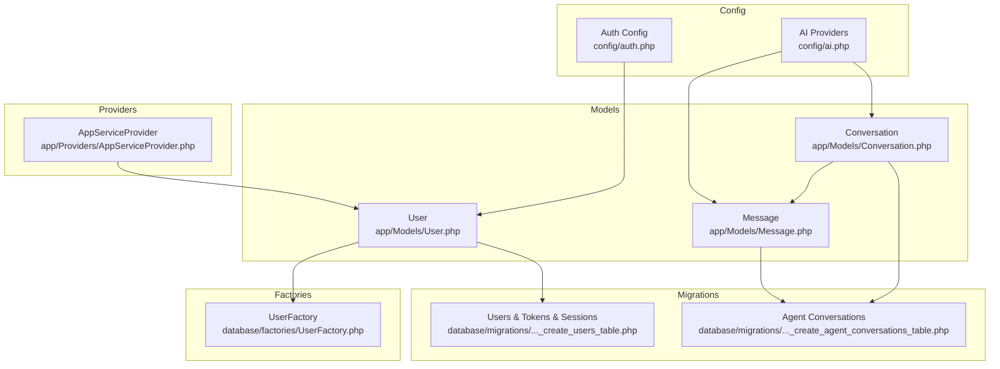
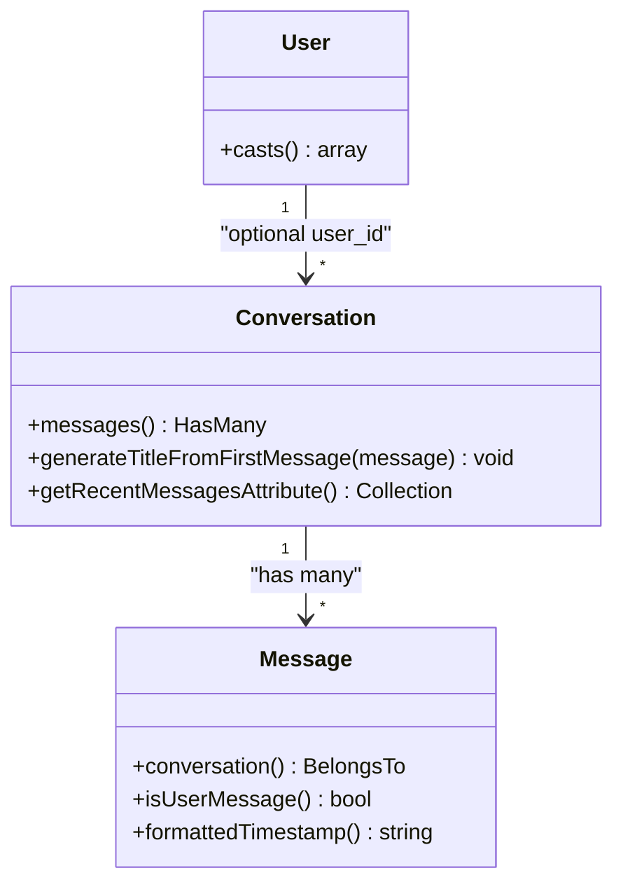
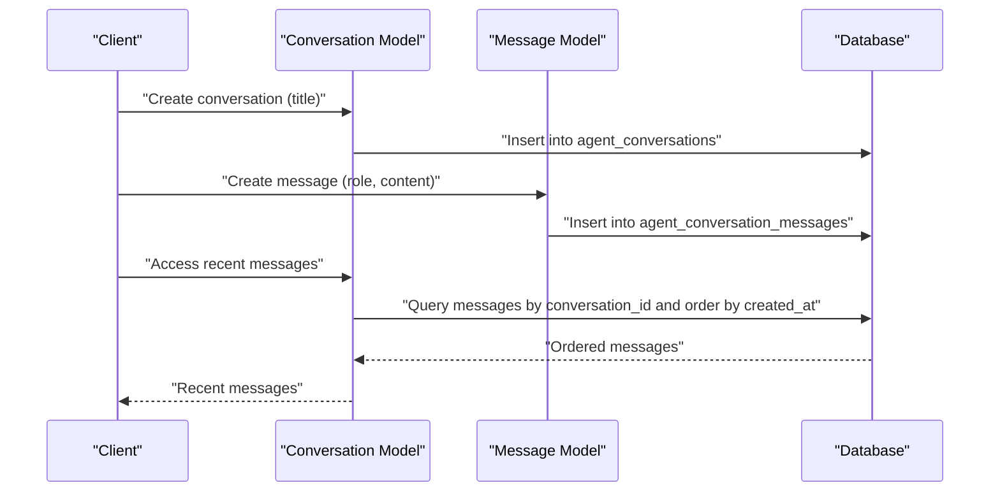
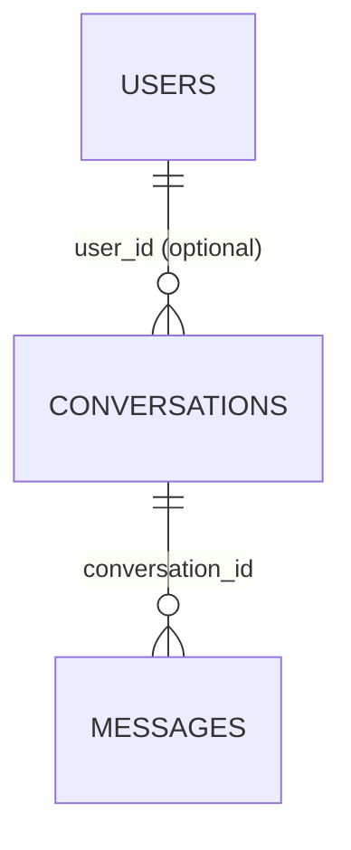
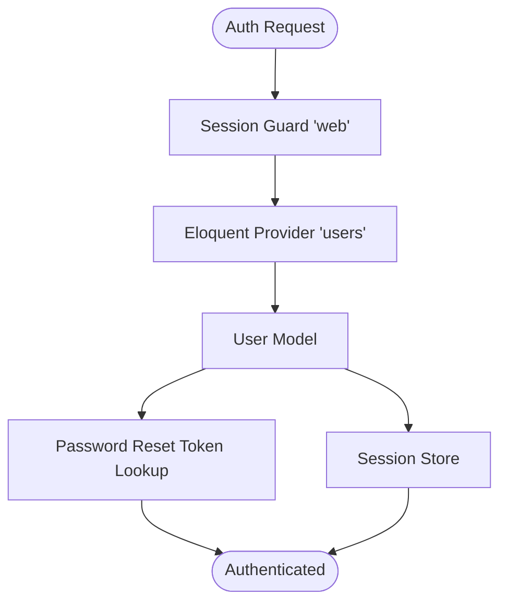
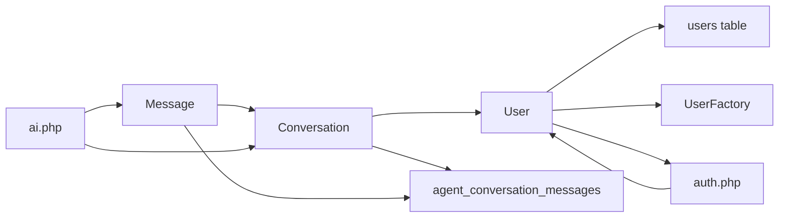

# Models

<cite>
**Referenced Files in This Document**
- [User.php](file://app/Models/User.php)
- [UserFactory.php](file://database/factories/UserFactory.php)
- [create_users_table.php](file://database/migrations/0001_01_01_000000_create_users_table.php)
- [create_agent_conversations_table.php](file://database/migrations/2026_04_02_115916_create_agent_conversations_table.php)
- [Conversation.php](file://app/Models/Conversation.php)
- [Message.php](file://app/Models/Message.php)
- [auth.php](file://config/auth.php)
- [ai.php](file://config/ai.php)
- [AppServiceProvider.php](file://app/Providers/AppServiceProvider.php)
</cite>

## Table of Contents
1. [Introduction](#introduction)
2. [Project Structure](#project-structure)
3. [Core Components](#core-components)
4. [Architecture Overview](#architecture-overview)
5. [Detailed Component Analysis](#detailed-component-analysis)
6. [Dependency Analysis](#dependency-analysis)
7. [Performance Considerations](#performance-considerations)
8. [Troubleshooting Guide](#troubleshooting-guide)
9. [Conclusion](#conclusion)

## Introduction
This document focuses on the Eloquent models and related components that power user management and AI conversation tracking in the assistant project. It explains the User model structure, authentication traits, model relationships, factory patterns for test data generation, attribute casting, and migration-backed authentication features such as password reset tokens and session storage. Practical examples demonstrate model creation, relationship definitions, and data manipulation patterns. It also covers model events, mutators, and accessors for AI-enhanced data processing, along with Laravel best practices for performance optimization and security.

## Project Structure
The models and supporting infrastructure are organized under:
- app/Models: Eloquent models for users, conversations, and messages
- database/factories: Factories for generating test data
- database/migrations: Database schema for users, password resets, sessions, and agent conversation tables
- config: Authentication and AI provider configurations
- app/Providers: Application service provider (boot hooks)

**Diagram sources**
- [User.php:1-33](file://app/Models/User.php#L1-L33)
- [Conversation.php:1-30](file://app/Models/Conversation.php#L1-L30)
- [Message.php:1-35](file://app/Models/Message.php#L1-L35)
- [UserFactory.php:1-46](file://database/factories/UserFactory.php#L1-L46)
- [create_users_table.php:1-50](file://database/migrations/0001_01_01_000000_create_users_table.php#L1-L50)
- [create_agent_conversations_table.php:1-51](file://database/migrations/2026_04_02_115916_create_agent_conversations_table.php#L1-L51)
- [auth.php:1-118](file://config/auth.php#L1-L118)
- [ai.php:1-132](file://config/ai.php#L1-L132)
- [AppServiceProvider.php:1-25](file://app/Providers/AppServiceProvider.php#L1-L25)

**Section sources**
- [User.php:1-33](file://app/Models/User.php#L1-L33)
- [UserFactory.php:1-46](file://database/factories/UserFactory.php#L1-L46)
- [create_users_table.php:1-50](file://database/migrations/0001_01_01_000000_create_users_table.php#L1-L50)
- [create_agent_conversations_table.php:1-51](file://database/migrations/2026_04_02_115916_create_agent_conversations_table.php#L1-L51)
- [auth.php:1-118](file://config/auth.php#L1-L118)
- [ai.php:1-132](file://config/ai.php#L1-L132)
- [AppServiceProvider.php:1-25](file://app/Providers/AppServiceProvider.php#L1-L25)

## Core Components
- User model
  - Extends the framework’s authenticatable base class
  - Uses the modern PHP attribute-based fillable and hidden declarations
  - Defines attribute casting for date/time and hashed password fields
  - Integrates with the factory and notifications
- Conversation and Message models
  - Conversation has many messages and exposes helpers for recent messages and title generation
  - Message belongs to a conversation, with role casting and convenience helpers
- Factories
  - Generates realistic default user states, including hashed passwords and optional verification
- Authentication and session migrations
  - Users table with remember tokens
  - Password reset tokens table
  - Sessions table for server-side session storage
- Agent conversation migrations
  - Tables for storing conversations and messages with indexes optimized for querying and analytics

Practical usage patterns:
- Creating users via factory and persistence
- Defining relationships and accessing related data
- Casting and formatting attributes for display
- Leveraging authentication configuration for password reset and session management

**Section sources**
- [User.php:13-31](file://app/Models/User.php#L13-L31)
- [UserFactory.php:25-44](file://database/factories/UserFactory.php#L25-L44)
- [create_users_table.php:14-37](file://database/migrations/0001_01_01_000000_create_users_table.php#L14-L37)
- [create_agent_conversations_table.php:14-39](file://database/migrations/2026_04_02_115916_create_agent_conversations_table.php#L14-L39)
- [Conversation.php:10-28](file://app/Models/Conversation.php#L10-L28)
- [Message.php:10-33](file://app/Models/Message.php#L10-L33)

## Architecture Overview
The model layer integrates tightly with Laravel’s authentication system and the AI agent subsystem. The User model participates in authentication via the configured provider and guard. Conversations and messages track AI interactions and are indexed for efficient retrieval and analytics.

**Diagram sources**
- [User.php:15-31](file://app/Models/User.php#L15-L31)
- [Conversation.php:8-28](file://app/Models/Conversation.php#L8-L28)
- [Message.php:8-33](file://app/Models/Message.php#L8-L33)

## Detailed Component Analysis

### User Model
- Purpose: Core identity and authentication entity
- Authentication traits:
  - Uses the framework’s authenticatable base class
  - Integrates with notifications
- Attributes:
  - Fillable fields include name, email, and password
  - Hidden fields include password and remember token
- Attribute casting:
  - email_verified_at is cast to datetime
  - password is cast to hashed
- Factory integration:
  - Declares the factory class to enable model seeding and testing

Practical examples:
- Creating a user via factory and persisting to the database
- Retrieving a user and accessing verified/hidden attributes safely
- Using the model in authentication flows configured by the auth config

**Section sources**
- [User.php:13-31](file://app/Models/User.php#L13-L31)
- [auth.php:64-74](file://config/auth.php#L64-L74)

### UserFactory
- Purpose: Generate realistic test data for User model
- Default state:
  - Randomized name and unique email
  - Verified email timestamp set to current time
  - Hashed password cached for performance
  - Random remember token
- States:
  - unverified: sets email verification timestamp to null

Practical examples:
- Generating a verified user
- Generating an unverified user for testing verification flows
- Using sequences and states to vary test scenarios

**Section sources**
- [UserFactory.php:25-44](file://database/factories/UserFactory.php#L25-L44)

### Authentication and Session Tables
- Users table
  - Auto-increment id
  - Name, email (unique), email verification timestamp, password, remember token, timestamps
- Password reset tokens table
  - Email (primary), token, created_at
- Sessions table
  - Id (primary), user_id (indexed), IP address, user agent, payload, last activity (indexed)

These tables support:
- Standard authentication flows
- Password reset functionality
- Server-side session management

**Section sources**
- [create_users_table.php:14-37](file://database/migrations/0001_01_01_000000_create_users_table.php#L14-L37)
- [auth.php:95-102](file://config/auth.php#L95-L102)

### Agent Conversation Models and Tables
- Conversation model
  - Fillable: user_id, title
  - Has many messages ordered by creation time
  - Helpers: generate title from first message, access recent messages via attribute
- Message model
  - Fillable: conversation_id, role, content
  - Role is cast to string
  - Belongs to Conversation
  - Helpers: isUserMessage(), formattedTimestamp()
- Agent conversation tables
  - agent_conversations: id, user_id, title, timestamps; composite index on user_id and updated_at
  - agent_conversation_messages: id, conversation_id, user_id, agent, role, content, attachments, tool_calls, tool_results, usage, meta, timestamps; indexes for performance

Practical examples:
- Creating a conversation and appending messages
- Querying recent messages efficiently using indexes
- Tracking AI agent interactions with metadata and tool results

**Diagram sources**
- [Conversation.php:15-18](file://app/Models/Conversation.php#L15-L18)
- [Message.php:20-23](file://app/Models/Message.php#L20-L23)
- [create_agent_conversations_table.php:14-39](file://database/migrations/2026_04_02_115916_create_agent_conversations_table.php#L14-L39)

**Section sources**
- [Conversation.php:10-28](file://app/Models/Conversation.php#L10-L28)
- [Message.php:10-33](file://app/Models/Message.php#L10-L33)
- [create_agent_conversations_table.php:14-39](file://database/migrations/2026_04_02_115916_create_agent_conversations_table.php#L14-L39)

### Model Relationships
- User to Conversation
  - Optional foreign key user_id allows anonymous conversations or user-scoped ones
- Conversation to Message
  - One-to-many relationship with ordering by created_at
- Message to Conversation
  - Many-to-one relationship for reverse navigation

**Diagram sources**
- [Conversation.php:15-18](file://app/Models/Conversation.php#L15-L18)
- [Message.php:20-23](file://app/Models/Message.php#L20-L23)
- [create_agent_conversations_table.php:14-39](file://database/migrations/2026_04_02_115916_create_agent_conversations_table.php#L14-L39)

**Section sources**
- [Conversation.php:15-18](file://app/Models/Conversation.php#L15-L18)
- [Message.php:20-23](file://app/Models/Message.php#L20-L23)

### Attribute Casting and Formatting
- User
  - email_verified_at: datetime
  - password: hashed
- Message
  - role: string
- Display helpers
  - Message.formattedTimestamp() returns a human-friendly timestamp
  - Message.isUserMessage() determines sender role

Practical examples:
- Casting ensures consistent serialization and deserialization
- Accessors/helpers simplify presentation logic

**Section sources**
- [User.php:25-31](file://app/Models/User.php#L25-L31)
- [Message.php:16-33](file://app/Models/Message.php#L16-L33)

### Factory Patterns and Test Data Generation
- Default user state includes:
  - Unique email
  - Verified email timestamp
  - Hashed password
  - Random remember token
- State overrides:
  - unverified() clears email verification timestamp
- Usage patterns:
  - Generate multiple users for testing
  - Combine states to simulate real-world scenarios

**Section sources**
- [UserFactory.php:25-44](file://database/factories/UserFactory.php#L25-L44)

### Authentication Configuration and Integration
- Guard and provider
  - Session-based guard “web”
  - Eloquent provider for model User
- Password reset
  - Broker “users” uses the password reset tokens table
  - Expiration and throttling configured
- Session storage
  - Sessions table supports server-side session management

**Diagram sources**
- [auth.php:40-74](file://config/auth.php#L40-L74)
- [auth.php:95-102](file://config/auth.php#L95-L102)
- [create_users_table.php:24-37](file://database/migrations/0001_01_01_000000_create_users_table.php#L24-L37)

**Section sources**
- [auth.php:18-102](file://config/auth.php#L18-L102)
- [create_users_table.php:24-37](file://database/migrations/0001_01_01_000000_create_users_table.php#L24-L37)

### AI Provider Integration
- AI configuration defines default providers and credentials
- Conversation and message models can leverage AI providers for processing and storage of agent interactions
- Indexes on agent_conversation_messages support efficient retrieval and analytics

**Section sources**
- [ai.php:16-132](file://config/ai.php#L16-L132)
- [create_agent_conversations_table.php:14-39](file://database/migrations/2026_04_02_115916_create_agent_conversations_table.php#L14-L39)

## Dependency Analysis
- User depends on:
  - Authenticatable base class
  - Notifiable trait
  - UserFactory for testing
  - Users table schema for persistence
- Conversation depends on:
  - Message model
  - Agent conversations table schema
- Message depends on:
  - Conversation model
  - Agent conversation messages table schema
- Auth configuration ties User to the authentication system
- AI configuration informs agent-driven features

**Diagram sources**
- [User.php:15-18](file://app/Models/User.php#L15-L18)
- [UserFactory.php:13-18](file://database/factories/UserFactory.php#L13-L18)
- [create_users_table.php:14-22](file://database/migrations/0001_01_01_000000_create_users_table.php#L14-L22)
- [create_agent_conversations_table.php:14-39](file://database/migrations/2026_04_02_115916_create_agent_conversations_table.php#L14-L39)
- [auth.php:64-74](file://config/auth.php#L64-L74)
- [ai.php:52-129](file://config/ai.php#L52-L129)

**Section sources**
- [User.php:15-18](file://app/Models/User.php#L15-L18)
- [Conversation.php:15-18](file://app/Models/Conversation.php#L15-L18)
- [Message.php:20-23](file://app/Models/Message.php#L20-L23)
- [auth.php:64-74](file://config/auth.php#L64-L74)
- [ai.php:52-129](file://config/ai.php#L52-L129)

## Performance Considerations
- Eager loading
  - Use with relations when displaying lists of conversations and messages to prevent N+1 queries
- Indexes
  - Sessions and agent conversation tables include indexes on frequently queried columns (user_id, last_activity, conversation_id, timestamps)
- Efficient queries
  - Use scopes or query builders to limit result sets (e.g., recent messages)
- Cursor vs lazy iteration
  - For large datasets, prefer lazy iteration with relationship hydration when appropriate

[No sources needed since this section provides general guidance]

## Troubleshooting Guide
- Authentication issues
  - Verify guard and provider configuration align with the User model
  - Confirm password reset tokens table exists and is accessible
- Session problems
  - Ensure sessions table schema matches migration expectations
  - Check last_activity index and payload storage capacity
- Conversation/message retrieval
  - Confirm indexes exist on conversation_id and timestamps
  - Validate foreign key constraints and cascading behavior
- Model casting and visibility
  - Ensure casts are defined for sensitive or computed fields
  - Keep tokens and hashed values hidden from serialization

**Section sources**
- [auth.php:40-102](file://config/auth.php#L40-L102)
- [create_users_table.php:30-37](file://database/migrations/0001_01_01_000000_create_users_table.php#L30-L37)
- [create_agent_conversations_table.php:23-39](file://database/migrations/2026_04_02_115916_create_agent_conversations_table.php#L23-L39)
- [User.php:25-31](file://app/Models/User.php#L25-L31)

## Conclusion
The model layer in this project provides a solid foundation for user management and AI conversation tracking. The User model leverages modern Laravel features for attribute casting and factory integration, while the Conversation and Message models encapsulate agent interaction data with helpful accessors and relationships. Authentication and session tables are scaffolded to support secure, scalable user experiences. Following the best practices outlined here will help maintain performance, security, and clarity as the system evolves.