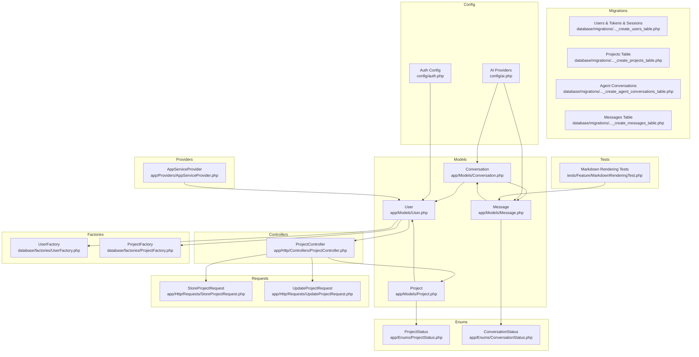
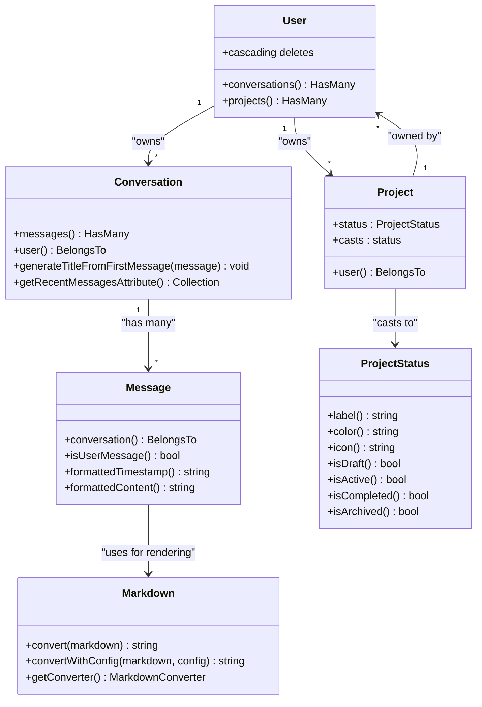
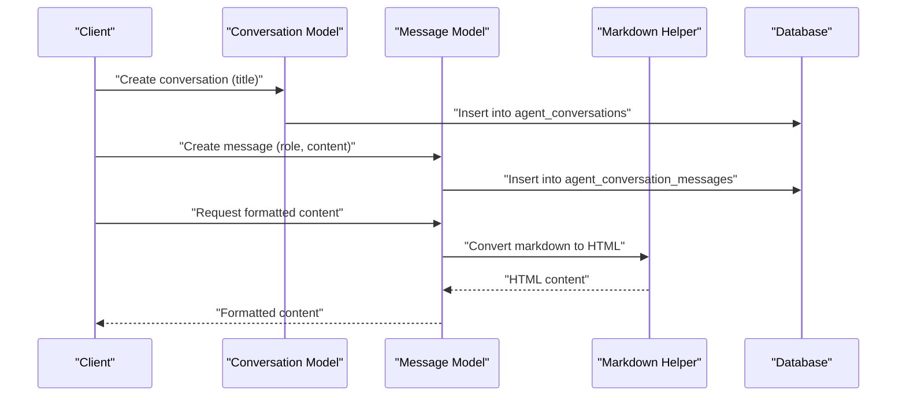
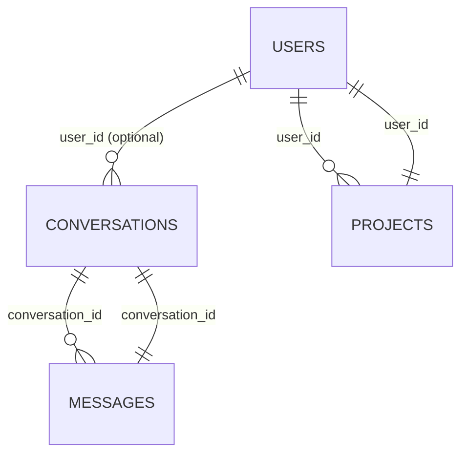
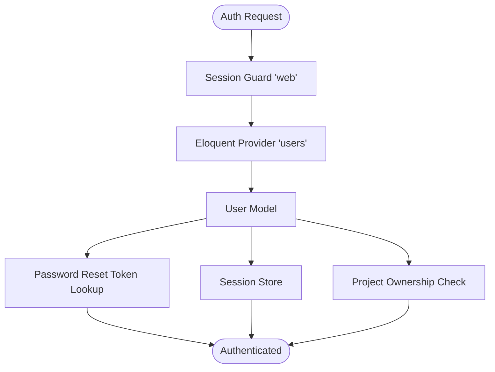
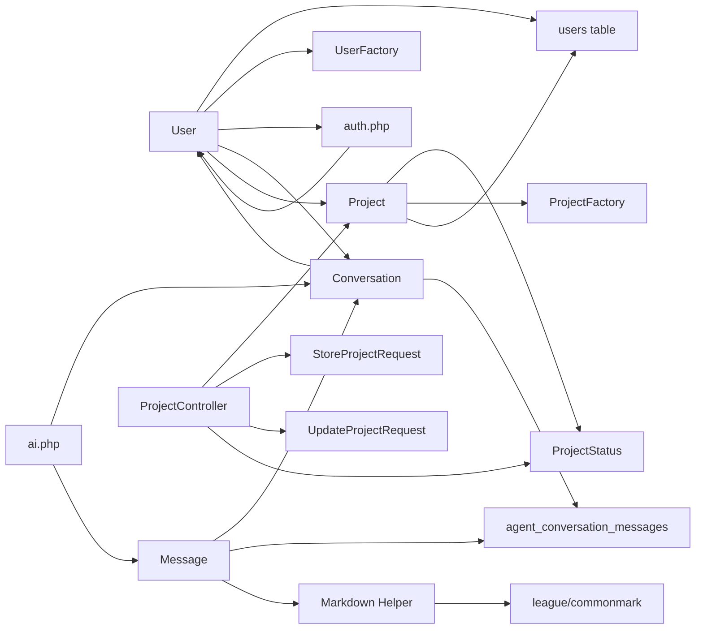

# Models

<cite>
**Referenced Files in This Document**
- [User.php](file://app/Models/User.php)
- [Project.php](file://app/Models/Project.php)
- [Conversation.php](file://app/Models/Conversation.php)
- [Message.php](file://app/Models/Message.php)
- [ProjectStatus.php](file://app/Enums/ProjectStatus.php)
- [UserFactory.php](file://database/factories/UserFactory.php)
- [ProjectFactory.php](file://database/factories/ProjectFactory.php)
- [create_users_table.php](file://database/migrations/0001_01_01_000000_create_users_table.php)
- [create_projects_table.php](file://database/migrations/2026_04_05_092017_create_projects_table.php)
- [create_agent_conversations_table.php](file://database/migrations/2026_04_02_115916_create_agent_conversations_table.php)
- [ProjectController.php](file://app/Http/Controllers/ProjectController.php)
- [StoreProjectRequest.php](file://app/Http/Requests/StoreProjectRequest.php)
- [UpdateProjectRequest.php](file://app/Http/Requests/UpdateProjectRequest.php)
- [Markdown.php](file://app/Helpers/Markdown.php)
- [auth.php](file://config/auth.php)
- [ai.php](file://config/ai.php)
- [AppServiceProvider.php](file://app/Providers/AppServiceProvider.php)
- [MarkdownRenderingTest.php](file://tests/Feature/MarkdownRenderingTest.php)
</cite>

## Update Summary
**Changes Made**
- Added comprehensive documentation for the new Project model with user ownership relationships
- Documented the ProjectStatus enum for status tracking with metadata methods
- Enhanced User model documentation to include projects relationship and cascading deletion
- Added project management controller and request validation documentation
- Updated architecture overview to include project management capabilities
- Added factory patterns for project data generation with status states
- Updated security considerations to include project ownership authorization

## Table of Contents
1. [Introduction](#introduction)
2. [Project Structure](#project-structure)
3. [Core Components](#core-components)
4. [Architecture Overview](#architecture-overview)
5. [Detailed Component Analysis](#detailed-component-analysis)
6. [Dependency Analysis](#dependency-analysis)
7. [Performance Considerations](#performance-considerations)
8. [Security Considerations](#security-considerations)
9. [Troubleshooting Guide](#troubleshooting-guide)
10. [Conclusion](#conclusion)

## Introduction
This document focuses on the Eloquent models and related components that power user management, AI conversation tracking, and project management in the assistant project. It explains the User model structure, authentication traits, model relationships, factory patterns for test data generation, attribute casting, and migration-backed authentication features such as password reset tokens and session storage. The documentation now includes comprehensive coverage of the new project management system with user-owned projects, status tracking through enums, and enhanced model relationships. Practical examples demonstrate model creation, relationship definitions, data manipulation patterns, and markdown content formatting. It also covers model events, mutators, and accessors for AI-enhanced data processing, along with Laravel best practices for performance optimization and security.

## Project Structure
The models and supporting infrastructure are organized under:
- app/Models: Eloquent models for users, projects, conversations, and messages
- app/Enums: Strongly-typed enumerations including ProjectStatus and ConversationStatus
- app/Http/Controllers: Project management controller for CRUD operations
- app/Http/Requests: Validation classes for project creation and updates
- database/factories: Factories for generating test data including projects
- database/migrations: Database schema for users, projects, password resets, sessions, and agent conversation tables
- config: Authentication and AI provider configurations
- app/Providers: Application service provider (boot hooks)
- tests: Feature tests for markdown rendering functionality

**Diagram sources**
- [User.php:16-60](file://app/Models/User.php#L16-L60)
- [Project.php:11-34](file://app/Models/Project.php#L11-L34)
- [Conversation.php:12-64](file://app/Models/Conversation.php#L12-L64)
- [Message.php:1-44](file://app/Models/Message.php#L1-L44)
- [ProjectStatus.php:23-100](file://app/Enums/ProjectStatus.php#L23-L100)
- [ProjectController.php:10-96](file://app/Http/Controllers/ProjectController.php#L10-L96)
- [StoreProjectRequest.php:10-25](file://app/Http/Requests/StoreProjectRequest.php#L10-L25)
- [UpdateProjectRequest.php:10-25](file://app/Http/Requests/UpdateProjectRequest.php#L10-L25)
- [UserFactory.php:1-46](file://database/factories/UserFactory.php#L1-L46)
- [ProjectFactory.php:13-69](file://database/factories/ProjectFactory.php#L13-L69)
- [create_users_table.php:1-50](file://database/migrations/0001_01_01_000000_create_users_table.php#L1-L50)
- [create_projects_table.php:7-33](file://database/migrations/2026_04_05_092017_create_projects_table.php#L7-L33)
- [create_agent_conversations_table.php:1-51](file://database/migrations/2026_04_02_115916_create_agent_conversations_table.php#L1-L51)

**Section sources**
- [User.php:16-60](file://app/Models/User.php#L16-L60)
- [Project.php:11-34](file://app/Models/Project.php#L11-L34)
- [ProjectStatus.php:23-100](file://app/Enums/ProjectStatus.php#L23-L100)
- [ProjectController.php:10-96](file://app/Http/Controllers/ProjectController.php#L10-L96)
- [UserFactory.php:1-46](file://database/factories/UserFactory.php#L1-L46)
- [ProjectFactory.php:13-69](file://database/factories/ProjectFactory.php#L13-L69)
- [create_users_table.php:1-50](file://database/migrations/0001_01_01_000000_create_users_table.php#L1-L50)
- [create_projects_table.php:7-33](file://database/migrations/2026_04_05_092017_create_projects_table.php#L7-L33)
- [auth.php:1-118](file://config/auth.php#L1-L118)
- [ai.php:1-132](file://config/ai.php#L1-L132)
- [AppServiceProvider.php:1-25](file://app/Providers/AppServiceProvider.php#L1-L25)

## Core Components
- User model
  - Extends the framework's authenticatable base class
  - Uses the modern PHP attribute-based fillable and hidden declarations
  - Defines attribute casting for date/time and hashed password fields
  - Integrates with the factory and notifications
  - **Enhanced**: Now includes projects relationship with cascading deletion
- Project model
  - **New**: Manages user-owned projects with status tracking
  - Strongly-typed status field using ProjectStatus enum
  - Factory integration with status states (draft, active, completed, archived)
  - User ownership relationship with foreign key constraints
- Conversation and Message models
  - Conversation has many messages and exposes helpers for recent messages and title generation
  - Message belongs to a conversation, with role casting and convenience helpers
  - **Enhanced**: Message model now includes markdown rendering capabilities through the Markdown helper
- ProjectStatus Enum
  - **New**: Strongly-typed status enumeration with metadata methods
  - Provides label(), color(), and icon() methods for UI display
  - Includes boolean methods for status checking (isDraft, isActive, etc.)
  - Integrated with model casting for type-safe status handling
- Project Management Controller
  - **New**: Full CRUD operations for project management
  - Implements ownership authorization and validation
  - Supports RESTful routing patterns
- Project Factory and Requests
  - **New**: Comprehensive factory with status state methods
  - **New**: Validation requests with enum rules for status fields
- Factories
  - Generates realistic default user states, including hashed passwords and optional verification
  - **Enhanced**: Project factory generates projects with associated user relationships
- Authentication and session migrations
  - Users table with remember tokens
  - Password reset tokens table
  - Sessions table for server-side session storage
- Agent conversation migrations
  - Tables for storing conversations and messages with indexes optimized for querying and analytics
- Markdown Helper System
  - **New**: Comprehensive markdown processing using league/commonmark library
  - Supports CommonMark specification and GitHub Flavored Markdown extensions
  - Provides secure HTML escaping and configurable rendering options
  - Includes specialized conversion methods for different use cases

Practical usage patterns:
- Creating users via factory and persistence
- Managing user projects with status tracking and ownership
- Defining relationships and accessing related data
- Casting and formatting attributes for display
- Leveraging authentication configuration for password reset and session management
- **New**: Rendering markdown content with enhanced security and maintainability
- **New**: Validating project data with enum-based status constraints

**Section sources**
- [User.php:16-60](file://app/Models/User.php#L16-L60)
- [Project.php:16-34](file://app/Models/Project.php#L16-L34)
- [ProjectStatus.php:23-100](file://app/Enums/ProjectStatus.php#L23-L100)
- [ProjectController.php:15-85](file://app/Http/Controllers/ProjectController.php#L15-L85)
- [ProjectFactory.php:20-69](file://database/factories/ProjectFactory.php#L20-L69)
- [StoreProjectRequest.php:17-24](file://app/Http/Requests/StoreProjectRequest.php#L17-L24)
- [UpdateProjectRequest.php:17-24](file://app/Http/Requests/UpdateProjectRequest.php#L17-L24)
- [UserFactory.php:25-44](file://database/factories/UserFactory.php#L25-L44)
- [create_users_table.php:14-37](file://database/migrations/0001_01_01_000000_create_users_table.php#L14-L37)
- [create_projects_table.php:14-23](file://database/migrations/2026_04_05_092017_create_projects_table.php#L14-L23)
- [create_agent_conversations_table.php:14-39](file://database/migrations/2026_04_02_115916_create_agent_conversations_table.php#L14-L39)
- [Conversation.php:10-28](file://app/Models/Conversation.php#L10-L28)
- [Message.php:10-44](file://app/Models/Message.php#L10-L44)
- [Markdown.php:10-62](file://app/Helpers/Markdown.php#L10-L62)

## Architecture Overview
The model layer integrates tightly with Laravel's authentication system, the AI agent subsystem, and the new project management system. The User model participates in authentication via the configured provider and now manages both conversations and projects. Projects are user-owned entities with strong typing through the ProjectStatus enum, providing metadata for UI display and filtering. Conversations and messages track AI interactions and are indexed for efficient retrieval and analytics. The new markdown rendering system provides secure content formatting through the league/commonmark library, replacing previous custom regex processing with a standards-compliant and maintainable solution.

**Diagram sources**
- [User.php:48-59](file://app/Models/User.php#L48-L59)
- [Project.php:23-33](file://app/Models/Project.php#L23-L33)
- [Conversation.php:27-38](file://app/Models/Conversation.php#L27-L38)
- [Message.php:8-44](file://app/Models/Message.php#L8-L44)
- [ProjectStatus.php:33-99](file://app/Enums/ProjectStatus.php#L33-L99)
- [Markdown.php:10-62](file://app/Helpers/Markdown.php#L10-L62)

## Detailed Component Analysis

### User Model
- Purpose: Core identity and authentication entity with enhanced project management capabilities
- Authentication traits:
  - Uses the framework's authenticatable base class
  - Integrates with notifications
- Attributes:
  - Fillable fields include name, email, and password
  - Hidden fields include password and remember token
- Attribute casting:
  - email_verified_at is cast to datetime
  - password is cast to hashed
- Model relationships:
  - **Enhanced**: conversations() HasMany relationship for user-owned conversations
  - **Enhanced**: projects() HasMany relationship for user-owned projects
- Model events:
  - **Enhanced**: Cascading deletion hook that removes all user conversations and projects on user deletion
- Factory integration:
  - Declares the factory class to enable model seeding and testing

Practical examples:
- Creating a user via factory and persisting to the database
- Retrieving a user and accessing verified/hidden attributes safely
- Managing user projects with proper ownership relationships
- Using the model in authentication flows configured by the auth config
- **Enhanced**: Deleting a user automatically cleans up associated conversations and projects

**Section sources**
- [User.php:16-60](file://app/Models/User.php#L16-L60)
- [auth.php:64-74](file://config/auth.php#L64-L74)

### Project Model
- Purpose: **New**: Manages user-owned projects with status tracking and lifecycle management
- Relationship to User:
  - Belongs to User via user_id foreign key
  - Enforces cascade-on-delete for clean data cleanup
- Attributes:
  - Fillable: user_id, name, description, status
  - Status field uses ProjectStatus enum for type safety
- Attribute casting:
  - status is cast to ProjectStatus enum for automatic type conversion
- Business logic:
  - Strongly-typed status management through enum methods
  - Metadata methods for UI display (label, color, icon)
- Factory integration:
  - Generates realistic project states with associated user relationships
  - Includes status state methods for testing different project lifecycles

Practical examples:
- Creating a project owned by a specific user
- Managing project status through enum methods
- Querying user projects with proper ownership constraints
- Using factory states to generate projects in different statuses

**Section sources**
- [Project.php:16-34](file://app/Models/Project.php#L16-L34)
- [ProjectStatus.php:23-100](file://app/Enums/ProjectStatus.php#L23-L100)

### ProjectStatus Enum
- Purpose: **New**: Strongly-typed status enumeration for project lifecycle management
- Status values:
  - Draft: Initial project state
  - Active: Project currently in progress
  - Completed: Project finished successfully
  - Archived: Project completed and archived
- Metadata methods:
  - label(): Human-readable status labels for display
  - color(): Tailwind CSS color classes for UI theming
  - icon(): Icon identifiers for status visualization
- Boolean methods:
  - isDraft(), isActive(), isCompleted(), isArchived() for conditional logic
- Integration:
  - Automatically cast by Project model status field
  - Validated by StoreProjectRequest and UpdateProjectRequest

Practical examples:
- Displaying project status with appropriate styling
- Filtering projects by status using boolean methods
- Using status metadata for UI components and dashboards
- Validating status values in forms and APIs

**Section sources**
- [ProjectStatus.php:23-100](file://app/Enums/ProjectStatus.php#L23-L100)

### Project Management Controller
- Purpose: **New**: Full CRUD operations for project management with ownership enforcement
- Routes:
  - GET /projects - List user's projects
  - GET /projects/create - Show create form
  - POST /projects - Store new project
  - GET /projects/{project} - Show project details
  - GET /projects/{project}/edit - Show edit form
  - PUT/PATCH /projects/{project} - Update project
  - DELETE /projects/{project} - Delete project
- Ownership authorization:
  - authorizeOwnership() method validates project ownership
  - Prevents unauthorized access to other users' projects
- Data validation:
  - Uses StoreProjectRequest and UpdateProjectRequest for validation
  - Validates required fields and enum status values
- Response handling:
  - Redirects with success messages after operations
  - Proper HTTP status codes for different operations

Practical examples:
- Creating a project owned by the authenticated user
- Editing project details with proper authorization checks
- Deleting projects with cascading effects on related data
- Handling validation errors and displaying appropriate feedback

**Section sources**
- [ProjectController.php:15-95](file://app/Http/Controllers/ProjectController.php#L15-L95)
- [StoreProjectRequest.php:17-24](file://app/Http/Requests/StoreProjectRequest.php#L17-L24)
- [UpdateProjectRequest.php:17-24](file://app/Http/Requests/UpdateProjectRequest.php#L17-L24)

### Project Factory
- Purpose: **New**: Generate realistic test data for Project model with status states
- Default state:
  - Randomized name and description
  - Associated user (current authenticated user or generated user)
  - Status set to Draft by default
- State methods:
  - draft(): Sets status to ProjectStatus::Draft
  - active(): Sets status to ProjectStatus::Active
  - completed(): Sets status to ProjectStatus::Completed
  - archived(): Sets status to ProjectStatus::Archived
- Usage patterns:
  - Generate projects in different lifecycle states for testing
  - Create user-owned projects with proper relationships
  - Combine states with other factory methods for complex scenarios

Practical examples:
- Generating a draft project for testing project creation flows
- Creating active projects for testing project management features
- Using state methods to simulate different project lifecycles
- Combining project factories with user factories for comprehensive testing

**Section sources**
- [ProjectFactory.php:20-69](file://database/factories/ProjectFactory.php#L20-L69)

### UserFactory
- Purpose: Generate realistic test data for User model
- Default state:
  - Randomized name and unique email
  - Verified email timestamp set to current time
  - Hashed password cached for performance
  - Random remember token
- States:
  - unverified: sets email verification timestamp to null

Practical examples:
- Generating a verified user
- Generating an unverified user for testing verification flows
- Using sequences and states to vary test scenarios

**Section sources**
- [UserFactory.php:25-44](file://database/factories/UserFactory.php#L25-L44)

### Authentication and Session Tables
- Users table
  - Auto-increment id
  - Name, email (unique), email verification timestamp, password, remember token, timestamps
- Password reset tokens table
  - Email (primary), token, created_at
- Sessions table
  - Id (primary), user_id (indexed), IP address, user agent, payload, last activity (indexed)

These tables support:
- Standard authentication flows
- Password reset functionality
- Server-side session management

**Section sources**
- [create_users_table.php:14-37](file://database/migrations/0001_01_01_000000_create_users_table.php#L14-L37)
- [auth.php:95-102](file://config/auth.php#L95-L102)

### Projects Table
- Purpose: **New**: Database schema for project management with user ownership
- Columns:
  - id: Auto-increment primary key
  - user_id: Foreign key to users table with cascade-on-delete
  - name: String field for project name
  - description: Text field for project description (nullable)
  - status: String field with default 'draft'
  - Created indexes on user_id and created_at for performance
  - Timestamps for created_at and updated_at
- Constraints:
  - Foreign key constraint on user_id with cascade-on-delete
  - Default status value for new projects

Practical examples:
- Creating projects with proper user ownership
- Querying projects by user with efficient indexing
- Managing project status through database-level constraints

**Section sources**
- [create_projects_table.php:14-23](file://database/migrations/2026_04_05_092017_create_projects_table.php#L14-L23)

### Agent Conversation Models and Tables
- Conversation model
  - Fillable: user_id, title, status
  - Has many messages ordered by creation time
  - Has many conversations relationship for user ownership
  - Helpers: generate title from first message, access recent messages via attribute
- Message model
  - Fillable: conversation_id, role, content
  - Role is cast to string
  - Belongs to Conversation
  - Helpers: isUserMessage(), formattedTimestamp()
  - **Enhanced**: formattedContent() method for markdown rendering
- Agent conversation tables
  - agent_conversations: id, user_id, title, status, timestamps; composite index on user_id and updated_at
  - agent_conversation_messages: id, conversation_id, user_id, agent, role, content, attachments, tool_calls, tool_results, usage, meta, timestamps; indexes for performance

Practical examples:
- Creating a conversation and appending messages
- Querying recent messages efficiently using indexes
- Tracking AI agent interactions with metadata and tool results
- **Enhanced**: Rendering markdown content with enhanced formatting capabilities

**Diagram sources**
- [Conversation.php:15-18](file://app/Models/Conversation.php#L15-L18)
- [Message.php:20-44](file://app/Models/Message.php#L20-L44)
- [Markdown.php:38-41](file://app/Helpers/Markdown.php#L38-L41)
- [create_agent_conversations_table.php:14-39](file://database/migrations/2026_04_02_115916_create_agent_conversations_table.php#L14-L39)

**Section sources**
- [Conversation.php:10-28](file://app/Models/Conversation.php#L10-L28)
- [Message.php:10-44](file://app/Models/Message.php#L10-L44)
- [create_agent_conversations_table.php:14-39](file://database/migrations/2026_04_02_115916_create_agent_conversations_table.php#L14-L39)

### Markdown Helper System
- **New**: Comprehensive markdown processing solution built on league/commonmark
- Architecture:
  - Singleton pattern for efficient converter instantiation
  - Environment configuration with security-focused defaults
  - Extension-based architecture supporting CommonMark and GitHub Flavored Markdown
- Security Features:
  - HTML input escaping enabled by default
  - Unsafe link prevention
  - Configurable nesting level limits
- Methods:
  - convert(): Basic markdown to HTML conversion
  - convertWithConfig(): Advanced conversion with custom environment configuration
  - getConverter(): Internal method for converter instance management

Practical examples:
- Converting markdown content to secure HTML
- Customizing rendering behavior for specific use cases
- Integrating with Message model for content formatting

**Section sources**
- [Markdown.php:10-62](file://app/Helpers/Markdown.php#L10-L62)

### Model Relationships
- User to Conversation
  - Optional foreign key user_id allows anonymous conversations or user-scoped ones
- User to Project
  - **New**: Has many projects relationship with proper ownership
  - Cascade-on-delete ensures clean data cleanup
- Conversation to Message
  - One-to-many relationship with ordering by created_at
- Message to Conversation
  - Many-to-one relationship for reverse navigation
- Project to User
  - **New**: Belongs to user relationship with foreign key constraints

**Diagram sources**
- [Conversation.php:15-18](file://app/Models/Conversation.php#L15-L18)
- [Project.php:30-33](file://app/Models/Project.php#L30-L33)
- [Message.php:20-44](file://app/Models/Message.php#L20-L44)
- [create_agent_conversations_table.php:14-39](file://database/migrations/2026_04_02_115916_create_agent_conversations_table.php#L14-L39)
- [create_projects_table.php:16-16](file://database/migrations/2026_04_05_092017_create_projects_table.php#L16-L16)

**Section sources**
- [Conversation.php:15-18](file://app/Models/Conversation.php#L15-L18)
- [Project.php:30-33](file://app/Models/Project.php#L30-L33)
- [Message.php:20-44](file://app/Models/Message.php#L20-L44)

### Attribute Casting and Formatting
- User
  - email_verified_at: datetime
  - password: hashed
- Project
  - **New**: status: ProjectStatus enum for type-safe status management
- Message
  - role: string
- Display helpers
  - Message.formattedTimestamp() returns a human-friendly timestamp
  - Message.isUserMessage() determines sender role
  - **Enhanced**: Project.status.label(), color(), and icon() for UI display
  - **New**: ProjectStatus enum methods for metadata display
  - **Enhanced**: Message.formattedContent() returns markdown-rendered HTML content

Practical examples:
- Casting ensures consistent serialization and deserialization
- Accessors/helpers simplify presentation logic
- **Enhanced**: Enum casting provides type safety for status fields
- **New**: Status metadata methods simplify UI component development
- **Enhanced**: Markdown rendering provides rich content formatting while maintaining security

**Section sources**
- [User.php:26-32](file://app/Models/User.php#L26-L32)
- [Project.php:23-25](file://app/Models/Project.php#L23-L25)
- [ProjectStatus.php:33-67](file://app/Enums/ProjectStatus.php#L33-L67)
- [Message.php:16-44](file://app/Models/Message.php#L16-L44)

### Factory Patterns and Test Data Generation
- Default user state includes:
  - Unique email
  - Verified email timestamp
  - Hashed password
  - Random remember token
- State overrides:
  - unverified() clears email verification timestamp
- **Enhanced**: Project factory default state includes:
  - Associated user (current authenticated user or generated user)
  - Status set to Draft by default
  - Randomized name and description
- **Enhanced**: Project factory state methods:
  - draft(): Sets status to ProjectStatus::Draft
  - active(): Sets status to ProjectStatus::Active
  - completed(): Sets status to ProjectStatus::Completed
  - archived(): Sets status to ProjectStatus::Archived
- Usage patterns:
  - Generate multiple users for testing
  - Generate projects with different statuses for lifecycle testing
  - Combine states to simulate real-world scenarios

**Section sources**
- [UserFactory.php:25-44](file://database/factories/UserFactory.php#L25-L44)
- [ProjectFactory.php:20-69](file://database/factories/ProjectFactory.php#L20-L69)

### Authentication Configuration and Integration
- Guard and provider
  - Session-based guard "web"
  - Eloquent provider for model User
- Password reset
  - Broker "users" uses the password reset tokens table
  - Expiration and throttling configured
- Session storage
  - Sessions table supports server-side session management
- **Enhanced**: Project ownership authorization
  - ProjectController implements authorizeOwnership() method
  - Prevents unauthorized access to projects
  - Throws AccessDeniedHttpException for violations

**Diagram sources**
- [auth.php:40-74](file://config/auth.php#L40-L74)
- [auth.php:95-102](file://config/auth.php#L95-L102)
- [create_users_table.php:24-37](file://database/migrations/0001_01_01_000000_create_users_table.php#L24-L37)
- [ProjectController.php:92-95](file://app/Http/Controllers/ProjectController.php#L92-L95)

**Section sources**
- [auth.php:18-102](file://config/auth.php#L18-L102)
- [create_users_table.php:24-37](file://database/migrations/0001_01_01_000000_create_users_table.php#L24-L37)
- [ProjectController.php:92-95](file://app/Http/Controllers/ProjectController.php#L92-L95)

### AI Provider Integration
- AI configuration defines default providers and credentials
- Conversation and message models can leverage AI providers for processing and storage of agent interactions
- Indexes on agent_conversation_messages support efficient retrieval and analytics
- **Enhanced**: ProjectStatus enum provides metadata for AI-driven project management features
- **Enhanced**: Markdown rendering enhances AI-generated content presentation with proper formatting
- **New**: Project management system integrates with AI tools for project creation and management

**Section sources**
- [ai.php:16-132](file://config/ai.php#L16-L132)
- [create_agent_conversations_table.php:14-39](file://database/migrations/2026_04_02_115916_create_agent_conversations_table.php#L14-L39)
- [ProjectStatus.php:33-67](file://app/Enums/ProjectStatus.php#L33-L67)

## Dependency Analysis
- User depends on:
  - Authenticatable base class
  - Notifiable trait
  - UserFactory for testing
  - Users table schema for persistence
  - **Enhanced**: Project model for project relationships
  - **Enhanced**: Conversation model for conversation relationships
- Project depends on:
  - **New**: ProjectStatus enum for type-safe status management
  - **New**: User model for ownership relationships
  - **New**: ProjectFactory for testing
  - Projects table schema for persistence
- Conversation depends on:
  - Message model
  - Agent conversations table schema
  - **Enhanced**: User model for ownership relationships
- Message depends on:
  - Conversation model
  - Agent conversation messages table schema
  - **Enhanced**: Markdown helper for content rendering
- ProjectStatus enum depends on:
  - **New**: Project model for casting integration
  - **New**: ProjectController for validation integration
- ProjectController depends on:
  - **New**: Project model for business logic
  - **New**: StoreProjectRequest and UpdateProjectRequest for validation
  - **New**: ProjectStatus enum for status validation
- Markdown helper depends on:
  - **New**: league/commonmark library for markdown processing
- Auth configuration ties User to the authentication system
- AI configuration informs agent-driven features

**Diagram sources**
- [User.php:16-60](file://app/Models/User.php#L16-L60)
- [Project.php:11-34](file://app/Models/Project.php#L11-L34)
- [ProjectStatus.php:23-100](file://app/Enums/ProjectStatus.php#L23-L100)
- [ProjectController.php:10-96](file://app/Http/Controllers/ProjectController.php#L10-L96)
- [UserFactory.php:13-18](file://database/factories/UserFactory.php#L13-L18)
- [ProjectFactory.php:13-18](file://database/factories/ProjectFactory.php#L13-L18)
- [create_users_table.php:14-22](file://database/migrations/0001_01_01_000000_create_users_table.php#L14-L22)
- [create_projects_table.php:14-23](file://database/migrations/2026_04_05_092017_create_projects_table.php#L14-L23)
- [create_agent_conversations_table.php:14-39](file://database/migrations/2026_04_02_115916_create_agent_conversations_table.php#L14-L39)
- [Message.php:5-6](file://app/Models/Message.php#L5-L6)
- [Markdown.php:5-8](file://app/Helpers/Markdown.php#L5-L8)
- [auth.php:64-74](file://config/auth.php#L64-L74)
- [ai.php:52-129](file://config/ai.php#L52-L129)

**Section sources**
- [User.php:16-60](file://app/Models/User.php#L16-L60)
- [Project.php:11-34](file://app/Models/Project.php#L11-L34)
- [ProjectStatus.php:23-100](file://app/Enums/ProjectStatus.php#L23-L100)
- [ProjectController.php:10-96](file://app/Http/Controllers/ProjectController.php#L10-L96)
- [Conversation.php:15-18](file://app/Models/Conversation.php#L15-L18)
- [Message.php:5-6](file://app/Models/Message.php#L5-L6)
- [Markdown.php:5-8](file://app/Helpers/Markdown.php#L5-L8)
- [auth.php:64-74](file://config/auth.php#L64-L74)
- [ai.php:52-129](file://config/ai.php#L52-L129)

## Performance Considerations
- Eager loading
  - Use with relations when displaying lists of conversations, messages, and projects to prevent N+1 queries
  - **Enhanced**: Consider eager loading projects when displaying user profiles
- Indexes
  - Sessions and agent conversation tables include indexes on frequently queried columns (user_id, last_activity, conversation_id, timestamps)
  - Messages table includes composite index for efficient conversation queries
  - **New**: Projects table includes indexes on user_id and created_at for efficient user-based queries
- Efficient queries
  - Use scopes or query builders to limit result sets (e.g., recent messages, projects by status)
  - **Enhanced**: Use ProjectStatus enum methods for efficient status-based filtering
- Cursor vs lazy iteration
  - For large datasets, prefer lazy iteration with relationship hydration when appropriate
- **Enhanced**: Project status caching
  - **New**: ProjectStatus enum provides efficient status comparisons without database queries
- **Enhanced**: Markdown rendering performance
  - Converter instances are cached as singletons to avoid repeated initialization overhead
  - Environment configuration is reused across conversions for optimal performance

## Security Considerations
- **Updated**: Markdown rendering security
  - HTML input escaping is enabled by default to prevent XSS attacks
  - Unsafe link prevention protects against malicious URLs
  - Configurable nesting level limits prevent stack overflow attacks
  - Custom configuration methods allow fine-tuned security policies
- Authentication security
  - Guard and provider configuration align with the User model
  - Password reset tokens table provides secure password recovery
  - Sessions table supports server-side session management with proper indexing
- Data integrity
  - Mass assignment protection through fillable attributes
  - Attribute casting ensures proper data types and serialization
  - Foreign key constraints maintain referential integrity
- **Enhanced**: Project ownership security
  - **New**: ProjectController implements authorizeOwnership() method for strict ownership validation
  - **New**: Cascade-on-delete prevents orphaned project records
  - **New**: ProjectStatus enum prevents invalid status values through type safety
- **Enhanced**: Input validation security
  - **New**: StoreProjectRequest and UpdateProjectRequest validate required fields and enum status values
  - **New**: ProjectStatus enum validation prevents injection attacks through type enforcement

**Section sources**
- [Markdown.php:17-33](file://app/Helpers/Markdown.php#L17-L33)
- [Markdown.php:46-60](file://app/Helpers/Markdown.php#L46-L60)
- [auth.php:40-102](file://config/auth.php#L40-L102)
- [create_users_table.php:30-37](file://database/migrations/0001_01_01_000000_create_users_table.php#L30-L37)
- [create_agent_conversations_table.php:23-39](file://database/migrations/2026_04_02_115916_create_agent_conversations_table.php#L23-L39)
- [User.php:25-31](file://app/Models/User.php#L25-L31)
- [ProjectController.php:92-95](file://app/Http/Controllers/ProjectController.php#L92-L95)
- [StoreProjectRequest.php:17-24](file://app/Http/Requests/StoreProjectRequest.php#L17-L24)
- [UpdateProjectRequest.php:17-24](file://app/Http/Requests/UpdateProjectRequest.php#L17-L24)
- [ProjectStatus.php:23-100](file://app/Enums/ProjectStatus.php#L23-L100)

## Troubleshooting Guide
- Authentication issues
  - Verify guard and provider configuration align with the User model
  - Confirm password reset tokens table exists and is accessible
- Session problems
  - Ensure sessions table schema matches migration expectations
  - Check last_activity index and payload storage capacity
- Conversation/message retrieval
  - Confirm indexes exist on conversation_id and timestamps
  - Validate foreign key constraints and cascading behavior
- Model casting and visibility
  - Ensure casts are defined for sensitive or computed fields
  - Keep tokens and hashed values hidden from serialization
- **Enhanced**: Project management issues
  - **New**: Verify project ownership relationships and foreign key constraints
  - **New**: Check ProjectStatus enum values match database status values
  - **New**: Ensure ProjectController authorizeOwnership() method is functioning correctly
  - **New**: Validate project factory states are generating expected status values
- **Enhanced**: Markdown rendering issues
  - Verify league/commonmark library is properly installed and autoloaded
  - Check environment configuration for security settings
  - Ensure markdown content is properly escaped and sanitized
  - Test custom configuration methods for specific rendering requirements
- **Enhanced**: Input validation issues
  - **New**: Verify StoreProjectRequest and UpdateProjectRequest rules are properly configured
  - **New**: Check ProjectStatus enum validation is working correctly
  - **New**: Ensure project status values are properly validated and sanitized

**Section sources**
- [auth.php:40-102](file://config/auth.php#L40-L102)
- [create_users_table.php:30-37](file://database/migrations/0001_01_01_000000_create_users_table.php#L30-L37)
- [create_agent_conversations_table.php:23-39](file://database/migrations/2026_04_02_115916_create_agent_conversations_table.php#L23-L39)
- [User.php:25-31](file://app/Models/User.php#L25-L31)
- [ProjectController.php:92-95](file://app/Http/Controllers/ProjectController.php#L92-L95)
- [ProjectStatus.php:23-100](file://app/Enums/ProjectStatus.php#L23-L100)
- [Markdown.php:17-33](file://app/Helpers/Markdown.php#L17-L33)
- [StoreProjectRequest.php:17-24](file://app/Http/Requests/StoreProjectRequest.php#L17-L24)
- [UpdateProjectRequest.php:17-24](file://app/Http/Requests/UpdateProjectRequest.php#L17-L24)

## Conclusion
The model layer in this project provides a solid foundation for user management, AI conversation tracking, and project management. The User model leverages modern Laravel features for attribute casting and factory integration, while the Conversation and Message models encapsulate agent interaction data with helpful accessors and relationships. The new project management system introduces comprehensive user-owned project tracking with strong typing through the ProjectStatus enum, providing metadata for UI display and filtering. The Project model includes proper ownership relationships with cascade-on-delete functionality, ensuring clean data management. The enhanced User model now manages both conversations and projects through dedicated relationships with cascading deletion hooks. The new markdown rendering system significantly enhances content processing capabilities by integrating the secure and maintainable league/commonmark library, replacing previous custom regex processing with industry-standard markdown parsing. Authentication and session tables are scaffolded to support secure, scalable user experiences. The addition of comprehensive markdown rendering with security-focused configuration options ensures that AI-generated content can be safely and effectively presented to users. The project management system follows Laravel best practices with proper validation, authorization, and relationship management. Following the best practices outlined here will help maintain performance, security, and clarity as the system evolves, with the project management system providing robust capabilities for user-owned project lifecycle management and the markdown rendering system providing enhanced content formatting capabilities for the AI agent interactions.