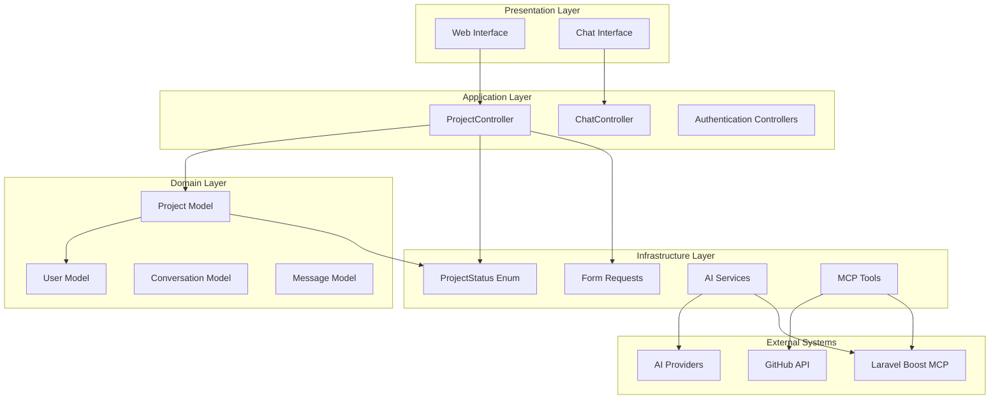
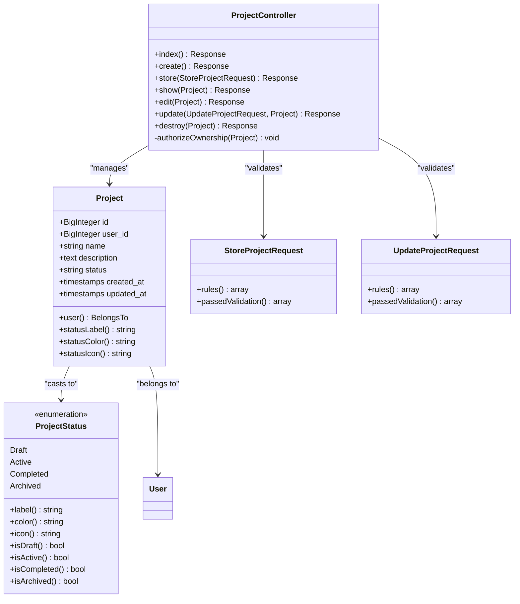
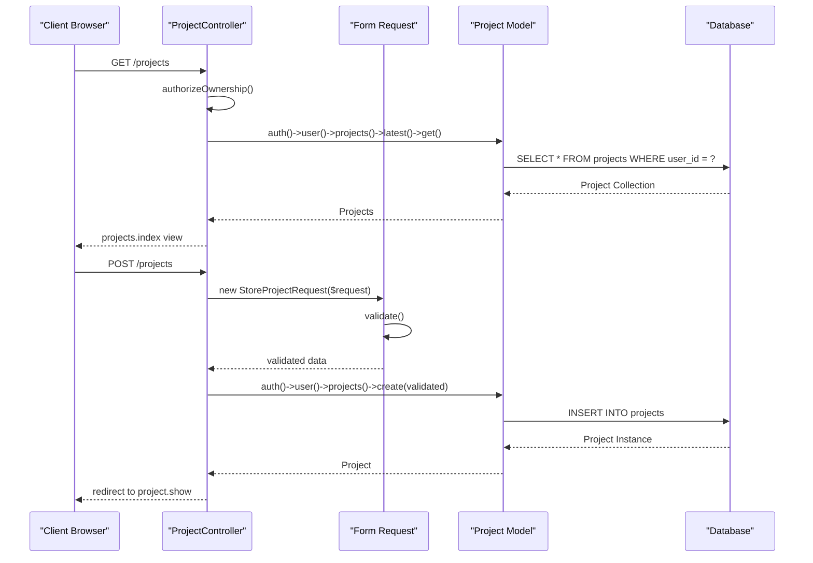
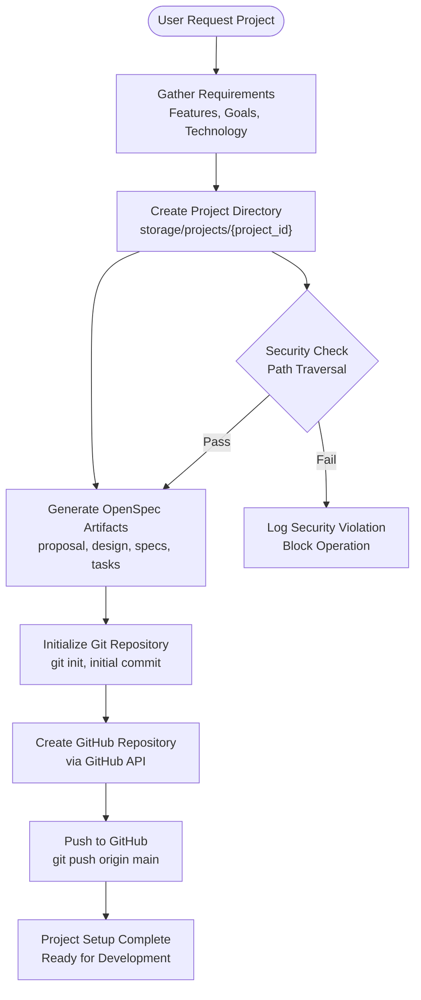
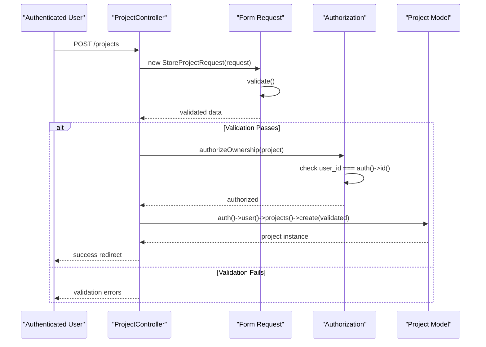
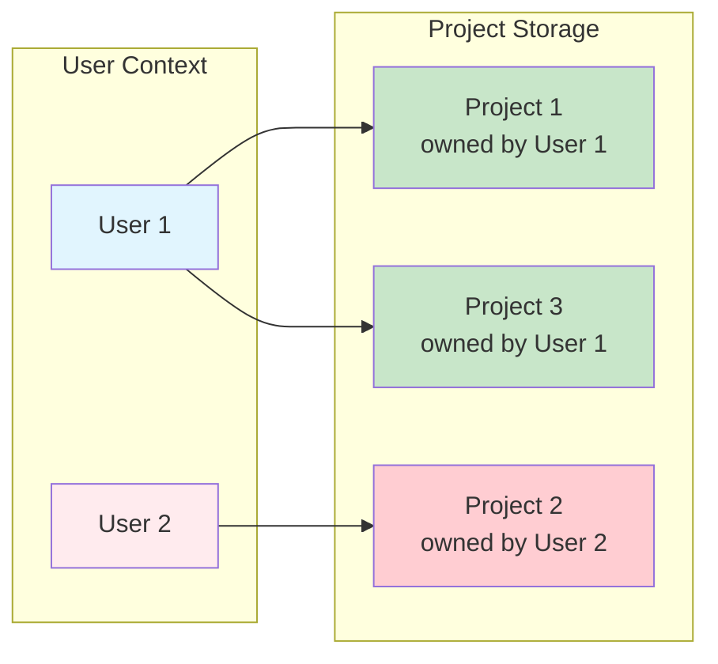
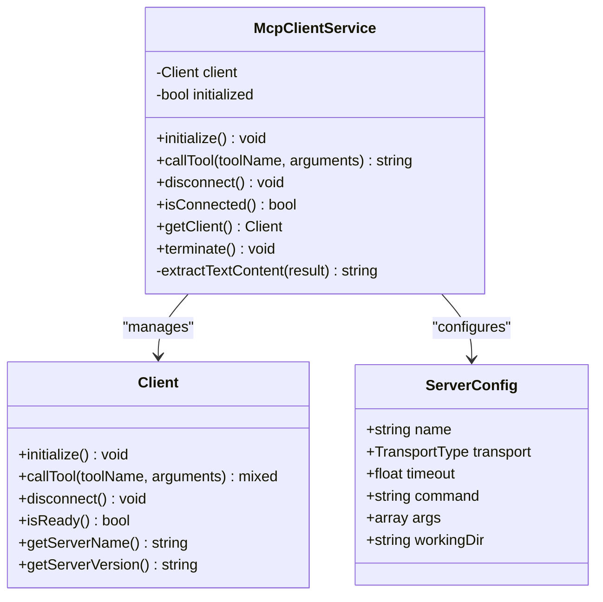
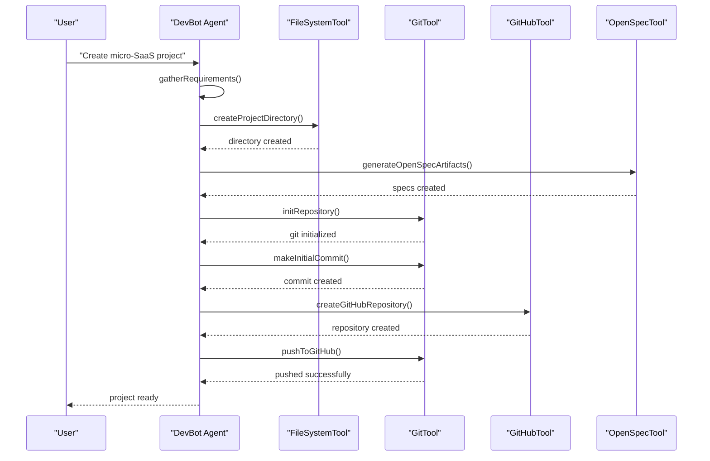
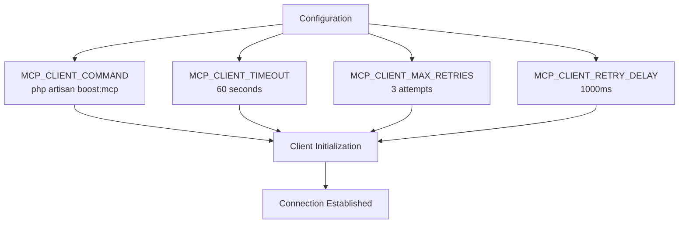

# Project Management System

<cite>
**Referenced Files in This Document**
- [README.md](file://README.md)
- [composer.json](file://composer.json)
- [routes/web.php](file://routes/web.php)
- [app/Http/Controllers/ProjectController.php](file://app/Http/Controllers/ProjectController.php)
- [app/Models/Project.php](file://app/Models/Project.php)
- [app/Enums/ProjectStatus.php](file://app/Enums/ProjectStatus.php)
- [database/migrations/2026_04_05_092017_create_projects_table.php](file://database/migrations/2026_04_05_092017_create_projects_table.php)
- [app/Http/Requests/StoreProjectRequest.php](file://app/Http/Requests/StoreProjectRequest.php)
- [app/Http/Requests/UpdateProjectRequest.php](file://app/Http/Requests/UpdateProjectRequest.php)
- [config/ai.php](file://config/ai.php)
- [app/Ai/Agents/DevBot.php](file://app/Ai/Agents/DevBot.php)
- [app/Services/McpClientService.php](file://app/Services/McpClientService.php)
</cite>

## Table of Contents
1. [Introduction](#introduction)
2. [System Architecture](#system-architecture)
3. [Project Management Core Components](#project-management-core-components)
4. [Data Model Architecture](#data-model-architecture)
5. [Project Lifecycle Management](#project-lifecycle-management)
6. [Security and Access Control](#security-and-access-control)
7. [Integration with AI Tools](#integration-with-ai-tools)
8. [Development Workflow](#development-workflow)
9. [Configuration Management](#configuration-management)
10. [Troubleshooting Guide](#troubleshooting-guide)

## Introduction

The Laravel Assistant project management system is an AI-powered development environment that enables users to create, manage, and track software projects through an intelligent chat interface. Built with Laravel 13 and PHP 8.3, this system provides comprehensive project lifecycle management capabilities including project creation, status tracking, user ownership, and integration with external development tools.

The system centers around DevBot, an AI agent that assists developers with programming questions while also enabling automated project creation workflows. Users can transform micro-SaaS ideas into structured projects with complete GitHub repository integration, automated file generation, and version control setup.

Key features include:
- **User Authentication**: Secure email/password authentication with Laravel Breeze
- **Project Creation**: Automated micro-SaaS project generation with GitHub integration
- **Project Tracking**: Status management (Draft, Active, Completed, Archived)
- **AI-Powered Assistance**: Intelligent project creation and development support
- **MCP Integration**: Enhanced capabilities through Laravel Boost MCP server
- **Security**: User isolation and path traversal protection

## System Architecture

The project management system follows a layered architecture pattern with clear separation of concerns:



**Diagram sources**
- [app/Http/Controllers/ProjectController.php:10-96](file://app/Http/Controllers/ProjectController.php#L10-L96)
- [app/Models/Project.php:11-34](file://app/Models/Project.php#L11-L34)
- [app/Enums/ProjectStatus.php:23-100](file://app/Enums/ProjectStatus.php#L23-L100)

**Section sources**
- [README.md:1-367](file://README.md#L1-L367)
- [composer.json:1-98](file://composer.json#L1-L98)

## Project Management Core Components

### Project Entity and Business Logic

The Project entity serves as the central domain object for project management, implementing Laravel's Eloquent ORM patterns with comprehensive validation and relationship management.



**Diagram sources**
- [app/Models/Project.php:11-34](file://app/Models/Project.php#L11-L34)
- [app/Enums/ProjectStatus.php:23-100](file://app/Enums/ProjectStatus.php#L23-L100)
- [app/Http/Controllers/ProjectController.php:10-96](file://app/Http/Controllers/ProjectController.php#L10-L96)
- [app/Http/Requests/StoreProjectRequest.php:10-25](file://app/Http/Requests/StoreProjectRequest.php#L10-L25)
- [app/Http/Requests/UpdateProjectRequest.php:10-25](file://app/Http/Requests/UpdateProjectRequest.php#L10-L25)

### Controller Implementation Pattern

The ProjectController implements the standard CRUD operations with comprehensive authorization and validation:



**Diagram sources**
- [app/Http/Controllers/ProjectController.php:15-39](file://app/Http/Controllers/ProjectController.php#L15-L39)
- [app/Http/Requests/StoreProjectRequest.php:17-24](file://app/Http/Requests/StoreProjectRequest.php#L17-L24)

**Section sources**
- [app/Http/Controllers/ProjectController.php:10-96](file://app/Http/Controllers/ProjectController.php#L10-L96)
- [app/Models/Project.php:11-34](file://app/Models/Project.php#L11-L34)
- [app/Enums/ProjectStatus.php:23-100](file://app/Enums/ProjectStatus.php#L23-L100)

## Data Model Architecture

### Database Schema Design

The project management system uses a normalized relational design optimized for user isolation and efficient querying:

```mermaid
erDiagram
USERS {
bigint id PK
string name
string email
timestamp email_verified_at
string password
remember_token
timestamps created_at
timestamps updated_at
}
PROJECTS {
bigint id PK
bigint user_id FK
string name
text description
string status
timestamps created_at
timestamps updated_at
}
CONVERSATIONS {
bigint id PK
bigint user_id FK
string title
timestamps created_at
timestamps updated_at
}
MESSAGES {
bigint id PK
bigint conversation_id FK
longtext content
string role
timestamps created_at
timestamps updated_at
}
USERS ||--o{ PROJECTS : "owns"
USERS ||--o{ CONVERSATIONS : "creates"
CONVERSATIONS ||--o{ MESSAGES : "contains"
```

**Diagram sources**
- [database/migrations/2026_04_05_092017_create_projects_table.php:14-23](file://database/migrations/2026_04_05_092017_create_projects_table.php#L14-L23)
- [database/migrations/0001_01_01_000000_create_users_table.php](file://database/migrations/0001_01_01_000000_create_users_table.php)
- [database/migrations/2026_04_02_123216_create_conversations_table.php](file://database/migrations/2026_04_02_123216_create_conversations_table.php)
- [database/migrations/2026_04_02_123238_create_messages_table.php](file://database/migrations/2026_04_02_123238_create_messages_table.php)

### Status Management System

The ProjectStatus enumeration provides type-safe status management with comprehensive metadata:

| Status | Label | Color | Icon | Description |
|--------|-------|-------|------|-------------|
| draft | Draft | gray | document | Initial project state |
| active | Active | blue | spark | Project is being worked on |
| completed | Completed | green | check | Project development finished |
| archived | Archived | purple | archive | Project is inactive |

**Section sources**
- [database/migrations/2026_04_05_092017_create_projects_table.php:14-23](file://database/migrations/2026_04_05_092017_create_projects_table.php#L14-L23)
- [app/Enums/ProjectStatus.php:23-100](file://app/Enums/ProjectStatus.php#L23-L100)

## Project Lifecycle Management

### Project Creation Workflow

The system supports automated project creation from user ideas to fully functional repositories:



**Diagram sources**
- [app/Ai/Agents/DevBot.php:65-74](file://app/Ai/Agents/DevBot.php#L65-L74)
- [config/ai.php:52-56](file://config/ai.php#L52-L56)

### Validation and Authorization

The system implements comprehensive validation and authorization patterns:



**Diagram sources**
- [app/Http/Controllers/ProjectController.php:33-39](file://app/Http/Controllers/ProjectController.php#L33-L39)
- [app/Http/Requests/StoreProjectRequest.php:17-24](file://app/Http/Requests/StoreProjectRequest.php#L17-L24)

**Section sources**
- [app/Http/Controllers/ProjectController.php:87-96](file://app/Http/Controllers/ProjectController.php#L87-L96)
- [app/Http/Requests/StoreProjectRequest.php:10-25](file://app/Http/Requests/StoreProjectRequest.php#L10-L25)
- [app/Http/Requests/UpdateProjectRequest.php:10-25](file://app/Http/Requests/UpdateProjectRequest.php#L10-L25)

## Security and Access Control

### User Isolation and Ownership

The system implements strict user isolation through database relationships and controller authorization:



**Diagram sources**
- [app/Http/Controllers/ProjectController.php:92-95](file://app/Http/Controllers/ProjectController.php#L92-L95)

### Path Traversal Protection

All file operations are scoped to the `storage/projects/` directory with comprehensive path validation:

| Operation | Security Measure | Validation |
|-----------|------------------|------------|
| File Creation | Directory Restriction | `storage/projects/{user_id}/` |
| File Reading | Path Normalization | `realpath()` validation |
| File Writing | Permission Checking | `is_writable()` checks |
| Git Operations | Working Directory | `base_path()` restriction |

**Section sources**
- [app/Http/Controllers/ProjectController.php:92-95](file://app/Http/Controllers/ProjectController.php#L92-L95)
- [config/ai.php:52-56](file://config/ai.php#L52-L56)

## Integration with AI Tools

### MCP Client Service Architecture

The McpClientService provides robust connection management for Laravel Boost MCP integration:



**Diagram sources**
- [app/Services/McpClientService.php:20-279](file://app/Services/McpClientService.php#L20-L279)

### AI Agent Capabilities

DevBot integrates multiple specialized tools for comprehensive project assistance:

| Tool Category | Tool Name | Function | Security Level |
|---------------|-----------|----------|----------------|
| Database | DatabaseQueryTool | Execute read-only SQL queries | Low Risk |
| Database | DatabaseSchemaTool | Inspect table structure | Low Risk |
| Documentation | SearchDocsTool | Search Laravel documentation | No Risk |
| Development | TinkerTool | Execute PHP code | Medium Risk |
| File System | FileSystemTool | Secure file operations | High Risk |
| Version Control | GitTool | Repository management | Medium Risk |
| GitHub | GitHubTool | Remote repository creation | Medium Risk |
| Specification | OpenSpecTool | Project workflow guidance | No Risk |

**Section sources**
- [app/Ai/Agents/DevBot.php:123-135](file://app/Ai/Agents/DevBot.php#L123-L135)
- [app/Services/McpClientService.php:48-96](file://app/Services/McpClientService.php#L48-L96)

## Development Workflow

### Project Creation Pipeline

The automated project creation process follows a structured workflow:



**Diagram sources**
- [app/Ai/Agents/DevBot.php:65-74](file://app/Ai/Agents/DevBot.php#L65-L74)

### Route Configuration

The system uses Laravel's route model binding for automatic authorization:

| Route | Method | Action | Description |
|-------|--------|--------|-------------|
| `/projects` | GET | `ProjectController@index` | List user's projects |
| `/projects/create` | GET | `ProjectController@create` | Show creation form |
| `/projects` | POST | `ProjectController@store` | Create new project |
| `/projects/{project}` | GET | `ProjectController@show` | Show project details |
| `/projects/{project}/edit` | GET | `ProjectController@edit` | Show edit form |
| `/projects/{project}` | PUT/PATCH | `ProjectController@update` | Update project |
| `/projects/{project}` | DELETE | `ProjectController@destroy` | Delete project |

**Section sources**
- [routes/web.php:15-26](file://routes/web.php#L15-L26)

## Configuration Management

### Environment Configuration

The system supports multiple AI providers through centralized configuration:

| Provider | Environment Variable | Default URL | Use Case |
|----------|---------------------|-------------|----------|
| Anthropic | ANTHROPIC_API_KEY | api.anthropic.com | General AI tasks |
| OpenAI | OPENAI_API_KEY | api.openai.com | Creative tasks |
| Gemini | GEMINI_API_KEY | gemini.googleapis.com | Multimodal tasks |
| Z.ai Proxy | Z_API_KEY | api.z.ai | Production stability |
| Azure OpenAI | AZURE_OPENAI_API_KEY | Custom | Enterprise deployment |

### MCP Client Configuration



**Diagram sources**
- [app/Services/McpClientService.php:55-76](file://app/Services/McpClientService.php#L55-L76)

**Section sources**
- [config/ai.php:69-152](file://config/ai.php#L69-L152)
- [app/Services/McpClientService.php:55-96](file://app/Services/McpClientService.php#L55-L96)

## Troubleshooting Guide

### Common Issues and Solutions

| Issue | Symptoms | Solution |
|-------|----------|----------|
| Project Access Denied | 403 Forbidden error | Verify user ownership and authentication |
| File Operation Failure | Permission denied errors | Check storage/projects/ permissions |
| MCP Connection Issues | Tool call failures | Verify Laravel Boost server is running |
| Validation Errors | Form submission rejected | Check required fields and data types |
| GitHub Integration | Repository creation fails | Verify GitHub token permissions |

### Development Commands

```bash
# Development server with all services
composer run dev

# Database migration
php artisan migrate

# Test execution
composer run test

# Asset building
npm run build

# Route listing
php artisan route:list
```

### Logging and Monitoring

The system implements comprehensive logging for debugging and monitoring:

- **Application Logs**: Standard Laravel logging with context
- **MCP Client Logs**: Connection and tool call activity
- **Security Logs**: Path traversal attempts and access violations
- **AI Interaction Logs**: Conversation history and tool usage

**Section sources**
- [README.md:324-367](file://README.md#L324-L367)
- [app/Services/McpClientService.php:81-95](file://app/Services/McpClientService.php#L81-L95)