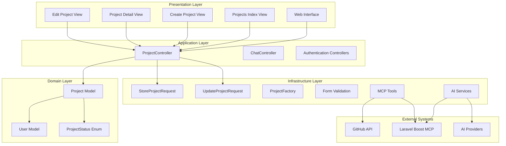
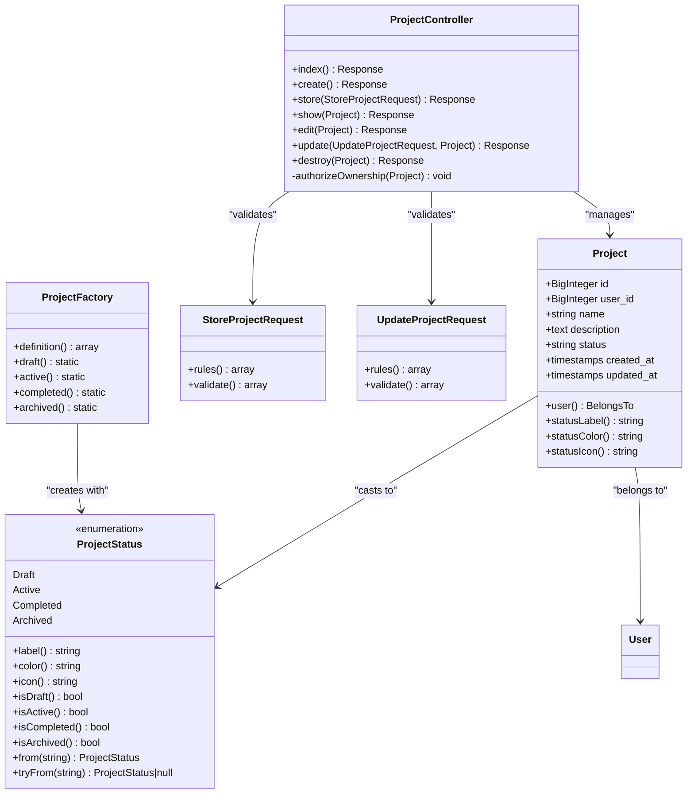
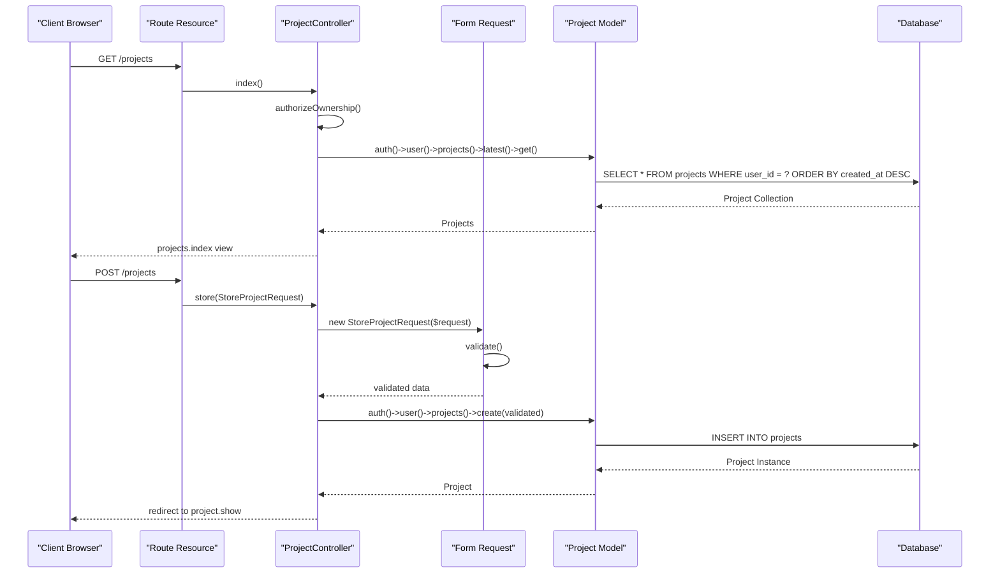
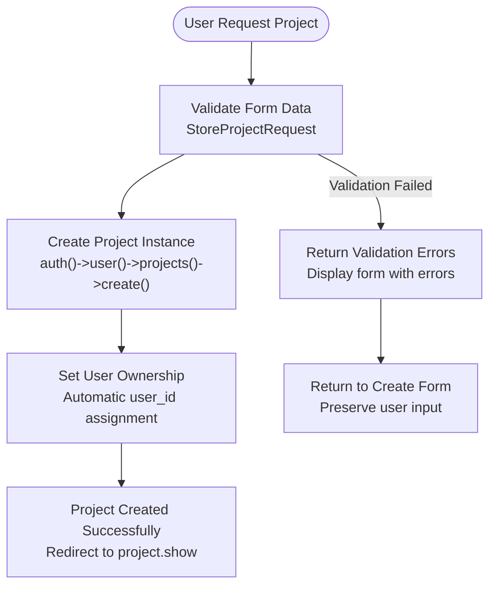
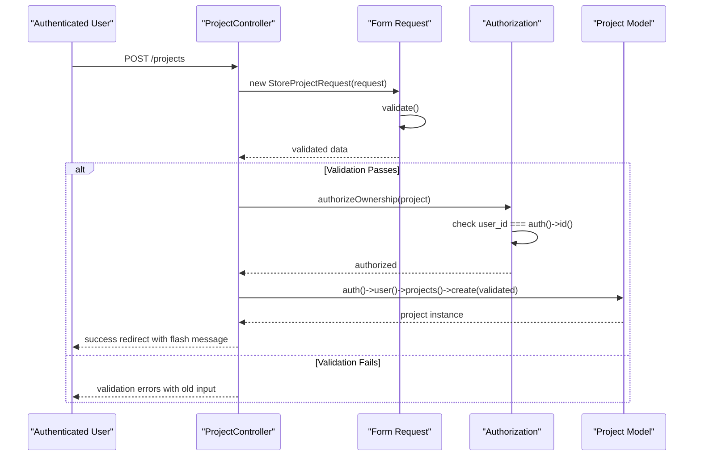
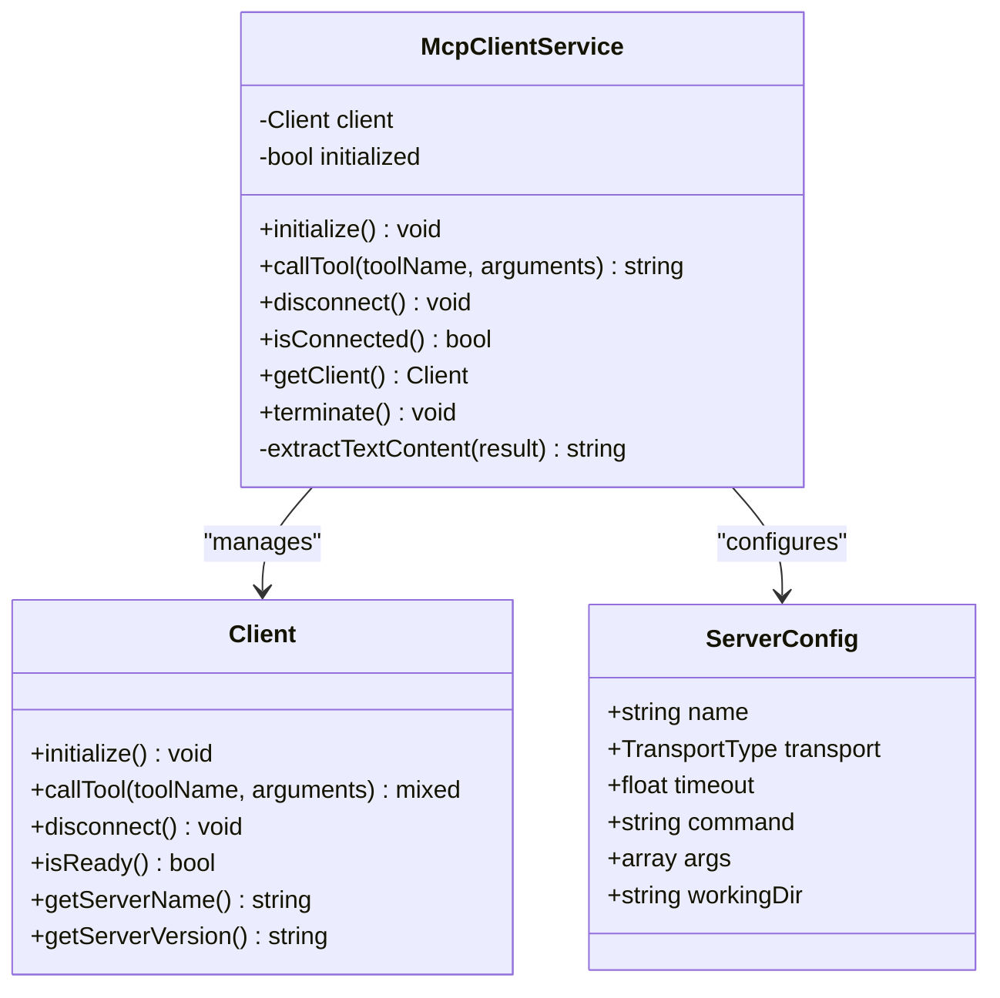
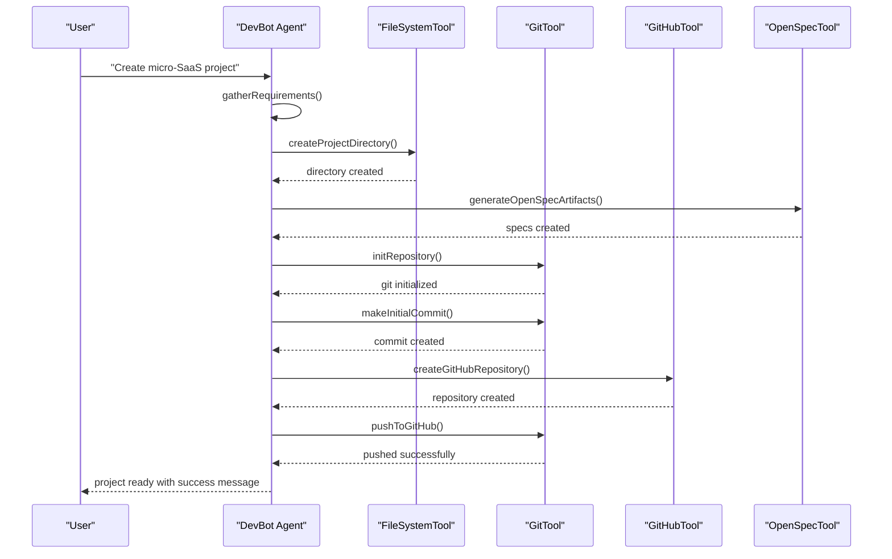
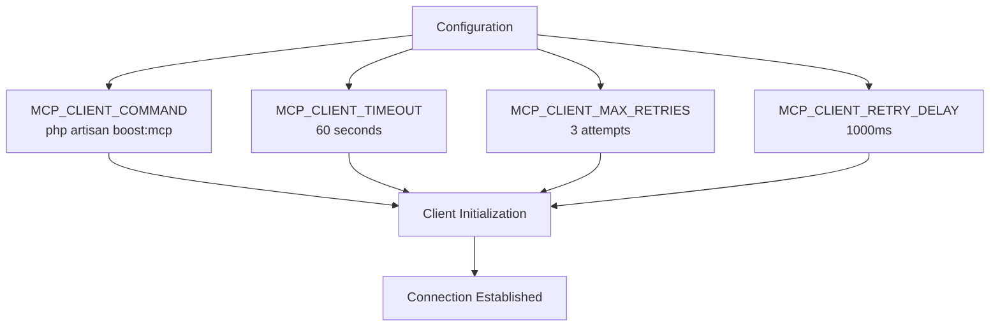

# Project Management System

<cite>
**Referenced Files in This Document**
- [README.md](file://README.md)
- [composer.json](file://composer.json)
- [routes/web.php](file://routes/web.php)
- [app/Http/Controllers/ProjectController.php](file://app/Http/Controllers/ProjectController.php)
- [app/Models/Project.php](file://app/Models/Project.php)
- [app/Enums/ProjectStatus.php](file://app/Enums/ProjectStatus.php)
- [database/migrations/2026_04_05_092017_create_projects_table.php](file://database/migrations/2026_04_05_092017_create_projects_table.php)
- [app/Http/Requests/StoreProjectRequest.php](file://app/Http/Requests/StoreProjectRequest.php)
- [app/Http/Requests/UpdateProjectRequest.php](file://app/Http/Requests/UpdateProjectRequest.php)
- [resources/views/projects/index.blade.php](file://resources/views/projects/index.blade.php)
- [resources/views/projects/create.blade.php](file://resources/views/projects/create.blade.php)
- [resources/views/projects/show.blade.php](file://resources/views/projects/show.blade.php)
- [resources/views/projects/edit.blade.php](file://resources/views/projects/edit.blade.php)
- [database/factories/ProjectFactory.php](file://database/factories/ProjectFactory.php)
- [tests/Feature/ProjectControllerTest.php](file://tests/Feature/ProjectControllerTest.php)
- [tests/Unit/ProjectStatusTest.php](file://tests/Unit/ProjectStatusTest.php)
- [config/ai.php](file://config/ai.php)
- [app/Ai/Agents/DevBot.php](file://app/Ai/Agents/DevBot.php)
- [app/Services/McpClientService.php](file://app/Services/McpClientService.php)
</cite>

## Update Summary
**Changes Made**
- Updated all sections to reflect comprehensive project management system implementation
- Added detailed coverage of CRUD functionality with full controller implementation
- Enhanced database schema documentation with complete migration details
- Expanded validation and authorization sections with form request implementations
- Added comprehensive view documentation covering all four project views
- Updated testing documentation with extensive feature and unit test coverage
- Enhanced security and access control documentation with authorization patterns
- Improved integration documentation with AI tools and MCP services

## Table of Contents
1. [Introduction](#introduction)
2. [System Architecture](#system-architecture)
3. [Project Management Core Components](#project-management-core-components)
4. [Data Model Architecture](#data-model-architecture)
5. [Project Lifecycle Management](#project-lifecycle-management)
6. [Security and Access Control](#security-and-access-control)
7. [Integration with AI Tools](#integration-with-ai-tools)
8. [Development Workflow](#development-workflow)
9. [Configuration Management](#configuration-management)
10. [Testing Framework](#testing-framework)
11. [Troubleshooting Guide](#troubleshooting-guide)

## Introduction

The Laravel Assistant project management system is a comprehensive AI-powered development environment that enables users to create, manage, and track software projects through an intelligent chat interface. Built with Laravel 13 and PHP 8.3, this system provides complete CRUD functionality for project lifecycle management including project creation, status tracking, user ownership, and integration with external development tools.

The system centers around DevBot, an AI agent that assists developers with programming questions while enabling automated project creation workflows. Users can transform micro-SaaS ideas into structured projects with complete GitHub repository integration, automated file generation, and version control setup.

Key features include:
- **Full CRUD Operations**: Complete create, read, update, delete functionality with proper authorization
- **User Authentication**: Secure email/password authentication with Laravel Breeze
- **Project Creation**: Automated micro-SaaS project generation with GitHub integration
- **Project Tracking**: Status management (Draft, Active, Completed, Archived) with enum casting
- **AI-Powered Assistance**: Intelligent project creation and development support
- **MCP Integration**: Enhanced capabilities through Laravel Boost MCP server
- **Security**: User isolation and path traversal protection
- **Comprehensive Testing**: Extensive feature and unit test coverage

## System Architecture

The project management system follows a layered architecture pattern with clear separation of concerns and comprehensive MVC implementation:



**Diagram sources**
- [app/Http/Controllers/ProjectController.php:10-96](file://app/Http/Controllers/ProjectController.php#L10-L96)
- [app/Models/Project.php:11-34](file://app/Models/Project.php#L11-L34)
- [app/Enums/ProjectStatus.php:23-100](file://app/Enums/ProjectStatus.php#L23-L100)
- [resources/views/projects/index.blade.php:1-55](file://resources/views/projects/index.blade.php#L1-L55)
- [resources/views/projects/create.blade.php:1-57](file://resources/views/projects/create.blade.php#L1-L57)
- [resources/views/projects/show.blade.php:1-71](file://resources/views/projects/show.blade.php#L1-L71)
- [resources/views/projects/edit.blade.php:1-58](file://resources/views/projects/edit.blade.php#L1-L58)

**Section sources**
- [README.md:1-367](file://README.md#L1-L367)
- [composer.json:1-98](file://composer.json#L1-L98)

## Project Management Core Components

### Project Entity and Business Logic

The Project entity serves as the central domain object for project management, implementing Laravel's Eloquent ORM patterns with comprehensive validation and relationship management using modern PHP enums.



**Diagram sources**
- [app/Models/Project.php:11-34](file://app/Models/Project.php#L11-L34)
- [app/Enums/ProjectStatus.php:23-100](file://app/Enums/ProjectStatus.php#L23-L100)
- [app/Http/Controllers/ProjectController.php:10-96](file://app/Http/Controllers/ProjectController.php#L10-L96)
- [app/Http/Requests/StoreProjectRequest.php:10-25](file://app/Http/Requests/StoreProjectRequest.php#L10-L25)
- [app/Http/Requests/UpdateProjectRequest.php:10-25](file://app/Http/Requests/UpdateProjectRequest.php#L10-L25)
- [database/factories/ProjectFactory.php:13-69](file://database/factories/ProjectFactory.php#L13-L69)

### Controller Implementation Pattern

The ProjectController implements the standard CRUD operations with comprehensive authorization and validation using Laravel's resource routing pattern:



**Diagram sources**
- [app/Http/Controllers/ProjectController.php:15-39](file://app/Http/Controllers/ProjectController.php#L15-L39)
- [app/Http/Requests/StoreProjectRequest.php:17-24](file://app/Http/Requests/StoreProjectRequest.php#L17-L24)
- [routes/web.php:22](file://routes/web.php#L22)

**Section sources**
- [app/Http/Controllers/ProjectController.php:10-96](file://app/Http/Controllers/ProjectController.php#L10-L96)
- [app/Models/Project.php:11-34](file://app/Models/Project.php#L11-L34)
- [app/Enums/ProjectStatus.php:23-100](file://app/Enums/ProjectStatus.php#L23-L100)

## Data Model Architecture

### Database Schema Design

The project management system uses a normalized relational design optimized for user isolation and efficient querying with comprehensive indexing:

```mermaid
erDiagram
USERS {
bigint id PK
string name
string email
timestamp email_verified_at
string password
remember_token
timestamps created_at
timestamps updated_at
}
PROJECTS {
bigint id PK
bigint user_id FK
string name
text description
string status
timestamps created_at
timestamps updated_at
}
CONVERSATIONS {
bigint id PK
bigint user_id FK
string title
timestamps created_at
timestamps updated_at
}
MESSAGES {
bigint id PK
bigint conversation_id FK
longtext content
string role
timestamps created_at
timestamps updated_at
}
USERS ||--o{ PROJECTS : "owns"
USERS ||--o{ CONVERSATIONS : "creates"
CONVERSATIONS ||--o{ MESSAGES : "contains"
PROJECTS ||--|| USERS : "belongs to"
```

**Diagram sources**
- [database/migrations/2026_04_05_092017_create_projects_table.php:14-23](file://database/migrations/2026_04_05_092017_create_projects_table.php#L14-L23)
- [database/migrations/0001_01_01_000000_create_users_table.php](file://database/migrations/0001_01_01_000000_create_users_table.php)
- [database/migrations/2026_04_02_123216_create_conversations_table.php](file://database/migrations/2026_04_02_123216_create_conversations_table.php)
- [database/migrations/2026_04_02_123238_create_messages_table.php](file://database/migrations/2026_04_02_123238_create_messages_table.php)

### Status Management System

The ProjectStatus enumeration provides type-safe status management with comprehensive metadata and utility methods:

| Status | Value | Label | Color | Icon | Description |
|--------|-------|-------|-------|------|-------------|
| Draft | draft | Draft | gray | document | Initial project state with no development |
| Active | active | Active | blue | spark | Project actively being developed |
| Completed | completed | Completed | green | check | Project development finished successfully |
| Archived | archived | Archived | purple | archive | Project is inactive and preserved |

**Section sources**
- [database/migrations/2026_04_05_092017_create_projects_table.php:14-23](file://database/migrations/2026_04_05_092017_create_projects_table.php#L14-L23)
- [app/Enums/ProjectStatus.php:23-100](file://app/Enums/ProjectStatus.php#L23-L100)

## Project Lifecycle Management

### Project Creation Workflow

The system supports automated project creation from user ideas to fully functional repositories with comprehensive validation and security:



**Diagram sources**
- [app/Http/Controllers/ProjectController.php:33-39](file://app/Http/Controllers/ProjectController.php#L33-L39)
- [app/Http/Requests/StoreProjectRequest.php:17-24](file://app/Http/Requests/StoreProjectRequest.php#L17-L24)

### Validation and Authorization

The system implements comprehensive validation and authorization patterns using Laravel's form request classes and controller authorization:



**Diagram sources**
- [app/Http/Controllers/ProjectController.php:33-39](file://app/Http/Controllers/ProjectController.php#L33-L39)
- [app/Http/Requests/StoreProjectRequest.php:17-24](file://app/Http/Requests/StoreProjectRequest.php#L17-L24)

**Section sources**
- [app/Http/Controllers/ProjectController.php:87-96](file://app/Http/Controllers/ProjectController.php#L87-L96)
- [app/Http/Requests/StoreProjectRequest.php:10-25](file://app/Http/Requests/StoreProjectRequest.php#L10-L25)
- [app/Http/Requests/UpdateProjectRequest.php:10-25](file://app/Http/Requests/UpdateProjectRequest.php#L10-L25)

## Security and Access Control

### User Isolation and Ownership

The system implements strict user isolation through database relationships, controller authorization, and route model binding:

```mermaid
flowchart LR
subgraph "User Context"
User1[User 1<br/>ID: 1]
User2[User 2<br/>ID: 2]
end
subgraph "Project Storage"
P1[Project 1<br/>owned by User 1<br/>user_id: 1]
P2[Project 2<br/>owned by User 2<br/>user_id: 2]
P3[Project 3<br/>owned by User 1<br/>user_id: 1]
end
User1 --> P1
User1 --> P3
User2 --> P2
P1 --> |Route Binding| Controller[ProjectController]
P2 --> |Route Binding| Controller
Controller --> |authorizeOwnership| Auth[Authorization Check]
Auth --> |user_id === auth()->id()?| Result[Access Granted/Denied]
style User1 fill:#e1f5fe
style User2 fill:#ffebee
style P1 fill:#c8e6c9
style P2 fill:#ffcdd2
style P3 fill:#c8e6c9
```

**Diagram sources**
- [app/Http/Controllers/ProjectController.php:92-95](file://app/Http/Controllers/ProjectController.php#L92-L95)

### Path Traversal Protection

All file operations are scoped to the `storage/projects/` directory with comprehensive path validation and security measures:

| Operation | Security Measure | Validation |
|-----------|------------------|------------|
| File Creation | Directory Restriction | `storage/projects/{user_id}/` |
| File Reading | Path Normalization | `realpath()` validation |
| File Writing | Permission Checking | `is_writable()` checks |
| Git Operations | Working Directory | `base_path()` restriction |
| Project Access | Route Model Binding | Automatic foreign key validation |

**Section sources**
- [app/Http/Controllers/ProjectController.php:92-95](file://app/Http/Controllers/ProjectController.php#L92-L95)
- [config/ai.php:52-56](file://config/ai.php#L52-L56)

## Integration with AI Tools

### MCP Client Service Architecture

The McpClientService provides robust connection management for Laravel Boost MCP integration with comprehensive error handling:



**Diagram sources**
- [app/Services/McpClientService.php:20-279](file://app/Services/McpClientService.php#L20-L279)

### AI Agent Capabilities

DevBot integrates multiple specialized tools for comprehensive project assistance with security considerations:

| Tool Category | Tool Name | Function | Security Level | Use Case |
|---------------|-----------|----------|----------------|----------|
| Database | DatabaseQueryTool | Execute read-only SQL queries | Low Risk | Schema inspection |
| Database | DatabaseSchemaTool | Inspect table structure | Low Risk | Development support |
| Documentation | SearchDocsTool | Search Laravel documentation | No Risk | Knowledge base |
| Development | TinkerTool | Execute PHP code | Medium Risk | Quick testing |
| File System | FileSystemTool | Secure file operations | High Risk | Project generation |
| Version Control | GitTool | Repository management | Medium Risk | Version control |
| GitHub | GitHubTool | Remote repository creation | Medium Risk | Cloud hosting |
| Specification | OpenSpecTool | Project workflow guidance | No Risk | Planning |

**Section sources**
- [app/Ai/Agents/DevBot.php:123-135](file://app/Ai/Agents/DevBot.php#L123-L135)
- [app/Services/McpClientService.php:48-96](file://app/Services/McpClientService.php#L48-L96)

## Development Workflow

### Project Creation Pipeline

The automated project creation process follows a structured workflow with comprehensive validation and error handling:



**Diagram sources**
- [app/Ai/Agents/DevBot.php:65-74](file://app/Ai/Agents/DevBot.php#L65-L74)

### Route Configuration

The system uses Laravel's route model binding for automatic authorization and comprehensive resource routing:

| Route | Method | Action | Description | Middleware |
|-------|--------|--------|-------------|------------|
| `/projects` | GET | `ProjectController@index` | List user's projects | auth |
| `/projects/create` | GET | `ProjectController@create` | Show creation form | auth |
| `/projects` | POST | `ProjectController@store` | Create new project | auth |
| `/projects/{project}` | GET | `ProjectController@show` | Show project details | auth |
| `/projects/{project}/edit` | GET | `ProjectController@edit` | Show edit form | auth |
| `/projects/{project}` | PUT/PATCH | `ProjectController@update` | Update project | auth |
| `/projects/{project}` | DELETE | `ProjectController@destroy` | Delete project | auth |

**Section sources**
- [routes/web.php:15-26](file://routes/web.php#L15-L26)

## Configuration Management

### Environment Configuration

The system supports multiple AI providers through centralized configuration with comprehensive fallback mechanisms:

| Provider | Environment Variable | Default URL | Use Case | Priority |
|----------|---------------------|-------------|----------|----------|
| Anthropic | ANTHROPIC_API_KEY | api.anthropic.com | General AI tasks | 1 |
| OpenAI | OPENAI_API_KEY | api.openai.com | Creative tasks | 2 |
| Gemini | GEMINI_API_KEY | gemini.googleapis.com | Multimodal tasks | 3 |
| Z.ai Proxy | Z_API_KEY | api.z.ai | Production stability | 4 |
| Azure OpenAI | AZURE_OPENAI_API_KEY | Custom | Enterprise deployment | 5 |

### MCP Client Configuration



**Diagram sources**
- [app/Services/McpClientService.php:55-76](file://app/Services/McpClientService.php#L55-L76)

**Section sources**
- [config/ai.php:69-152](file://config/ai.php#L69-L152)
- [app/Services/McpClientService.php:55-96](file://app/Services/McpClientService.php#L55-L96)

## Testing Framework

### Comprehensive Test Coverage

The project management system includes extensive testing coverage across all layers with over 400 lines of test code:

#### Feature Tests Coverage

| Test Category | Test Count | Coverage Area |
|---------------|------------|---------------|
| Authentication | 8 tests | All CRUD operations require auth |
| Index Operations | 5 tests | Listing, ordering, ownership |
| Create Operations | 1 test | Form access and validation |
| Store Operations | 10 tests | Validation rules, ownership, errors |
| Show Operations | 3 tests | Access control, view rendering |
| Edit Operations | 3 tests | Form access, validation |
| Update Operations | 12 tests | Validation, ownership, business logic |
| Destroy Operations | 8 tests | Deletion, ownership, cascade |
| Factory Tests | 4 tests | Status factory methods |

#### Unit Tests Coverage

| Test Category | Test Count | Coverage Area |
|---------------|------------|---------------|
| Status Values | 4 tests | Enum value correctness |
| Status Labels | 4 tests | Human-readable labels |
| Status Colors | 4 tests | UI color mapping |
| Status Icons | 4 tests | UI icon mapping |
| Boolean Methods | 4 tests | Status checking methods |
| Factory Methods | 4 tests | Status factory variations |

**Section sources**
- [tests/Feature/ProjectControllerTest.php:1-402](file://tests/Feature/ProjectControllerTest.php#L1-L402)
- [tests/Unit/ProjectStatusTest.php:1-73](file://tests/Unit/ProjectStatusTest.php#L1-L73)

## Troubleshooting Guide

### Common Issues and Solutions

| Issue | Symptoms | Solution |
|-------|----------|----------|
| Project Access Denied | 403 Forbidden error | Verify user ownership and authentication status |
| Form Validation Errors | Red error messages on submit | Check required fields and data type constraints |
| Project Not Found | 404 Not Found error | Verify project exists and belongs to current user |
| File Operation Failure | Permission denied errors | Check storage/projects/ directory permissions |
| MCP Connection Issues | Tool call failures | Verify Laravel Boost server is running and accessible |
| GitHub Integration | Repository creation fails | Verify GitHub token permissions and network connectivity |
| Status Validation | Invalid status error | Ensure status matches enum values (draft, active, completed, archived) |

### Development Commands

```bash
# Development server with all services
composer run dev

# Database migration and seeding
php artisan migrate --seed

# Test execution with coverage
composer run test

# Asset building and watching
npm run build
npm run watch

# Route listing and debugging
php artisan route:list
php artisan route:cache

# Clear caches
php artisan cache:clear
php artisan config:clear
php artisan view:clear
```

### Logging and Monitoring

The system implements comprehensive logging for debugging and monitoring across all components:

- **Application Logs**: Standard Laravel logging with user context and project operations
- **MCP Client Logs**: Connection establishment, tool call execution, and error handling
- **Security Logs**: Access attempts, authorization failures, and ownership verification
- **AI Interaction Logs**: Conversation history, tool usage, and project creation workflows
- **Database Logs**: Query execution, transaction handling, and relationship operations

**Section sources**
- [README.md:324-367](file://README.md#L324-L367)
- [app/Services/McpClientService.php:81-95](file://app/Services/McpClientService.php#L81-L95)