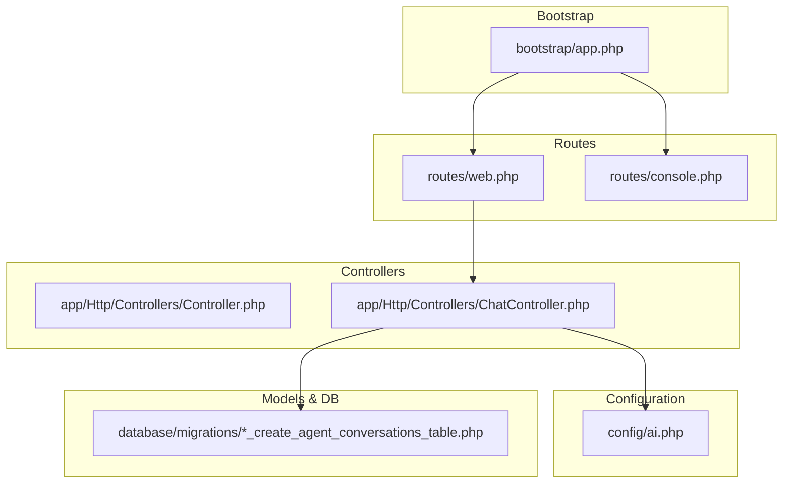
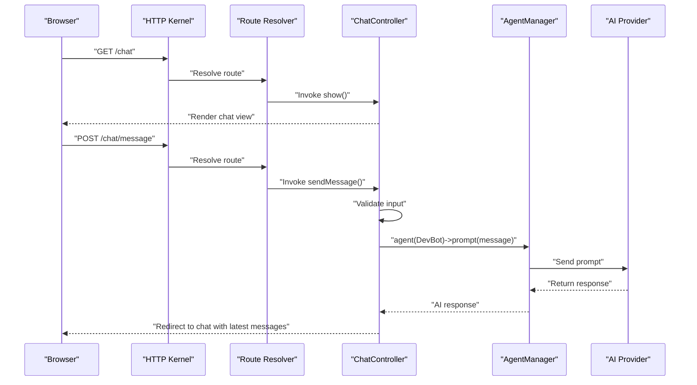
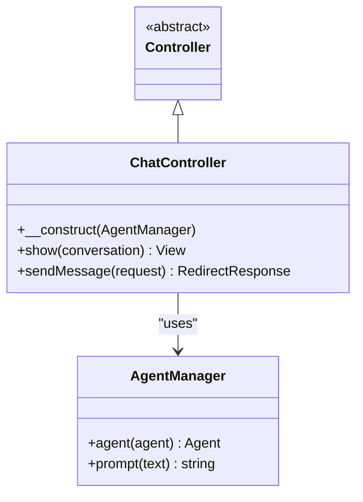
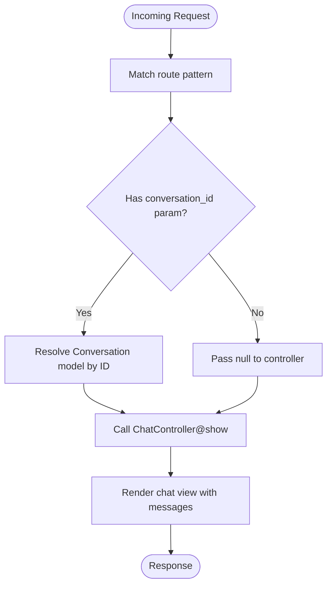
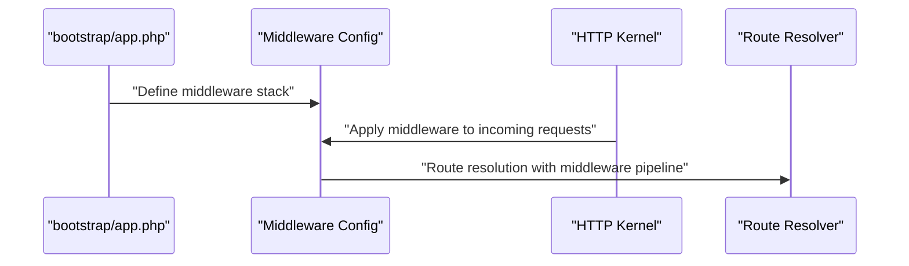
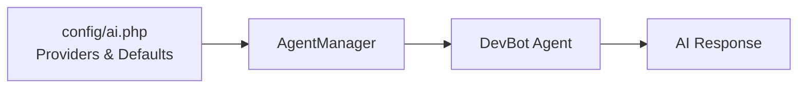
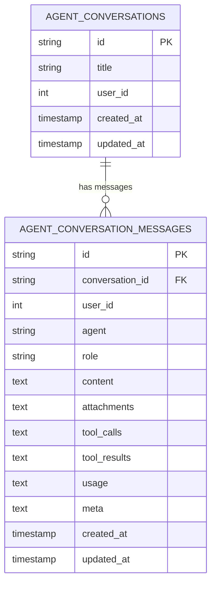
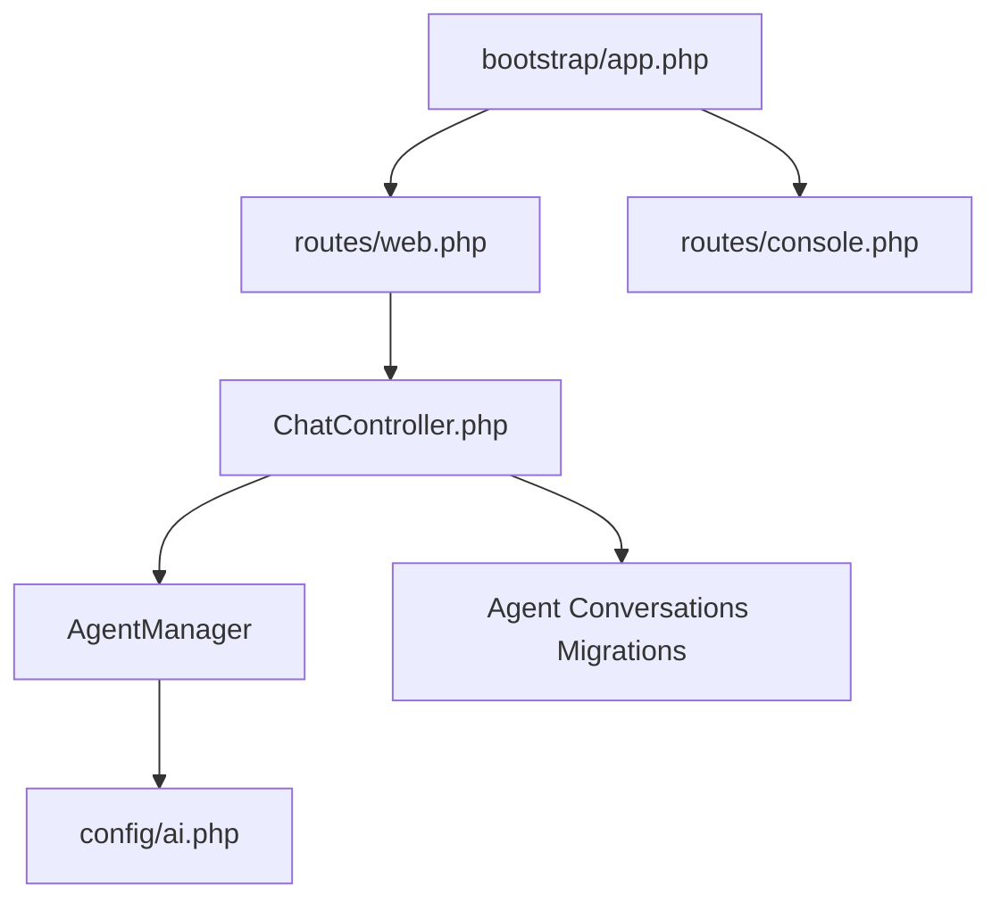

# Routing

<cite>
**Referenced Files in This Document**
- [web.php](file://routes/web.php)
- [console.php](file://routes/console.php)
- [app.php](file://bootstrap/app.php)
- [Controller.php](file://app/Http/Controllers/Controller.php)
- [ChatController.php](file://app/Http/Controllers/ChatController.php)
- [AppServiceProvider.php](file://app/Providers/AppServiceProvider.php)
- [ai.php](file://config/ai.php)
- [2026_04_02_115916_create_agent_conversations_table.php](file://database/migrations/2026_04_02_115916_create_agent_conversations_table.php)
- [composer.json](file://composer.json)
</cite>

## Table of Contents
1. [Introduction](#introduction)
2. [Project Structure](#project-structure)
3. [Core Components](#core-components)
4. [Architecture Overview](#architecture-overview)
5. [Detailed Component Analysis](#detailed-component-analysis)
6. [Dependency Analysis](#dependency-analysis)
7. [Performance Considerations](#performance-considerations)
8. [Troubleshooting Guide](#troubleshooting-guide)
9. [Conclusion](#conclusion)

## Introduction
This document explains routing in the Laravel Assistant project, focusing on how web and console routes are configured, how controllers handle requests, and how AI-enabled endpoints integrate with the Laravel service container. It covers route-to-controller mapping, named routes, and model binding patterns used for agent conversations. It also outlines the Laravel bootstrap process, middleware application, and practical examples for building agent workflows with RESTful design. Guidance on caching, performance, security, and best practices is included, along with conceptual diagrams to illustrate runtime flows.

## Project Structure
The routing system centers around two primary route definition files and the Laravel bootstrap configuration that wires them into the application lifecycle. Controllers implement the business logic for chat interactions, while configuration files define AI providers and database schema for agent conversations.

**Diagram sources**
- [app.php:7-12](file://bootstrap/app.php#L7-L12)
- [web.php:1-12](file://routes/web.php#L1-L12)
- [console.php:1-9](file://routes/console.php#L1-L9)
- [Controller.php:1-9](file://app/Http/Controllers/Controller.php#L1-L9)
- [ChatController.php:1-98](file://app/Http/Controllers/ChatController.php#L1-L98)
- [ai.php:1-132](file://config/ai.php#L1-L132)
- [2026_04_02_115916_create_agent_conversations_table.php:1-51](file://database/migrations/2026_04_02_115916_create_agent_conversations_table.php#L1-L51)

**Section sources**
- [app.php:7-12](file://bootstrap/app.php#L7-L12)
- [web.php:1-12](file://routes/web.php#L1-L12)
- [console.php:1-9](file://routes/console.php#L1-L9)
- [Controller.php:1-9](file://app/Http/Controllers/Controller.php#L1-L9)
- [ChatController.php:1-98](file://app/Http/Controllers/ChatController.php#L1-L98)
- [ai.php:1-132](file://config/ai.php#L1-L132)
- [2026_04_02_115916_create_agent_conversations_table.php:1-51](file://database/migrations/2026_04_02_115916_create_agent_conversations_table.php#L1-L51)

## Core Components
- Web routes: Define HTTP endpoints for the UI and agent interactions.
- Console routes: Define Artisan commands for maintenance and automation.
- Controller base class: Shared foundation for all controllers.
- Chat controller: Handles chat UI rendering and message submission with AI integration.
- AI configuration: Provider selection and caching policies for AI operations.
- Database migrations: Schema for agent conversations and messages supporting AI workflows.

Key responsibilities:
- Route registration and middleware wiring during bootstrap.
- Request validation and conversation persistence.
- AI prompt orchestration via the Agent Manager.
- Named route usage for redirects after actions.

**Section sources**
- [web.php:6-11](file://routes/web.php#L6-L11)
- [console.php:6-8](file://routes/console.php#L6-L8)
- [Controller.php:5-8](file://app/Http/Controllers/Controller.php#L5-L8)
- [ChatController.php:23-96](file://app/Http/Controllers/ChatController.php#L23-L96)
- [ai.php:16-132](file://config/ai.php#L16-L132)
- [2026_04_02_115916_create_agent_conversations_table.php:14-39](file://database/migrations/2026_04_02_115916_create_agent_conversations_table.php#L14-L39)

## Architecture Overview
The routing architecture integrates Laravel’s HTTP kernel with controller actions and the AI subsystem. The bootstrap file registers web and console routes, while controllers depend on the service container for injected dependencies like the Agent Manager. AI configuration drives provider selection and caching behavior.

**Diagram sources**
- [app.php:7-12](file://bootstrap/app.php#L7-L12)
- [web.php:10-11](file://routes/web.php#L10-L11)
- [ChatController.php:23-96](file://app/Http/Controllers/ChatController.php#L23-L96)
- [ai.php:16-132](file://config/ai.php#L16-L132)

## Detailed Component Analysis

### Web Routes and Controller Mapping
- The homepage route renders a Blade view.
- The chat routes map to controller actions:
  - GET /chat → ChatController@show (named route: chat.show)
  - POST /chat/message → ChatController@sendMessage (named route: chat.message)

These routes demonstrate:
- Simple route-to-controller mapping.
- Named routes enabling consistent redirects and links.
- Controller actions handling view rendering and form submissions.

Practical example references:
- [routes/web.php:6-11](file://routes/web.php#L6-L11)

**Section sources**
- [web.php:6-11](file://routes/web.php#L6-L11)

### Console Routes and Artisan Commands
- Defines an Artisan command with a purpose statement.
- Demonstrates console route registration during bootstrap.

Practical example references:
- [routes/console.php:6-8](file://routes/console.php#L6-L8)

**Section sources**
- [console.php:6-8](file://routes/console.php#L6-L8)

### Controller Base and Chat Controller
- Controller base class provides a shared foundation.
- ChatController:
  - Accepts AgentManager via constructor injection.
  - show(): Optionally accepts a bound Conversation model and renders the chat view.
  - sendMessage(): Validates input, manages conversation lifecycle, persists messages, triggers AI prompt, and handles errors.

**Diagram sources**
- [Controller.php:5-8](file://app/Http/Controllers/Controller.php#L5-L8)
- [ChatController.php:13-18](file://app/Http/Controllers/ChatController.php#L13-L18)
- [ChatController.php:23-96](file://app/Http/Controllers/ChatController.php#L23-L96)

**Section sources**
- [Controller.php:5-8](file://app/Http/Controllers/Controller.php#L5-L8)
- [ChatController.php:13-18](file://app/Http/Controllers/ChatController.php#L13-L18)
- [ChatController.php:23-96](file://app/Http/Controllers/ChatController.php#L23-L96)

### Route Model Binding for AI-Enabled Endpoints
- The show action accepts a nullable Conversation model parameter. When a route parameter matches a Conversation ID, Laravel automatically resolves it to a model instance.
- This enables concise controller logic and leverages Eloquent relationships seamlessly.

**Diagram sources**
- [ChatController.php:23-36](file://app/Http/Controllers/ChatController.php#L23-L36)

**Section sources**
- [ChatController.php:23-36](file://app/Http/Controllers/ChatController.php#L23-L36)

### Middleware Application and Bootstrap Integration
- The bootstrap file registers web and console routes and exposes hooks for middleware and exception handling.
- Middleware can be added centrally to apply cross-cutting concerns (e.g., authentication, rate limiting) to web routes.

**Diagram sources**
- [app.php:13-15](file://bootstrap/app.php#L13-L15)

**Section sources**
- [app.php:13-15](file://bootstrap/app.php#L13-L15)

### AI Provider Configuration and Agent Integration
- AI provider defaults and per-operation defaults are configured.
- The ChatController uses AgentManager to orchestrate prompts through the selected provider.
- Caching options for embeddings are configurable.

**Diagram sources**
- [ai.php:16-132](file://config/ai.php#L16-L132)
- [ChatController.php:75-76](file://app/Http/Controllers/ChatController.php#L75-L76)

**Section sources**
- [ai.php:16-132](file://config/ai.php#L16-L132)
- [ChatController.php:75-76](file://app/Http/Controllers/ChatController.php#L75-L76)

### Database Schema for Agent Conversations
- Migrations define tables for agent conversations and messages, including indexes optimized for querying by conversation and user.
- Fields capture roles, content, attachments, tool calls/results, usage metrics, and metadata to support AI workflows.

**Diagram sources**
- [2026_04_02_115916_create_agent_conversations_table.php:14-39](file://database/migrations/2026_04_02_115916_create_agent_conversations_table.php#L14-L39)

**Section sources**
- [2026_04_02_115916_create_agent_conversations_table.php:1-51](file://database/migrations/2026_04_02_115916_create_agent_conversations_table.php#L1-L51)

### Practical Examples

- Creating a new chat route:
  - Add a GET route to render the chat interface and a POST route to submit messages.
  - Reference: [routes/web.php:10-11](file://routes/web.php#L10-L11)

- Using named routes for redirects:
  - After sending a message, redirect to the named route chat.show with the current conversation.
  - Reference: [ChatController.php:91-95](file://app/Http/Controllers/ChatController.php#L91-L95)

- Resource controllers for agent workflows:
  - For scalable APIs, consider resource controllers with actions like index, show, store, update, destroy.
  - Reference: [Controller.php:5-8](file://app/Http/Controllers/Controller.php#L5-L8)

- API endpoint design for agent workflows:
  - Use RESTful patterns with JSON payloads for prompts and streaming responses.
  - Integrate with AgentManager for provider selection and caching.
  - Reference: [ChatController.php:41-96](file://app/Http/Controllers/ChatController.php#L41-L96), [ai.php:16-132](file://config/ai.php#L16-L132)

## Dependency Analysis
- Route registration depends on bootstrap configuration.
- Controllers depend on the service container for injected dependencies (e.g., AgentManager).
- AI operations depend on provider configuration and optional caching settings.
- Database migrations define the schema for conversation and message persistence.

**Diagram sources**
- [app.php:7-12](file://bootstrap/app.php#L7-L12)
- [web.php:1-12](file://routes/web.php#L1-L12)
- [console.php:1-9](file://routes/console.php#L1-L9)
- [ChatController.php:13-18](file://app/Http/Controllers/ChatController.php#L13-L18)
- [ai.php:16-132](file://config/ai.php#L16-L132)
- [2026_04_02_115916_create_agent_conversations_table.php:1-51](file://database/migrations/2026_04_02_115916_create_agent_conversations_table.php#L1-L51)

**Section sources**
- [app.php:7-12](file://bootstrap/app.php#L7-L12)
- [web.php:1-12](file://routes/web.php#L1-L12)
- [console.php:1-9](file://routes/console.php#L1-L9)
- [ChatController.php:13-18](file://app/Http/Controllers/ChatController.php#L13-L18)
- [ai.php:16-132](file://config/ai.php#L16-L132)
- [2026_04_02_115916_create_agent_conversations_table.php:1-51](file://database/migrations/2026_04_02_115916_create_agent_conversations_table.php#L1-L51)

## Performance Considerations
- Route caching:
  - Use Laravel’s route cache in production to reduce route registration overhead.
  - Reference: [composer.json:40-74](file://composer.json#L40-L74)

- Middleware optimization:
  - Place heavy middleware behind conditionals and avoid unnecessary processing for static assets.
  - Reference: [app.php:13-15](file://bootstrap/app.php#L13-L15)

- AI provider caching:
  - Configure caching for embeddings and other expensive operations.
  - Reference: [ai.php:34-39](file://config/ai.php#L34-L39)

- Database indexing:
  - Leverage existing indexes on conversation_id and timestamps for efficient queries.
  - Reference: [2026_04_02_115916_create_agent_conversations_table.php:20-39](file://database/migrations/2026_04_02_115916_create_agent_conversations_table.php#L20-L39)

[No sources needed since this section provides general guidance]

## Troubleshooting Guide
- Route not found:
  - Verify route registration in web.php and ensure bootstrap wiring is intact.
  - References: [web.php:10-11](file://routes/web.php#L10-L11), [app.php:7-12](file://bootstrap/app.php#L7-L12)

- Controller dependency resolution failures:
  - Confirm constructor injection of AgentManager and that the service provider is registered.
  - References: [ChatController.php:13-18](file://app/Http/Controllers/ChatController.php#L13-L18), [AppServiceProvider.php:12-23](file://app/Providers/AppServiceProvider.php#L12-L23)

- AI provider configuration issues:
  - Check provider keys and defaults in ai.php; confirm environment variables are set.
  - References: [ai.php:52-129](file://config/ai.php#L52-L129)

- Validation errors on message submission:
  - Review input validation rules and ensure client sends required fields.
  - References: [ChatController.php:43-46](file://app/Http/Controllers/ChatController.php#L43-L46)

**Section sources**
- [web.php:10-11](file://routes/web.php#L10-L11)
- [app.php:7-12](file://bootstrap/app.php#L7-L12)
- [ChatController.php:13-18](file://app/Http/Controllers/ChatController.php#L13-L18)
- [AppServiceProvider.php:12-23](file://app/Providers/AppServiceProvider.php#L12-L23)
- [ai.php:52-129](file://config/ai.php#L52-L129)
- [ChatController.php:43-46](file://app/Http/Controllers/ChatController.php#L43-L46)

## Conclusion
The Laravel Assistant project demonstrates clean separation of concerns in routing, controller logic, and AI integration. Web routes map to controller actions that validate input, persist conversations, and orchestrate AI prompts through the Agent Manager. The bootstrap configuration centralizes route registration and middleware setup, while AI configuration provides flexible provider selection and caching. Following RESTful patterns, named routes, and model binding simplifies development and improves maintainability. For production, leverage route caching, middleware optimization, and AI caching to achieve optimal performance and reliability.