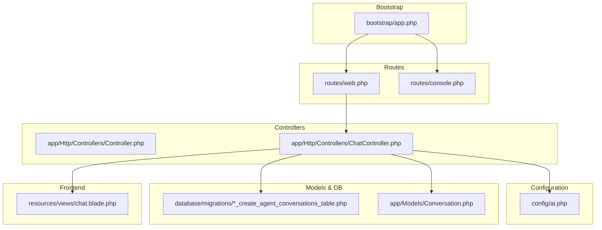
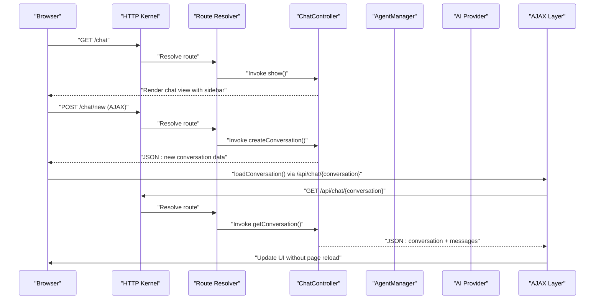
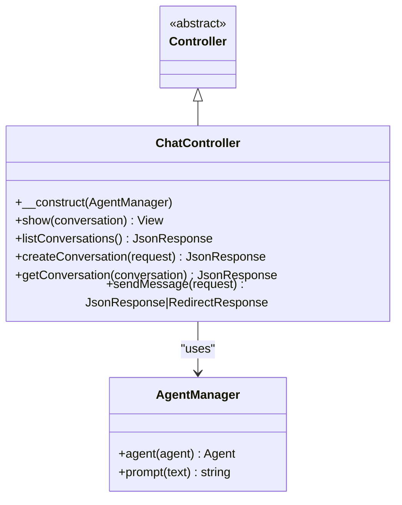
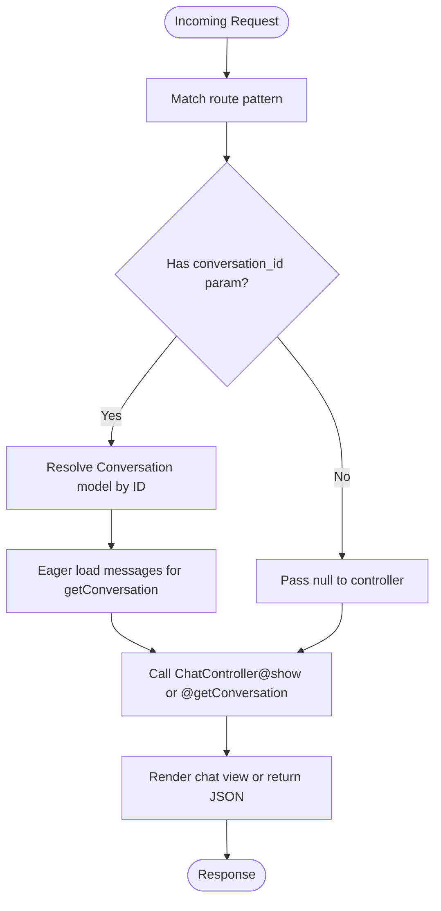
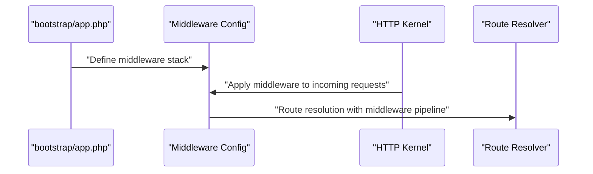
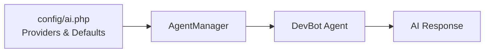
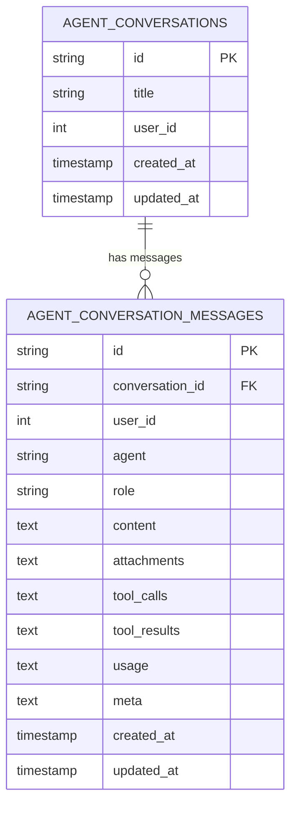
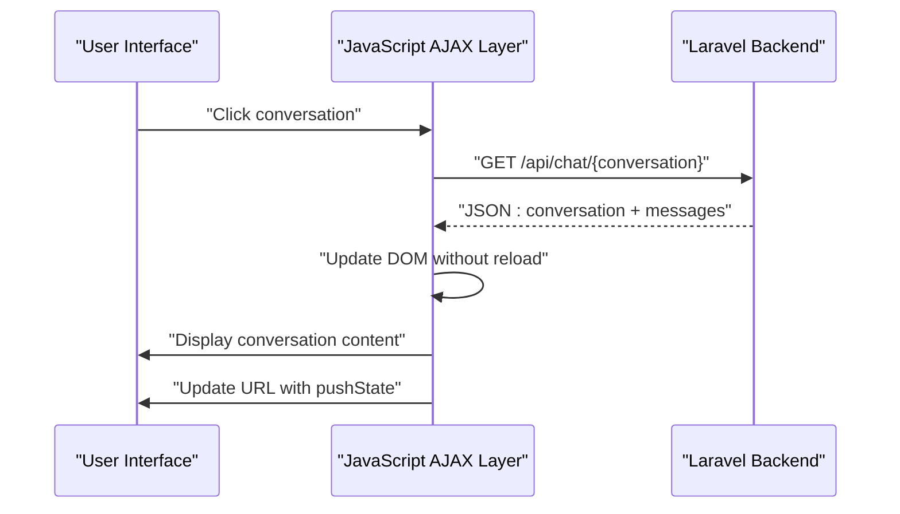
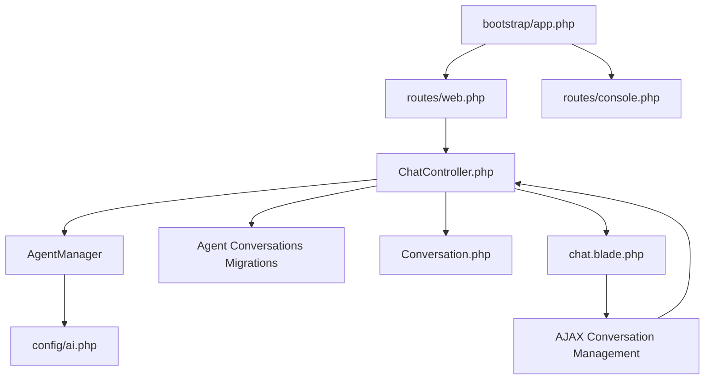

# Routing

<cite>
**Referenced Files in This Document**
- [web.php](file://routes/web.php)
- [console.php](file://routes/console.php)
- [app.php](file://bootstrap/app.php)
- [Controller.php](file://app/Http/Controllers/Controller.php)
- [ChatController.php](file://app/Http/Controllers/ChatController.php)
- [AppServiceProvider.php](file://app/Providers/AppServiceProvider.php)
- [ai.php](file://config/ai.php)
- [2026_04_02_115916_create_agent_conversations_table.php](file://database/migrations/2026_04_02_115916_create_agent_conversations_table.php)
- [composer.json](file://composer.json)
- [chat.blade.php](file://resources/views/chat.blade.php)
- [Conversation.php](file://app/Models/Conversation.php)
</cite>

## Update Summary
**Changes Made**
- Added comprehensive documentation for new conversation management endpoints
- Updated AJAX-based conversation management system documentation
- Enhanced route-to-controller mapping with new endpoints
- Added detailed coverage of API endpoints for conversation management
- Updated architecture diagrams to reflect AJAX-driven conversation switching
- Expanded practical examples for modern chat interface patterns

## Table of Contents
1. [Introduction](#introduction)
2. [Project Structure](#project-structure)
3. [Core Components](#core-components)
4. [Architecture Overview](#architecture-overview)
5. [Detailed Component Analysis](#detailed-component-analysis)
6. [AJAX-Based Conversation Management](#ajax-based-conversation-management)
7. [API Endpoints and Data Flow](#api-endpoints-and-data-flow)
8. [Dependency Analysis](#dependency-analysis)
9. [Performance Considerations](#performance-considerations)
10. [Troubleshooting Guide](#troubleshooting-guide)
11. [Conclusion](#conclusion)

## Introduction
This document explains routing in the Laravel Assistant project, focusing on how web and console routes are configured, how controllers handle requests, and how AI-enabled endpoints integrate with the Laravel service container. The system now features comprehensive conversation management with AJAX-based switching, supporting modern chat interface patterns. It covers route-to-controller mapping, named routes, and model binding patterns used for agent conversations, along with detailed AJAX implementation for seamless conversation switching without page reloads.

## Project Structure
The routing system centers around five primary route definition files and the Laravel bootstrap configuration that wires them into the application lifecycle. Controllers implement the business logic for chat interactions, while configuration files define AI providers and database schema for agent conversations. The system now supports both traditional server-rendered pages and AJAX-based conversation management.



**Diagram sources**
- [app.php:7-12](file://bootstrap/app.php#L7-L12)
- [web.php:1-16](file://routes/web.php#L1-L16)
- [console.php:1-9](file://routes/console.php#L1-L9)
- [Controller.php:1-9](file://app/Http/Controllers/Controller.php#L1-L9)
- [ChatController.php:1-182](file://app/Http/Controllers/ChatController.php#L1-L182)
- [ai.php:1-132](file://config/ai.php#L1-L132)
- [2026_04_02_115916_create_agent_conversations_table.php:1-51](file://database/migrations/2026_04_02_115916_create_agent_conversations_table.php#L1-L51)
- [chat.blade.php:1-731](file://resources/views/chat.blade.php#L1-L731)
- [Conversation.php:1-45](file://app/Models/Conversation.php#L1-L45)

**Section sources**
- [app.php:7-12](file://bootstrap/app.php#L7-L12)
- [web.php:1-16](file://routes/web.php#L1-L16)
- [console.php:1-9](file://routes/console.php#L1-L9)
- [Controller.php:1-9](file://app/Http/Controllers/Controller.php#L1-L9)
- [ChatController.php:1-182](file://app/Http/Controllers/ChatController.php#L1-L182)
- [ai.php:1-132](file://config/ai.php#L1-L132)
- [2026_04_02_115916_create_agent_conversations_table.php:1-51](file://database/migrations/2026_04_02_115916_create_agent_conversations_table.php#L1-L51)
- [chat.blade.php:1-731](file://resources/views/chat.blade.php#L1-L731)
- [Conversation.php:1-45](file://app/Models/Conversation.php#L1-L45)

## Core Components
- **Web routes**: Define HTTP endpoints for the UI and agent interactions, including new conversation management endpoints
- **Console routes**: Define Artisan commands for maintenance and automation
- **Controller base class**: Shared foundation for all controllers
- **Chat controller**: Handles chat UI rendering, conversation management, message submission with AI integration, and AJAX endpoints
- **AI configuration**: Provider selection and caching policies for AI operations
- **Database migrations**: Schema for agent conversations and messages supporting AI workflows
- **AJAX conversation management**: Client-side JavaScript for seamless conversation switching without page reloads

Key responsibilities:
- Route registration and middleware wiring during bootstrap
- Request validation and conversation persistence
- AI prompt orchestration via the Agent Manager
- Named route usage for redirects after actions
- AJAX endpoint implementation for real-time conversation management
- Client-side conversation switching with pushState API

**Section sources**
- [web.php:6-16](file://routes/web.php#L6-L16)
- [console.php:6-8](file://routes/console.php#L6-L8)
- [Controller.php:5-8](file://app/Http/Controllers/Controller.php#L5-L8)
- [ChatController.php:13-182](file://app/Http/Controllers/ChatController.php#L13-L182)
- [ai.php:16-132](file://config/ai.php#L16-L132)
- [2026_04_02_115916_create_agent_conversations_table.php:14-39](file://database/migrations/2026_04_02_115916_create_agent_conversations_table.php#L14-L39)
- [chat.blade.php:350-549](file://resources/views/chat.blade.php#L350-L549)

## Architecture Overview
The routing architecture integrates Laravel's HTTP kernel with controller actions and the AI subsystem. The bootstrap file registers web and console routes, while controllers depend on the service container for injected dependencies like the Agent Manager. The system now supports both traditional server-rendered pages and AJAX-based conversation management for modern chat interfaces.



**Diagram sources**
- [app.php:7-12](file://bootstrap/app.php#L7-L12)
- [web.php:10-16](file://routes/web.php#L10-L16)
- [ChatController.php:18-182](file://app/Http/Controllers/ChatController.php#L18-L182)
- [ai.php:16-132](file://config/ai.php#L16-L132)
- [chat.blade.php:484-679](file://resources/views/chat.blade.php#L484-L679)

## Detailed Component Analysis

### Web Routes and Controller Mapping
The routing system now includes comprehensive conversation management endpoints:

- **GET /** → Welcome page
- **GET /chat** → ChatController@show (named route: chat.show)
- **GET /chat/conversations** → ChatController@listConversations (named route: chat.conversations)
- **POST /chat/new** → ChatController@createConversation (named route: chat.new)
- **GET /api/chat/{conversation}** → ChatController@getConversation (named route: chat.conversation)
- **GET /chat/{conversation}** → ChatController@show (named route: chat.show.conversation)
- **POST /chat/message** → ChatController@sendMessage (named route: chat.message)

These routes demonstrate:
- **RESTful design patterns** with dedicated endpoints for different operations
- **Named routes** enabling consistent redirects and links
- **Model binding** for conversation parameter resolution
- **Dual API approach** supporting both server-rendered and AJAX-based interactions

Practical example references:
- [routes/web.php:6-16](file://routes/web.php#L6-L16)

**Section sources**
- [web.php:6-16](file://routes/web.php#L6-L16)

### Console Routes and Artisan Commands
- Defines an Artisan command with a purpose statement
- Demonstrates console route registration during bootstrap

Practical example references:
- [routes/console.php:6-8](file://routes/console.php#L6-L8)

**Section sources**
- [console.php:6-8](file://routes/console.php#L6-L8)

### Controller Base and Chat Controller
- Controller base class provides a shared foundation
- ChatController now includes comprehensive conversation management methods:
  - **show()**: Renders chat interface with optional conversation parameter
  - **listConversations()**: Returns JSON list of recent conversations
  - **createConversation()**: Creates new empty conversation and returns JSON
  - **getConversation()**: Returns conversation details and messages as JSON
  - **sendMessage()**: Handles message submission with AI integration



**Diagram sources**
- [Controller.php:5-8](file://app/Http/Controllers/Controller.php#L5-L8)
- [ChatController.php:13-182](file://app/Http/Controllers/ChatController.php#L13-L182)

**Section sources**
- [Controller.php:5-8](file://app/Http/Controllers/Controller.php#L5-L8)
- [ChatController.php:13-182](file://app/Http/Controllers/ChatController.php#L13-L182)

### Route Model Binding for AI-Enabled Endpoints
- The show action accepts a nullable Conversation model parameter. When a route parameter matches a Conversation ID, Laravel automatically resolves it to a model instance.
- The getConversation action uses explicit model binding with automatic eager loading of messages.
- This enables concise controller logic and leverages Eloquent relationships seamlessly.



**Diagram sources**
- [ChatController.php:18-102](file://app/Http/Controllers/ChatController.php#L18-L102)

**Section sources**
- [ChatController.php:18-102](file://app/Http/Controllers/ChatController.php#L18-L102)

### Middleware Application and Bootstrap Integration
- The bootstrap file registers web and console routes and exposes hooks for middleware and exception handling.
- Middleware can be added centrally to apply cross-cutting concerns (e.g., authentication, rate limiting) to web routes.



**Diagram sources**
- [app.php:13-15](file://bootstrap/app.php#L13-L15)

**Section sources**
- [app.php:13-15](file://bootstrap/app.php#L13-L15)

### AI Provider Configuration and Agent Integration
- AI provider defaults and per-operation defaults are configured.
- The ChatController uses AgentManager to orchestrate prompts through the selected provider.
- Caching options for embeddings are configurable.



**Diagram sources**
- [ai.php:16-132](file://config/ai.php#L16-L132)
- [ChatController.php:141-149](file://app/Http/Controllers/ChatController.php#L141-L149)

**Section sources**
- [ai.php:16-132](file://config/ai.php#L16-L132)
- [ChatController.php:141-149](file://app/Http/Controllers/ChatController.php#L141-L149)

### Database Schema for Agent Conversations
- Migrations define tables for agent conversations and messages, including indexes optimized for querying by conversation and user.
- Fields capture roles, content, attachments, tool calls/results, usage metrics, and metadata to support AI workflows.



**Diagram sources**
- [2026_04_02_115916_create_agent_conversations_table.php:14-39](file://database/migrations/2026_04_02_115916_create_agent_conversations_table.php#L14-L39)

**Section sources**
- [2026_04_02_115916_create_agent_conversations_table.php:1-51](file://database/migrations/2026_04_02_115916_create_agent_conversations_table.php#L1-L51)

## AJAX-Based Conversation Management

### Modern Chat Interface Architecture
The Laravel Assistant now supports sophisticated AJAX-based conversation management that enables seamless switching between conversations without page reloads. This modern approach enhances user experience by providing instant conversation switching and real-time updates.

### AJAX Implementation Details
The frontend JavaScript implements several key AJAX operations:

- **New Conversation Creation**: POST `/chat/new` creates a new empty conversation and returns JSON with conversation details
- **Conversation Loading**: GET `/api/chat/{conversation}` loads conversation data and messages via AJAX
- **Conversation Switching**: Seamless switching between conversations using pushState API
- **Real-time Updates**: Dynamic sidebar updates and URL synchronization



**Diagram sources**
- [chat.blade.php:484-585](file://resources/views/chat.blade.php#L484-L585)
- [chat.blade.php:598-689](file://resources/views/chat.blade.php#L598-L689)

### Conversation Management Endpoints
The system provides dedicated endpoints for conversation management:

- **GET /chat/conversations**: Returns JSON list of recent conversations (limited to 50)
- **POST /chat/new**: Creates new empty conversation and returns JSON response
- **GET /api/chat/{conversation}**: Returns conversation details and messages as JSON
- **GET /chat/{conversation}**: Traditional server-rendered conversation view

**Section sources**
- [web.php:11-13](file://routes/web.php#L11-L13)
- [ChatController.php:43-102](file://app/Http/Controllers/ChatController.php#L43-L102)
- [chat.blade.php:484-679](file://resources/views/chat.blade.php#L484-L679)

### Frontend JavaScript Architecture
The frontend JavaScript implements sophisticated conversation management:

- **Conversation List Management**: Dynamic sidebar with search and filtering
- **AJAX Loading**: Asynchronous conversation loading with loading indicators
- **State Management**: Uses HTML5 History API for URL updates without reloads
- **Error Handling**: Comprehensive error handling for network failures
- **CSRF Protection**: Automatic CSRF token inclusion in AJAX requests

**Section sources**
- [chat.blade.php:350-549](file://resources/views/chat.blade.php#L350-L549)
- [chat.blade.php:598-689](file://resources/views/chat.blade.php#L598-L689)

## API Endpoints and Data Flow

### Conversation Management API
The system provides a comprehensive API for conversation management:

**List Conversations**
- **Endpoint**: GET `/chat/conversations`
- **Response**: JSON array of up to 50 most recent conversations with basic metadata
- **Use Case**: Populate conversation sidebar

**Create New Conversation**
- **Endpoint**: POST `/chat/new`
- **Response**: JSON with new conversation ID, title, and timestamp
- **Use Case**: Create new empty conversations via AJAX

**Get Conversation Details**
- **Endpoint**: GET `/api/chat/{conversation}`
- **Response**: JSON with conversation metadata and complete message history
- **Use Case**: Load specific conversation content

**Show Conversation**
- **Endpoint**: GET `/chat/{conversation}`
- **Response**: Full HTML chat interface
- **Use Case**: Direct conversation access

### Data Structure Specifications
Each endpoint returns standardized JSON structures:

**Conversation List Response**:
```json
{
  "conversations": [
    {
      "id": "conv_id",
      "title": "Conversation Title",
      "created_at": "2 hours ago",
      "updated_at": "1 hour ago"
    }
  ]
}
```

**New Conversation Response**:
```json
{
  "success": true,
  "conversation": {
    "id": "new_conv_id",
    "title": "New Chat",
    "created_at": "just now"
  }
}
```

**Conversation Details Response**:
```json
{
  "conversation": {
    "id": "conv_id",
    "title": "Conversation Title",
    "created_at": "2 hours ago"
  },
  "messages": [
    {
      "id": "msg_id",
      "role": "user",
      "content": "Hello!",
      "created_at": "10:30 AM"
    }
  ]
}
```

**Section sources**
- [ChatController.php:43-102](file://app/Http/Controllers/ChatController.php#L43-L102)
- [web.php:11-13](file://routes/web.php#L11-L13)

## Dependency Analysis
- Route registration depends on bootstrap configuration
- Controllers depend on the service container for injected dependencies (e.g., AgentManager)
- AI operations depend on provider configuration and optional caching settings
- Database migrations define the schema for conversation and message persistence
- Frontend JavaScript depends on backend API endpoints for data exchange



**Diagram sources**
- [app.php:7-12](file://bootstrap/app.php#L7-L12)
- [web.php:1-16](file://routes/web.php#L1-L16)
- [console.php:1-9](file://routes/console.php#L1-L9)
- [ChatController.php:13-182](file://app/Http/Controllers/ChatController.php#L13-L182)
- [ai.php:16-132](file://config/ai.php#L16-L132)
- [2026_04_02_115916_create_agent_conversations_table.php:1-51](file://database/migrations/2026_04_02_115916_create_agent_conversations_table.php#L1-L51)
- [chat.blade.php:1-731](file://resources/views/chat.blade.php#L1-L731)
- [Conversation.php:1-45](file://app/Models/Conversation.php#L1-L45)

**Section sources**
- [app.php:7-12](file://bootstrap/app.php#L7-L12)
- [web.php:1-16](file://routes/web.php#L1-L16)
- [console.php:1-9](file://routes/console.php#L1-L9)
- [ChatController.php:13-182](file://app/Http/Controllers/ChatController.php#L13-L182)
- [ai.php:16-132](file://config/ai.php#L16-L132)
- [2026_04_02_115916_create_agent_conversations_table.php:1-51](file://database/migrations/2026_04_02_115916_create_agent_conversations_table.php#L1-L51)
- [chat.blade.php:1-731](file://resources/views/chat.blade.php#L1-L731)
- [Conversation.php:1-45](file://app/Models/Conversation.php#L1-L45)

## Performance Considerations
- **Route caching**:
  - Use Laravel's route cache in production to reduce route registration overhead
  - Reference: [composer.json:40-74](file://composer.json#L40-L74)

- **Middleware optimization**:
  - Place heavy middleware behind conditionals and avoid unnecessary processing for static assets
  - Reference: [app.php:13-15](file://bootstrap/app.php#L13-L15)

- **AI provider caching**:
  - Configure caching for embeddings and other expensive operations
  - Reference: [ai.php:34-39](file://config/ai.php#L34-L39)

- **Database indexing**:
  - Leverage existing indexes on conversation_id and timestamps for efficient queries
  - Reference: [2026_04_02_115916_create_agent_conversations_table.php:20-39](file://database/migrations/2026_04_02_115916_create_agent_conversations_table.php#L20-L39)

- **AJAX optimization**:
  - Implement request debouncing for conversation switching
  - Cache frequently accessed conversation data
  - Use efficient JSON serialization for large message histories

## Troubleshooting Guide
- **Route not found**:
  - Verify route registration in web.php and ensure bootstrap wiring is intact
  - Check that new conversation management routes are properly defined
  - References: [web.php:10-16](file://routes/web.php#L10-L16), [app.php:7-12](file://bootstrap/app.php#L7-L12)

- **Controller dependency resolution failures**:
  - Confirm constructor injection of AgentManager and that the service provider is registered
  - Verify that conversation model binding works correctly
  - References: [ChatController.php:13-18](file://app/Http/Controllers/ChatController.php#L13-L18), [AppServiceProvider.php:12-23](file://app/Providers/AppServiceProvider.php#L12-L23)

- **AI provider configuration issues**:
  - Check provider keys and defaults in ai.php; confirm environment variables are set
  - References: [ai.php:52-129](file://config/ai.php#L52-L129)

- **AJAX conversation loading failures**:
  - Verify CSRF token is present in AJAX requests
  - Check that conversation IDs are properly formatted
  - Ensure model binding resolves conversation instances correctly
  - References: [chat.blade.php:496-501](file://resources/views/chat.blade.php#L496-L501), [ChatController.php:81-102](file://app/Http/Controllers/ChatController.php#L81-L102)

- **Validation errors on message submission**:
  - Review input validation rules and ensure client sends required fields
  - Check AJAX request headers and content types
  - References: [ChatController.php:107-112](file://app/Http/Controllers/ChatController.php#L107-L112), [chat.blade.php:353-360](file://resources/views/chat.blade.php#L353-L360)

**Section sources**
- [web.php:10-16](file://routes/web.php#L10-L16)
- [app.php:7-12](file://bootstrap/app.php#L7-L12)
- [ChatController.php:13-182](file://app/Http/Controllers/ChatController.php#L13-L182)
- [AppServiceProvider.php:12-23](file://app/Providers/AppServiceProvider.php#L12-L23)
- [ai.php:52-129](file://config/ai.php#L52-L129)
- [chat.blade.php:353-501](file://resources/views/chat.blade.php#L353-L501)
- [ChatController.php:107-112](file://app/Http/Controllers/ChatController.php#L107-L112)

## Conclusion
The Laravel Assistant project demonstrates clean separation of concerns in routing, controller logic, and AI integration, now enhanced with sophisticated AJAX-based conversation management. The system provides both traditional server-rendered pages and modern AJAX interactions, supporting seamless conversation switching without page reloads. Web routes map to controller actions that validate input, persist conversations, and orchestrate AI prompts through the Agent Manager. The bootstrap configuration centralizes route registration and middleware setup, while AI configuration provides flexible provider selection and caching. 

The new conversation management endpoints (`/chat/conversations`, `/chat/new`, `/api/chat/{conversation}`, `/chat/{conversation}`) enable modern chat interface patterns with AJAX-based conversation switching. The frontend JavaScript implements sophisticated state management using the HTML5 History API, providing instant conversation switching with URL synchronization. Following RESTful patterns, named routes, model binding, and AJAX implementation simplifies development and improves maintainability. For production, leverage route caching, middleware optimization, AI caching, and AJAX optimization to achieve optimal performance and reliability.