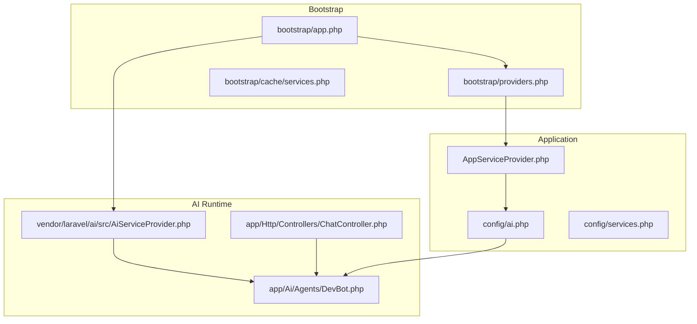
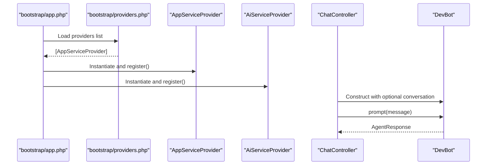
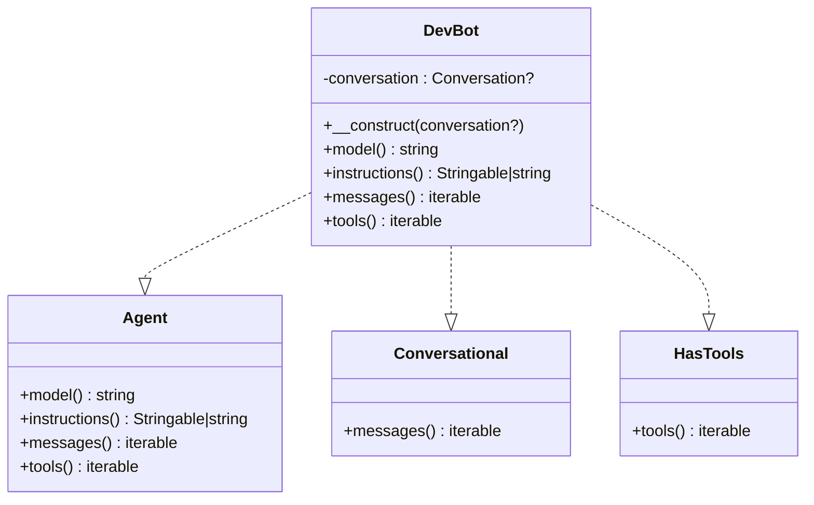
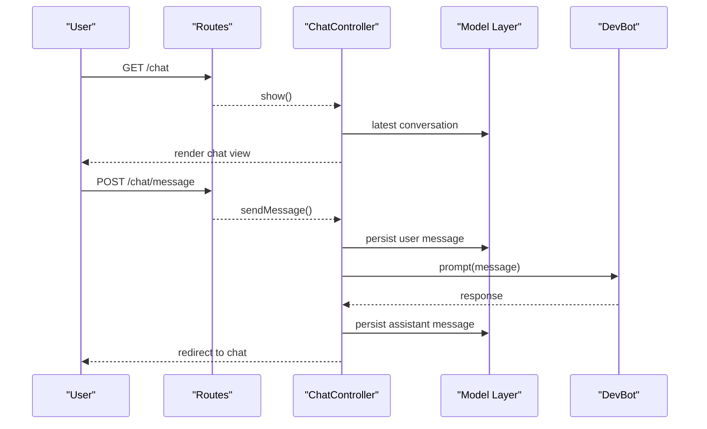
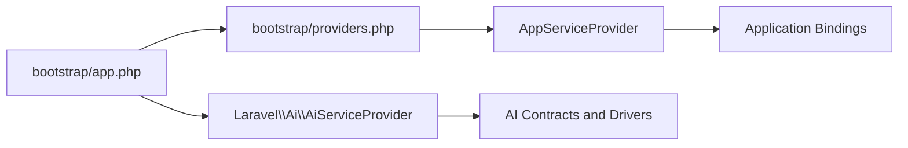

# Service Providers

<cite>
**Referenced Files in This Document**
- [AppServiceProvider.php](file://app/Providers/AppServiceProvider.php)
- [app.php](file://bootstrap/app.php)
- [providers.php](file://bootstrap/providers.php)
- [ai.php](file://config/ai.php)
- [composer.json](file://composer.json)
- [services.php](file://config/services.php)
- [DevBot.php](file://app/Ai/Agents/DevBot.php)
- [ChatController.php](file://app/Http/Controllers/ChatController.php)
- [Conversation.php](file://app/Models/Conversation.php)
- [Message.php](file://app/Models/Message.php)
- [web.php](file://routes/web.php)
- [console.php](file://routes/console.php)
- [2026_04_02_115916_create_agent_conversations_table.php](file://database/migrations/2026_04_02_115916_create_agent_conversations_table.php)
- [services.cache](file://bootstrap/cache/services.php)
- [AiServiceProvider.php](file://vendor/laravel/ai/src/AiServiceProvider.php)
</cite>

## Table of Contents
1. [Introduction](#introduction)
2. [Project Structure](#project-structure)
3. [Core Components](#core-components)
4. [Architecture Overview](#architecture-overview)
5. [Detailed Component Analysis](#detailed-component-analysis)
6. [Dependency Analysis](#dependency-analysis)
7. [Performance Considerations](#performance-considerations)
8. [Troubleshooting Guide](#troubleshooting-guide)
9. [Conclusion](#conclusion)
10. [Appendices](#appendices)

## Introduction
This document explains how Laravel service providers operate within the assistant project, focusing on the AppServiceProvider structure, dependency injection container configuration, and integration with AI services. It covers provider bootstrapping, service binding, and interface implementation for AI agents. Practical examples demonstrate custom service registration, singleton bindings, and facades creation for AI components. It also outlines optimization strategies, conditional loading, performance considerations, and best practices for modular architecture and dynamic AI service registration.

## Project Structure
The assistant project follows Laravel’s standard structure with a dedicated AppServiceProvider and AI configuration. The bootstrap pipeline wires providers, and the AI subsystem is provided by the official Laravel AI package.

**Diagram sources**
- [app.php:1-19](file://bootstrap/app.php#L1-L19)
- [providers.php:1-8](file://bootstrap/providers.php#L1-L8)
- [services.cache:25-52](file://bootstrap/cache/services.php#L25-L52)
- [AppServiceProvider.php:1-25](file://app/Providers/AppServiceProvider.php#L1-L25)
- [ai.php:1-132](file://config/ai.php#L1-L132)
- [services.php:1-39](file://config/services.php#L1-L39)
- [AiServiceProvider.php](file://vendor/laravel/ai/src/AiServiceProvider.php)
- [DevBot.php:1-100](file://app/Ai/Agents/DevBot.php#L1-L100)
- [ChatController.php:1-92](file://app/Http/Controllers/ChatController.php#L1-L92)

**Section sources**
- [app.php:1-19](file://bootstrap/app.php#L1-L19)
- [providers.php:1-8](file://bootstrap/providers.php#L1-L8)
- [services.cache:25-52](file://bootstrap/cache/services.php#L25-L52)
- [AppServiceProvider.php:1-25](file://app/Providers/AppServiceProvider.php#L1-L25)
- [ai.php:1-132](file://config/ai.php#L1-L132)
- [services.php:1-39](file://config/services.php#L1-L39)

## Core Components
- AppServiceProvider: The application-level provider where custom bindings and boot logic live. In this project, it currently offers empty register and boot hooks.
- Laravel AI Package: Provides the AiServiceProvider, which registers AI-related services and integrates agent contracts and drivers.
- AI Configuration: config/ai.php defines default providers, per-capability defaults, and provider credentials.
- Agent Implementation: DevBot demonstrates an AI agent with attributes for provider selection, max steps, and temperature.
- Controller Integration: ChatController orchestrates conversation persistence and delegates AI prompts to DevBot.

Key responsibilities:
- AppServiceProvider.register: Place custom bindings and singletons.
- AppServiceProvider.boot: Perform post-registration initialization.
- AiServiceProvider: Registers AI contracts, drivers, and runtime services.
- DevBot: Implements Agent, Conversational, and HasTools contracts; decorated with provider metadata.

**Section sources**
- [AppServiceProvider.php:1-25](file://app/Providers/AppServiceProvider.php#L1-L25)
- [AiServiceProvider.php](file://vendor/laravel/ai/src/AiServiceProvider.php)
- [ai.php:1-132](file://config/ai.php#L1-L132)
- [DevBot.php:1-100](file://app/Ai/Agents/DevBot.php#L1-L100)
- [ChatController.php:1-92](file://app/Http/Controllers/ChatController.php#L1-L92)

## Architecture Overview
The Laravel application initializes via bootstrap/app.php, which creates the Application instance and wires routing, middleware, and exceptions. Providers are loaded from bootstrap/providers.php and include AppServiceProvider. The Laravel AI package contributes AiServiceProvider, which registers AI services. The controller layer interacts with DevBot, which encapsulates agent behavior and provider configuration.

**Diagram sources**
- [app.php:1-19](file://bootstrap/app.php#L1-L19)
- [providers.php:1-8](file://bootstrap/providers.php#L1-L8)
- [AppServiceProvider.php:1-25](file://app/Providers/AppServiceProvider.php#L1-L25)
- [AiServiceProvider.php](file://vendor/laravel/ai/src/AiServiceProvider.php)
- [ChatController.php:1-92](file://app/Http/Controllers/ChatController.php#L1-L92)
- [DevBot.php:1-100](file://app/Ai/Agents/DevBot.php#L1-L100)

## Detailed Component Analysis

### AppServiceProvider
- Purpose: Central place for application-level service registration and boot logic.
- Current state: Empty register and boot methods; ready for custom bindings and initialization.
- Typical usage:
  - Bind interfaces to implementations.
  - Register singletons for expensive resources.
  - Configure facades after resolving services.
  - Set up validation, policies, or event listeners during boot.

Recommended patterns:
- Use register for bindings and deferred loading.
- Use boot for runtime initialization that depends on other services.

**Section sources**
- [AppServiceProvider.php:1-25](file://app/Providers/AppServiceProvider.php#L1-L25)

### AI Configuration and Provider Defaults
- config/ai.php centralizes:
  - Default provider selection per capability (text, images, audio, embeddings, reranking).
  - Provider registry with driver, key, and optional URL overrides.
  - Optional caching configuration for embeddings.
- Environment variables supply keys and URLs, enabling per-environment configuration.

Integration:
- DevBot uses attributes to declare provider metadata and runtime parameters.
- Controllers rely on the AI package’s runtime to resolve providers and execute prompts.

**Section sources**
- [ai.php:1-132](file://config/ai.php#L1-L132)
- [DevBot.php:1-100](file://app/Ai/Agents/DevBot.php#L1-L100)

### Agent Implementation and Contracts
- DevBot implements Agent, Conversational, and HasTools contracts.
- Attributes define provider selection, max steps, and temperature.
- Constructor accepts an optional Conversation to feed historical messages.

**Diagram sources**
- [DevBot.php:1-100](file://app/Ai/Agents/DevBot.php#L1-L100)

**Section sources**
- [DevBot.php:1-100](file://app/Ai/Agents/DevBot.php#L1-L100)

### Controller Integration and Conversation Persistence
- ChatController manages:
  - Loading or creating a Conversation.
  - Persisting user and assistant messages.
  - Delegating prompt processing to DevBot.
- Database schema for agent conversations is provided by a migration that extends the AI migration base class.

**Diagram sources**
- [web.php:1-12](file://routes/web.php#L1-L12)
- [ChatController.php:1-92](file://app/Http/Controllers/ChatController.php#L1-L92)
- [Conversation.php:1-30](file://app/Models/Conversation.php#L1-L30)
- [Message.php:1-35](file://app/Models/Message.php#L1-L35)
- [2026_04_02_115916_create_agent_conversations_table.php:1-50](file://database/migrations/2026_04_02_115916_create_agent_conversations_table.php#L1-L50)

**Section sources**
- [web.php:1-12](file://routes/web.php#L1-L12)
- [ChatController.php:1-92](file://app/Http/Controllers/ChatController.php#L1-L92)
- [Conversation.php:1-30](file://app/Models/Conversation.php#L1-L30)
- [Message.php:1-35](file://app/Models/Message.php#L1-L35)
- [2026_04_02_115916_create_agent_conversations_table.php:1-50](file://database/migrations/2026_04_02_115916_create_agent_conversations_table.php#L1-L50)

### Practical Examples: Custom Service Registration, Singleton Bindings, and Facades
Note: The following are conceptual examples aligned with Laravel patterns. Replace placeholders with actual classes and interfaces present in your codebase.

- Custom service registration in AppServiceProvider.register:
  - Bind an interface to a concrete implementation.
  - Use container tags for grouping or lazy resolution.
- Singleton bindings:
  - Register a long-lived resource (e.g., a shared client) as a singleton to avoid repeated instantiation.
- Facades creation:
  - After registering a service, create a facade to expose static-like access for ergonomic usage.

These patterns integrate with the Laravel container and are invoked during the provider lifecycle.

**Section sources**
- [AppServiceProvider.php:1-25](file://app/Providers/AppServiceProvider.php#L1-L25)

### Conditional Loading and Provider Optimization
- Conditional registration:
  - Gate bindings behind environment checks or feature flags.
  - Defer heavy bindings until needed using lazy or deferred providers.
- Eager vs. deferred providers:
  - Eager providers are registered early; ensure minimal work in boot.
  - Use deferred providers for optional integrations.
- Performance:
  - Avoid heavy computations in register/boot.
  - Cache compiled service maps and configuration where appropriate.

**Section sources**
- [services.cache:25-52](file://bootstrap/cache/services.php#L25-L52)

### Relationship Between Traditional Providers and AI-Enhanced Service Management
- Traditional providers manage core application services (authentication, database, queues).
- The Laravel AI package contributes AiServiceProvider, which:
  - Registers AI contracts and drivers.
  - Integrates with the container to resolve agents and providers.
  - Supports configuration-driven provider selection and capabilities.
- Modular architecture:
  - Agents (like DevBot) encapsulate behavior and provider metadata.
  - Controllers depend on contracts, keeping coupling low and testability high.

**Section sources**
- [AiServiceProvider.php](file://vendor/laravel/ai/src/AiServiceProvider.php)
- [DevBot.php:1-100](file://app/Ai/Agents/DevBot.php#L1-L100)
- [ai.php:1-132](file://config/ai.php#L1-L132)

## Dependency Analysis
The bootstrap process determines which providers are loaded. The AI package contributes its own provider, and AppServiceProvider is explicitly included.

**Diagram sources**
- [app.php:1-19](file://bootstrap/app.php#L1-L19)
- [providers.php:1-8](file://bootstrap/providers.php#L1-L8)
- [services.cache:25-52](file://bootstrap/cache/services.php#L25-L52)
- [AiServiceProvider.php](file://vendor/laravel/ai/src/AiServiceProvider.php)

**Section sources**
- [app.php:1-19](file://bootstrap/app.php#L1-L19)
- [providers.php:1-8](file://bootstrap/providers.php#L1-L8)
- [services.cache:25-52](file://bootstrap/cache/services.php#L25-L52)

## Performance Considerations
- Keep register/boot lightweight; defer heavy work.
- Use singleton bindings for shared clients or caches.
- Leverage configuration caching and preloading where supported.
- Minimize reflection-heavy operations at runtime; prefer typed bindings.
- Use environment-specific provider loading to reduce overhead in production.

[No sources needed since this section provides general guidance]

## Troubleshooting Guide
Common issues and remedies:
- Missing AI provider configuration:
  - Verify config/ai.php entries and environment variables for keys and URLs.
- Agent runtime errors:
  - Inspect controller error handling and logs around AI prompt execution.
- Migration issues:
  - Confirm agent conversation tables exist and are migrated.

**Section sources**
- [ai.php:1-132](file://config/ai.php#L1-L132)
- [ChatController.php:67-87](file://app/Http/Controllers/ChatController.php#L67-L87)
- [2026_04_02_115916_create_agent_conversations_table.php:1-50](file://database/migrations/2026_04_02_115916_create_agent_conversations_table.php#L1-L50)

## Conclusion
Service providers are the backbone of Laravel’s modularity and extensibility. In this project, AppServiceProvider serves as the application’s extension point, while the Laravel AI package supplies AI-specific services via AiServiceProvider. By structuring bindings, leveraging configuration, and implementing agents with clear contracts, teams can achieve a robust, testable, and scalable AI-enhanced application.

[No sources needed since this section summarizes without analyzing specific files]

## Appendices

### Appendix A: Routes and Console Entrypoints
- Web routes define the chat interface and message submission endpoints.
- Console routes provide Artisan command scaffolding.

**Section sources**
- [web.php:1-12](file://routes/web.php#L1-L12)
- [console.php:1-9](file://routes/console.php#L1-L9)

### Appendix B: Composer and Package Integration
- The project requires the Laravel AI package, which contributes its provider and contracts.
- Autoload and scripts support development and deployment workflows.

**Section sources**
- [composer.json:1-93](file://composer.json#L1-L93)