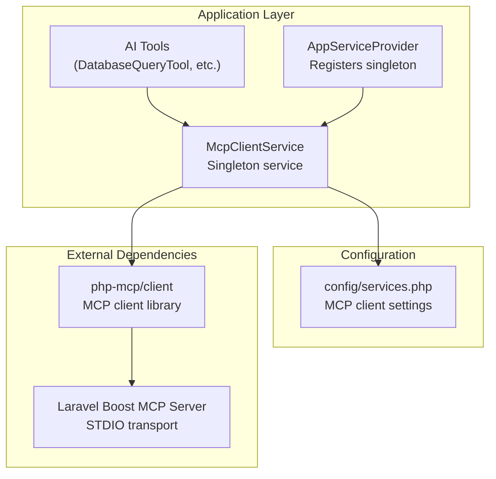
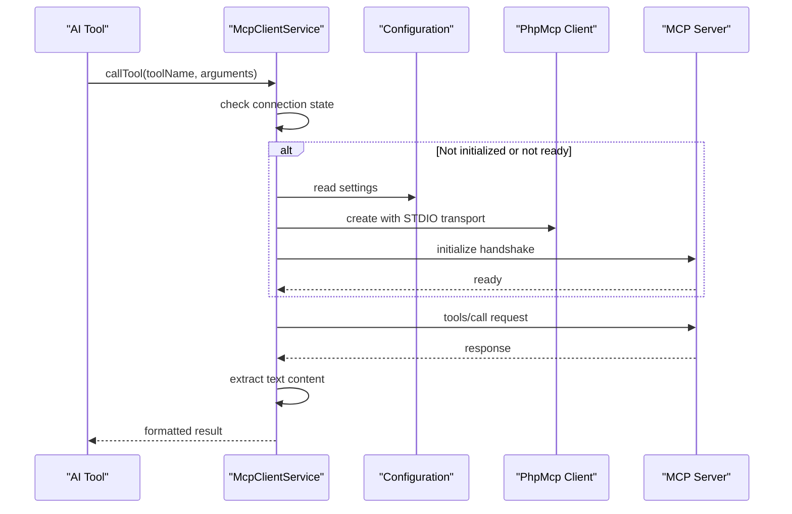
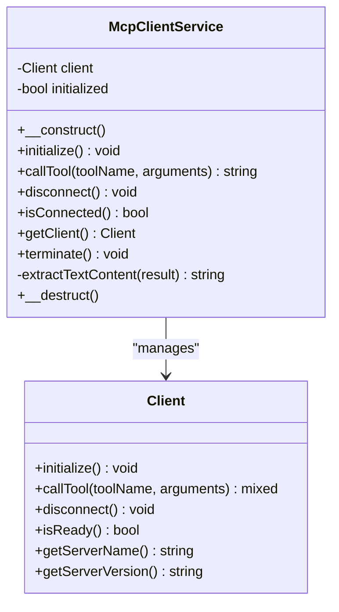
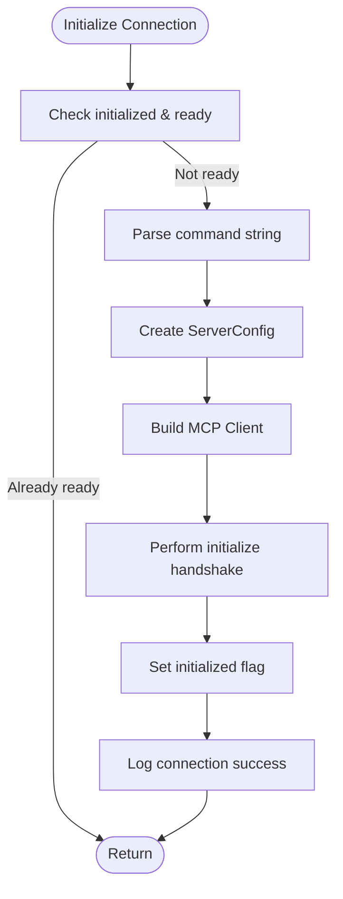
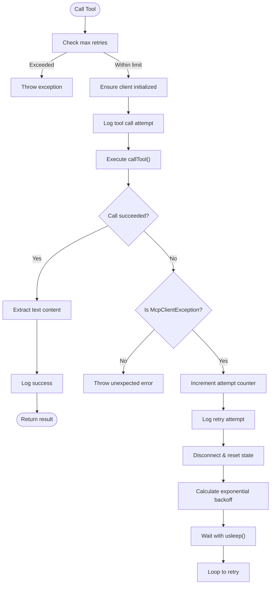
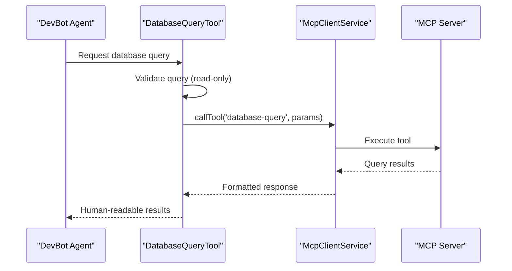
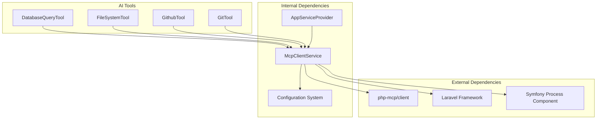

# Mcp Client Service

<cite>
**Referenced Files in This Document**
- [McpClientService.php](file://app/Services/McpClientService.php)
- [services.php](file://config/services.php)
- [AppServiceProvider.php](file://app/Providers/AppServiceProvider.php)
- [DatabaseQueryTool.php](file://app/Ai/Tools/DatabaseQueryTool.php)
- [McpClientServiceTest.php](file://tests/Unit/McpClientServiceTest.php)
- [spec.md](file://openspec/specs/mcp-client-service/spec.md)
- [composer.json](file://composer.json)
</cite>

## Table of Contents
1. [Introduction](#introduction)
2. [Project Structure](#project-structure)
3. [Core Components](#core-components)
4. [Architecture Overview](#architecture-overview)
5. [Detailed Component Analysis](#detailed-component-analysis)
6. [Dependency Analysis](#dependency-analysis)
7. [Performance Considerations](#performance-considerations)
8. [Troubleshooting Guide](#troubleshooting-guide)
9. [Conclusion](#conclusion)

## Introduction
The Mcp Client Service provides a centralized interface for Laravel applications to communicate with an MCP (Model Context Protocol) server. It manages persistent connections, handles automatic reconnection with exponential backoff, and offers robust error handling and logging. The service integrates with Laravel's dependency injection container as a singleton and coordinates with DevBot AI tools to execute server-side operations securely.

## Project Structure
The Mcp Client Service resides in the application's service layer and integrates with configuration, providers, and AI tools:

**Diagram sources**
- [AppServiceProvider.php:14-35](file://app/Providers/AppServiceProvider.php#L14-L35)
- [McpClientService.php:20-38](file://app/Services/McpClientService.php#L20-L38)
- [services.php:38-43](file://config/services.php#L38-L43)

**Section sources**
- [AppServiceProvider.php:14-35](file://app/Providers/AppServiceProvider.php#L14-L35)
- [McpClientService.php:20-38](file://app/Services/McpClientService.php#L20-L38)
- [services.php:38-43](file://config/services.php#L38-L43)

## Core Components
The Mcp Client Service consists of several key components:

- **Initialization Manager**: Creates and configures the MCP client with STDIO transport, performs handshake, and tracks connection state
- **Tool Caller**: Executes MCP tool requests with automatic reconnection and retry logic
- **Connection Lifecycle**: Manages persistent connections, graceful shutdown, and resource cleanup
- **Configuration Bridge**: Reads and validates MCP client settings from Laravel's configuration system
- **Error Handler**: Provides comprehensive logging and controlled error propagation

Key configuration options include:
- Command: Artisan command to launch the MCP server (default: `php artisan boost:mcp`)
- Timeout: Maximum wait time for tool responses (default: 60 seconds)
- Max Retries: Number of automatic reconnection attempts (default: 3)
- Retry Delay: Base delay between retries in milliseconds (default: 1000)

**Section sources**
- [McpClientService.php:48-96](file://app/Services/McpClientService.php#L48-L96)
- [McpClientService.php:110-179](file://app/Services/McpClientService.php#L110-L179)
- [McpClientService.php:186-202](file://app/Services/McpClientService.php#L186-L202)
- [services.php:38-43](file://config/services.php#L38-L43)

## Architecture Overview
The Mcp Client Service follows a layered architecture with clear separation of concerns:

**Diagram sources**
- [McpClientService.php:110-179](file://app/Services/McpClientService.php#L110-L179)
- [McpClientService.php:48-96](file://app/Services/McpClientService.php#L48-L96)
- [DatabaseQueryTool.php:52-59](file://app/Ai/Tools/DatabaseQueryTool.php#L52-L59)

**Section sources**
- [McpClientService.php:48-96](file://app/Services/McpClientService.php#L48-L96)
- [McpClientService.php:110-179](file://app/Services/McpClientService.php#L110-L179)
- [DatabaseQueryTool.php:52-59](file://app/Ai/Tools/DatabaseQueryTool.php#L52-L59)

## Detailed Component Analysis

### McpClientService Class
The core service implements a comprehensive MCP client with the following capabilities:

**Diagram sources**
- [McpClientService.php:20-279](file://app/Services/McpClientService.php#L20-L279)

#### Connection Management
The service maintains persistent connections with automatic health checks:

**Diagram sources**
- [McpClientService.php:48-96](file://app/Services/McpClientService.php#L48-L96)

#### Tool Execution with Retry Logic
The tool calling mechanism implements sophisticated retry and recovery:

**Diagram sources**
- [McpClientService.php:110-179](file://app/Services/McpClientService.php#L110-L179)

**Section sources**
- [McpClientService.php:20-279](file://app/Services/McpClientService.php#L20-L279)

### Configuration Management
The service reads its configuration from Laravel's configuration system:

| Configuration Key | Environment Variable | Default Value | Description |
|-------------------|---------------------|---------------|-------------|
| `services.mcp_client.command` | `MCP_CLIENT_COMMAND` | `php artisan boost:mcp` | Artisan command to launch MCP server |
| `services.mcp_client.timeout` | `MCP_CLIENT_TIMEOUT` | `60` | Timeout in seconds for tool responses |
| `services.mcp_client.max_retries` | `MCP_CLIENT_MAX_RETRIES` | `3` | Maximum retry attempts on failure |
| `services.mcp_client.retry_delay` | `MCP_CLIENT_RETRY_DELAY` | `1000` | Base delay between retries (milliseconds) |

**Section sources**
- [services.php:38-43](file://config/services.php#L38-L43)
- [AppServiceProvider.php:40-63](file://app/Providers/AppServiceProvider.php#L40-L63)

### Integration with AI Tools
The Mcp Client Service integrates seamlessly with DevBot AI tools:

**Diagram sources**
- [DatabaseQueryTool.php:26-69](file://app/Ai/Tools/DatabaseQueryTool.php#L26-L69)
- [McpClientService.php:110-179](file://app/Services/McpClientService.php#L110-L179)

**Section sources**
- [DatabaseQueryTool.php:26-69](file://app/Ai/Tools/DatabaseQueryTool.php#L26-L69)
- [McpClientService.php:110-179](file://app/Services/McpClientService.php#L110-L179)

## Dependency Analysis
The Mcp Client Service has minimal but critical dependencies:

**Diagram sources**
- [composer.json:17](file://composer.json#L17)
- [McpClientService.php:5-11](file://app/Services/McpClientService.php#L5-L11)
- [DatabaseQueryTool.php:5](file://app/Ai/Tools/DatabaseQueryTool.php#L5)

**Section sources**
- [composer.json:17](file://composer.json#L17)
- [McpClientService.php:5-11](file://app/Services/McpClientService.php#L5-L11)

## Performance Considerations
The Mcp Client Service implements several performance optimizations:

- **Persistent Connections**: Reuses MCP client instances to avoid subprocess startup overhead
- **Lazy Initialization**: Defers MCP server startup until the first tool call
- **Exponential Backoff**: Uses increasing delays between retry attempts to minimize server load
- **Connection Health Checks**: Verifies subprocess viability before tool execution
- **Resource Cleanup**: Ensures proper disconnection and process termination

Configuration tuning recommendations:
- Adjust `max_retries` based on expected server reliability
- Set `timeout` according to longest-running tool operations
- Monitor retry delay growth to balance responsiveness vs. server load

## Troubleshooting Guide
Common issues and their resolution:

### Connection Issues
**Symptoms**: `McpClientException` during tool calls
**Causes**: 
- MCP server process crashed or terminated
- Network/transport problems
- Authentication failures

**Resolutions**:
- Verify MCP server availability: `php artisan boost:mcp`
- Check process logs for errors
- Review network connectivity
- Confirm proper authentication setup

### Timeout Problems
**Symptoms**: Tool calls exceeding configured timeout
**Solutions**:
- Increase `MCP_CLIENT_TIMEOUT` value
- Optimize tool-specific queries or operations
- Monitor server performance

### Retry Exhaustion
**Symptoms**: Automatic reconnection failing after maximum attempts
**Actions**:
- Check server stability and resource availability
- Review retry configuration (`max_retries`, `retry_delay`)
- Examine server logs for recurring failure patterns

**Section sources**
- [McpClientService.php:141-179](file://app/Services/McpClientService.php#L141-L179)
- [McpClientServiceTest.php:79-103](file://tests/Unit/McpClientServiceTest.php#L79-L103)

## Conclusion
The Mcp Client Service provides a robust, production-ready foundation for integrating MCP-capable servers with Laravel applications. Its design emphasizes reliability through persistent connections, intelligent retry logic, comprehensive error handling, and seamless integration with Laravel's ecosystem. The service successfully bridges the gap between AI agents and backend systems while maintaining security through proper isolation and validation mechanisms.