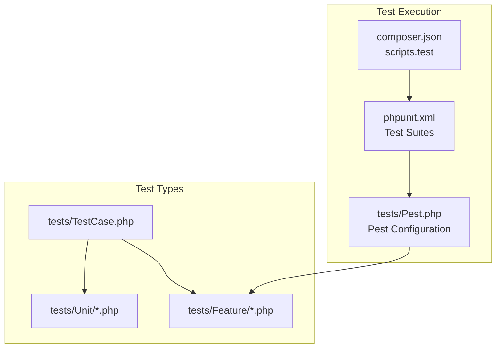
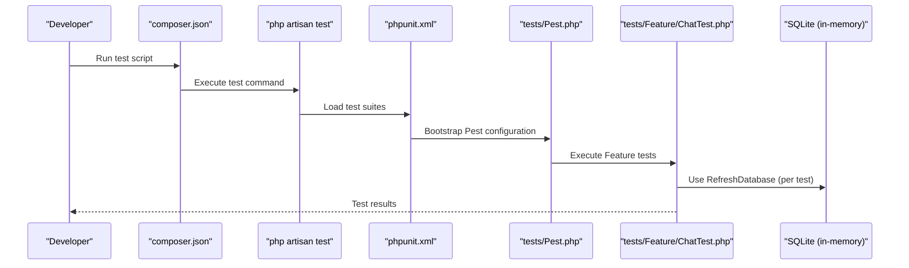
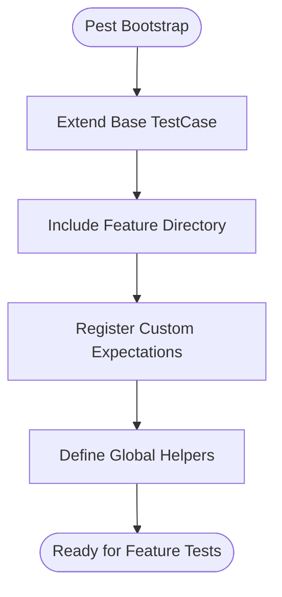
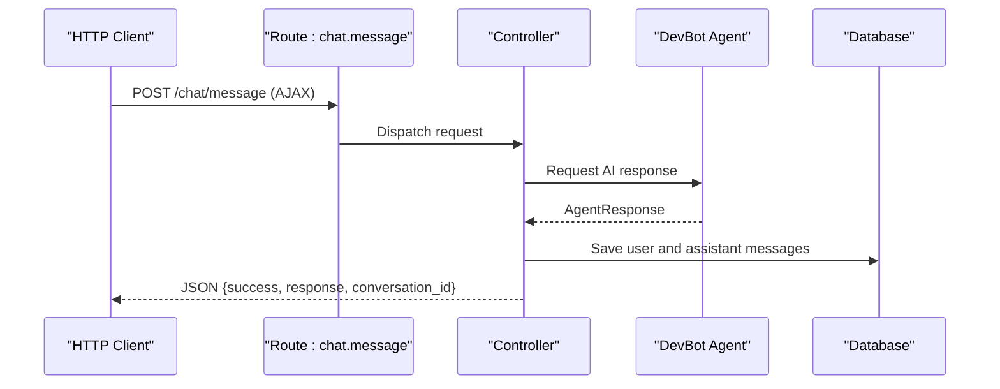
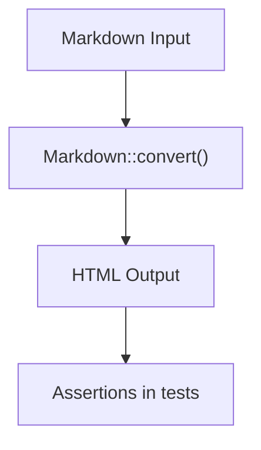
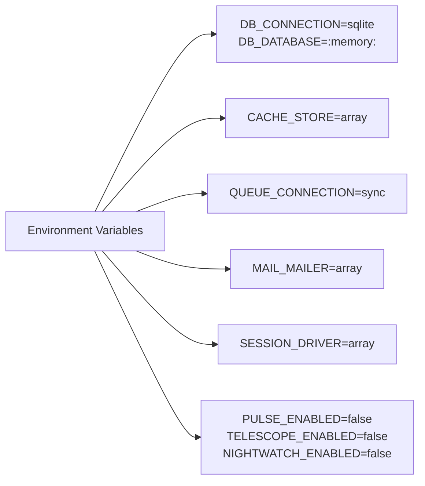
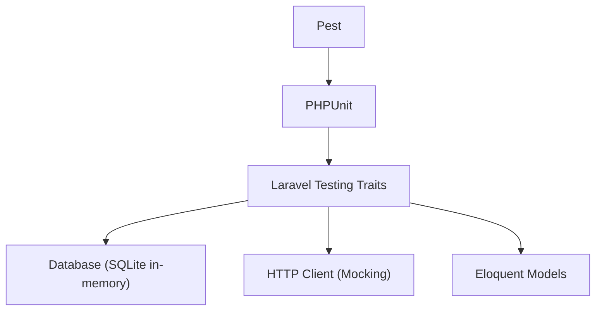

# Testing Infrastructure

<cite>
**Referenced Files in This Document**
- [tests/TestCase.php](file://tests/TestCase.php)
- [tests/Pest.php](file://tests/Pest.php)
- [phpunit.xml](file://phpunit.xml)
- [composer.json](file://composer.json)
- [tests/Feature/ChatTest.php](file://tests/Feature/ChatTest.php)
- [tests/Feature/ExampleTest.php](file://tests/Feature/ExampleTest.php)
- [tests/Unit/ExampleTest.php](file://tests/Unit/ExampleTest.php)
- [tests/Feature/MarkdownRenderingTest.php](file://tests/Feature/MarkdownRenderingTest.php)
- [.agents/skills/laravel-best-practices/rules/testing.md](file://.agents/skills/laravel-best-practices/rules/testing.md)
- [.agents/skills/pest-testing/SKILL.md](file://.agents/skills/pest-testing/SKILL.md)
- [config/database.php](file://config/database.php)
- [database/migrations/0001_01_01_000000_create_users_table.php](file://database/migrations/0001_01_01_000000_create_users_table.php)
</cite>

## Table of Contents
1. [Introduction](#introduction)
2. [Project Structure](#project-structure)
3. [Core Components](#core-components)
4. [Architecture Overview](#architecture-overview)
5. [Detailed Component Analysis](#detailed-component-analysis)
6. [Dependency Analysis](#dependency-analysis)
7. [Performance Considerations](#performance-considerations)
8. [Troubleshooting Guide](#troubleshooting-guide)
9. [Conclusion](#conclusion)

## Introduction
This document describes the testing infrastructure of the Laravel Assistant project. It explains how tests are organized, configured, and executed, and documents the testing patterns used across unit, feature, and integration tests. It also highlights best practices for database testing, mocking, and assertion strategies, and provides guidance for maintaining and extending the test suite.

## Project Structure
The testing setup follows Laravel conventions with Pest as the primary test runner and PHPUnit as the underlying engine. Tests are organized into:
- Unit tests: Lightweight tests for isolated logic
- Feature tests: Integration tests covering HTTP requests, model interactions, and end-to-end flows
- A base TestCase class that extends Laravel's base test case

Key configuration files:
- phpunit.xml defines test suites, source inclusion, and environment variables for the testing environment
- composer.json lists Pest as a development dependency and defines test scripts
- tests/Pest.php configures Pest extensions and global traits for Feature tests

**Diagram sources**
- [composer.json:53-56](file://composer.json#L53-L56)
- [phpunit.xml:7-14](file://phpunit.xml#L7-L14)
- [tests/Pest.php:16-18](file://tests/Pest.php#L16-L18)
- [tests/TestCase.php:7-10](file://tests/TestCase.php#L7-L10)

**Section sources**
- [composer.json:18-27](file://composer.json#L18-L27)
- [composer.json:53-56](file://composer.json#L53-L56)
- [phpunit.xml:7-14](file://phpunit.xml#L7-L14)
- [tests/Pest.php:16-18](file://tests/Pest.php#L16-L18)
- [tests/TestCase.php:7-10](file://tests/TestCase.php#L7-L10)

## Core Components
- Base TestCase: Extends Laravel's base test case and serves as the foundation for all tests.
- Pest Configuration: Sets up Pest to extend the base TestCase, enables Feature tests, and exposes helper functions and expectations.
- Test Suites: PHPUnit defines Unit and Feature test suites that include respective directories.
- Environment Configuration: phpunit.xml sets environment variables for a fast, isolated testing environment (SQLite in-memory database, array caches, sync queues, etc.).

Key behaviors:
- Feature tests use the RefreshDatabase trait to reset the database between tests.
- Pest provides concise it()/expect() syntax and global helpers for rapid test authoring.
- The testing environment disables maintenance mode, Telescope, Pulse, and Nightwatch to keep tests fast and deterministic.

**Section sources**
- [tests/TestCase.php:7-10](file://tests/TestCase.php#L7-L10)
- [tests/Pest.php:16-18](file://tests/Pest.php#L16-L18)
- [tests/Pest.php:31-33](file://tests/Pest.php#L31-L33)
- [tests/Pest.php:46-49](file://tests/Pest.php#L46-L49)
- [phpunit.xml:7-14](file://phpunit.xml#L7-L14)
- [phpunit.xml:20-35](file://phpunit.xml#L20-L35)

## Architecture Overview
The testing architecture integrates Pest, PHPUnit, and Laravel's testing facilities. Feature tests leverage Laravel's HTTP testing capabilities, model factories, and database refresh mechanisms. The configuration ensures a clean, fast, and deterministic environment for reliable test execution.

**Diagram sources**
- [composer.json:53-56](file://composer.json#L53-L56)
- [phpunit.xml:7-14](file://phpunit.xml#L7-L14)
- [tests/Pest.php:16-18](file://tests/Pest.php#L16-L18)
- [tests/Feature/ChatTest.php:11](file://tests/Feature/ChatTest.php#L11)

## Detailed Component Analysis

### Pest Configuration and Extensions
Pest is configured to:
- Extend the base TestCase class
- Include Feature tests automatically
- Add custom expectations (e.g., toBeOne)
- Define global helper functions

This setup allows Feature tests to inherit Laravel testing traits and helpers, simplifying database resets, HTTP assertions, and model assertions.

**Diagram sources**
- [tests/Pest.php:16-18](file://tests/Pest.php#L16-L18)
- [tests/Pest.php:31-33](file://tests/Pest.php#L31-L33)
- [tests/Pest.php:46-49](file://tests/Pest.php#L46-L49)

**Section sources**
- [tests/Pest.php:16-18](file://tests/Pest.php#L16-L18)
- [tests/Pest.php:31-33](file://tests/Pest.php#L31-L33)
- [tests/Pest.php:46-49](file://tests/Pest.php#L46-L49)

### Feature Test Suite: Chat Functionality
The chat feature tests cover:
- Page rendering and view composition
- Message sending via AJAX and form submissions
- Validation rules for message content
- Conversation lifecycle (creation, reuse, title generation)
- Error handling for AI API failures and timeouts
- Response formatting (JSON vs redirect)
- Markdown rendering and message formatting
- End-to-end conversation persistence

Patterns demonstrated:
- beforeEach to prepare shared state (e.g., a reusable conversation)
- uses(RefreshDatabase) to reset the database per test
- Http::fake to simulate external API responses
- Model assertions and database assertions
- Redirect assertions and JSON structure assertions

**Diagram sources**
- [tests/Feature/ChatTest.php:90-129](file://tests/Feature/ChatTest.php#L90-L129)
- [tests/Feature/ChatTest.php:159-181](file://tests/Feature/ChatTest.php#L159-L181)
- [tests/Feature/ChatTest.php:424-443](file://tests/Feature/ChatTest.php#L424-L443)

**Section sources**
- [tests/Feature/ChatTest.php:11](file://tests/Feature/ChatTest.php#L11)
- [tests/Feature/ChatTest.php:26-80](file://tests/Feature/ChatTest.php#L26-L80)
- [tests/Feature/ChatTest.php:90-129](file://tests/Feature/ChatTest.php#L90-L129)
- [tests/Feature/ChatTest.php:159-181](file://tests/Feature/ChatTest.php#L159-L181)
- [tests/Feature/ChatTest.php:189-252](file://tests/Feature/ChatTest.php#L189-L252)
- [tests/Feature/ChatTest.php:260-355](file://tests/Feature/ChatTest.php#L260-L355)
- [tests/Feature/ChatTest.php:363-416](file://tests/Feature/ChatTest.php#L363-L416)
- [tests/Feature/ChatTest.php:424-478](file://tests/Feature/ChatTest.php#L424-L478)
- [tests/Feature/ChatTest.php:486-545](file://tests/Feature/ChatTest.php#L486-L545)
- [tests/Feature/ChatTest.php:553-610](file://tests/Feature/ChatTest.php#L553-L610)
- [tests/Feature/ChatTest.php:618-678](file://tests/Feature/ChatTest.php#L618-L678)

### Markdown Rendering Tests
These tests validate the Markdown helper and message formatting:
- Basic markdown to HTML conversion (bold, italic, code)
- Code block rendering with language classes
- Headings, lists, and links
- XSS escaping and safe HTML output
- Message model formatting and chat page rendering

**Diagram sources**
- [tests/Feature/MarkdownRenderingTest.php:16-115](file://tests/Feature/MarkdownRenderingTest.php#L16-L115)

**Section sources**
- [tests/Feature/MarkdownRenderingTest.php:16-115](file://tests/Feature/MarkdownRenderingTest.php#L16-L115)

### Unit and Example Tests
Basic unit tests demonstrate:
- A simple boolean expectation
- A basic HTTP route assertion

These tests illustrate the minimal structure of unit and example tests in the suite.

**Section sources**
- [tests/Unit/ExampleTest.php:3-5](file://tests/Unit/ExampleTest.php#L3-L5)
- [tests/Feature/ExampleTest.php:3-7](file://tests/Feature/ExampleTest.php#L3-L7)

### Database and Environment Configuration
The testing environment is optimized for speed and isolation:
- SQLite in-memory database for fast test execution
- Array cache, sync queue, and array session drivers
- Disabled observability tools (Telescope, Pulse, Nightwatch)
- Reduced bcrypt cost for faster hashing during tests

**Diagram sources**
- [phpunit.xml:20-35](file://phpunit.xml#L20-L35)

**Section sources**
- [phpunit.xml:20-35](file://phpunit.xml#L20-L35)
- [config/database.php:35-45](file://config/database.php#L35-L45)

## Dependency Analysis
The testing stack depends on:
- Pest for concise test syntax and runtime
- PHPUnit for test discovery and execution
- Laravel testing traits (e.g., RefreshDatabase) for database isolation
- HTTP client mocking (Http::fake) for external service simulation
- Model factories and Eloquent for data setup

**Diagram sources**
- [composer.json:25-26](file://composer.json#L25-L26)
- [phpunit.xml:7-14](file://phpunit.xml#L7-L14)
- [tests/Feature/ChatTest.php:6](file://tests/Feature/ChatTest.php#L6)
- [tests/Feature/ChatTest.php:8](file://tests/Feature/ChatTest.php#L8)

**Section sources**
- [composer.json:25-26](file://composer.json#L25-L26)
- [composer.json:18-27](file://composer.json#L18-L27)
- [phpunit.xml:7-14](file://phpunit.xml#L7-L14)
- [tests/Feature/ChatTest.php:6](file://tests/Feature/ChatTest.php#L6)
- [tests/Feature/ChatTest.php:8](file://tests/Feature/ChatTest.php#L8)

## Performance Considerations
- Use RefreshDatabase judiciously: It ensures isolation but can slow tests if overused. Consider Lazy loading strategies for large suites when applicable.
- Prefer model-based assertions over raw database assertions for readability and maintainability.
- Keep test data minimal and scoped to the test case to reduce overhead.
- Use HTTP mocking to avoid real network calls and external dependencies.
- Leverage array-backed stores (cache, sessions, queues) to minimize I/O.

Best practices derived from the project's skill documentation:
- Prefer lazy database refresh over full migration runs when schema has not changed.
- Use model assertions for clearer, type-safe tests.
- Employ factory states and sequences to reduce repetitive setup.
- Use Exceptions::fake to assert exception reporting without bypassing normal request handling.
- Apply Event::fake after factory setup to prevent broken models.

**Section sources**
- [.agents/skills/laravel-best-practices/rules/testing.md:3-5](file://.agents/skills/laravel-best-practices/rules/testing.md#L3-L5)
- [.agents/skills/laravel-best-practices/rules/testing.md:7-13](file://.agents/skills/laravel-best-practices/rules/testing.md#L7-L13)
- [.agents/skills/laravel-best-practices/rules/testing.md:15-21](file://.agents/skills/laravel-best-practices/rules/testing.md#L15-L21)
- [.agents/skills/laravel-best-practices/rules/testing.md:23-25](file://.agents/skills/laravel-best-practices/rules/testing.md#L23-L25)
- [.agents/skills/laravel-best-practices/rules/testing.md:27-33](file://.agents/skills/laravel-best-practices/rules/testing.md#L27-L33)
- [.agents/skills/laravel-best-practices/rules/testing.md:35-43](file://.agents/skills/laravel-best-practices/rules/testing.md#L35-L43)

## Troubleshooting Guide
Common issues and resolutions:
- Database state bleeding between tests: Ensure RefreshDatabase is applied to tests that modify the database.
- External API dependencies causing flaky tests: Use Http::fake to simulate responses and avoid real network calls.
- Slow test runs: Review the use of heavy fixtures or repeated migrations; consider lazy refresh strategies.
- Assertion failures on redirects or JSON: Use specific assertions (e.g., assertSuccessful, assertJsonStructure) for clarity and reliability.
- Environment-specific failures: Confirm phpunit.xml environment variables match expected testing configuration.

Operational references:
- Test execution via composer script
- Test suites defined in phpunit.xml
- Pest configuration and global helpers

**Section sources**
- [composer.json:53-56](file://composer.json#L53-L56)
- [phpunit.xml:7-14](file://phpunit.xml#L7-L14)
- [tests/Pest.php:16-18](file://tests/Pest.php#L16-L18)
- [tests/Feature/ChatTest.php:90-129](file://tests/Feature/ChatTest.php#L90-L129)

## Conclusion
The Laravel Assistant testing infrastructure leverages Pest for concise, expressive tests and PHPUnit for robust execution. Feature tests utilize Laravel's HTTP testing, database refresh, and model assertions to validate chat functionality comprehensively. The configuration prioritizes speed and isolation through SQLite in-memory databases and array-backed services. Adhering to best practices—such as model-centric assertions, factory states, and careful mocking—ensures maintainable and reliable tests. The documented patterns and troubleshooting guidance provide a solid foundation for extending and evolving the test suite.