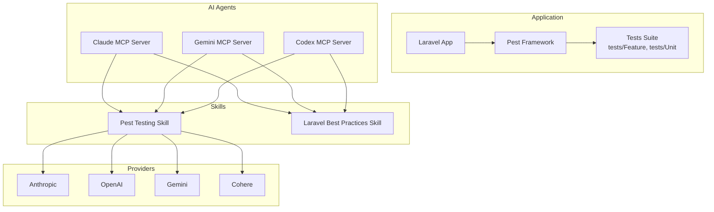
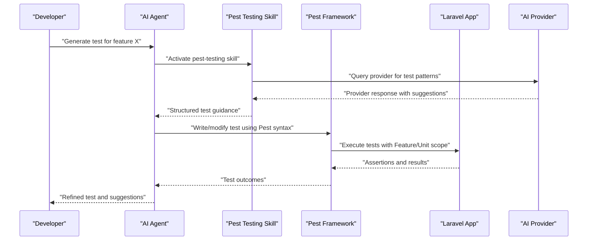
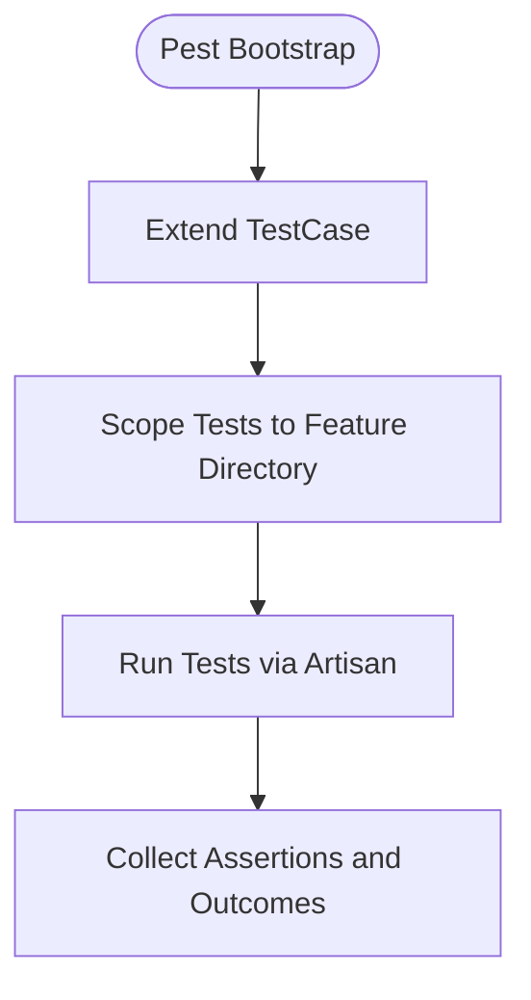
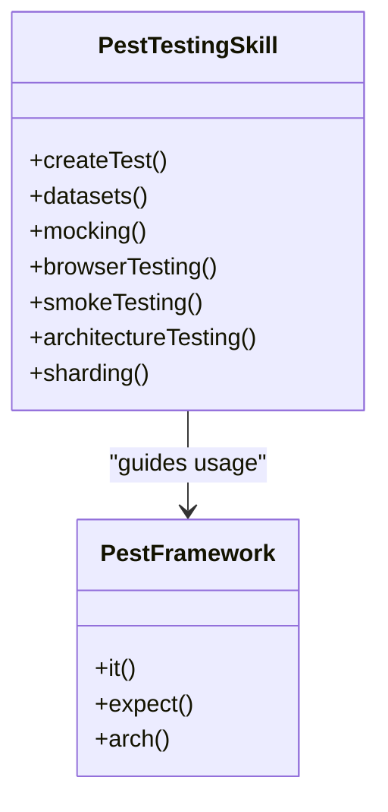
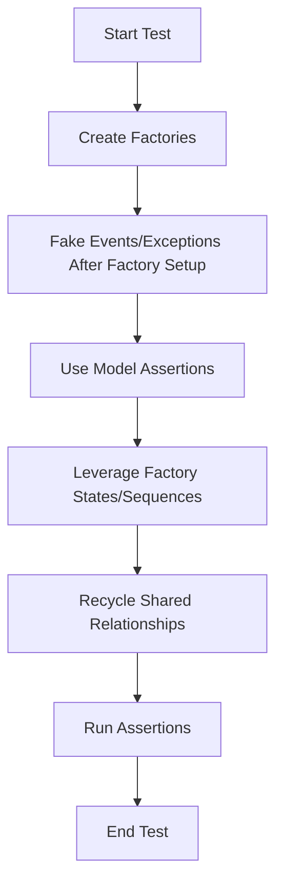
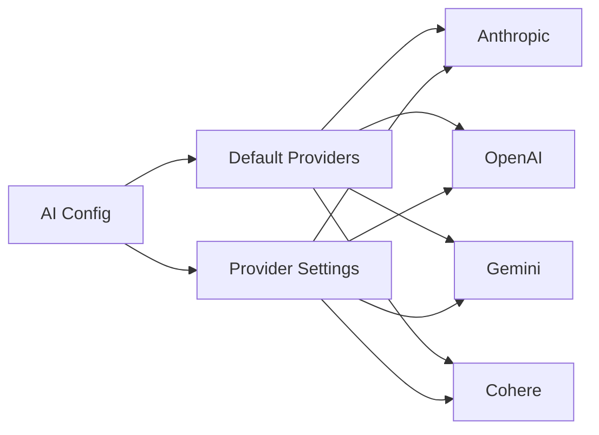
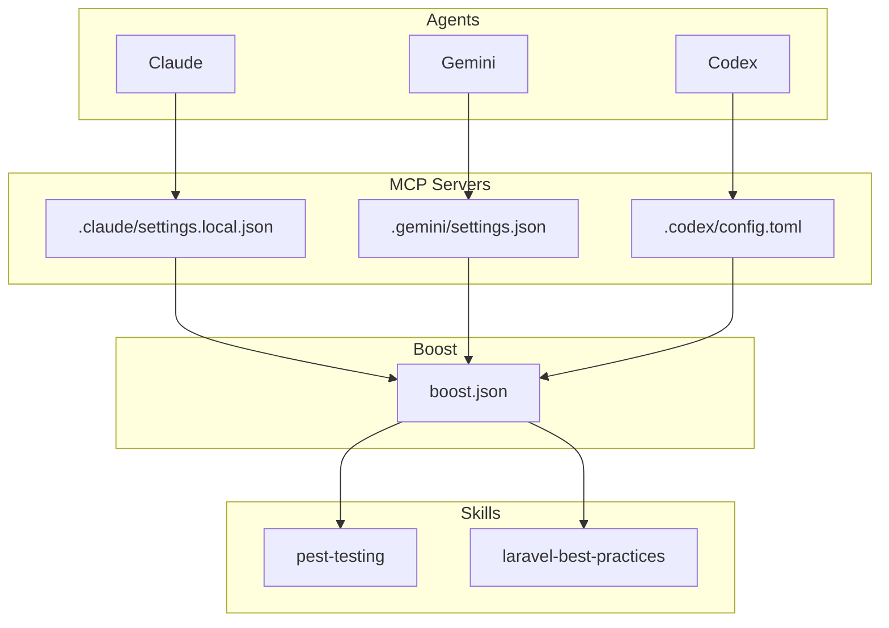
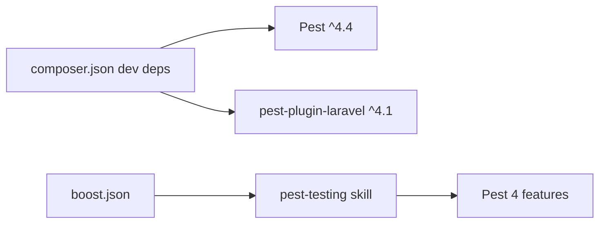

# AI-Assisted Testing Workflows

<cite>
**Referenced Files in This Document**
- [README.md](file://README.md)
- [AGENTS.md](file://AGENTS.md)
- [composer.json](file://composer.json)
- [phpunit.xml](file://phpunit.xml)
- [.agents/skills/pest-testing/SKILL.md](file://.agents/skills/pest-testing/SKILL.md)
- [.agents/skills/laravel-best-practices/SKILL.md](file://.agents/skills/laravel-best-practices/SKILL.md)
- [.agents/skills/laravel-best-practices/rules/testing.md](file://.agents/skills/laravel-best-practices/rules/testing.md)
- [tests/Pest.php](file://tests/Pest.php)
- [tests/TestCase.php](file://tests/TestCase.php)
- [tests/Feature/ExampleTest.php](file://tests/Feature/ExampleTest.php)
- [tests/Unit/ExampleTest.php](file://tests/Unit/ExampleTest.php)
- [config/ai.php](file://config/ai.php)
- [.claude/settings.local.json](file://.claude/settings.local.json)
- [.gemini/settings.json](file://.gemini/settings.json)
- [.codex/config.toml](file://.codex/config.toml)
- [boost.json](file://boost.json)
</cite>

## Table of Contents
1. [Introduction](#introduction)
2. [Project Structure](#project-structure)
3. [Core Components](#core-components)
4. [Architecture Overview](#architecture-overview)
5. [Detailed Component Analysis](#detailed-component-analysis)
6. [Dependency Analysis](#dependency-analysis)
7. [Performance Considerations](#performance-considerations)
8. [Troubleshooting Guide](#troubleshooting-guide)
9. [Conclusion](#conclusion)
10. [Appendices](#appendices)

## Introduction
This document explains how to leverage AI agents for AI-assisted testing workflows in Laravel projects, focusing on Pest-driven test automation and skill-based testing assistance. It covers how AI skills enhance testing processes such as automated test case generation, code coverage analysis, and test maintenance. It documents the integration between AI agents and the Pest framework, including intelligent test suggestion systems, practical AI-powered workflows, automated regression testing, and performance benchmarking. It also compares traditional testing methodologies with AI-enhanced approaches and outlines best practices for maintaining test quality while utilizing AI assistance.

## Project Structure
The repository is a Laravel application with Pest as the primary testing framework and a set of AI skills for Laravel development and testing. Key areas for AI-assisted testing include:
- Pest configuration and test harness
- Skill-based guidance for Pest usage and Laravel testing best practices
- AI provider configuration for agent-driven operations
- Agent configuration enabling MCP servers and skills

**Diagram sources**
- [composer.json:24-25](file://composer.json#L24-L25)
- [.agents/skills/pest-testing/SKILL.md:1-157](file://.agents/skills/pest-testing/SKILL.md#L1-L157)
- [.agents/skills/laravel-best-practices/SKILL.md:1-190](file://.agents/skills/laravel-best-practices/SKILL.md#L1-L190)
- [config/ai.php:52-129](file://config/ai.php#L52-L129)

**Section sources**
- [composer.json:17-26](file://composer.json#L17-L26)
- [AGENTS.md:24-30](file://AGENTS.md#L24-L30)
- [config/ai.php:16-132](file://config/ai.php#L16-L132)

## Core Components
- Pest configuration and test harness: The project uses Pest as the testing framework with a central configuration that extends the base test case and scopes test discovery to Feature tests. See [tests/Pest.php:16-18](file://tests/Pest.php#L16-L18).
- Pest skill: A dedicated skill defines Pest usage patterns, browser testing, smoke testing, architecture tests, datasets, and best practices for Pest 4. See [.agents/skills/pest-testing/SKILL.md:1-157](file://.agents/skills/pest-testing/SKILL.md#L1-L157).
- Laravel best practices skill: Includes testing best practices such as preferring lazy refresh of databases, using model assertions, factory states, and proper event/fake ordering. See [.agents/skills/laravel-best-practices/rules/testing.md:1-43](file://.agents/skills/laravel-best-practices/rules/testing.md#L1-L43).
- AI provider configuration: Centralized provider definitions enable agents to perform AI-assisted tasks. See [config/ai.php:52-129](file://config/ai.php#L52-L129).
- Agent configuration: MCP servers and skills are enabled via project configuration. See [.claude/settings.local.json:1-7](file://.claude/settings.local.json#L1-L7), [.gemini/settings.json:1-11](file://.gemini/settings.json#L1-L11), [.codex/config.toml:1-5](file://.codex/config.toml#L1-L5), and [boost.json:1-16](file://boost.json#L1-L16).

**Section sources**
- [tests/Pest.php:16-18](file://tests/Pest.php#L16-L18)
- [.agents/skills/pest-testing/SKILL.md:17-41](file://.agents/skills/pest-testing/SKILL.md#L17-L41)
- [.agents/skills/laravel-best-practices/rules/testing.md:3-5](file://.agents/skills/laravel-best-practices/rules/testing.md#L3-L5)
- [config/ai.php:52-129](file://config/ai.php#L52-L129)
- [.claude/settings.local.json:2-6](file://.claude/settings.local.json#L2-L6)
- [.gemini/settings.json:2-10](file://.gemini/settings.json#L2-L10)
- [.codex/config.toml:1-5](file://.codex/config.toml#L1-L5)
- [boost.json:11-15](file://boost.json#L11-L15)

## Architecture Overview
The AI-assisted testing architecture integrates Pest with AI skills and providers. Agents trigger skills to generate, refine, and validate tests, while the Laravel application provides the runtime context for test execution.

**Diagram sources**
- [.agents/skills/pest-testing/SKILL.md:17-41](file://.agents/skills/pest-testing/SKILL.md#L17-L41)
- [tests/Pest.php:16-18](file://tests/Pest.php#L16-L18)
- [config/ai.php:52-129](file://config/ai.php#L52-L129)

## Detailed Component Analysis

### Pest Configuration and Test Harness
- The Pest configuration extends the base test case and scopes test discovery to Feature tests. This ensures consistent test execution and alignment with Laravel conventions. See [tests/Pest.php:16-18](file://tests/Pest.php#L16-L18).
- The base TestCase class provides foundational testing capabilities. See [tests/TestCase.php:7-10](file://tests/TestCase.php#L7-L10).
- Example tests demonstrate Pest’s it()/expect() syntax and basic assertions. See [tests/Feature/ExampleTest.php:3-7](file://tests/Feature/ExampleTest.php#L3-L7) and [tests/Unit/ExampleTest.php:3-5](file://tests/Unit/ExampleTest.php#L3-L5).

**Diagram sources**
- [tests/Pest.php:16-18](file://tests/Pest.php#L16-L18)
- [composer.json:52-55](file://composer.json#L52-L55)

**Section sources**
- [tests/Pest.php:16-18](file://tests/Pest.php#L16-L18)
- [tests/TestCase.php:7-10](file://tests/TestCase.php#L7-L10)
- [tests/Feature/ExampleTest.php:3-7](file://tests/Feature/ExampleTest.php#L3-L7)
- [tests/Unit/ExampleTest.php:3-5](file://tests/Unit/ExampleTest.php#L3-L5)

### Pest Testing Skill
- Purpose: Guides Pest usage in Laravel projects, including test creation, datasets, mocking, browser testing, smoke testing, architecture tests, and sharding.
- Key capabilities:
  - Test creation and organization
  - Browser and smoke testing patterns
  - Architecture testing with Pest’s arch()
  - Sharding for parallel CI runs
- Practical examples:
  - Basic test structure and assertions
  - Browser test flows with visit/click/fill
  - Smoke testing multiple pages
  - Architecture enforcement patterns

**Diagram sources**
- [.agents/skills/pest-testing/SKILL.md:17-157](file://.agents/skills/pest-testing/SKILL.md#L17-L157)

**Section sources**
- [.agents/skills/pest-testing/SKILL.md:17-157](file://.agents/skills/pest-testing/SKILL.md#L17-L157)

### Laravel Best Practices Skill (Testing Focus)
- Purpose: Reinforces testing best practices aligned with Laravel conventions, ensuring efficient and reliable test suites.
- Key recommendations:
  - Prefer LazilyRefreshDatabase over RefreshDatabase for performance
  - Use model assertions (e.g., assertModelExists) over raw database assertions
  - Use factory states and sequences for expressive, maintainable tests
  - Fake events and exceptions after factory setup to preserve model behavior
  - Share relationship instances across factories using recycle()

**Diagram sources**
- [.agents/skills/laravel-best-practices/rules/testing.md:3-43](file://.agents/skills/laravel-best-practices/rules/testing.md#L3-L43)

**Section sources**
- [.agents/skills/laravel-best-practices/rules/testing.md:3-43](file://.agents/skills/laravel-best-practices/rules/testing.md#L3-L43)

### AI Provider Configuration
- The AI configuration defines default providers and provider-specific settings for text, embeddings, reranking, and other operations. This enables agents to perform reasoning, suggestions, and synthesis during testing workflows.
- Default provider assignments include anthropic, gemini, openai, cohere, and others. See [config/ai.php:16-21](file://config/ai.php#L16-L21).
- Provider credentials and endpoints are configured centrally. See [config/ai.php:52-129](file://config/ai.php#L52-L129).

**Diagram sources**
- [config/ai.php:16-21](file://config/ai.php#L16-L21)
- [config/ai.php:52-129](file://config/ai.php#L52-L129)

**Section sources**
- [config/ai.php:16-21](file://config/ai.php#L16-L21)
- [config/ai.php:52-129](file://config/ai.php#L52-L129)

### Agent Configuration and MCP Servers
- The project enables MCP servers for Claude, Gemini, and Codex, allowing agents to interact with Laravel Boost and skills.
- Configuration files define MCP server commands and working directories. See [.claude/settings.local.json:1-7](file://.claude/settings.local.json#L1-L7), [.gemini/settings.json:1-11](file://.gemini/settings.json#L1-L11), and [.codex/config.toml:1-5](file://.codex/config.toml#L1-L5).
- The boost configuration lists enabled agents and skills, including pest-testing and laravel-best-practices. See [boost.json:1-16](file://boost.json#L1-L16).

**Diagram sources**
- [.claude/settings.local.json:2-6](file://.claude/settings.local.json#L2-L6)
- [.gemini/settings.json:3-9](file://.gemini/settings.json#L3-L9)
- [.codex/config.toml:1-5](file://.codex/config.toml#L1-L5)
- [boost.json:11-15](file://boost.json#L11-L15)

**Section sources**
- [.claude/settings.local.json:2-6](file://.claude/settings.local.json#L2-L6)
- [.gemini/settings.json:3-9](file://.gemini/settings.json#L3-L9)
- [.codex/config.toml:1-5](file://.codex/config.toml#L1-L5)
- [boost.json:11-15](file://boost.json#L11-L15)

## Dependency Analysis
- Pest is a development dependency and is configured for Laravel projects. See [composer.json:24-25](file://composer.json#L24-L25).
- The Laravel Boost skill “pest-testing” is explicitly enabled in the project’s boost configuration. See [boost.json:11-15](file://boost.json#L11-L15).
- The Pest skill provides guidance for running tests, organizing tests, and leveraging Pest 4 features such as browser testing, smoke testing, architecture testing, and sharding. See [.agents/skills/pest-testing/SKILL.md:36-86](file://.agents/skills/pest-testing/SKILL.md#L36-L86).

**Diagram sources**
- [composer.json:24-25](file://composer.json#L24-L25)
- [boost.json:11-15](file://boost.json#L11-L15)
- [.agents/skills/pest-testing/SKILL.md:36-86](file://.agents/skills/pest-testing/SKILL.md#L36-L86)

**Section sources**
- [composer.json:24-25](file://composer.json#L24-L25)
- [boost.json:11-15](file://boost.json#L11-L15)
- [.agents/skills/pest-testing/SKILL.md:36-86](file://.agents/skills/pest-testing/SKILL.md#L36-L86)

## Performance Considerations
- Use LazilyRefreshDatabase to avoid unnecessary migrations across tests, improving suite performance. See [.agents/skills/laravel-best-practices/rules/testing.md:3-5](file://.agents/skills/laravel-best-practices/rules/testing.md#L3-L5).
- Prefer model assertions over raw database assertions for clarity and performance. See [.agents/skills/laravel-best-practices/rules/testing.md:7-13](file://.agents/skills/laravel-best-practices/rules/testing.md#L7-L13).
- Leverage datasets and factory states to minimize repetitive setup. See [.agents/skills/pest-testing/SKILL.md:63-76](file://.agents/skills/pest-testing/SKILL.md#L63-L76).
- Use Pest’s sharding for parallel CI runs to reduce total execution time. See [.agents/skills/pest-testing/SKILL.md:135-137](file://.agents/skills/pest-testing/SKILL.md#L135-L137).

[No sources needed since this section provides general guidance]

## Troubleshooting Guide
- Running tests: Use Artisan commands to run filtered or full test suites. See [AGENTS.md:150-152](file://AGENTS.md#L150-L152).
- PHPUnit configuration: The project uses SQLite in-memory database and array caches for testing. See [phpunit.xml:20-35](file://phpunit.xml#L20-L35).
- Browser and smoke testing: Ensure assertions for JavaScript errors and console logs are included in browser tests. See [.agents/skills/pest-testing/SKILL.md:120-129](file://.agents/skills/pest-testing/SKILL.md#L120-L129).
- Architecture tests: Use Pest’s arch() to enforce naming and inheritance conventions. See [.agents/skills/pest-testing/SKILL.md:139-149](file://.agents/skills/pest-testing/SKILL.md#L139-L149).

**Section sources**
- [AGENTS.md:150-152](file://AGENTS.md#L150-L152)
- [phpunit.xml:20-35](file://phpunit.xml#L20-L35)
- [.agents/skills/pest-testing/SKILL.md:120-129](file://.agents/skills/pest-testing/SKILL.md#L120-L129)
- [.agents/skills/pest-testing/SKILL.md:139-149](file://.agents/skills/pest-testing/SKILL.md#L139-L149)

## Conclusion
By combining Pest with AI skills and providers, teams can automate and elevate testing workflows. The pest-testing skill and Laravel best practices skill provide structured guidance for test generation, browser and smoke testing, architecture enforcement, and performance optimization. Centralized AI provider configuration enables agents to assist with reasoning, suggestions, and synthesis. Adopting AI-assisted testing alongside traditional methodologies yields improved test coverage, reduced maintenance overhead, and faster feedback loops.

[No sources needed since this section summarizes without analyzing specific files]

## Appendices

### Practical AI-Powered Testing Workflows
- Automated test case generation: Activate the pest-testing skill to generate it()/expect() patterns and browser flows tailored to Laravel features.
- Code coverage analysis: Use Pest’s built-in coverage reporting and CI sharding to track and improve coverage across Feature and Unit tests.
- Test maintenance assistance: Apply the laravel-best-practices skill to refactor tests, adopt factory states, and switch to model assertions for clarity and resilience.
- Intelligent test suggestion systems: Configure agents with MCP servers and skills to propose datasets, architecture tests, and browser smoke tests based on application behavior.

[No sources needed since this section provides general guidance]