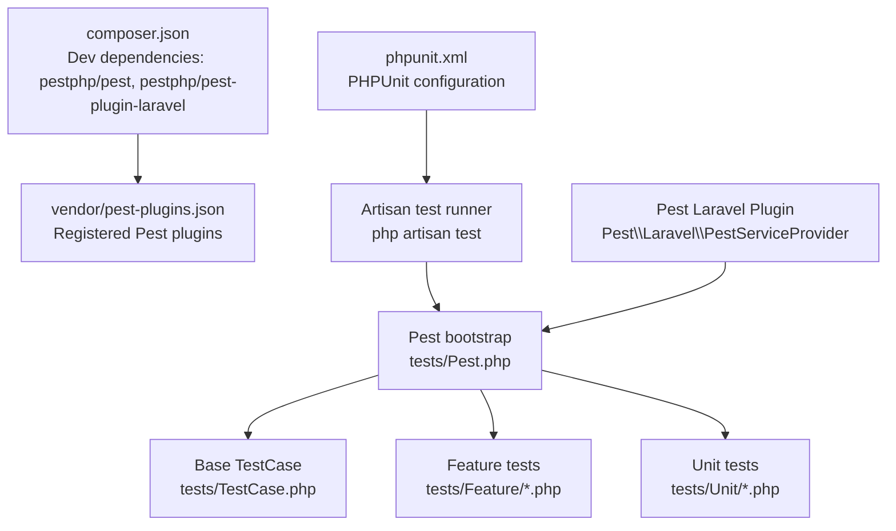
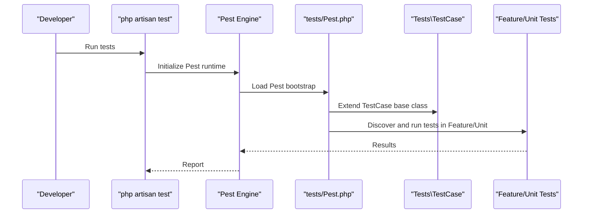
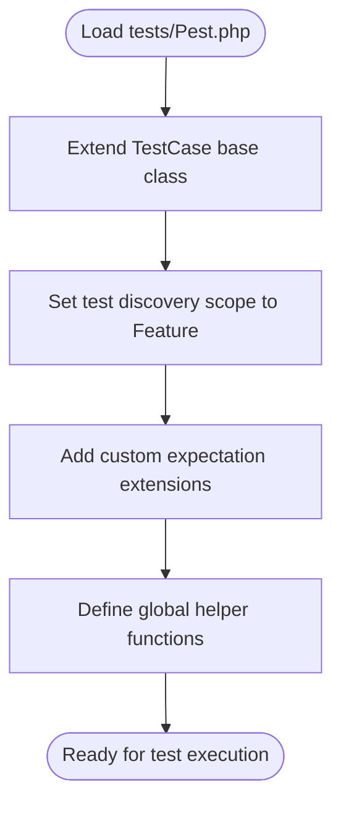
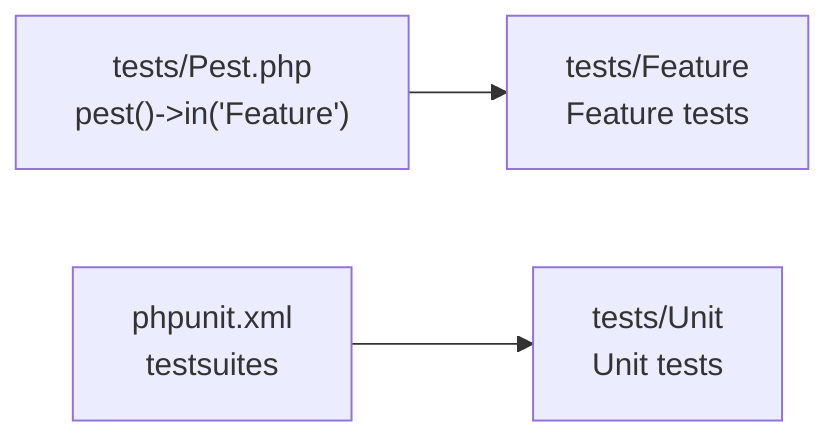
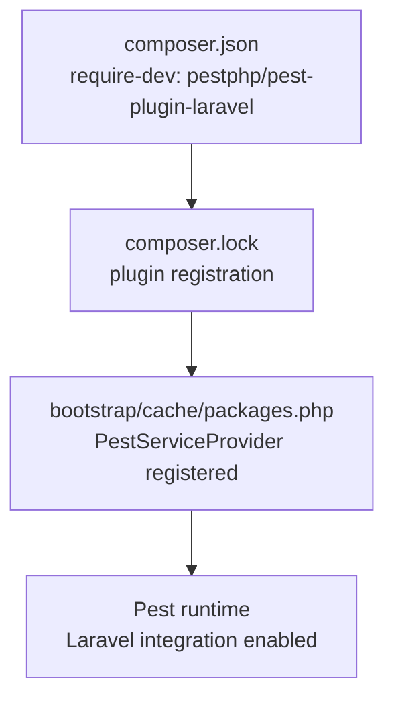
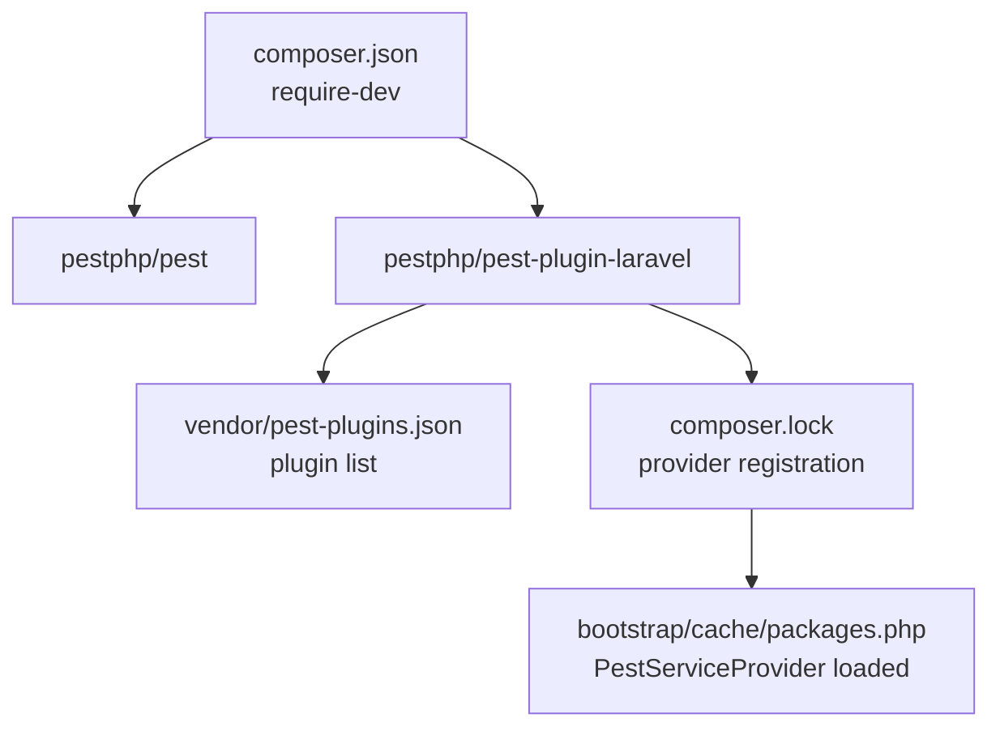

# Pest Framework Integration

<cite>
**Referenced Files in This Document**
- [composer.json](file://composer.json)
- [phpunit.xml](file://phpunit.xml)
- [tests/Pest.php](file://tests/Pest.php)
- [tests/TestCase.php](file://tests/TestCase.php)
- [tests/Feature/ExampleTest.php](file://tests/Feature/ExampleTest.php)
- [tests/Unit/ExampleTest.php](file://tests/Unit/ExampleTest.php)
- [vendor/pest-plugins.json](file://vendor/pest-plugins.json)
- [bootstrap/cache/packages.php](file://bootstrap/cache/packages.php)
- [.agents/skills/pest-testing/SKILL.md](file://.agents/skills/pest-testing/SKILL.md)
</cite>

## Table of Contents
1. [Introduction](#introduction)
2. [Project Structure](#project-structure)
3. [Core Components](#core-components)
4. [Architecture Overview](#architecture-overview)
5. [Detailed Component Analysis](#detailed-component-analysis)
6. [Dependency Analysis](#dependency-analysis)
7. [Performance Considerations](#performance-considerations)
8. [Troubleshooting Guide](#troubleshooting-guide)
9. [Conclusion](#conclusion)

## Introduction
This document explains how Pest PHP testing framework is integrated with Laravel in this project. It covers Pest initialization, global configuration, the TestCase base class, autoloading and test discovery, Laravel-specific integration via the Pest Laravel plugin, and practical guidance for configuration, custom assertions, helper functions, service container usage, database testing, and mocking. The goal is to make Pest accessible to newcomers while providing advanced configuration options for experienced users.

## Project Structure
The testing setup centers around a small set of files under the tests directory and Composer configuration that pulls in Pest and the Pest Laravel plugin. The project uses Laravel's Artisan test runner, which delegates to Pest.

**Diagram sources**
- [composer.json:17-26](file://composer.json#L17-L26)
- [vendor/pest-plugins.json:1-24](file://vendor/pest-plugins.json#L1-L24)
- [phpunit.xml:1-37](file://phpunit.xml#L1-L37)
- [tests/Pest.php:1-50](file://tests/Pest.php#L1-L50)
- [tests/TestCase.php:1-11](file://tests/TestCase.php#L1-L11)

**Section sources**
- [composer.json:17-26](file://composer.json#L17-L26)
- [composer.json:76-92](file://composer.json#L76-L92)
- [phpunit.xml:1-37](file://phpunit.xml#L1-L37)
- [tests/Pest.php:1-50](file://tests/Pest.php#L1-L50)
- [tests/TestCase.php:1-11](file://tests/TestCase.php#L1-L11)

## Core Components
- Pest bootstrap and configuration: Centralized in tests/Pest.php, where Pest is extended with the Laravel TestCase base class and configured to discover Feature tests.
- Base TestCase: Extends Laravel's testing TestCase to provide Laravel-specific helpers and container integration.
- Test suites: Feature and Unit tests are organized under tests/Feature and tests/Unit respectively.
- Pest Laravel plugin: Installed as a dev dependency and registered as a Pest plugin and Laravel service provider.

Key responsibilities:
- tests/Pest.php: Defines Pest extensions, expectations, and global helpers; sets up test discovery scope.
- tests/TestCase.php: Provides Laravel-aware base class for tests.
- composer.json: Declares Pest and the Pest Laravel plugin as dev dependencies and configures plugin loading.
- phpunit.xml: Configures the testing environment and database for running tests.

**Section sources**
- [tests/Pest.php:1-50](file://tests/Pest.php#L1-L50)
- [tests/TestCase.php:1-11](file://tests/TestCase.php#L1-L11)
- [composer.json:17-26](file://composer.json#L17-L26)
- [composer.json:76-92](file://composer.json#L76-L92)
- [phpunit.xml:1-37](file://phpunit.xml#L1-L37)

## Architecture Overview
The Laravel application integrates Pest through two primary mechanisms:
- Pest Laravel plugin: Adds Laravel-specific APIs and lifecycle hooks to Pest.
- Artisan test command: Runs Pest with Laravel's environment loaded via the Composer autoload and PHPUnit configuration.

**Diagram sources**
- [tests/Pest.php:16-18](file://tests/Pest.php#L16-L18)
- [tests/TestCase.php:7-10](file://tests/TestCase.php#L7-L10)
- [phpunit.xml:7-14](file://phpunit.xml#L7-L14)

## Detailed Component Analysis

### Pest Bootstrap and Global Configuration (tests/Pest.php)
Purpose:
- Extend Pest with the Laravel TestCase base class.
- Configure test discovery scope to Feature tests.
- Add custom expectation extensions and global helper functions.

Highlights:
- Extending the test case class binds Laravel's testing helpers and service container to each test closure.
- The in(...) directive scopes discovery to Feature tests; Unit tests are separate and can be configured similarly if desired.
- expect()->extend(...) adds custom assertion-like methods to Pest's expectation API.
- Global helper functions can be exposed for reuse across test files.

**Diagram sources**
- [tests/Pest.php:16-18](file://tests/Pest.php#L16-L18)
- [tests/Pest.php:31-33](file://tests/Pest.php#L31-L33)
- [tests/Pest.php:46-49](file://tests/Pest.php#L46-L49)

**Section sources**
- [tests/Pest.php:16-18](file://tests/Pest.php#L16-L18)
- [tests/Pest.php:31-33](file://tests/Pest.php#L31-L33)
- [tests/Pest.php:46-49](file://tests/Pest.php#L46-L49)

### Base TestCase Setup (tests/TestCase.php)
Purpose:
- Provide a Laravel-aware base class for all tests.
- Expose Laravel testing helpers, HTTP client, database helpers, and service container access.

Integration points:
- Inherits from Laravel's base TestCase, enabling features like actingAs, assert* methods, and database traits.
- Used by Pest bootstrap to bind the test closures to this base class.

**Section sources**
- [tests/TestCase.php:7-10](file://tests/TestCase.php#L7-L10)

### Test Discovery Patterns
- Feature tests live under tests/Feature and are discovered by Pest via the bootstrap configuration.
- Unit tests live under tests/Unit and are configured as separate test suites in phpunit.xml.
- Pest supports scoping discovery to directories and can be extended to include other locations if needed.

**Diagram sources**
- [tests/Pest.php:18](file://tests/Pest.php#L18)
- [phpunit.xml:7-14](file://phpunit.xml#L7-L14)

**Section sources**
- [tests/Pest.php:18](file://tests/Pest.php#L18)
- [phpunit.xml:7-14](file://phpunit.xml#L7-L14)

### Laravel Integration via Pest Plugin
- The Pest Laravel plugin is installed as a dev dependency and registered as both a Pest plugin and a Laravel service provider.
- The plugin enables Laravel-specific APIs inside Pest tests and integrates Pest with Laravel's service container and testing facilities.

Evidence:
- composer.json lists pestphp/pest-plugin-laravel in require-dev.
- composer.lock shows the plugin registers Pest\\Laravel\\Plugin and Pest\\Laravel\\PestServiceProvider.
- bootstrap/cache/packages.php confirms the Pest Laravel provider is registered.

**Diagram sources**
- [composer.json:25](file://composer.json#L25)
- [composer.lock:7480-7487](file://composer.lock#L7480-L7487)
- [bootstrap/cache/packages.php:69-75](file://bootstrap/cache/packages.php#L69-L75)

**Section sources**
- [composer.json:25](file://composer.json#L25)
- [composer.lock:7480-7487](file://composer.lock#L7480-L7487)
- [bootstrap/cache/packages.php:69-75](file://bootstrap/cache/packages.php#L69-L75)

### Practical Configuration Options
- Custom expectations: Extend Pest's expectation API with domain-specific assertions.
- Global helpers: Define reusable functions to reduce boilerplate in tests.
- Test discovery scope: Control which directories Pest scans for tests.
- Database and environment: Configure database connections and environment variables via phpunit.xml.

Examples (paths only):
- Custom expectation extension: [tests/Pest.php:31-33](file://tests/Pest.php#L31-L33)
- Global helper definition: [tests/Pest.php:46-49](file://tests/Pest.php#L46-L49)
- Test discovery scope: [tests/Pest.php:18](file://tests/Pest.php#L18)
- Environment configuration: [phpunit.xml:20-35](file://phpunit.xml#L20-L35)

**Section sources**
- [tests/Pest.php:31-33](file://tests/Pest.php#L31-L33)
- [tests/Pest.php:46-49](file://tests/Pest.php#L46-L49)
- [tests/Pest.php:18](file://tests/Pest.php#L18)
- [phpunit.xml:20-35](file://phpunit.xml#L20-L35)

### Custom Assertions and Helper Functions
- Custom assertions: Use expect()->extend(...) to add expressive, reusable checks.
- Helper functions: Define global functions in the Pest bootstrap to encapsulate common operations.

References:
- [tests/Pest.php:31-33](file://tests/Pest.php#L31-L33)
- [tests/Pest.php:46-49](file://tests/Pest.php#L46-L49)

**Section sources**
- [tests/Pest.php:31-33](file://tests/Pest.php#L31-L33)
- [tests/Pest.php:46-49](file://tests/Pest.php#L46-L49)

### Laravel Service Container, Database Testing, and Mocking
- Service container: Tests inherit Laravel's TestCase, which provides access to the container and resolved dependencies.
- Database testing: Laravel's database testing traits (e.g., RefreshDatabase) can be applied via the TestCase or Pest extensions.
- Mocking: Use Pest's Laravel helpers to mock classes and fakes for notifications, events, and external services.

References:
- [tests/TestCase.php:7-10](file://tests/TestCase.php#L7-L10)
- [composer.json:25](file://composer.json#L25)
- [.agents/skills/pest-testing/SKILL.md:59-61](file://.agents/skills/pest-testing/SKILL.md#L59-L61)

**Section sources**
- [tests/TestCase.php:7-10](file://tests/TestCase.php#L7-L10)
- [composer.json:25](file://composer.json#L25)
- [.agents/skills/pest-testing/SKILL.md:59-61](file://.agents/skills/pest-testing/SKILL.md#L59-L61)

### Pest-Specific Testing Patterns
- Prefer expressive assertions over generic status checks.
- Use datasets for repetitive validations.
- Leverage browser testing, smoke testing, and architecture tests where applicable.

References:
- [.agents/skills/pest-testing/SKILL.md:42-57](file://.agents/skills/pest-testing/SKILL.md#L42-L57)
- [.agents/skills/pest-testing/SKILL.md:63-75](file://.agents/skills/pest-testing/SKILL.md#L63-L75)
- [.agents/skills/pest-testing/SKILL.md:77-85](file://.agents/skills/pest-testing/SKILL.md#L77-L85)

**Section sources**
- [.agents/skills/pest-testing/SKILL.md:42-57](file://.agents/skills/pest-testing/SKILL.md#L42-L57)
- [.agents/skills/pest-testing/SKILL.md:63-75](file://.agents/skills/pest-testing/SKILL.md#L63-L75)
- [.agents/skills/pest-testing/SKILL.md:77-85](file://.agents/skills/pest-testing/SKILL.md#L77-L85)

## Dependency Analysis
The integration relies on Composer-managed dependencies and Pest plugin registration.

**Diagram sources**
- [composer.json:17-26](file://composer.json#L17-L26)
- [vendor/pest-plugins.json:1-24](file://vendor/pest-plugins.json#L1-L24)
- [composer.lock:7480-7487](file://composer.lock#L7480-L7487)
- [bootstrap/cache/packages.php:69-75](file://bootstrap/cache/packages.php#L69-L75)

**Section sources**
- [composer.json:17-26](file://composer.json#L17-L26)
- [vendor/pest-plugins.json:1-24](file://vendor/pest-plugins.json#L1-L24)
- [composer.lock:7480-7487](file://composer.lock#L7480-L7487)
- [bootstrap/cache/packages.php:69-75](file://bootstrap/cache/packages.php#L69-L75)

## Performance Considerations
- Use Pest's built-in plugins (e.g., parallelization, sharding) to speed up CI runs.
- Keep test suites scoped (Feature/Unit) to avoid unnecessary scanning.
- Prefer lightweight assertions and targeted mocks to reduce overhead.
- Use compact reporting during development and filter tests when debugging.

References:
- [.agents/skills/pest-testing/SKILL.md:36-41](file://.agents/skills/pest-testing/SKILL.md#L36-L41)
- [vendor/pest-plugins.json:1-24](file://vendor/pest-plugins.json#L1-L24)

**Section sources**
- [.agents/skills/pest-testing/SKILL.md:36-41](file://.agents/skills/pest-testing/SKILL.md#L36-L41)
- [vendor/pest-plugins.json:1-24](file://vendor/pest-plugins.json#L1-L24)

## Troubleshooting Guide
Common issues and remedies:
- Missing Laravel helpers: Ensure the TestCase base class is extended in Pest bootstrap.
- Database state issues: Apply database refresh or migration traits via the TestCase or Pest extensions.
- Mocking failures: Import the mock function before use in tests.
- Browser test errors: Verify browser testing prerequisites and use assertion helpers for JavaScript errors.

References:
- [tests/Pest.php:16](file://tests/Pest.php#L16)
- [.agents/skills/pest-testing/SKILL.md:59-61](file://.agents/skills/pest-testing/SKILL.md#L59-L61)
- [.agents/skills/pest-testing/SKILL.md:151-157](file://.agents/skills/pest-testing/SKILL.md#L151-L157)

**Section sources**
- [tests/Pest.php:16](file://tests/Pest.php#L16)
- [.agents/skills/pest-testing/SKILL.md:59-61](file://.agents/skills/pest-testing/SKILL.md#L59-L61)
- [.agents/skills/pest-testing/SKILL.md:151-157](file://.agents/skills/pest-testing/SKILL.md#L151-L157)

## Conclusion
This project integrates Pest with Laravel through a concise bootstrap configuration, a Laravel-aware TestCase, and the Pest Laravel plugin. The setup enables expressive tests, Laravel-specific helpers, and scalable test discovery. Developers can enhance the suite with custom expectations, helpers, and advanced Pest features while leveraging Laravel's service container, database testing, and mocking capabilities.