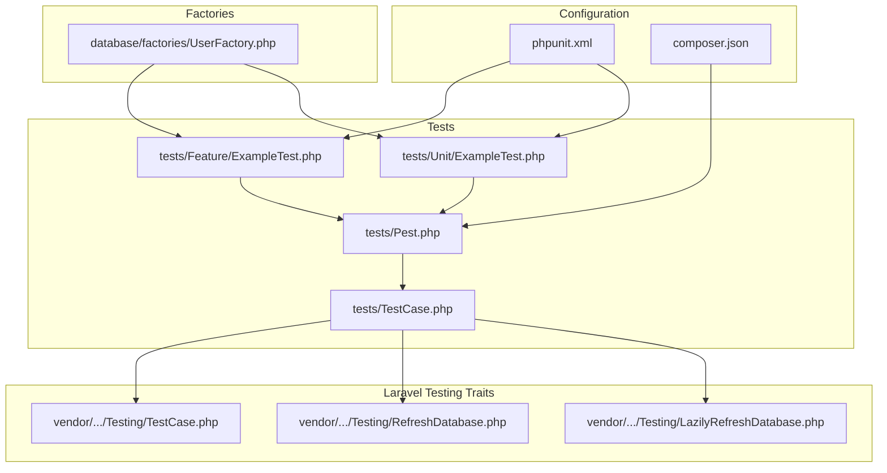
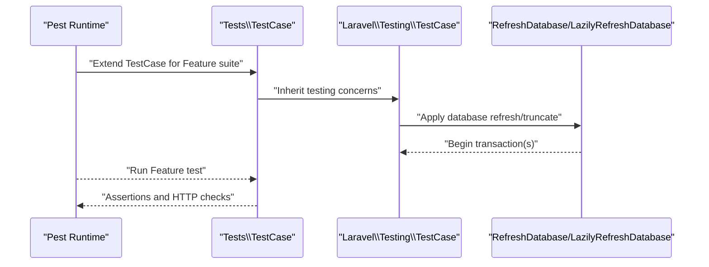
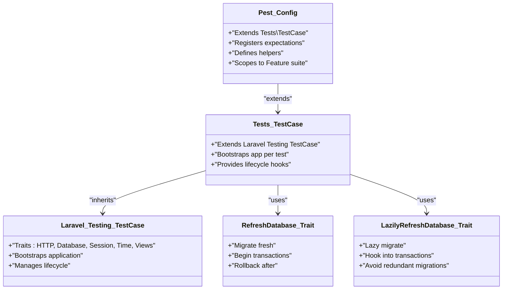

# Test Organization and Patterns

<cite>
**Referenced Files in This Document**
- [tests/TestCase.php](file://tests/TestCase.php)
- [tests/Pest.php](file://tests/Pest.php)
- [phpunit.xml](file://phpunit.xml)
- [tests/Feature/ExampleTest.php](file://tests/Feature/ExampleTest.php)
- [tests/Unit/ExampleTest.php](file://tests/Unit/ExampleTest.php)
- [database/factories/UserFactory.php](file://database/factories/UserFactory.php)
- [vendor/laravel/framework/src/Illuminate/Foundation/Testing/TestCase.php](file://vendor/laravel/framework/src/Illuminate/Foundation/Testing/TestCase.php)
- [vendor/laravel/framework/src/Illuminate/Foundation/Testing/LazilyRefreshDatabase.php](file://vendor/laravel/framework/src/Illuminate/Foundation/Testing/LazilyRefreshDatabase.php)
- [vendor/laravel/framework/src/Illuminate/Foundation/Testing/RefreshDatabase.php](file://vendor/laravel/framework/src/Illuminate/Foundation/Testing/RefreshDatabase.php)
- [.agents/skills/laravel-best-practices/rules/testing.md](file://.agents/skills/laravel-best-practices/rules/testing.md)
- [composer.json](file://composer.json)
</cite>

## Table of Contents
1. [Introduction](#introduction)
2. [Project Structure](#project-structure)
3. [Core Components](#core-components)
4. [Architecture Overview](#architecture-overview)
5. [Detailed Component Analysis](#detailed-component-analysis)
6. [Dependency Analysis](#dependency-analysis)
7. [Performance Considerations](#performance-considerations)
8. [Troubleshooting Guide](#troubleshooting-guide)
9. [Conclusion](#conclusion)
10. [Appendices](#appendices)

## Introduction
This document provides comprehensive guidance for organizing and structuring effective test suites in Laravel applications. It focuses on the distinction between unit and feature tests, directory organization, naming conventions, and test patterns such as Arrange-Act-Assert and test isolation. It also covers reusable test helpers, shared utilities, factory usage, database transaction strategies, performance optimization, parallel execution, and CI considerations. The content is grounded in the repository’s existing Pest-based configuration and Laravel testing traits.

## Project Structure
The repository adopts a Pest-driven testing setup with a conventional Laravel test layout:
- tests/TestCase.php defines a base test case class extending the Laravel testing TestCase.
- tests/Pest.php configures Pest extensions, global expectations, and global helper functions, and scopes Pest to the Feature directory.
- phpunit.xml declares two test suites: Unit and Feature, and sets environment variables for a fast, isolated testing environment.
- tests/Feature and tests/Unit contain example tests demonstrating Pest’s test() syntax and expect-based assertions.
- database/factories contains Eloquent factories for model creation and seeding.

**Diagram sources**
- [tests/TestCase.php:1-11](file://tests/TestCase.php#L1-L11)
- [tests/Pest.php:1-50](file://tests/Pest.php#L1-L50)
- [phpunit.xml:1-37](file://phpunit.xml#L1-L37)
- [tests/Feature/ExampleTest.php:1-8](file://tests/Feature/ExampleTest.php#L1-L8)
- [tests/Unit/ExampleTest.php:1-6](file://tests/Unit/ExampleTest.php#L1-L6)
- [database/factories/UserFactory.php:1-46](file://database/factories/UserFactory.php#L1-L46)
- [vendor/laravel/framework/src/Illuminate/Foundation/Testing/TestCase.php:1-125](file://vendor/laravel/framework/src/Illuminate/Foundation/Testing/TestCase.php#L1-L125)
- [vendor/laravel/framework/src/Illuminate/Foundation/Testing/RefreshDatabase.php:1-201](file://vendor/laravel/framework/src/Illuminate/Foundation/Testing/RefreshDatabase.php#L1-L201)
- [vendor/laravel/framework/src/Illuminate/Foundation/Testing/LazilyRefreshDatabase.php:1-48](file://vendor/laravel/framework/src/Illuminate/Foundation/Testing/LazilyRefreshDatabase.php#L1-L48)

**Section sources**
- [tests/TestCase.php:1-11](file://tests/TestCase.php#L1-L11)
- [tests/Pest.php:1-50](file://tests/Pest.php#L1-L50)
- [phpunit.xml:1-37](file://phpunit.xml#L1-L37)
- [tests/Feature/ExampleTest.php:1-8](file://tests/Feature/ExampleTest.php#L1-L8)
- [tests/Unit/ExampleTest.php:1-6](file://tests/Unit/ExampleTest.php#L1-L6)
- [database/factories/UserFactory.php:1-46](file://database/factories/UserFactory.php#L1-L46)

## Core Components
- Base test case: tests/TestCase.php extends Laravel’s testing TestCase, which aggregates multiple concerns for HTTP requests, database interactions, sessions, time manipulation, lifecycle hooks, and view rendering. This forms the foundation for all tests.
- Pest configuration: tests/Pest.php extends the base test case for Feature tests, registers global expectations and helper functions, and scopes Pest to the Feature directory.
- Test suites: phpunit.xml defines Unit and Feature suites and configures environment variables for speed and isolation (e.g., SQLite in-memory database).
- Example tests: tests/Feature/ExampleTest.php demonstrates a feature-style test using Pest’s test() and HTTP assertions. tests/Unit/ExampleTest.php demonstrates a unit-style assertion using expect().
- Factories: database/factories/UserFactory.php provides a reusable factory for creating model instances with default attributes and named states.

Key responsibilities:
- tests/TestCase.php: Provides shared application bootstrap, lifecycle hooks, and convenience methods for HTTP, database, and container interactions.
- tests/Pest.php: Centralizes Pest-specific configuration, expectations, and helpers scoped to Feature tests.
- phpunit.xml: Declares test suites and sets environment variables for fast, isolated testing.
- Example tests: Demonstrate Pest syntax and assertion styles for feature and unit contexts.
- UserFactory: Encapsulates model creation and default state, enabling concise and expressive tests.

**Section sources**
- [tests/TestCase.php:1-11](file://tests/TestCase.php#L1-L11)
- [tests/Pest.php:1-50](file://tests/Pest.php#L1-L50)
- [phpunit.xml:1-37](file://phpunit.xml#L1-L37)
- [tests/Feature/ExampleTest.php:1-8](file://tests/Feature/ExampleTest.php#L1-L8)
- [tests/Unit/ExampleTest.php:1-6](file://tests/Unit/ExampleTest.php#L1-L6)
- [database/factories/UserFactory.php:1-46](file://database/factories/UserFactory.php#L1-L46)

## Architecture Overview
The testing architecture centers on Pest and Laravel’s testing traits. Pest extends the base test case for Feature tests, while Unit tests are executed via Pest’s expect-based syntax. Laravel’s RefreshDatabase and LazilyRefreshDatabase traits manage database migrations and transactions per test, ensuring isolation and speed.

**Diagram sources**
- [tests/Pest.php:16-18](file://tests/Pest.php#L16-L18)
- [tests/TestCase.php:7-10](file://tests/TestCase.php#L7-L10)
- [vendor/laravel/framework/src/Illuminate/Foundation/Testing/TestCase.php:12-24](file://vendor/laravel/framework/src/Illuminate/Foundation/Testing/TestCase.php#L12-L24)
- [vendor/laravel/framework/src/Illuminate/Foundation/Testing/RefreshDatabase.php:17-28](file://vendor/laravel/framework/src/Illuminate/Foundation/Testing/RefreshDatabase.php#L17-L28)
- [vendor/laravel/framework/src/Illuminate/Foundation/Testing/LazilyRefreshDatabase.php:16-46](file://vendor/laravel/framework/src/Illuminate/Foundation/Testing/LazilyRefreshDatabase.php#L16-L46)

## Detailed Component Analysis

### Pest Configuration and Scoping
- Pest extension: tests/Pest.php extends the base test case class for Feature tests, aligning all Feature tests with Laravel’s testing capabilities.
- Global expectations and helpers: tests/Pest.php registers custom expectations and exposes global helper functions, reducing duplication across Feature tests.
- Scoping: tests/Pest.php confines Pest execution to the Feature directory, allowing Unit tests to be managed independently.

Best practices derived from the repository:
- Keep Feature tests scoped to the Feature directory and leverage Pest’s extension mechanism.
- Centralize expectation and helper definitions in tests/Pest.php to avoid repetition.

**Section sources**
- [tests/Pest.php:16-18](file://tests/Pest.php#L16-L18)
- [tests/Pest.php:31-33](file://tests/Pest.php#L31-L33)
- [tests/Pest.php:46-49](file://tests/Pest.php#L46-L49)

### Base Test Case and Lifecycle
- tests/TestCase.php extends Laravel’s testing TestCase, inheriting traits for HTTP, database, authentication, console, session, time, lifecycle, and view interactions.
- The base class ensures the application boots per test and cleans up afterward, providing a consistent environment for all tests.

Implications:
- All Feature and Unit tests benefit from the same lifecycle and convenience methods.
- Use the base class to share setup logic across suites.

**Section sources**
- [tests/TestCase.php:7-10](file://tests/TestCase.php#L7-L10)
- [vendor/laravel/framework/src/Illuminate/Foundation/Testing/TestCase.php:12-24](file://vendor/laravel/framework/src/Illuminate/Foundation/Testing/TestCase.php#L12-L24)
- [vendor/laravel/framework/src/Illuminate/Foundation/Testing/TestCase.php:64-97](file://vendor/laravel/framework/src/Illuminate/Foundation/Testing/TestCase.php#L64-L97)

### Test Suites and Environment
- phpunit.xml defines two suites: Unit and Feature, and sets environment variables for a fast, isolated testing environment:
  - APP_ENV: testing
  - CACHE_STORE: array
  - DB_CONNECTION: sqlite with DB_DATABASE set to an in-memory target
  - QUEUE_CONNECTION: sync
  - SESSION_DRIVER: array
  - PULSE_ENABLED, TELESCOPE_ENABLED, NIGHTWATCH_ENABLED disabled for speed

Guidelines:
- Keep suites distinct to enable targeted execution.
- Favor in-memory databases and array stores for speed.

**Section sources**
- [phpunit.xml:7-14](file://phpunit.xml#L7-L14)
- [phpunit.xml:20-35](file://phpunit.xml#L20-L35)

### Example Tests: Feature vs Unit
- tests/Feature/ExampleTest.php: Demonstrates a feature-style test using Pest’s test() and HTTP assertions against the application’s root route.
- tests/Unit/ExampleTest.php: Demonstrates a unit-style assertion using expect().

Patterns:
- Feature tests: Use Pest’s test() with HTTP helpers and assertions.
- Unit tests: Use expect() for value-based assertions.

**Section sources**
- [tests/Feature/ExampleTest.php:1-8](file://tests/Feature/ExampleTest.php#L1-L8)
- [tests/Unit/ExampleTest.php:1-6](file://tests/Unit/ExampleTest.php#L1-L6)

### Factory Usage and Naming Conventions
- database/factories/UserFactory.php defines default model state and a named state (e.g., unverified) to produce realistic, self-documenting test data.
- Naming convention: PascalCase for factory classes, snake_case for state methods, and clear attribute names.

Recommended usage:
- Prefer named states to express intent (e.g., unverified).
- Keep default state minimal and deterministic.

**Section sources**
- [database/factories/UserFactory.php:13-45](file://database/factories/UserFactory.php#L13-L45)

### Database Transaction Strategies
- RefreshDatabase: Applies migrations once per suite and begins/rolls back transactions per test for isolation.
- LazilyRefreshDatabase: Migrates only when needed, avoiding repeated migrations when the schema has not changed, improving performance for large suites.

Implementation highlights:
- RefreshDatabase manages in-memory database restoration, transaction begin/rollback, and connection cleanup.
- LazilyRefreshDatabase hooks into transaction lifecycle to avoid redundant migrations.

**Section sources**
- [vendor/laravel/framework/src/Illuminate/Foundation/Testing/RefreshDatabase.php:17-28](file://vendor/laravel/framework/src/Illuminate/Foundation/Testing/RefreshDatabase.php#L17-L28)
- [vendor/laravel/framework/src/Illuminate/Foundation/Testing/RefreshDatabase.php:81-94](file://vendor/laravel/framework/src/Illuminate/Foundation/Testing/RefreshDatabase.php#L81-L94)
- [vendor/laravel/framework/src/Illuminate/Foundation/Testing/RefreshDatabase.php:127-167](file://vendor/laravel/framework/src/Illuminate/Foundation/Testing/RefreshDatabase.php#L127-L167)
- [vendor/laravel/framework/src/Illuminate/Foundation/Testing/LazilyRefreshDatabase.php:16-46](file://vendor/laravel/framework/src/Illuminate/Foundation/Testing/LazilyRefreshDatabase.php#L16-L46)

### Test Isolation Principles and Dependency Injection
- Isolation: Transactions are started per test and rolled back automatically, ensuring state does not leak between tests.
- Dependency injection: Use the base test case to resolve services from the container and inject dependencies into tested classes or methods.

Practical tips:
- Avoid relying on external services in tests; mock or fake them.
- Use container resolution to supply dependencies during tests.

**Section sources**
- [vendor/laravel/framework/src/Illuminate/Foundation/Testing/TestCase.php:14-24](file://vendor/laravel/framework/src/Illuminate/Foundation/Testing/TestCase.php#L14-L24)
- [vendor/laravel/framework/src/Illuminate/Foundation/Testing/RefreshDatabase.php:127-167](file://vendor/laravel/framework/src/Illuminate/Foundation/Testing/RefreshDatabase.php#L127-L167)

### Reusable Test Helpers and Shared Utilities
- tests/Pest.php: Registers global expectations and helper functions, enabling concise assertions and shared logic across Feature tests.
- Composer autoload-dev: Ensures the Tests namespace resolves to the tests directory, supporting shared utilities.

Recommendations:
- Centralize shared expectations and helpers in tests/Pest.php.
- Use autoload-dev to expose shared utilities under the Tests namespace.

**Section sources**
- [tests/Pest.php:31-33](file://tests/Pest.php#L31-L33)
- [tests/Pest.php:46-49](file://tests/Pest.php#L46-L49)
- [composer.json:34-37](file://composer.json#L34-L37)

### Test Data Management and Factories
- Factories encapsulate creation logic and default attributes, enabling fast, deterministic test data generation.
- Use named states to express variations (e.g., unverified) and keep factories cohesive.

Guidelines:
- Keep factory definitions close to models.
- Use sequences sparingly; prefer named states for clarity.

**Section sources**
- [database/factories/UserFactory.php:25-34](file://database/factories/UserFactory.php#L25-L34)
- [database/factories/UserFactory.php:39-44](file://database/factories/UserFactory.php#L39-L44)

### Test Patterns: Arrange-Act-Assert
- Arrange: Set up dependencies and test data using factories and container resolution.
- Act: Invoke the system under test (e.g., HTTP requests or method calls).
- Assert: Verify outcomes using expect() or HTTP assertions.

Repository examples:
- Feature test arranges an HTTP request and asserts the response status.
- Unit test arranges a boolean condition and asserts it is true.

**Section sources**
- [tests/Feature/ExampleTest.php:3-7](file://tests/Feature/ExampleTest.php#L3-L7)
- [tests/Unit/ExampleTest.php:3-5](file://tests/Unit/ExampleTest.php#L3-L5)

### Continuous Integration Considerations
- phpunit.xml sets environment variables optimized for speed and isolation (e.g., in-memory database, array cache/session).
- Composer scripts provide a standardized way to run tests, clearing configuration caches before execution.

Recommendations:
- Keep CI environments aligned with phpunit.xml settings.
- Use Composer scripts to ensure consistent test execution.

**Section sources**
- [phpunit.xml:20-35](file://phpunit.xml#L20-L35)
- [composer.json:52-55](file://composer.json#L52-L55)

## Dependency Analysis
The following diagram shows how Pest, the base test case, and Laravel’s testing traits interrelate and influence test execution.

**Diagram sources**
- [tests/Pest.php:16-18](file://tests/Pest.php#L16-L18)
- [tests/TestCase.php:7-10](file://tests/TestCase.php#L7-L10)
- [vendor/laravel/framework/src/Illuminate/Foundation/Testing/TestCase.php:12-24](file://vendor/laravel/framework/src/Illuminate/Foundation/Testing/TestCase.php#L12-L24)
- [vendor/laravel/framework/src/Illuminate/Foundation/Testing/RefreshDatabase.php:8-28](file://vendor/laravel/framework/src/Illuminate/Foundation/Testing/RefreshDatabase.php#L8-L28)
- [vendor/laravel/framework/src/Illuminate/Foundation/Testing/LazilyRefreshDatabase.php:5-16](file://vendor/laravel/framework/src/Illuminate/Foundation/Testing/LazilyRefreshDatabase.php#L5-L16)

**Section sources**
- [tests/Pest.php:16-18](file://tests/Pest.php#L16-L18)
- [tests/TestCase.php:7-10](file://tests/TestCase.php#L7-L10)
- [vendor/laravel/framework/src/Illuminate/Foundation/Testing/TestCase.php:12-24](file://vendor/laravel/framework/src/Illuminate/Foundation/Testing/TestCase.php#L12-L24)
- [vendor/laravel/framework/src/Illuminate/Foundation/Testing/RefreshDatabase.php:8-28](file://vendor/laravel/framework/src/Illuminate/Foundation/Testing/RefreshDatabase.php#L8-L28)
- [vendor/laravel/framework/src/Illuminate/Foundation/Testing/LazilyRefreshDatabase.php:5-16](file://vendor/laravel/framework/src/Illuminate/Foundation/Testing/LazilyRefreshDatabase.php#L5-L16)

## Performance Considerations
- Use LazilyRefreshDatabase to avoid repeated migrations when the schema has not changed.
- Prefer in-memory SQLite databases and array stores to minimize I/O overhead.
- Keep suites separated to enable targeted runs and parallelization where supported.

Evidence from repository:
- phpunit.xml configures DB_CONNECTION=sqlite with DB_DATABASE=:memory:.
- LazilyRefreshDatabase trait hooks into transaction lifecycle to avoid redundant migrations.

**Section sources**
- [phpunit.xml:26-28](file://phpunit.xml#L26-L28)
- [vendor/laravel/framework/src/Illuminate/Foundation/Testing/LazilyRefreshDatabase.php:16-46](file://vendor/laravel/framework/src/Illuminate/Foundation/Testing/LazilyRefreshDatabase.php#L16-L46)

## Troubleshooting Guide
Common issues and remedies:
- Schema changes mid-run: Ensure migrations are applied before tests and transactions are rolled back per test.
- Event interference: Follow best practice to call Event::fake() after factory setup to avoid breaking models created by factory events.
- Exception reporting: Use Exceptions::fake() to assert exceptions were reported while maintaining normal request completion.

Repository-backed guidance:
- Prefer LazilyRefreshDatabase over RefreshDatabase for large suites.
- Use model assertions over raw database assertions for clarity.
- Use factory states and sequences for expressive, maintainable tests.
- Call Event::fake() after factory setup to prevent event silencing issues.

**Section sources**
- [.agents/skills/laravel-best-practices/rules/testing.md:3-6](file://.agents/skills/laravel-best-practices/rules/testing.md#L3-L6)
- [.agents/skills/laravel-best-practices/rules/testing.md:7-13](file://.agents/skills/laravel-best-practices/rules/testing.md#L7-L13)
- [.agents/skills/laravel-best-practices/rules/testing.md:15-22](file://.agents/skills/laravel-best-practices/rules/testing.md#L15-L22)
- [.agents/skills/laravel-best-practices/rules/testing.md:23-34](file://.agents/skills/laravel-best-practices/rules/testing.md#L23-L34)

## Conclusion
This guide outlines a practical, repository-aligned approach to organizing and executing Laravel tests. By leveraging Pest’s scoping, the base test case, and Laravel’s database traits, teams can achieve fast, isolated, and maintainable test suites. The repository’s configuration and examples demonstrate clear patterns for feature and unit tests, factory usage, and performance-conscious strategies.

## Appendices
- Pest best practices: See the repository’s testing best practices document for additional guidance on traits, assertions, and factory usage.
- Composer scripts: Use the provided script to run tests consistently across environments.

**Section sources**
- [.agents/skills/laravel-best-practices/rules/testing.md:1-43](file://.agents/skills/laravel-best-practices/rules/testing.md#L1-L43)
- [composer.json:52-55](file://composer.json#L52-L55)