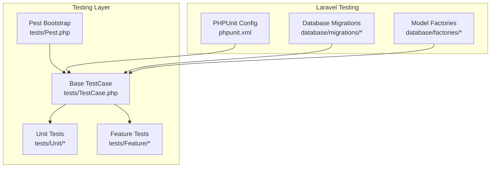
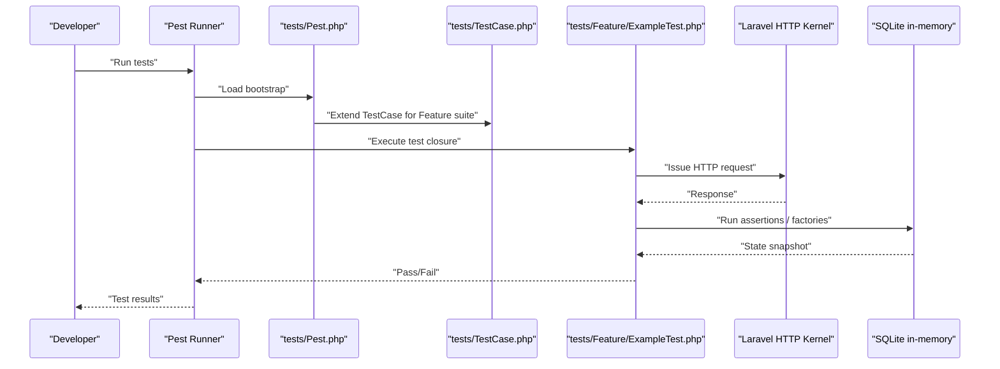
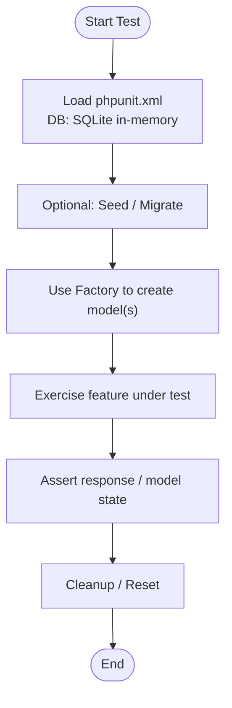
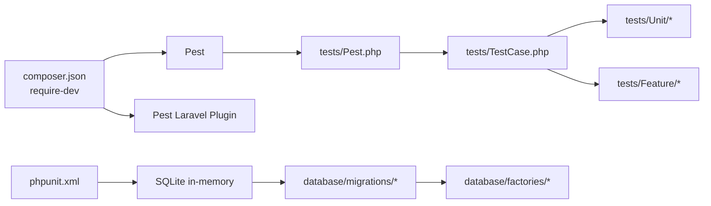

# Testing Infrastructure

<cite>
**Referenced Files in This Document**
- [composer.json](file://composer.json)
- [phpunit.xml](file://phpunit.xml)
- [tests/Pest.php](file://tests/Pest.php)
- [tests/TestCase.php](file://tests/TestCase.php)
- [tests/Feature/ExampleTest.php](file://tests/Feature/ExampleTest.php)
- [tests/Unit/ExampleTest.php](file://tests/Unit/ExampleTest.php)
- [database/factories/UserFactory.php](file://database/factories/UserFactory.php)
- [database/migrations/0001_01_01_000000_create_users_table.php](file://database/migrations/0001_01_01_000000_create_users_table.php)
- [database/migrations/0001_01_01_000001_create_cache_table.php](file://database/migrations/0001_01_01_000001_create_cache_table.php)
- [database/migrations/0001_01_01_000002_create_jobs_table.php](file://database/migrations/0001_01_01_000002_create_jobs_table.php)
- [database/migrations/2026_04_02_115916_create_agent_conversations_table.php](file://database/migrations/2026_04_02_115916_create_agent_conversations_table.php)
- [.agents/skills/pest-testing/SKILL.md](file://.agents/skills/pest-testing/SKILL.md)
- [.agents/skills/laravel-best-practices/rules/testing.md](file://.agents/skills/laravel-best-practices/rules/testing.md)
</cite>

## Table of Contents
1. [Introduction](#introduction)
2. [Project Structure](#project-structure)
3. [Core Components](#core-components)
4. [Architecture Overview](#architecture-overview)
5. [Detailed Component Analysis](#detailed-component-analysis)
6. [Dependency Analysis](#dependency-analysis)
7. [Performance Considerations](#performance-considerations)
8. [Troubleshooting Guide](#troubleshooting-guide)
9. [Conclusion](#conclusion)
10. [Appendices](#appendices)

## Introduction
This document explains the Testing Infrastructure for the project, focusing on Pest PHP integration and Laravel-specific testing patterns. It covers test organization, feature and unit test patterns, assertion syntax, mocking strategies, configuration, database testing, and practical examples drawn from the repository. It also connects testing infrastructure to AI-assisted development workflows and outlines best practices for test-driven development and continuous integration.

## Project Structure
The testing setup is organized around Pest and Laravel’s testing facilities:
- Pest bootstrap and shared expectations are configured centrally.
- Unit and Feature tests are separated into dedicated directories.
- Laravel’s testing environment is configured via phpunit.xml, including in-memory SQLite for speed and isolation.
- Factories and migrations support realistic database-backed tests.

**Diagram sources**
- [tests/Pest.php:1-50](file://tests/Pest.php#L1-L50)
- [tests/TestCase.php:1-11](file://tests/TestCase.php#L1-L11)
- [phpunit.xml:1-37](file://phpunit.xml#L1-L37)
- [database/migrations/0001_01_01_000000_create_users_table.php:1-50](file://database/migrations/0001_01_01_000000_create_users_table.php#L1-L50)
- [database/factories/UserFactory.php:1-46](file://database/factories/UserFactory.php#L1-L46)

**Section sources**
- [tests/Pest.php:1-50](file://tests/Pest.php#L1-L50)
- [tests/TestCase.php:1-11](file://tests/TestCase.php#L1-L11)
- [phpunit.xml:1-37](file://phpunit.xml#L1-L37)

## Core Components
- Pest Bootstrap and Shared Expectations
  - Extends the base Laravel TestCase for all Feature tests and demonstrates how to register custom expectation extensions and global helpers.
  - Provides a central place to enable database refresh strategies and other shared behaviors for Feature tests.

- Base TestCase
  - A thin wrapper around Laravel’s base TestCase, ready to be extended by Feature and Unit tests.

- Unit and Feature Tests
  - Unit tests focus on isolated logic and assertions using Pest’s expect syntax.
  - Feature tests exercise HTTP requests, middleware, and database interactions using Laravel’s HTTP test helpers.

- Database Configuration and Factories
  - phpunit.xml configures an in-memory SQLite database for fast, isolated tests.
  - Factories define realistic default model states and named states for common scenarios.

**Section sources**
- [tests/Pest.php:16-18](file://tests/Pest.php#L16-L18)
- [tests/TestCase.php:7-10](file://tests/TestCase.php#L7-L10)
- [tests/Unit/ExampleTest.php:1-6](file://tests/Unit/ExampleTest.php#L1-L6)
- [tests/Feature/ExampleTest.php:1-8](file://tests/Feature/ExampleTest.php#L1-L8)
- [phpunit.xml:20-35](file://phpunit.xml#L20-L35)
- [database/factories/UserFactory.php:25-44](file://database/factories/UserFactory.php#L25-L44)

## Architecture Overview
The testing architecture integrates Pest with Laravel’s HTTP and database testing capabilities. Pest’s DSL simplifies test authoring, while Laravel’s TestCase provides convenient helpers for requests, authentication, and database assertions.

**Diagram sources**
- [tests/Pest.php:16-18](file://tests/Pest.php#L16-L18)
- [tests/TestCase.php:7-10](file://tests/TestCase.php#L7-L10)
- [tests/Feature/ExampleTest.php:3-7](file://tests/Feature/ExampleTest.php#L3-L7)
- [phpunit.xml:20-35](file://phpunit.xml#L20-L35)

## Detailed Component Analysis

### Pest Bootstrap and Expectations
- Extending TestCase for Feature tests
  - The Pest bootstrap binds Feature tests to the Laravel TestCase, enabling access to HTTP helpers, database assertions, and service container helpers.
- Custom expectations
  - Demonstrates extending the Expectation API to add domain-specific assertions, improving readability and reusability.
- Global helpers
  - Shows how to define reusable helpers for common test operations.

Practical implications:
- Centralized configuration reduces duplication across Feature tests.
- Custom expectations encapsulate domain logic and improve maintainability.

**Section sources**
- [tests/Pest.php:16-18](file://tests/Pest.php#L16-L18)
- [tests/Pest.php:31-33](file://tests/Pest.php#L31-L33)
- [tests/Pest.php:46-49](file://tests/Pest.php#L46-L49)

### Base TestCase
- Minimal extension of Laravel’s base TestCase.
- Serves as the foundation for both Unit and Feature tests, ensuring consistent behavior and shared utilities.

**Section sources**
- [tests/TestCase.php:7-10](file://tests/TestCase.php#L7-L10)

### Unit Tests
- Example pattern
  - Uses Pest’s expect syntax to assert logical truths and primitive values.
- Best practice alignment
  - Encourages small, focused assertions that validate pure logic without external dependencies.

**Section sources**
- [tests/Unit/ExampleTest.php:3-5](file://tests/Unit/ExampleTest.php#L3-L5)

### Feature Tests
- Example pattern
  - Issues an HTTP request and asserts the response status using Laravel’s assertion helpers.
- Integration with Pest
  - Combines Pest’s concise syntax with Laravel’s HTTP testing capabilities.

**Section sources**
- [tests/Feature/ExampleTest.php:3-7](file://tests/Feature/ExampleTest.php#L3-L7)

### Database Testing and Factories
- In-memory SQLite configuration
  - phpunit.xml sets the database connection to SQLite with an in-memory database, enabling fast and isolated tests.
- Factory usage
  - Factories define default model states and named states (e.g., unverified) to produce realistic entities for tests.
- Migrations
  - Migrations define the schema for users, cache, jobs, and AI-related tables, ensuring tests operate against a consistent structure.

**Diagram sources**
- [phpunit.xml:20-35](file://phpunit.xml#L20-L35)
- [database/factories/UserFactory.php:25-44](file://database/factories/UserFactory.php#L25-L44)
- [database/migrations/0001_01_01_000000_create_users_table.php:14-22](file://database/migrations/0001_01_01_000000_create_users_table.php#L14-L22)

**Section sources**
- [phpunit.xml:20-35](file://phpunit.xml#L20-L35)
- [database/factories/UserFactory.php:25-44](file://database/factories/UserFactory.php#L25-L44)
- [database/migrations/0001_01_01_000000_create_users_table.php:14-22](file://database/migrations/0001_01_01_000000_create_users_table.php#L14-L22)

### Assertion Syntax and Patterns
- Prefer semantic assertions
  - Use higher-level assertions (e.g., assertSuccessful) instead of raw status codes to improve readability and intent.
- Model-centric assertions
  - Prefer model-level assertions over raw database checks for clarity and type safety.

**Section sources**
- [.agents/skills/pest-testing/SKILL.md:44-58](file://.agents/skills/pest-testing/SKILL.md#L44-L58)
- [.agents/skills/laravel-best-practices/rules/testing.md:7-13](file://.agents/skills/laravel-best-practices/rules/testing.md#L7-L13)

### Mocking Strategies
- Import the mock function before use
  - Ensure proper imports are present when mocking classes or external services in tests.
- Combine with Pest’s DSL
  - Use Pest’s concise syntax alongside Laravel’s mocking helpers for clear, expressive tests.

**Section sources**
- [.agents/skills/pest-testing/SKILL.md:61-61](file://.agents/skills/pest-testing/SKILL.md#L61-L61)

### Datasets and Repetitive Validation
- Use datasets to reduce repetition in validation and boundary tests.
- Leverage Pest’s dataset syntax to parameterize tests with multiple inputs.

**Section sources**
- [.agents/skills/pest-testing/SKILL.md:67-75](file://.agents/skills/pest-testing/SKILL.md#L67-L75)

### Browser and Architecture Testing (Pest 4)
- Browser testing
  - Full integration tests in real browsers, including navigation, form submission, and visual checks.
- Architecture testing
  - Enforce code conventions and structure using Pest’s architecture testing features.

**Section sources**
- [.agents/skills/pest-testing/SKILL.md:87-118](file://.agents/skills/pest-testing/SKILL.md#L87-L118)
- [.agents/skills/pest-testing/SKILL.md:139-149](file://.agents/skills/pest-testing/SKILL.md#L139-L149)

## Dependency Analysis
The testing stack depends on Pest and Laravel’s testing ecosystem. Composer lists Pest and the Laravel plugin as development dependencies, while phpunit.xml configures the testing environment.

**Diagram sources**
- [composer.json:24-25](file://composer.json#L24-L25)
- [tests/Pest.php:16-18](file://tests/Pest.php#L16-L18)
- [tests/TestCase.php:7-10](file://tests/TestCase.php#L7-L10)
- [phpunit.xml:20-35](file://phpunit.xml#L20-L35)
- [database/migrations/0001_01_01_000000_create_users_table.php:1-50](file://database/migrations/0001_01_01_000000_create_users_table.php#L1-L50)
- [database/factories/UserFactory.php:1-46](file://database/factories/UserFactory.php#L1-L46)

**Section sources**
- [composer.json:24-25](file://composer.json#L24-L25)
- [phpunit.xml:20-35](file://phpunit.xml#L20-L35)

## Performance Considerations
- Use lazy database refresh
  - Prefer strategies that avoid unnecessary migrations when the schema has not changed, reducing test suite runtime.
- Favor model-level assertions
  - They are more expressive and efficient than raw database checks.
- Leverage in-memory SQLite
  - Keeps tests fast and isolated without disk I/O overhead.

**Section sources**
- [.agents/skills/laravel-best-practices/rules/testing.md:3-5](file://.agents/skills/laravel-best-practices/rules/testing.md#L3-L5)
- [.agents/skills/laravel-best-practices/rules/testing.md:7-13](file://.agents/skills/laravel-best-practices/rules/testing.md#L7-L13)
- [phpunit.xml:20-35](file://phpunit.xml#L20-L35)

## Troubleshooting Guide
Common pitfalls and remedies:
- Incorrect assertion choice
  - Prefer semantic assertions over raw status codes for clarity and reliability.
- Missing imports for mocking
  - Ensure the mock function is imported before use in tests.
- Improper event faking order
  - Create models via factories before faking events to avoid breaking model generation hooks.
- Overusing raw database assertions
  - Prefer model-level assertions for better feedback and type safety.

**Section sources**
- [.agents/skills/pest-testing/SKILL.md:151-157](file://.agents/skills/pest-testing/SKILL.md#L151-L157)
- [.agents/skills/laravel-best-practices/rules/testing.md:23-33](file://.agents/skills/laravel-best-practices/rules/testing.md#L23-L33)

## Conclusion
The project’s testing infrastructure combines Pest’s expressive DSL with Laravel’s robust testing toolkit. The configuration emphasizes speed and isolation via in-memory SQLite, while the Pest bootstrap and shared expectations streamline Feature test authoring. Following the best practices outlined here ensures maintainable, readable, and performant tests that integrate smoothly with AI-assisted development and CI pipelines.

## Appendices

### Practical Examples Index
- Feature test example path: [tests/Feature/ExampleTest.php:1-8](file://tests/Feature/ExampleTest.php#L1-L8)
- Unit test example path: [tests/Unit/ExampleTest.php:1-6](file://tests/Unit/ExampleTest.php#L1-L6)
- Pest bootstrap path: [tests/Pest.php:1-50](file://tests/Pest.php#L1-L50)
- Base TestCase path: [tests/TestCase.php:1-11](file://tests/TestCase.php#L1-L11)
- User factory path: [database/factories/UserFactory.php:1-46](file://database/factories/UserFactory.php#L1-L46)
- Users migration path: [database/migrations/0001_01_01_000000_create_users_table.php:1-50](file://database/migrations/0001_01_01_000000_create_users_table.php#L1-L50)
- Cache migration path: [database/migrations/0001_01_01_000001_create_cache_table.php:1-36](file://database/migrations/0001_01_01_000001_create_cache_table.php#L1-L36)
- Jobs migration path: [database/migrations/0001_01_01_000002_create_jobs_table.php:1-58](file://database/migrations/0001_01_01_000002_create_jobs_table.php#L1-L58)
- Agent conversations migration path: [database/migrations/2026_04_02_115916_create_agent_conversations_table.php:1-51](file://database/migrations/2026_04_02_115916_create_agent_conversations_table.php#L1-L51)