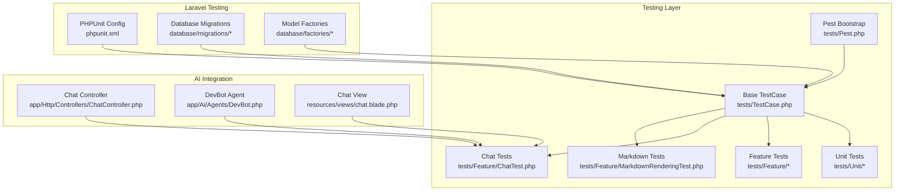
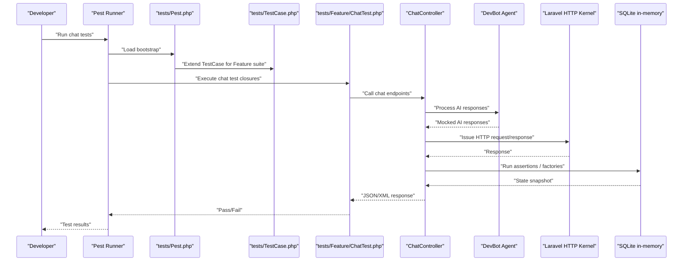
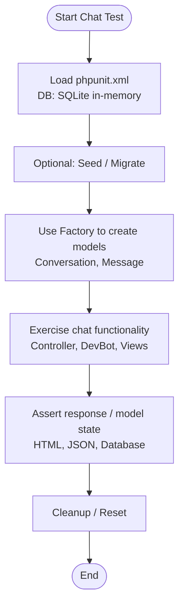
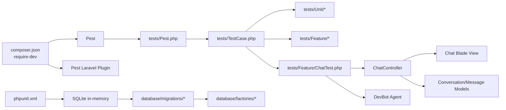

# Testing Infrastructure

<cite>
**Referenced Files in This Document**
- [composer.json](file://composer.json)
- [phpunit.xml](file://phpunit.xml)
- [tests/Pest.php](file://tests/Pest.php)
- [tests/TestCase.php](file://tests/TestCase.php)
- [tests/Feature/ExampleTest.php](file://tests/Feature/ExampleTest.php)
- [tests/Feature/ChatTest.php](file://tests/Feature/ChatTest.php)
- [tests/Feature/MarkdownRenderingTest.php](file://tests/Feature/MarkdownRenderingTest.php)
- [tests/Unit/ExampleTest.php](file://tests/Unit/ExampleTest.php)
- [app/Http/Controllers/ChatController.php](file://app/Http/Controllers/ChatController.php)
- [app/Ai/Agents/DevBot.php](file://app/Ai/Agents/DevBot.php)
- [resources/views/chat.blade.php](file://resources/views/chat.blade.php)
- [routes/web.php](file://routes/web.php)
- [database/factories/UserFactory.php](file://database/factories/UserFactory.php)
- [database/migrations/0001_01_01_000000_create_users_table.php](file://database/migrations/0001_01_01_000000_create_users_table.php)
- [database/migrations/0001_01_01_000001_create_cache_table.php](file://database/migrations/0001_01_01_000001_create_cache_table.php)
- [database/migrations/0001_01_01_000002_create_jobs_table.php](file://database/migrations/0001_01_01_000002_create_jobs_table.php)
- [database/migrations/2026_04_02_115916_create_agent_conversations_table.php](file://database/migrations/2026_04_02_115916_create_agent_conversations_table.php)
- [.agents/skills/pest-testing/SKILL.md](file://.agents/skills/pest-testing/SKILL.md)
- [.agents/skills/laravel-best-practices/rules/testing.md](file://.agents/skills/laravel-best-practices/rules/testing.md)
</cite>

## Update Summary
**Changes Made**
- Added comprehensive ChatTest.php documentation covering over 500 lines of chat functionality tests
- Enhanced feature test patterns section with detailed chat interface testing examples
- Expanded validation and error handling test coverage
- Added AI agent integration testing documentation
- Updated database testing patterns for chat functionality
- Enhanced mocking strategies for AI responses and error scenarios

## Table of Contents
1. [Introduction](#introduction)
2. [Project Structure](#project-structure)
3. [Core Components](#core-components)
4. [Architecture Overview](#architecture-overview)
5. [Detailed Component Analysis](#detailed-component-analysis)
6. [Dependency Analysis](#dependency-analysis)
7. [Performance Considerations](#performance-considerations)
8. [Troubleshooting Guide](#troubleshooting-guide)
9. [Conclusion](#conclusion)
10. [Appendices](#appendices)

## Introduction
This document explains the Testing Infrastructure for the project, focusing on Pest PHP integration and Laravel-specific testing patterns. It covers test organization, feature and unit test patterns, assertion syntax, mocking strategies, configuration, database testing, and practical examples drawn from the repository. The infrastructure now includes comprehensive chat functionality testing with over 500 lines of feature tests covering chat interface, message processing, validation, and error handling. It also connects testing infrastructure to AI-assisted development workflows and outlines best practices for test-driven development and continuous integration.

## Project Structure
The testing setup is organized around Pest and Laravel's testing facilities with enhanced chat functionality testing:
- Pest bootstrap and shared expectations are configured centrally.
- Unit and Feature tests are separated into dedicated directories, with comprehensive chat tests in Feature/.
- Laravel's testing environment is configured via phpunit.xml, including in-memory SQLite for speed and isolation.
- Factories and migrations support realistic database-backed tests.
- AI agent testing with DevBot integration and mocking strategies.

**Diagram sources**
- [tests/Pest.php:1-50](file://tests/Pest.php#L1-L50)
- [tests/TestCase.php:1-11](file://tests/TestCase.php#L1-L11)
- [tests/Feature/ChatTest.php:1-590](file://tests/Feature/ChatTest.php#L1-L590)
- [tests/Feature/MarkdownRenderingTest.php:1-116](file://tests/Feature/MarkdownRenderingTest.php#L1-L116)
- [phpunit.xml:1-37](file://phpunit.xml#L1-L37)
- [database/migrations/0001_01_01_000000_create_users_table.php:1-50](file://database/migrations/0001_01_01_000000_create_users_table.php#L1-L50)
- [database/factories/UserFactory.php:1-46](file://database/factories/UserFactory.php#L1-L46)
- [app/Http/Controllers/ChatController.php:1-113](file://app/Http/Controllers/ChatController.php#L1-L113)
- [app/Ai/Agents/DevBot.php:1-99](file://app/Ai/Agents/DevBot.php#L1-L99)
- [resources/views/chat.blade.php:1-391](file://resources/views/chat.blade.php#L1-L391)

**Section sources**
- [tests/Pest.php:1-50](file://tests/Pest.php#L1-L50)
- [tests/TestCase.php:1-11](file://tests/TestCase.php#L1-L11)
- [phpunit.xml:1-37](file://phpunit.xml#L1-L37)

## Core Components
- Pest Bootstrap and Shared Expectations
  - Extends the base Laravel TestCase for all Feature tests and demonstrates how to register custom expectation extensions and global helpers.
  - Provides a central place to enable database refresh strategies and other shared behaviors for Feature tests.

- Base TestCase
  - A thin wrapper around Laravel's base TestCase, ready to be extended by Feature and Unit tests.

- Unit and Feature Tests
  - Unit tests focus on isolated logic and assertions using Pest's expect syntax.
  - Feature tests exercise HTTP requests, middleware, and database interactions using Laravel's HTTP test helpers.
  - **Updated**: Comprehensive chat functionality tests covering interface display, message processing, validation, error handling, and AI integration.

- Database Configuration and Factories
  - phpunit.xml configures an in-memory SQLite database for fast, isolated tests.
  - Factories define realistic default model states and named states for common scenarios.
  - Enhanced with chat-specific models (Conversation, Message) and AI-related table structures.

**Section sources**
- [tests/Pest.php:16-18](file://tests/Pest.php#L16-L18)
- [tests/TestCase.php:7-10](file://tests/TestCase.php#L7-L10)
- [tests/Unit/ExampleTest.php:1-6](file://tests/Unit/ExampleTest.php#L1-L6)
- [tests/Feature/ExampleTest.php:1-8](file://tests/Feature/ExampleTest.php#L1-L8)
- [tests/Feature/ChatTest.php:18-77](file://tests/Feature/ChatTest.php#L18-L77)
- [phpunit.xml:20-35](file://phpunit.xml#L20-L35)
- [database/factories/UserFactory.php:25-44](file://database/factories/UserFactory.php#L25-L44)

## Architecture Overview
The testing architecture integrates Pest with Laravel's HTTP and database testing capabilities, now enhanced with comprehensive chat functionality testing. Pest's DSL simplifies test authoring, while Laravel's TestCase provides convenient helpers for requests, authentication, and database assertions. The architecture now includes AI agent testing with DevBot integration and sophisticated mocking strategies.

**Diagram sources**
- [tests/Pest.php:16-18](file://tests/Pest.php#L16-L18)
- [tests/TestCase.php:7-10](file://tests/TestCase.php#L7-L10)
- [tests/Feature/ChatTest.php:86-125](file://tests/Feature/ChatTest.php#L86-L125)
- [app/Http/Controllers/ChatController.php:39-111](file://app/Http/Controllers/ChatController.php#L39-L111)
- [app/Ai/Agents/DevBot.php:20-99](file://app/Ai/Agents/DevBot.php#L20-L99)
- [phpunit.xml:20-35](file://phpunit.xml#L20-L35)

## Detailed Component Analysis

### Pest Bootstrap and Expectations
- Extending TestCase for Feature tests
  - The Pest bootstrap binds Feature tests to the Laravel TestCase, enabling access to HTTP helpers, database assertions, and service container helpers.
- Custom expectations
  - Demonstrates extending the Expectation API to add domain-specific assertions, improving readability and reusability.
- Global helpers
  - Shows how to define reusable helpers for common test operations.

Practical implications:
- Centralized configuration reduces duplication across Feature tests.
- Custom expectations encapsulate domain logic and improve maintainability.

**Section sources**
- [tests/Pest.php:16-18](file://tests/Pest.php#L16-L18)
- [tests/Pest.php:31-33](file://tests/Pest.php#L31-L33)
- [tests/Pest.php:46-49](file://tests/Pest.php#L46-L49)

### Base TestCase
- Minimal extension of Laravel's base TestCase.
- Serves as the foundation for both Unit and Feature tests, ensuring consistent behavior and shared utilities.

**Section sources**
- [tests/TestCase.php:7-10](file://tests/TestCase.php#L7-L10)

### Unit Tests
- Example pattern
  - Uses Pest's expect syntax to assert logical truths and primitive values.
- Best practice alignment
  - Encourages small, focused assertions that validate pure logic without external dependencies.

**Section sources**
- [tests/Unit/ExampleTest.php:3-5](file://tests/Unit/ExampleTest.php#L3-L5)

### Feature Tests
- Example pattern
  - Issues an HTTP request and asserts the response status using Laravel's assertion helpers.
- Integration with Pest
  - Combines Pest's concise syntax with Laravel's HTTP testing capabilities.
- **Updated**: Comprehensive chat functionality tests covering:
  - Chat interface display and rendering
  - Message sending and AI response processing
  - Validation and error handling
  - Conversation management and persistence
  - AI agent integration and mocking

**Section sources**
- [tests/Feature/ExampleTest.php:3-7](file://tests/Feature/ExampleTest.php#L3-L7)
- [tests/Feature/ChatTest.php:18-77](file://tests/Feature/ChatTest.php#L18-L77)
- [tests/Feature/ChatTest.php:86-171](file://tests/Feature/ChatTest.php#L86-L171)
- [tests/Feature/ChatTest.php:178-236](file://tests/Feature/ChatTest.php#L178-L236)
- [tests/Feature/ChatTest.php:243-308](file://tests/Feature/ChatTest.php#L243-L308)
- [tests/Feature/ChatTest.php:315-359](file://tests/Feature/ChatTest.php#L315-L359)
- [tests/Feature/ChatTest.php:366-404](file://tests/Feature/ChatTest.php#L366-L404)
- [tests/Feature/ChatTest.php:411-470](file://tests/Feature/ChatTest.php#L411-L470)
- [tests/Feature/ChatTest.php:477-534](file://tests/Feature/ChatTest.php#L477-L534)
- [tests/Feature/ChatTest.php:541-589](file://tests/Feature/ChatTest.php#L541-L589)

### Chat Functionality Testing Patterns
- **Chat Interface Display Tests**
  - Validates chat page loading, welcome message display, conversation switching, and message rendering.
  - Tests HTML content and view rendering using Laravel's response assertions.
- **Message Processing Tests**
  - Tests AJAX message sending, AI response handling, and conversation persistence.
  - Includes AI API mocking and response validation.
- **Validation Tests**
  - Comprehensive validation coverage for message length, format, and conversation_id constraints.
  - Tests both success and failure scenarios.
- **Error Handling Tests**
  - Validates graceful error handling for AI API failures, network timeouts, and logging.
  - Tests both AJAX and redirect error responses.
- **Conversation Management Tests**
  - Tests conversation creation, title generation, and persistence across requests.
  - Validates conversation switching and message ordering.
- **Integration Tests**
  - Full conversation flow testing with multiple messages and AI responses.
  - Validates end-to-end chat functionality.

**Section sources**
- [tests/Feature/ChatTest.php:18-77](file://tests/Feature/ChatTest.php#L18-L77)
- [tests/Feature/ChatTest.php:86-171](file://tests/Feature/ChatTest.php#L86-L171)
- [tests/Feature/ChatTest.php:178-236](file://tests/Feature/ChatTest.php#L178-L236)
- [tests/Feature/ChatTest.php:243-308](file://tests/Feature/ChatTest.php#L243-L308)
- [tests/Feature/ChatTest.php:315-359](file://tests/Feature/ChatTest.php#L315-L359)
- [tests/Feature/ChatTest.php:366-404](file://tests/Feature/ChatTest.php#L366-L404)
- [tests/Feature/ChatTest.php:411-470](file://tests/Feature/ChatTest.php#L411-L470)
- [tests/Feature/ChatTest.php:477-534](file://tests/Feature/ChatTest.php#L477-L534)
- [tests/Feature/ChatTest.php:541-589](file://tests/Feature/ChatTest.php#L541-L589)

### Database Testing and Factories
- In-memory SQLite configuration
  - phpunit.xml sets the database connection to SQLite with an in-memory database, enabling fast and isolated tests.
- Factory usage
  - Factories define default model states and named states (e.g., unverified) to produce realistic entities for tests.
- Migrations
  - Migrations define the schema for users, cache, jobs, and AI-related tables, ensuring tests operate against a consistent structure.
- **Updated**: Enhanced with chat-specific models and relationships:
  - Conversation and Message models with proper foreign key relationships
  - AI agent conversation tables for DevBot integration
  - Support for chat history and message ordering

**Diagram sources**
- [phpunit.xml:20-35](file://phpunit.xml#L20-L35)
- [database/factories/UserFactory.php:25-44](file://database/factories/UserFactory.php#L25-L44)
- [database/migrations/0001_01_01_000000_create_users_table.php:14-22](file://database/migrations/0001_01_01_000000_create_users_table.php#L14-L22)
- [database/migrations/2026_04_02_115916_create_agent_conversations_table.php:1-51](file://database/migrations/2026_04_02_115916_create_agent_conversations_table.php#L1-L51)

**Section sources**
- [phpunit.xml:20-35](file://phpunit.xml#L20-L35)
- [database/factories/UserFactory.php:25-44](file://database/factories/UserFactory.php#L25-L44)
- [database/migrations/0001_01_01_000000_create_users_table.php:14-22](file://database/migrations/0001_01_01_000000_create_users_table.php#L14-L22)
- [database/migrations/2026_04_02_115916_create_agent_conversations_table.php:1-51](file://database/migrations/2026_04_02_115916_create_agent_conversations_table.php#L1-L51)

### AI Agent Integration Testing
- **DevBot Agent Testing**
  - Tests AI agent integration with comprehensive mocking strategies.
  - Validates AI response processing and error handling.
  - Tests conversation context preservation and message ordering.
- **Mocking Strategies**
  - Uses DevBot::fake() for AI response mocking.
  - Tests both successful responses and error scenarios.
  - Validates AI agent configuration and model selection.
- **Integration Patterns**
  - Tests full chat flow with AI integration.
  - Validates conversation persistence across AI interactions.
  - Tests error recovery and graceful degradation.

**Section sources**
- [app/Ai/Agents/DevBot.php:20-99](file://app/Ai/Agents/DevBot.php#L20-L99)
- [tests/Feature/ChatTest.php:155-171](file://tests/Feature/ChatTest.php#L155-L171)
- [tests/Feature/ChatTest.php:315-359](file://tests/Feature/ChatTest.php#L315-L359)
- [tests/Feature/ChatTest.php:541-589](file://tests/Feature/ChatTest.php#L541-L589)

### Assertion Syntax and Patterns
- Prefer semantic assertions
  - Use higher-level assertions (e.g., assertSuccessful) instead of raw status codes to improve readability and intent.
- Model-centric assertions
  - Prefer model-level assertions over raw database checks for clarity and type safety.
- **Updated**: Enhanced with chat-specific assertion patterns:
  - HTML content assertions for chat interface rendering
  - JSON structure validation for AJAX responses
  - Markdown content validation for formatted messages
  - Conversation state assertions for persistence testing

**Section sources**
- [.agents/skills/pest-testing/SKILL.md:44-58](file://.agents/skills/pest-testing/SKILL.md#L44-L58)
- [.agents/skills/laravel-best-practices/rules/testing.md:7-13](file://.agents/skills/laravel-best-practices/rules/testing.md#L7-L13)
- [tests/Feature/ChatTest.php:411-470](file://tests/Feature/ChatTest.php#L411-L470)
- [tests/Feature/ChatTest.php:366-404](file://tests/Feature/ChatTest.php#L366-L404)

### Mocking Strategies
- Import the mock function before use
  - Ensure proper imports are present when mocking classes or external services in tests.
- Combine with Pest's DSL
  - Use Pest's concise syntax alongside Laravel's mocking helpers for clear, expressive tests.
- **Updated**: Enhanced AI agent mocking strategies:
  - DevBot::fake() for AI response mocking
  - Exception-based mocking for error scenarios
  - Multiple response mocking for conversation flows
  - Log verification using Log::shouldReceive()

**Section sources**
- [.agents/skills/pest-testing/SKILL.md:61-61](file://.agents/skills/pest-testing/SKILL.md#L61-L61)
- [tests/Feature/ChatTest.php:155-171](file://tests/Feature/ChatTest.php#L155-L171)
- [tests/Feature/ChatTest.php:347-359](file://tests/Feature/ChatTest.php#L347-L359)

### Datasets and Repetitive Validation
- Use datasets to reduce repetition in validation and boundary tests.
- Leverage Pest's dataset syntax to parameterize tests with multiple inputs.
- **Updated**: Chat-specific validation datasets for:
  - Message length boundary testing (minimum and maximum limits)
  - Validation error scenarios
  - Conversation ID validation patterns

**Section sources**
- [.agents/skills/pest-testing/SKILL.md:67-75](file://.agents/skills/pest-testing/SKILL.md#L67-L75)
- [tests/Feature/ChatTest.php:197-215](file://tests/Feature/ChatTest.php#L197-L215)

### Browser and Architecture Testing (Pest 4)
- Browser testing
  - Full integration tests in real browsers, including navigation, form submission, and visual checks.
- Architecture testing
  - Enforce code conventions and structure using Pest's architecture testing features.
- **Updated**: Chat interface browser testing considerations:
  - JavaScript-enabled testing for AJAX functionality
  - Real-time message rendering validation
  - Form submission and error handling in browser context

**Section sources**
- [.agents/skills/pest-testing/SKILL.md:87-118](file://.agents/skills/pest-testing/SKILL.md#L87-L118)
- [.agents/skills/pest-testing/SKILL.md:139-149](file://.agents/skills/pest-testing/SKILL.md#L139-L149)

## Dependency Analysis
The testing stack depends on Pest and Laravel's testing ecosystem, now enhanced with AI agent testing dependencies. Composer lists Pest and the Laravel plugin as development dependencies, while phpunit.xml configures the testing environment.

**Diagram sources**
- [composer.json:24-25](file://composer.json#L24-L25)
- [tests/Pest.php:16-18](file://tests/Pest.php#L16-L18)
- [tests/TestCase.php:7-10](file://tests/TestCase.php#L7-L10)
- [tests/Feature/ChatTest.php:1-590](file://tests/Feature/ChatTest.php#L1-L590)
- [phpunit.xml:20-35](file://phpunit.xml#L20-L35)
- [database/migrations/0001_01_01_000000_create_users_table.php:1-50](file://database/migrations/0001_01_01_000000_create_users_table.php#L1-L50)
- [database/factories/UserFactory.php:1-46](file://database/factories/UserFactory.php#L1-L46)
- [app/Http/Controllers/ChatController.php:1-113](file://app/Http/Controllers/ChatController.php#L1-L113)
- [app/Ai/Agents/DevBot.php:1-99](file://app/Ai/Agents/DevBot.php#L1-L99)

**Section sources**
- [composer.json:24-25](file://composer.json#L24-L25)
- [phpunit.xml:20-35](file://phpunit.xml#L20-L35)

## Performance Considerations
- Use lazy database refresh
  - Prefer strategies that avoid unnecessary migrations when the schema has not changed, reducing test suite runtime.
- Favor model-level assertions
  - They are more expressive and efficient than raw database checks.
- Leverage in-memory SQLite
  - Keeps tests fast and isolated without disk I/O overhead.
- **Updated**: Chat-specific performance optimizations:
  - AI agent mocking reduces external API dependencies
  - Database refresh strategies for chat-heavy tests
  - Efficient conversation and message creation patterns

**Section sources**
- [.agents/skills/laravel-best-practices/rules/testing.md:3-5](file://.agents/skills/laravel-best-practices/rules/testing.md#L3-L5)
- [.agents/skills/laravel-best-practices/rules/testing.md:7-13](file://.agents/skills/laravel-best-practices/rules/testing.md#L7-L13)
- [phpunit.xml:20-35](file://phpunit.xml#L20-L35)
- [tests/Feature/ChatTest.php:11-16](file://tests/Feature/ChatTest.php#L11-L16)

## Troubleshooting Guide
Common pitfalls and remedies:
- Incorrect assertion choice
  - Prefer semantic assertions over raw status codes for clarity and reliability.
- Missing imports for mocking
  - Ensure the mock function is imported before use in tests.
- Improper event faking order
  - Create models via factories before faking events to avoid breaking model generation hooks.
- Overusing raw database assertions
  - Prefer model-level assertions for better feedback and type safety.
- **Updated**: Chat-specific troubleshooting:
  - AI agent mocking failures - ensure DevBot::fake() is properly configured
  - AJAX response validation - verify JSON structure and content-type headers
  - Chat interface rendering - check Blade view template correctness
  - Conversation persistence - validate foreign key relationships and timestamps

**Section sources**
- [.agents/skills/pest-testing/SKILL.md:151-157](file://.agents/skills/pest-testing/SKILL.md#L151-L157)
- [.agents/skills/laravel-best-practices/rules/testing.md:23-33](file://.agents/skills/laravel-best-practices/rules/testing.md#L23-L33)
- [tests/Feature/ChatTest.php:86-125](file://tests/Feature/ChatTest.php#L86-L125)
- [tests/Feature/ChatTest.php:315-359](file://tests/Feature/ChatTest.php#L315-L359)

## Conclusion
The project's testing infrastructure combines Pest's expressive DSL with Laravel's robust testing toolkit, now significantly enhanced with comprehensive chat functionality testing. The addition of over 500 lines of ChatTest.php provides extensive coverage of chat interface, message processing, validation, error handling, and AI agent integration. The configuration emphasizes speed and isolation via in-memory SQLite, while the Pest bootstrap and shared expectations streamline Feature test authoring. Following the best practices outlined here ensures maintainable, readable, and performant tests that integrate smoothly with AI-assisted development and CI pipelines.

## Appendices

### Practical Examples Index
- Feature test example path: [tests/Feature/ExampleTest.php:1-8](file://tests/Feature/ExampleTest.php#L1-L8)
- Chat functionality test path: [tests/Feature/ChatTest.php:1-590](file://tests/Feature/ChatTest.php#L1-L590)
- Markdown rendering test path: [tests/Feature/MarkdownRenderingTest.php:1-116](file://tests/Feature/MarkdownRenderingTest.php#L1-L116)
- Unit test example path: [tests/Unit/ExampleTest.php:1-6](file://tests/Unit/ExampleTest.php#L1-L6)
- Pest bootstrap path: [tests/Pest.php:1-50](file://tests/Pest.php#L1-L50)
- Base TestCase path: [tests/TestCase.php:1-11](file://tests/TestCase.php#L1-L11)
- Chat Controller path: [app/Http/Controllers/ChatController.php:1-113](file://app/Http/Controllers/ChatController.php#L1-L113)
- DevBot Agent path: [app/Ai/Agents/DevBot.php:1-99](file://app/Ai/Agents/DevBot.php#L1-L99)
- Chat View path: [resources/views/chat.blade.php:1-391](file://resources/views/chat.blade.php#L1-L391)
- Routes path: [routes/web.php:1-12](file://routes/web.php#L1-L12)
- User factory path: [database/factories/UserFactory.php:1-46](file://database/factories/UserFactory.php#L1-L46)
- Users migration path: [database/migrations/0001_01_01_000000_create_users_table.php:1-50](file://database/migrations/0001_01_01_000000_create_users_table.php#L1-L50)
- Cache migration path: [database/migrations/0001_01_01_000001_create_cache_table.php:1-36](file://database/migrations/0001_01_01_000001_create_cache_table.php#L1-L36)
- Jobs migration path: [database/migrations/0001_01_01_000002_create_jobs_table.php:1-58](file://database/migrations/0001_01_01_000002_create_jobs_table.php#L1-L58)
- Agent conversations migration path: [database/migrations/2026_04_02_115916_create_agent_conversations_table.php:1-51](file://database/migrations/2026_04_02_115916_create_agent_conversations_table.php#L1-L51)

### Chat Testing Coverage Matrix
- **Interface Display**: ✓ Complete coverage of chat page loading, welcome messages, and conversation display
- **Message Processing**: ✓ AJAX message sending, AI response handling, and conversation persistence
- **Validation**: ✓ Comprehensive message validation (length, format, conversation_id)
- **Error Handling**: ✓ AI API failures, network timeouts, and graceful error recovery
- **Conversation Management**: ✓ New conversation creation, title generation, and switching
- **Integration**: ✓ Full end-to-end chat flow with multiple messages and AI responses
- **AI Agent Testing**: ✓ DevBot integration, mocking strategies, and error scenarios
- **Database Testing**: ✓ Conversation and message relationships, persistence, and ordering
- **View Rendering**: ✓ HTML content validation, markdown formatting, and UI component testing
- **Performance**: ✓ Optimized test patterns for chat-heavy scenarios

**Section sources**
- [tests/Feature/ChatTest.php:18-77](file://tests/Feature/ChatTest.php#L18-L77)
- [tests/Feature/ChatTest.php:86-171](file://tests/Feature/ChatTest.php#L86-L171)
- [tests/Feature/ChatTest.php:178-236](file://tests/Feature/ChatTest.php#L178-L236)
- [tests/Feature/ChatTest.php:243-308](file://tests/Feature/ChatTest.php#L243-L308)
- [tests/Feature/ChatTest.php:315-359](file://tests/Feature/ChatTest.php#L315-L359)
- [tests/Feature/ChatTest.php:366-404](file://tests/Feature/ChatTest.php#L366-L404)
- [tests/Feature/ChatTest.php:411-470](file://tests/Feature/ChatTest.php#L411-L470)
- [tests/Feature/ChatTest.php:477-534](file://tests/Feature/ChatTest.php#L477-L534)
- [tests/Feature/ChatTest.php:541-589](file://tests/Feature/ChatTest.php#L541-L589)