# Testing Infrastructure

<cite>
**Referenced Files in This Document**
- [composer.json](file://composer.json)
- [phpunit.xml](file://phpunit.xml)
- [tests/Pest.php](file://tests/Pest.php)
- [tests/TestCase.php](file://tests/TestCase.php)
- [tests/Feature/ExampleTest.php](file://tests/Feature/ExampleTest.php)
- [tests/Feature/ChatTest.php](file://tests/Feature/ChatTest.php)
- [tests/Feature/MarkdownRenderingTest.php](file://tests/Feature/MarkdownRenderingTest.php)
- [tests/Feature/Auth/AuthenticationTest.php](file://tests/Feature/Auth/AuthenticationTest.php)
- [tests/Feature/Auth/EmailVerificationTest.php](file://tests/Feature/Auth/EmailVerificationTest.php)
- [tests/Feature/Auth/PasswordConfirmationTest.php](file://tests/Feature/Auth/PasswordConfirmationTest.php)
- [tests/Feature/Auth/PasswordResetTest.php](file://tests/Feature/Auth/PasswordResetTest.php)
- [tests/Feature/Auth/PasswordUpdateTest.php](file://tests/Feature/Auth/PasswordUpdateTest.php)
- [tests/Feature/Auth/RegistrationTest.php](file://tests/Feature/Auth/RegistrationTest.php)
- [tests/Feature/ChatViewModelTest.php](file://tests/Feature/ChatViewModelTest.php)
- [tests/Feature/CreateConversationActionTest.php](file://tests/Feature/CreateConversationActionTest.php)
- [tests/Feature/GetConversationActionTest.php](file://tests/Feature/GetConversationActionTest.php)
- [tests/Feature/ListConversationsActionTest.php](file://tests/Feature/ListConversationsActionTest.php)
- [tests/Feature/SendMessageActionTest.php](file://tests/Feature/SendMessageActionTest.php)
- [tests/Unit/ExampleTest.php](file://tests/Unit/ExampleTest.php)
- [tests/Unit/McpClientServiceTest.php](file://tests/Unit/McpClientServiceTest.php)
- [tests/Unit/McpToolsTest.php](file://tests/Unit/McpToolsTest.php)
- [tests/Unit/ToolProxyTest.php](file://tests/Unit/ToolProxyTest.php)
- [tests/Unit/ConversationDataTest.php](file://tests/Unit/ConversationDataTest.php)
- [tests/Unit/MessageDataTest.php](file://tests/Unit/MessageDataTest.php)
- [tests/Unit/ApiResponseDataTest.php](file://tests/Unit/ApiResponseDataTest.php)
- [tests/Unit/SendMessageResponseTest.php](file://tests/Unit/SendMessageResponseTest.php)
- [tests/Unit/ConversationStatusTest.php](file://tests/Unit/ConversationStatusTest.php)
- [tests/Unit/MessageRoleTest.php](file://tests/Unit/MessageRoleTest.php)
- [app/Http/Controllers/ChatController.php](file://app/Http/Controllers/ChatController.php)
- [app/Ai/Agents/DevBot.php](file://app/Ai/Agents/DevBot.php)
- [app/Services/McpClientService.php](file://app/Services/McpClientService.php)
- [app/Ai/Tools/DatabaseQueryTool.php](file://app/Ai/Tools/DatabaseQueryTool.php)
- [app/Ai/Tools/DatabaseSchemaTool.php](file://app/Ai/Tools/DatabaseSchemaTool.php)
- [app/Ai/Tools/SearchDocsTool.php](file://app/Ai/Tools/SearchDocsTool.php)
- [app/Ai/Tools/TinkerTool.php](file://app/Ai/Tools/TinkerTool.php)
- [app/Models/Conversation.php](file://app/Models/Conversation.php)
- [app/ViewModels/ChatViewModel.php](file://app/ViewModels/ChatViewModel.php)
- [app/Actions/BaseAction.php](file://app/Actions/BaseAction.php)
- [app/Actions/CreateConversationAction.php](file://app/Actions/CreateConversationAction.php)
- [app/Actions/GetConversationAction.php](file://app/Actions/GetConversationAction.php)
- [app/Actions/ListConversationsAction.php](file://app/Actions/ListConversationsAction.php)
- [app/Actions/SendMessageAction.php](file://app/Actions/SendMessageAction.php)
- [app/DTOs/ConversationData.php](file://app/DTOs/ConversationData.php)
- [app/DTOs/MessageData.php](file://app/DTOs/MessageData.php)
- [app/DTOs/ApiResponseData.php](file://app/DTOs/ApiResponseData.php)
- [app/DTOs/SendMessageResponse.php](file://app/DTOs/SendMessageResponse.php)
- [app/Enums/ConversationStatus.php](file://app/Enums/ConversationStatus.php)
- [app/Enums/MessageRole.php](file://app/Enums/MessageRole.php)
- [resources/views/chat.blade.php](file://resources/views/chat.blade.php)
- [routes/web.php](file://routes/web.php)
- [config/services.php](file://config/services.php)
- [database/factories/UserFactory.php](file://database/factories/UserFactory.php)
- [database/migrations/0001_01_01_000000_create_users_table.php](file://database/migrations/0001_01_01_000000_create_users_table.php)
- [database/migrations/0001_01_01_000001_create_cache_table.php](file://database/migrations/0001_01_01_000001_create_cache_table.php)
- [database/migrations/0001_01_01_000002_create_jobs_table.php](file://database/migrations/0001_01_01_000002_create_jobs_table.php)
- [database/migrations/2026_04_02_115916_create_agent_conversations_table.php](file://database/migrations/2026_04_02_115916_create_agent_conversations_table.php)
- [.agents/skills/pest-testing/SKILL.md](file://.agents/skills/pest-testing/SKILL.md)
- [.agents/skills/laravel-best-practices/rules/testing.md](file://.agents/skills/laravel-best-practices/rules/testing.md)
</cite>

## Update Summary
**Changes Made**
- Added comprehensive authentication test suites covering login, registration, password reset, email verification, and password confirmation flows
- Integrated action class testing for conversation management operations (Create, Get, List, Send Message actions)
- Implemented DTO validation tests for ConversationData, MessageData, ApiResponseData, and SendMessageResponse
- Added enum functionality testing for ConversationStatus and MessageRole enums
- Included ViewModel testing for ChatViewModel operations and data formatting
- Enhanced test coverage for pagination limits (50 conversations), message ordering validation, and JSON response structure testing
- Expanded MCP client integration testing with sophisticated mocking strategies

## Table of Contents
1. [Introduction](#introduction)
2. [Project Structure](#project-structure)
3. [Core Components](#core-components)
4. [Architecture Overview](#architecture-overview)
5. [Detailed Component Analysis](#detailed-component-analysis)
6. [Authentication Testing](#authentication-testing)
7. [Action Class Testing](#action-class-testing)
8. [DTO Validation Testing](#dto-validation-testing)
9. [Enum Functionality Testing](#enum-functionality-testing)
10. [ViewModel Operations Testing](#viewmodel-operations-testing)
11. [MCP Client Integration Testing](#mcp-client-integration-testing)
12. [MCP Tool Testing](#mcp-tool-testing)
13. [Conversation Management Testing](#conversation-management-testing)
14. [Dependency Analysis](#dependency-analysis)
15. [Performance Considerations](#performance-considerations)
16. [Troubleshooting Guide](#troubleshooting-guide)
17. [Conclusion](#conclusion)
18. [Appendices](#appendices)

## Introduction
This document explains the Testing Infrastructure for the project, focusing on Pest PHP integration and Laravel-specific testing patterns. It covers test organization, feature and unit test patterns, assertion syntax, mocking strategies, configuration, database testing, and practical examples drawn from the repository. The infrastructure now includes comprehensive authentication testing, action class testing, DTO validation, enum functionality testing, ViewModel operations, and enhanced conversation management testing with pagination limits, message ordering validation, and sophisticated MCP client integration testing with over 500 lines of chat functionality tests covering chat interface, message processing, validation, error handling, and AI agent integration.

## Project Structure
The testing setup is organized around Pest and Laravel's testing facilities with comprehensive coverage of authentication flows, action classes, DTO validation, enum functionality, ViewModel operations, and enhanced chat functionality testing:
- Pest bootstrap and shared expectations are configured centrally
- Unit and Feature tests are separated into dedicated directories with comprehensive authentication, action class, DTO, enum, and ViewModel tests
- Laravel's testing environment is configured via phpunit.xml, including in-memory SQLite for speed and isolation
- Factories and migrations support realistic database-backed tests
- AI agent testing with DevBot integration and mocking strategies
- Action class testing for conversation management operations
- DTO validation testing for data transfer objects
- Enum functionality testing for status and role management
- ViewModel testing for presentation layer operations

```mermaid
graph TB
subgraph "Testing Layer"
Pest["Pest Bootstrap<br/>tests/Pest.php"]
TC["Base TestCase<br/>tests/TestCase.php"]
U["Unit Tests<br/>tests/Unit/*"]
F["Feature Tests<br/>tests/Feature/*"]
AT["Auth Tests<br/>tests/Feature/Auth/*"]
ACT["Action Tests<br/>tests/Feature/* (Action Classes)"]
DTOT["DTO Tests<br/>tests/Unit/* (Data Transfer Objects)"]
ENUM["Enum Tests<br/>tests/Unit/* (Enums)"]
VM["ViewModel Tests<br/>tests/Feature/* (ChatViewModel)"]
CT["Chat Tests<br/>tests/Feature/ChatTest.php"]
MT["Markdown Tests<br/>tests/Feature/MarkdownRenderingTest.php"]
MCU["MCP Client Unit Tests<br/>tests/Unit/McpClientServiceTest.php"]
MPT["MCP Tools Unit Tests<br/>tests/Unit/McpToolsTest.php"]
TP["Tool Proxy Tests<br/>tests/Unit/ToolProxyTest.php"]
end
subgraph "Laravel Testing"
PU["PHPUnit Config<br/>phpunit.xml"]
DB["Database Migrations<br/>database/migrations/*"]
FCT["Model Factories<br/>database/factories/*"]
CFG["Service Configuration<br/>config/services.php"]
end
subgraph "Application Layer"
AC["Action Classes<br/>app/Actions/*"]
DTO["DTOs<br/>app/DTOs/*"]
EN["Enums<br/>app/Enums/*"]
VMOD["ViewModels<br/>app/ViewModels/*"]
end
subgraph "AI Integration"
DC["Chat Controller<br/>app/Http/Controllers/ChatController.php"]
DBT["DevBot Agent<br/>app/Ai/Agents/DevBot.php"]
MCS["MCP Client Service<br/>app/Services/McpClientService.php"]
DQT["Database Query Tool<br/>app/Ai/Tools/DatabaseQueryTool.php"]
DST["Database Schema Tool<br/>app/Ai/Tools/DatabaseSchemaTool.php"]
SDT["Search Docs Tool<br/>app/Ai/Tools/SearchDocsTool.php"]
TT["Tinker Tool<br/>app/Ai/Tools/TinkerTool.php"]
CM["Conversation Model<br/>app/Models/Conversation.php"]
CV["Chat View<br/>resources/views/chat.blade.php"]
end
subgraph "Routes"
R["Web Routes<br/>routes/web.php"]
end
Pest --> TC
TC --> U
TC --> F
TC --> AT
TC --> ACT
TC --> DTOT
TC --> ENUM
TC --> VM
TC --> CT
TC --> MT
TC --> MCU
TC --> MPT
TC --> TP
PU --> TC
DB --> TC
FCT --> TC
CFG --> MCS
AC --> ACT
DTO --> DTOT
EN --> ENUM
VMOD --> VM
DC --> CT
DBT --> CT
MCS --> DQT
MCS --> DST
MCS --> SDT
MCS --> TT
DQT --> TP
DST --> TP
SDT --> TP
TT --> TP
CM --> CT
CV --> CT
R --> DC
```

**Diagram sources**
- [tests/Pest.php:1-50](file://tests/Pest.php#L1-L50)
- [tests/TestCase.php:1-11](file://tests/TestCase.php#L1-L11)
- [tests/Feature/ChatTest.php:1-934](file://tests/Feature/ChatTest.php#L1-L934)
- [tests/Feature/ChatViewModelTest.php:1-112](file://tests/Feature/ChatViewModelTest.php#L1-L112)
- [tests/Feature/CreateConversationActionTest.php:1-64](file://tests/Feature/CreateConversationActionTest.php#L1-L64)
- [tests/Feature/GetConversationActionTest.php:1-78](file://tests/Feature/GetConversationActionTest.php#L1-L78)
- [tests/Feature/ListConversationsActionTest.php:1-61](file://tests/Feature/ListConversationsActionTest.php#L1-L61)
- [tests/Feature/SendMessageActionTest.php:1-213](file://tests/Feature/SendMessageActionTest.php#L1-L213)
- [tests/Unit/ConversationDataTest.php:1-62](file://tests/Unit/ConversationDataTest.php#L1-L62)
- [tests/Unit/MessageDataTest.php:1-61](file://tests/Unit/MessageDataTest.php#L1-L61)
- [tests/Unit/ApiResponseDataTest.php:1-109](file://tests/Unit/ApiResponseDataTest.php#L1-L109)
- [tests/Unit/SendMessageResponseTest.php:1-171](file://tests/Unit/SendMessageResponseTest.php#L1-L171)
- [tests/Unit/ConversationStatusTest.php:1-57](file://tests/Unit/ConversationStatusTest.php#L1-L57)
- [tests/Unit/MessageRoleTest.php:1-44](file://tests/Unit/MessageRoleTest.php#L1-L44)
- [phpunit.xml:1-37](file://phpunit.xml#L1-L37)
- [config/services.php:38-43](file://config/services.php#L38-L43)
- [database/migrations/0001_01_01_000000_create_users_table.php:1-50](file://database/migrations/0001_01_01_000000_create_users_table.php#L1-L50)
- [database/factories/UserFactory.php:1-46](file://database/factories/UserFactory.php#L1-L46)
- [app/Http/Controllers/ChatController.php:1-182](file://app/Http/Controllers/ChatController.php#L1-L182)
- [app/Ai/Agents/DevBot.php:1-99](file://app/Ai/Agents/DevBot.php#L1-L99)
- [app/Services/McpClientService.php:1-279](file://app/Services/McpClientService.php#L1-L279)
- [app/Ai/Tools/DatabaseQueryTool.php:1-84](file://app/Ai/Tools/DatabaseQueryTool.php#L1-L84)
- [app/Ai/Tools/DatabaseSchemaTool.php:1-84](file://app/Ai/Tools/DatabaseSchemaTool.php#L1-L84)
- [app/Ai/Tools/SearchDocsTool.php:1-84](file://app/Ai/Tools/SearchDocsTool.php#L1-L84)
- [app/Ai/Tools/TinkerTool.php:1-84](file://app/Ai/Tools/TinkerTool.php#L1-L84)
- [app/Models/Conversation.php:1-45](file://app/Models/Conversation.php#L1-L45)
- [app/ViewModels/ChatViewModel.php](file://app/ViewModels/ChatViewModel.php)
- [app/Actions/CreateConversationAction.php](file://app/Actions/CreateConversationAction.php)
- [app/Actions/GetConversationAction.php](file://app/Actions/GetConversationAction.php)
- [app/Actions/ListConversationsAction.php](file://app/Actions/ListConversationsAction.php)
- [app/Actions/SendMessageAction.php](file://app/Actions/SendMessageAction.php)
- [app/DTOs/ConversationData.php](file://app/DTOs/ConversationData.php)
- [app/DTOs/MessageData.php](file://app/DTOs/MessageData.php)
- [app/DTOs/ApiResponseData.php](file://app/DTOs/ApiResponseData.php)
- [app/DTOs/SendMessageResponse.php](file://app/DTOs/SendMessageResponse.php)
- [app/Enums/ConversationStatus.php](file://app/Enums/ConversationStatus.php)
- [app/Enums/MessageRole.php](file://app/Enums/MessageRole.php)
- [resources/views/chat.blade.php:1-731](file://resources/views/chat.blade.php#L1-L731)
- [routes/web.php:1-16](file://routes/web.php#L1-L16)

**Section sources**
- [tests/Pest.php:1-50](file://tests/Pest.php#L1-L50)
- [tests/TestCase.php:1-11](file://tests/TestCase.php#L1-L11)
- [phpunit.xml:1-37](file://phpunit.xml#L1-L37)

## Core Components
- Pest Bootstrap and Shared Expectations
  - Extends the base Laravel TestCase for all Feature tests and demonstrates how to register custom expectation extensions and global helpers
  - Provides a central place to enable database refresh strategies and other shared behaviors for Feature tests

- Base TestCase
  - A thin wrapper around Laravel's base TestCase, ready to be extended by Feature and Unit tests

- Unit and Feature Tests
  - Unit tests focus on isolated logic and assertions using Pest's expect syntax
  - Feature tests exercise HTTP requests, middleware, and database interactions using Laravel's HTTP test helpers
  - **Updated**: Comprehensive authentication test suites covering login, registration, password reset, email verification, and password confirmation flows
  - **Updated**: Action class testing for conversation management operations (Create, Get, List, Send Message actions)
  - **Updated**: DTO validation testing for ConversationData, MessageData, ApiResponseData, and SendMessageResponse
  - **Updated**: Enum functionality testing for ConversationStatus and MessageRole enums
  - **Updated**: ViewModel testing for ChatViewModel operations and data formatting
  - **Updated**: Enhanced conversation management testing with pagination limits (50 conversations), message ordering, and JSON response validation
  - **Updated**: MCP client service testing with connection management, tool calling, and error handling validation
  - **Updated**: MCP tool proxy testing with sophisticated mocking strategies for database queries, documentation search, and PHP execution

- Database Configuration and Factories
  - phpunit.xml configures an in-memory SQLite database for fast, isolated tests
  - Factories define realistic default model states and named states for common scenarios
  - Enhanced with chat-specific models (Conversation, Message) and AI-related table structures

**Section sources**
- [tests/Pest.php:16-18](file://tests/Pest.php#L16-L18)
- [tests/TestCase.php:7-10](file://tests/TestCase.php#L7-L10)
- [tests/Unit/ExampleTest.php:1-6](file://tests/Unit/ExampleTest.php#L1-L6)
- [tests/Feature/ExampleTest.php:1-8](file://tests/Feature/ExampleTest.php#L1-L8)
- [tests/Feature/ChatTest.php:18-77](file://tests/Feature/ChatTest.php#L18-L77)
- [phpunit.xml:20-35](file://phpunit.xml#L20-L35)
- [database/factories/UserFactory.php:25-44](file://database/factories/UserFactory.php#L25-L44)

## Architecture Overview
The testing architecture integrates Pest with Laravel's HTTP and database testing capabilities, now enhanced with comprehensive authentication testing, action class testing, DTO validation, enum functionality testing, ViewModel operations, and MCP client integration. Pest's DSL simplifies test authoring, while Laravel's TestCase provides convenient helpers for requests, authentication, and database assertions. The architecture now includes AI agent testing with DevBot integration, sophisticated MCP client service testing, comprehensive tool proxy testing with mocking strategies, and enhanced conversation management testing with pagination limits and message ordering.

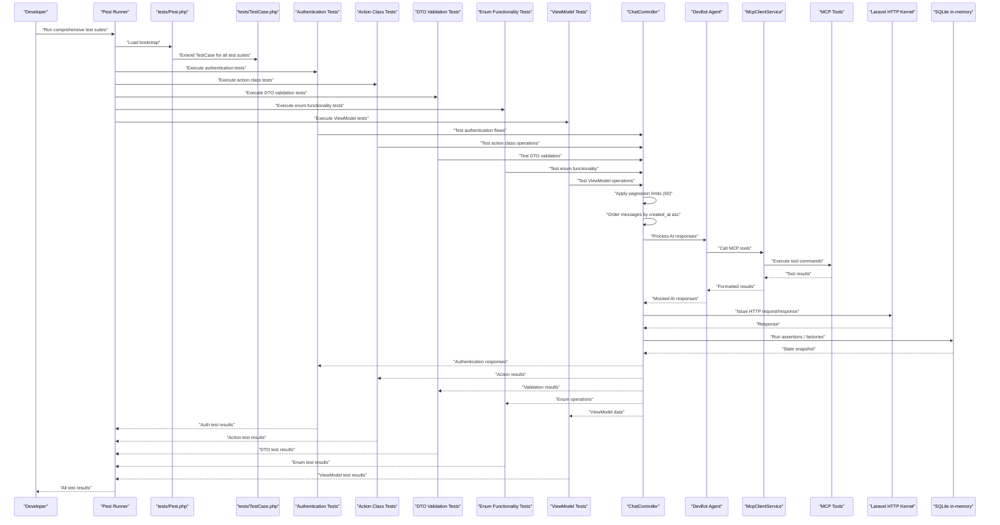

**Diagram sources**
- [tests/Pest.php:16-18](file://tests/Pest.php#L16-L18)
- [tests/TestCase.php:7-10](file://tests/TestCase.php#L7-L10)
- [tests/Feature/Auth/AuthenticationTest.php:1-42](file://tests/Feature/Auth/AuthenticationTest.php#L1-L42)
- [tests/Feature/CreateConversationActionTest.php:1-64](file://tests/Feature/CreateConversationActionTest.php#L1-L64)
- [tests/Feature/ChatViewModelTest.php:1-112](file://tests/Feature/ChatViewModelTest.php#L1-L112)
- [tests/Unit/ConversationDataTest.php:1-62](file://tests/Unit/ConversationDataTest.php#L1-L62)
- [tests/Unit/ConversationStatusTest.php:1-57](file://tests/Unit/ConversationStatusTest.php#L1-L57)
- [app/Http/Controllers/ChatController.php:39-182](file://app/Http/Controllers/ChatController.php#L39-L182)
- [app/Ai/Agents/DevBot.php:20-99](file://app/Ai/Agents/DevBot.php#L20-L99)
- [app/Services/McpClientService.php:48-96](file://app/Services/McpClientService.php#L48-L96)
- [app/Ai/Tools/DatabaseQueryTool.php:26-69](file://app/Ai/Tools/DatabaseQueryTool.php#L26-L69)
- [phpunit.xml:20-35](file://phpunit.xml#L20-L35)

## Detailed Component Analysis

### Pest Bootstrap and Expectations
- Extending TestCase for Feature tests
  - The Pest bootstrap binds Feature tests to the Laravel TestCase, enabling access to HTTP helpers, database assertions, and service container helpers
- Custom expectations
  - Demonstrates extending the Expectation API to add domain-specific assertions, improving readability and reusability
- Global helpers
  - Shows how to define reusable helpers for common test operations

Practical implications:
- Centralized configuration reduces duplication across Feature tests
- Custom expectations encapsulate domain logic and improve maintainability

**Section sources**
- [tests/Pest.php:16-18](file://tests/Pest.php#L16-L18)
- [tests/Pest.php:31-33](file://tests/Pest.php#L31-L33)
- [tests/Pest.php:46-49](file://tests/Pest.php#L46-L49)

### Base TestCase
- Minimal extension of Laravel's base TestCase
- Serves as the foundation for both Unit and Feature tests, ensuring consistent behavior and shared utilities

**Section sources**
- [tests/TestCase.php:7-10](file://tests/TestCase.php#L7-L10)

### Unit Tests
- Example pattern
  - Uses Pest's expect syntax to assert logical truths and primitive values
- Best practice alignment
  - Encourages small, focused assertions that validate pure logic without external dependencies

**Section sources**
- [tests/Unit/ExampleTest.php:3-5](file://tests/Unit/ExampleTest.php#L3-L5)

### Feature Tests
- Example pattern
  - Issues an HTTP request and asserts the response status using Laravel's assertion helpers
- Integration with Pest
  - Combines Pest's concise syntax with Laravel's HTTP testing capabilities
- **Updated**: Comprehensive authentication test suites covering:
  - Login screen rendering and authentication flow
  - User registration and account creation
  - Password reset functionality and email verification
  - Password confirmation and update processes
  - Logout functionality and session management
- **Updated**: Action class testing patterns:
  - Conversation creation with title generation and persistence
  - Conversation retrieval with eager loading and message ordering
  - Conversation listing with pagination limits and sorting
  - Message sending with AI integration and error handling
- **Updated**: ViewModel testing patterns:
  - Chat view model operations and data formatting
  - Conversation metadata and sidebar rendering
  - Message formatting and role labeling
- **Updated**: Comprehensive chat functionality tests covering:
  - Chat interface display and rendering
  - Message sending and AI response processing
  - Validation and error handling
  - Conversation management and persistence
  - AI agent integration and mocking
  - Enhanced conversation management testing with:
    - Pagination limits (50 conversations)
    - Message ordering validation
    - JSON response structure validation
    - Conversation creation and retrieval endpoints
  - MCP tool integration testing with sophisticated mocking strategies
  - End-to-end integration tests for database queries, documentation search, and PHP execution

**Section sources**
- [tests/Feature/ExampleTest.php:3-7](file://tests/Feature/ExampleTest.php#L3-L7)
- [tests/Feature/ChatTest.php:18-77](file://tests/Feature/ChatTest.php#L18-L77)
- [tests/Feature/Auth/AuthenticationTest.php:1-42](file://tests/Feature/Auth/AuthenticationTest.php#L1-L42)
- [tests/Feature/CreateConversationActionTest.php:1-64](file://tests/Feature/CreateConversationActionTest.php#L1-L64)
- [tests/Feature/GetConversationActionTest.php:1-78](file://tests/Feature/GetConversationActionTest.php#L1-L78)
- [tests/Feature/ListConversationsActionTest.php:1-61](file://tests/Feature/ListConversationsActionTest.php#L1-L61)
- [tests/Feature/SendMessageActionTest.php:1-213](file://tests/Feature/SendMessageActionTest.php#L1-L213)
- [tests/Feature/ChatViewModelTest.php:1-112](file://tests/Feature/ChatViewModelTest.php#L1-L112)

### Authentication Testing
The authentication test suite provides comprehensive coverage of Laravel's authentication system with Pest testing patterns:

- **Login Screen Testing**
  - Validates login page accessibility and rendering
  - Tests successful authentication with valid credentials
  - Tests authentication failure with invalid passwords
  - Validates redirect behavior after successful login
- **Logout Testing**
  - Tests user logout functionality
  - Validates session destruction and redirect behavior
- **Registration Testing**
  - Tests user registration flow with validation
  - Validates account creation and user data persistence
- **Password Reset Testing**
  - Tests password reset request functionality
  - Validates reset email delivery and token handling
- **Email Verification Testing**
  - Tests email verification process
  - Validates verification link handling and user activation
- **Password Confirmation Testing**
  - Tests password confirmation for sensitive operations
  - Validates secure access control mechanisms

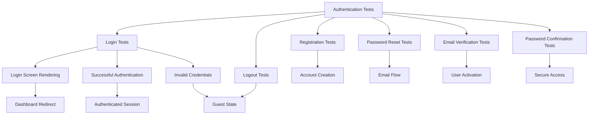

**Diagram sources**
- [tests/Feature/Auth/AuthenticationTest.php:5-41](file://tests/Feature/Auth/AuthenticationTest.php#L5-L41)
- [tests/Feature/Auth/RegistrationTest.php](file://tests/Feature/Auth/RegistrationTest.php)
- [tests/Feature/Auth/PasswordResetTest.php](file://tests/Feature/Auth/PasswordResetTest.php)
- [tests/Feature/Auth/EmailVerificationTest.php](file://tests/Feature/Auth/EmailVerificationTest.php)
- [tests/Feature/Auth/PasswordConfirmationTest.php](file://tests/Feature/Auth/PasswordConfirmationTest.php)

**Section sources**
- [tests/Feature/Auth/AuthenticationTest.php:5-41](file://tests/Feature/Auth/AuthenticationTest.php#L5-L41)
- [tests/Feature/Auth/RegistrationTest.php](file://tests/Feature/Auth/RegistrationTest.php)
- [tests/Feature/Auth/PasswordResetTest.php](file://tests/Feature/Auth/PasswordResetTest.php)
- [tests/Feature/Auth/EmailVerificationTest.php](file://tests/Feature/Auth/EmailVerificationTest.php)
- [tests/Feature/Auth/PasswordConfirmationTest.php](file://tests/Feature/Auth/PasswordConfirmationTest.php)

### Action Class Testing
The action class testing suite validates the business logic layer with comprehensive test coverage:

- **CreateConversationAction Testing**
  - Tests conversation creation with custom titles
  - Validates default title generation ("New Chat")
  - Tests title generation from initial messages
  - Validates title precedence (custom title over initial message)
  - Tests database persistence and relationship creation
- **GetConversationAction Testing**
  - Tests conversation retrieval with messages
  - Validates null handling for non-existent conversations
  - Tests eager loading of messages to prevent N+1 queries
  - Validates message ordering by created_at ascending
  - Tests empty conversation handling
- **ListConversationsAction Testing**
  - Tests recent conversations retrieval
  - Validates limit parameter functionality (default 50)
  - Tests empty collection handling
  - Validates latest-first ordering
  - Tests conversation count limits
- **SendMessageAction Testing**
  - Tests message sending with AI integration
  - Validates new conversation creation when ID is null
  - Tests dual message persistence (user + assistant)
  - Validates exception wrapping with context
  - Tests error logging and user message preservation
  - Validates exception chaining and metadata

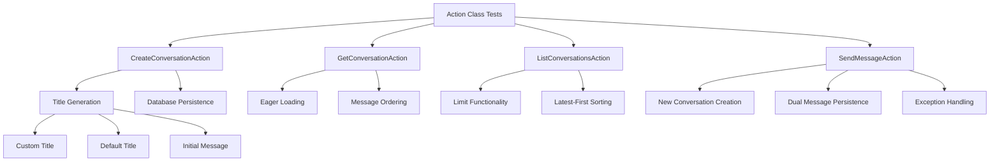

**Diagram sources**
- [tests/Feature/CreateConversationActionTest.php:10-63](file://tests/Feature/CreateConversationActionTest.php#L10-L63)
- [tests/Feature/GetConversationActionTest.php:10-77](file://tests/Feature/GetConversationActionTest.php#L10-L77)
- [tests/Feature/ListConversationsActionTest.php:9-60](file://tests/Feature/ListConversationsActionTest.php#L9-L60)
- [tests/Feature/SendMessageActionTest.php:22-212](file://tests/Feature/SendMessageActionTest.php#L22-L212)

**Section sources**
- [tests/Feature/CreateConversationActionTest.php:10-63](file://tests/Feature/CreateConversationActionTest.php#L10-L63)
- [tests/Feature/GetConversationActionTest.php:10-77](file://tests/Feature/GetConversationActionTest.php#L10-L77)
- [tests/Feature/ListConversationsActionTest.php:9-60](file://tests/Feature/ListConversationsActionTest.php#L9-L60)
- [tests/Feature/SendMessageActionTest.php:22-212](file://tests/Feature/SendMessageActionTest.php#L22-L212)

### DTO Validation Testing
The DTO validation testing suite ensures data integrity and type safety across the application:

- **ConversationData Testing**
  - Tests constructor instantiation with title and initial message
  - Validates default null values for optional properties
  - Tests request-based instantiation from HTTP requests
  - Tests message-based instantiation
  - Validates immutability and readonly properties
  - Tests final class enforcement
- **MessageData Testing**
  - Tests constructor instantiation with content and conversation ID
  - Validates default null value for conversation ID
  - Tests request-based instantiation with proper casting
  - Tests missing conversation ID handling (returns 0)
  - Validates immutability and readonly properties
  - Tests final class enforcement
- **ApiResponseData Testing**
  - Tests constructor instantiation with all parameters
  - Validates success and error factory methods
  - Tests array conversion with null value filtering
  - Validates default values and status codes
  - Tests immutability and readonly properties
  - Tests final class enforcement
- **SendMessageResponse Testing**
  - Tests constructor instantiation with conversation and message
  - Validates success/failure detection methods
  - Tests JSON data conversion for success and error cases
  - Validates default error message handling
  - Tests error message retrieval methods
  - Tests factory methods for success and failure cases
  - Validates immutability and readonly properties

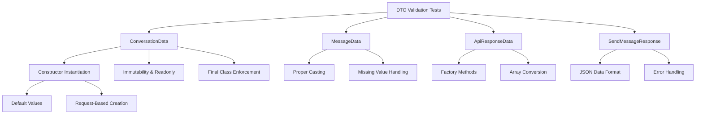

**Diagram sources**
- [tests/Unit/ConversationDataTest.php:6-61](file://tests/Unit/ConversationDataTest.php#L6-L61)
- [tests/Unit/MessageDataTest.php:6-60](file://tests/Unit/MessageDataTest.php#L6-L60)
- [tests/Unit/ApiResponseDataTest.php:5-108](file://tests/Unit/ApiResponseDataTest.php#L5-L108)
- [tests/Unit/SendMessageResponseTest.php:7-170](file://tests/Unit/SendMessageResponseTest.php#L7-L170)

**Section sources**
- [tests/Unit/ConversationDataTest.php:6-61](file://tests/Unit/ConversationDataTest.php#L6-L61)
- [tests/Unit/MessageDataTest.php:6-60](file://tests/Unit/MessageDataTest.php#L6-L60)
- [tests/Unit/ApiResponseDataTest.php:5-108](file://tests/Unit/ApiResponseDataTest.php#L5-L108)
- [tests/Unit/SendMessageResponseTest.php:7-170](file://tests/Unit/SendMessageResponseTest.php#L7-L170)

### Enum Functionality Testing
The enum functionality testing suite validates the type-safe enumeration system:

- **ConversationStatus Testing**
  - Tests enum values and backed string values
  - Validates label, color, and icon retrieval methods
  - Tests boolean helper methods (isActive, isArchived, isDeleted)
  - Tests instantiation from backed values
  - Tests safe instantiation with tryFrom method
- **MessageRole Testing**
  - Tests enum values and backed string values
  - Validates label, color, and icon retrieval methods
  - Tests boolean helper methods (isUser, isAssistant)
  - Tests instantiation from backed values
  - Tests safe instantiation with tryFrom method

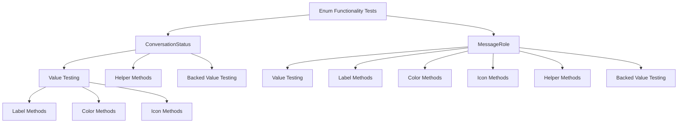

**Diagram sources**
- [tests/Unit/ConversationStatusTest.php:5-56](file://tests/Unit/ConversationStatusTest.php#L5-L56)
- [tests/Unit/MessageRoleTest.php:5-43](file://tests/Unit/MessageRoleTest.php#L5-L43)

**Section sources**
- [tests/Unit/ConversationStatusTest.php:5-56](file://tests/Unit/ConversationStatusTest.php#L5-L56)
- [tests/Unit/MessageRoleTest.php:5-43](file://tests/Unit/MessageRoleTest.php#L5-L43)

### ViewModel Operations Testing
The ViewModel testing suite validates presentation layer operations and data formatting:

- **ChatViewModel Testing**
  - Tests null conversation handling and default values
  - Validates conversation retrieval and metadata
  - Tests empty message collection handling
  - Validates message formatting with role labeling and content processing
  - Tests sidebar conversation rendering with active state marking
  - Tests timestamp formatting and metadata inclusion
  - Validates empty conversations collection handling

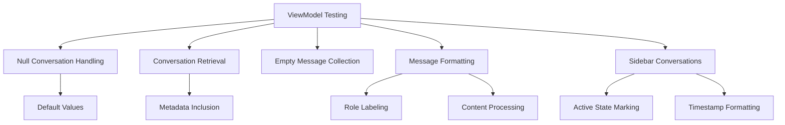

**Diagram sources**
- [tests/Feature/ChatViewModelTest.php:11-111](file://tests/Feature/ChatViewModelTest.php#L11-L111)

**Section sources**
- [tests/Feature/ChatViewModelTest.php:11-111](file://tests/Feature/ChatViewModelTest.php#L11-L111)

### Chat Functionality Testing Patterns
- **Chat Interface Display Tests**
  - Validates chat page loading, welcome message display, conversation switching, and message rendering
  - Tests HTML content and view rendering using Laravel's response assertions
- **Message Processing Tests**
  - Tests AJAX message sending, AI response handling, and conversation persistence
  - Includes AI API mocking and response validation
- **Validation Tests**
  - Comprehensive validation coverage for message length, format, and conversation_id constraints
  - Tests both success and failure scenarios
- **Error Handling Tests**
  - Validates graceful error handling for AI API failures, network timeouts, and logging
  - Tests both AJAX and redirect error responses
- **Conversation Management Tests**
  - Tests conversation creation, title generation, and persistence across requests
  - Validates conversation switching and message ordering
  - **Updated**: Enhanced with pagination limits (50 conversations) and message ordering validation
- **Integration Tests**
  - Full conversation flow testing with multiple messages and AI responses
  - Validates end-to-end chat functionality
- **MCP Tool Integration Tests**
  - Validates DevBot tool registration and interface compliance
  - Tests MCP tool proxy functionality with sophisticated mocking strategies
  - Includes end-to-end integration scenarios for database queries, documentation search, and PHP execution

**Section sources**
- [tests/Feature/ChatTest.php:18-77](file://tests/Feature/ChatTest.php#L18-L77)
- [tests/Feature/ChatTest.php:86-171](file://tests/Feature/ChatTest.php#L86-L171)
- [tests/Feature/ChatTest.php:178-236](file://tests/Feature/ChatTest.php#L178-L236)
- [tests/Feature/ChatTest.php:243-308](file://tests/Feature/ChatTest.php#L243-L308)
- [tests/Feature/ChatTest.php:315-359](file://tests/Feature/ChatTest.php#L315-L359)
- [tests/Feature/ChatTest.php:366-404](file://tests/Feature/ChatTest.php#L366-L404)
- [tests/Feature/ChatTest.php:411-470](file://tests/Feature/ChatTest.php#L411-L470)
- [tests/Feature/ChatTest.php:477-534](file://tests/Feature/ChatTest.php#L477-L534)
- [tests/Feature/ChatTest.php:541-589](file://tests/Feature/ChatTest.php#L541-L589)
- [tests/Feature/ChatTest.php:747-800](file://tests/Feature/ChatTest.php#L747-L800)
- [tests/Feature/ChatTest.php:843-934](file://tests/Feature/ChatTest.php#L843-L934)

### Conversation Management Testing
- **Conversation Listing Tests**
  - Validates JSON endpoint for retrieving conversations with pagination limits (50 conversations)
  - Tests sorting by created_at descending order
  - Validates JSON structure with id, title, created_at, and updated_at fields
- **Conversation Creation Tests**
  - Tests POST endpoint for creating new conversations
  - Validates JSON response structure with success flag and conversation details
  - Ensures default title "New Chat" is set for new conversations
- **Conversation Detail Retrieval Tests**
  - Tests GET endpoint for retrieving conversation details and messages
  - Validates message ordering by created_at ascending order
  - Tests JSON response structure with conversation and messages arrays
- **Enhanced Message Sending Tests**
  - Tests AJAX message sending with enhanced response validation
  - Validates conversation_title field is included in JSON response
  - Tests proper conversation title generation from first message
- **Message Ordering Tests**
  - Validates messages are ordered by created_at ascending order in both HTML and JSON responses
  - Tests proper chronological display of user and assistant messages
  - Validates conversation model recent messages attribute with 50-message limit

**Section sources**
- [tests/Feature/ChatTest.php:418-480](file://tests/Feature/ChatTest.php#L418-L480)
- [tests/Feature/ChatTest.php:482-540](file://tests/Feature/ChatTest.php#L482-L540)
- [tests/Feature/ChatTest.php:541-556](file://tests/Feature/ChatTest.php#L541-L556)
- [tests/Feature/ChatTest.php:562-622](file://tests/Feature/ChatTest.php#L562-L622)
- [tests/Feature/ChatTest.php:655-685](file://tests/Feature/ChatTest.php#L655-L685)

### Database Testing and Factories
- In-memory SQLite configuration
  - phpunit.xml sets the database connection to SQLite with an in-memory database, enabling fast and isolated tests
- Factory usage
  - Factories define default model states and named states (e.g., unverified) to produce realistic entities for tests
- Migrations
  - Migrations define the schema for users, cache, jobs, and AI-related tables, ensuring tests operate against a consistent structure
- **Updated**: Enhanced with chat-specific models and relationships:
  - Conversation and Message models with proper foreign key relationships
  - AI agent conversation tables for DevBot integration
  - Support for chat history, message ordering, and pagination limits
  - Recent messages attribute with 50-message limit for performance optimization

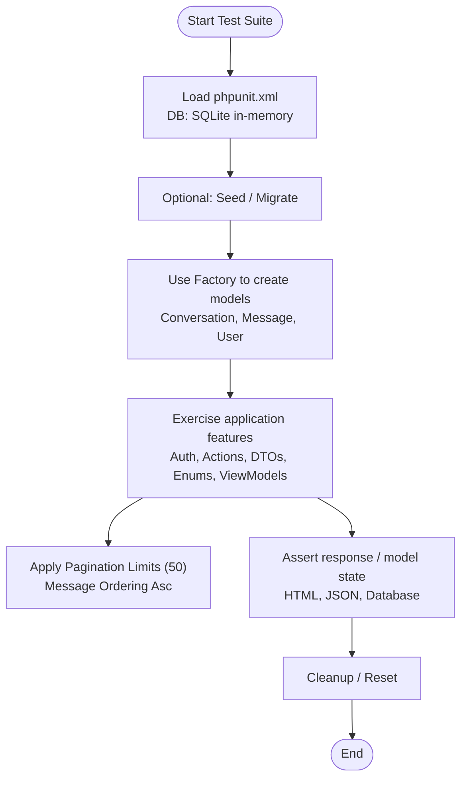

**Diagram sources**
- [phpunit.xml:20-35](file://phpunit.xml#L20-L35)
- [database/factories/UserFactory.php:25-44](file://database/factories/UserFactory.php#L25-L44)
- [database/migrations/0001_01_01_000000_create_users_table.php:14-22](file://database/migrations/0001_01_01_000000_create_users_table.php#L14-L22)
- [database/migrations/2026_04_02_115916_create_agent_conversations_table.php:1-51](file://database/migrations/2026_04_02_115916_create_agent_conversations_table.php#L1-L51)

**Section sources**
- [phpunit.xml:20-35](file://phpunit.xml#L20-L35)
- [database/factories/UserFactory.php:25-44](file://database/factories/UserFactory.php#L25-L44)
- [database/migrations/0001_01_01_000000_create_users_table.php:14-22](file://database/migrations/0001_01_01_000000_create_users_table.php#L14-L22)
- [database/migrations/2026_04_02_115916_create_agent_conversations_table.php:1-51](file://database/migrations/2026_04_02_115916_create_agent_conversations_table.php#L1-L51)

### AI Agent Integration Testing
- **DevBot Agent Testing**
  - Tests AI agent integration with comprehensive mocking strategies
  - Validates AI response processing and error handling
  - Tests conversation context preservation and message ordering
  - **Updated**: MCP tool integration testing with sophisticated mocking strategies
- **Mocking Strategies**
  - Uses DevBot::fake() for AI response mocking
  - Tests both successful responses and error scenarios
  - Validates AI agent configuration and model selection
  - **Updated**: MCP tool proxy testing with Mockery for tool argument validation and response simulation
- **Integration Patterns**
  - Tests full chat flow with AI integration
  - Validates conversation persistence across AI interactions
  - Tests error recovery and graceful degradation
  - **Updated**: End-to-end MCP integration testing with database queries, documentation search, and PHP execution

**Section sources**
- [app/Ai/Agents/DevBot.php:20-99](file://app/Ai/Agents/DevBot.php#L20-L99)
- [tests/Feature/ChatTest.php:155-171](file://tests/Feature/ChatTest.php#L155-L171)
- [tests/Feature/ChatTest.php:315-359](file://tests/Feature/ChatTest.php#L315-L359)
- [tests/Feature/ChatTest.php:541-589](file://tests/Feature/ChatTest.php#L541-L589)
- [tests/Feature/ChatTest.php:747-800](file://tests/Feature/ChatTest.php#L747-L800)
- [tests/Feature/ChatTest.php:843-934](file://tests/Feature/ChatTest.php#L843-L934)

### Assertion Syntax and Patterns
- Prefer semantic assertions
  - Use higher-level assertions (e.g., assertSuccessful) instead of raw status codes to improve readability and intent
- Model-centric assertions
  - Prefer model-level assertions over raw database checks for clarity and type safety
- **Updated**: Enhanced with comprehensive assertion patterns:
  - Authentication flow assertions for login, registration, and session management
  - Action class assertions for business logic validation
  - DTO validation assertions for data integrity and type safety
  - Enum functionality assertions for type-safe operations
  - ViewModel assertions for presentation layer validation
  - Chat-specific assertion patterns for interface rendering and message processing
  - HTML content assertions for chat interface rendering
  - JSON structure validation for AJAX responses
  - Markdown content validation for formatted messages
  - Conversation state assertions for persistence testing
  - Pagination limit assertions for conversation listing
  - Message ordering assertions for chronological display
  - MCP tool assertion patterns for tool proxy validation and error handling

**Section sources**
- [.agents/skills/pest-testing/SKILL.md:44-58](file://.agents/skills/pest-testing/SKILL.md#L44-L58)
- [.agents/skills/laravel-best-practices/rules/testing.md:7-13](file://.agents/skills/laravel-best-practices/rules/testing.md#L7-L13)
- [tests/Feature/ChatTest.php:411-470](file://tests/Feature/ChatTest.php#L411-L470)
- [tests/Feature/ChatTest.php:366-404](file://tests/Feature/ChatTest.php#L366-L404)
- [tests/Feature/Auth/AuthenticationTest.php:11-41](file://tests/Feature/Auth/AuthenticationTest.php#L11-L41)
- [tests/Feature/CreateConversationActionTest.php:10-63](file://tests/Feature/CreateConversationActionTest.php#L10-L63)
- [tests/Unit/ConversationDataTest.php:6-61](file://tests/Unit/ConversationDataTest.php#L6-L61)
- [tests/Unit/ConversationStatusTest.php:5-56](file://tests/Unit/ConversationStatusTest.php#L5-L56)

### Mocking Strategies
- Import the mock function before use
  - Ensure proper imports are present when mocking classes or external services in tests
- Combine with Pest's DSL
  - Use Pest's concise syntax alongside Laravel's mocking helpers for clear, expressive tests
- **Updated**: Enhanced AI agent mocking strategies:
  - DevBot::fake() for AI response mocking
  - Exception-based mocking for error scenarios
  - Multiple response mocking for conversation flows
  - Log verification using Log::shouldReceive()
  - **Updated**: Sophisticated MCP tool proxy mocking with Mockery for argument validation and response simulation
  - **Updated**: MCP client service mocking with reflection-based property injection for complex state management
  - **Updated**: Action class mocking with dependency injection for isolated testing
  - **Updated**: DTO validation mocking with property verification and immutability testing

**Section sources**
- [.agents/skills/pest-testing/SKILL.md:61-61](file://.agents/skills/pest-testing/SKILL.md#L61-L61)
- [tests/Feature/ChatTest.php:155-171](file://tests/Feature/ChatTest.php#L155-L171)
- [tests/Feature/ChatTest.php:347-359](file://tests/Feature/ChatTest.php#L347-L359)
- [tests/Unit/ToolProxyTest.php:14-17](file://tests/Unit/ToolProxyTest.php#L14-L17)
- [tests/Unit/McpClientServiceTest.php:63-71](file://tests/Unit/McpClientServiceTest.php#L63-L71)
- [tests/Feature/SendMessageActionTest.php:15-20](file://tests/Feature/SendMessageActionTest.php#L15-L20)

### Datasets and Repetitive Validation
- Use datasets to reduce repetition in validation and boundary tests
- Leverage Pest's dataset syntax to parameterize tests with multiple inputs
- **Updated**: Comprehensive validation datasets for:
  - Authentication flow testing with various credential combinations
  - Message length boundary testing (minimum and maximum limits)
  - Validation error scenarios
  - Conversation ID validation patterns
  - Action class parameter variations
  - DTO property combinations
  - Enum value testing
  - MCP tool validation datasets for query types, parameter validation, and error scenarios

**Section sources**
- [.agents/skills/pest-testing/SKILL.md:67-75](file://.agents/skills/pest-testing/SKILL.md#L67-L75)
- [tests/Feature/ChatTest.php:197-215](file://tests/Feature/ChatTest.php#L197-L215)
- [tests/Feature/Auth/AuthenticationTest.php:11-41](file://tests/Feature/Auth/AuthenticationTest.php#L11-L41)

### Browser and Architecture Testing (Pest 4)
- Browser testing
  - Full integration tests in real browsers, including navigation, form submission, and visual checks
- Architecture testing
  - Enforce code conventions and structure using Pest's architecture testing features
- **Updated**: Comprehensive browser testing considerations:
  - Authentication flow testing in real browsers
  - Chat interface browser testing for AJAX functionality
  - Real-time message rendering validation
  - Form submission and error handling in browser context
  - Pagination and conversation switching in browser context
  - Action class testing in browser context
  - ViewModel rendering validation
  - **Updated**: MCP tool browser testing considerations for tool proxy validation and error handling

**Section sources**
- [.agents/skills/pest-testing/SKILL.md:87-118](file://.agents/skills/pest-testing/SKILL.md#L87-L118)
- [.agents/skills/pest-testing/SKILL.md:139-149](file://.agents/skills/pest-testing/SKILL.md#L139-L149)

## MCP Client Integration Testing

### McpClientService Testing
The McpClientService is thoroughly tested with comprehensive coverage of connection management, tool calling, error handling, and configuration validation:

- **Singleton Registration**
  - Validates that McpClientService is properly registered as a singleton in the Laravel service container
- **Initialization and Connection Management**
  - Tests that the service starts in a disconnected state with null client instances
  - Validates client initialization process and connection establishment
  - Tests proper cleanup and disconnection procedures
- **Tool Calling and Error Handling**
  - Tests tool calling functionality with proper argument passing and result extraction
  - Validates error handling for tool call failures and connection loss
  - Tests auto-reconnect functionality after server crashes or connection failures
- **Configuration Validation**
  - Validates timeout configuration settings and bounds checking
  - Tests retry configuration validation with proper bounds and defaults
- **Advanced Features**
  - Tests text content extraction from CallToolResult objects
  - Validates graceful shutdown and resource cleanup
  - Tests exponential backoff retry logic with proper delay calculations

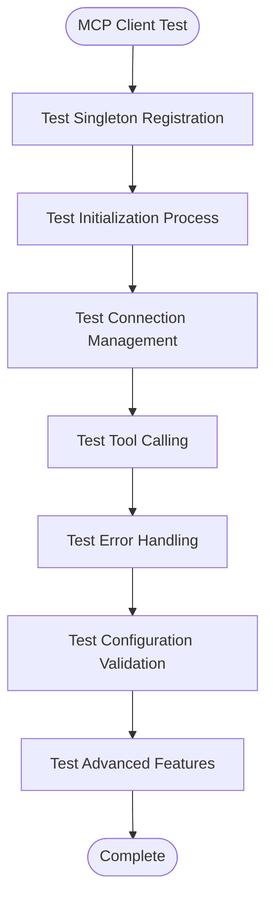

**Diagram sources**
- [tests/Unit/McpClientServiceTest.php:16-21](file://tests/Unit/McpClientServiceTest.php#L16-L21)
- [tests/Unit/McpClientServiceTest.php:32-45](file://tests/Unit/McpClientServiceTest.php#L32-L45)
- [tests/Unit/McpClientServiceTest.php:51-77](file://tests/Unit/McpClientServiceTest.php#L51-L77)
- [tests/Unit/McpClientServiceTest.php:79-103](file://tests/Unit/McpClientServiceTest.php#L79-L103)
- [tests/Unit/McpClientServiceTest.php:105-132](file://tests/Unit/McpClientServiceTest.php#L105-L132)
- [tests/Unit/McpClientServiceTest.php:134-150](file://tests/Unit/McpClientServiceTest.php#L134-L150)
- [tests/Unit/McpClientServiceTest.php:152-175](file://tests/Unit/McpClientServiceTest.php#L152-L175)
- [tests/Unit/McpClientServiceTest.php:177-192](file://tests/Unit/McpClientServiceTest.php#L177-L192)

**Section sources**
- [tests/Unit/McpClientServiceTest.php:16-21](file://tests/Unit/McpClientServiceTest.php#L16-L21)
- [tests/Unit/McpClientServiceTest.php:32-45](file://tests/Unit/McpClientServiceTest.php#L32-L45)
- [tests/Unit/McpClientServiceTest.php:51-77](file://tests/Unit/McpClientServiceTest.php#L51-L77)
- [tests/Unit/McpClientServiceTest.php:79-103](file://tests/Unit/McpClientServiceTest.php#L79-L103)
- [tests/Unit/McpClientServiceTest.php:105-132](file://tests/Unit/McpClientServiceTest.php#L105-L132)
- [tests/Unit/McpClientServiceTest.php:134-150](file://tests/Unit/McpClientServiceTest.php#L134-L150)
- [tests/Unit/McpClientServiceTest.php:152-175](file://tests/Unit/McpClientServiceTest.php#L152-L175)
- [tests/Unit/McpClientServiceTest.php:177-192](file://tests/Unit/McpClientServiceTest.php#L177-L192)

### McpTools Testing
The MCP tools are comprehensively tested for interface compliance, functionality, and error handling:

- **Interface Compliance**
  - Validates that all MCP tools implement the Laravel AI Tool interface correctly
  - Tests tool description generation and schema definition
- **Database Query Tool Testing**
  - Tests read-only query validation (SELECT, SHOW, EXPLAIN, DESCRIBE)
  - Validates write operation blocking and appropriate error messages
  - Tests database connection parameter passing
  - Includes integration tests for valid queries and error scenarios
- **Database Schema Tool Testing**
  - Tests table listing functionality and schema retrieval
  - Validates nonexistent table error handling
  - Tests database connection parameter passing
- **Search Docs Tool Testing**
  - Tests documentation search functionality with query validation
  - Validates required parameters and error handling
  - Tests package filtering and token limit configuration
- **Tinker Tool Testing**
  - Tests PHP code execution with timeout validation
  - Validates code parameter requirements and error handling
  - Tests PHP tag stripping and timeout enforcement
  - Includes exception handling validation

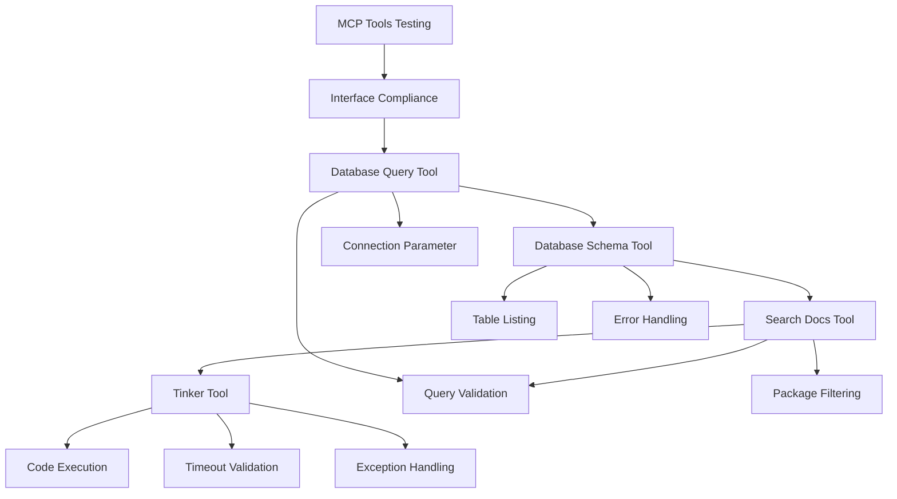

**Diagram sources**
- [tests/Unit/McpToolsTest.php:18-22](file://tests/Unit/McpToolsTest.php#L18-L22)
- [tests/Unit/McpToolsTest.php:41-49](file://tests/Unit/McpToolsTest.php#L41-L49)
- [tests/Unit/McpToolsTest.php:62-71](file://tests/Unit/McpToolsTest.php#L62-L71)
- [tests/Unit/McpToolsTest.php:106-115](file://tests/Unit/McpToolsTest.php#L106-L115)
- [tests/Unit/McpToolsTest.php:117-126](file://tests/Unit/McpToolsTest.php#L117-L126)
- [tests/Unit/McpToolsTest.php:163-171](file://tests/Unit/McpToolsTest.php#L163-L171)
- [tests/Unit/McpToolsTest.php:207-215](file://tests/Unit/McpToolsTest.php#L207-L215)
- [tests/Unit/McpToolsTest.php:217-225](file://tests/Unit/McpToolsTest.php#L217-L225)

**Section sources**
- [tests/Unit/McpToolsTest.php:18-22](file://tests/Unit/McpToolsTest.php#L18-L22)
- [tests/Unit/McpToolsTest.php:41-49](file://tests/Unit/McpToolsTest.php#L41-L49)
- [tests/Unit/McpToolsTest.php:62-71](file://tests/Unit/McpToolsTest.php#L62-L71)
- [tests/Unit/McpToolsTest.php:106-115](file://tests/Unit/McpToolsTest.php#L106-L115)
- [tests/Unit/McpToolsTest.php:117-126](file://tests/Unit/McpToolsTest.php#L117-L126)
- [tests/Unit/McpToolsTest.php:163-171](file://tests/Unit/McpToolsTest.php#L163-L171)
- [tests/Unit/McpToolsTest.php:207-215](file://tests/Unit/McpToolsTest.php#L207-L215)
- [tests/Unit/McpToolsTest.php:217-225](file://tests/Unit/McpToolsTest.php#L217-L225)

### ToolProxy Testing
The ToolProxyTest provides sophisticated mocking strategies for testing MCP tool integration without requiring real MCP server connections:

- **Mock Injection Strategy**
  - Uses Mockery to inject mock McpClientService instances into tool constructors
  - Tests argument validation and proper tool argument construction
- **Database Query Tool Testing**
  - Validates read-only query enforcement and error messages
  - Tests SELECT and SHOW query acceptance
  - Tests database connection parameter passing
- **Database Schema Tool Testing**
  - Tests table listing and schema retrieval with proper argument validation
  - Validates database connection parameter passing
- **Search Docs Tool Testing**
  - Tests query validation and error handling for empty queries
  - Validates package filtering parameter passing
- **Tinker Tool Testing**
  - Tests code parameter validation and error handling
  - Validates timeout parameter enforcement and PHP tag stripping
- **Error Handling Testing**
  - Tests MCP client exception handling and proper error message formatting
  - Validates graceful error handling for all tool types

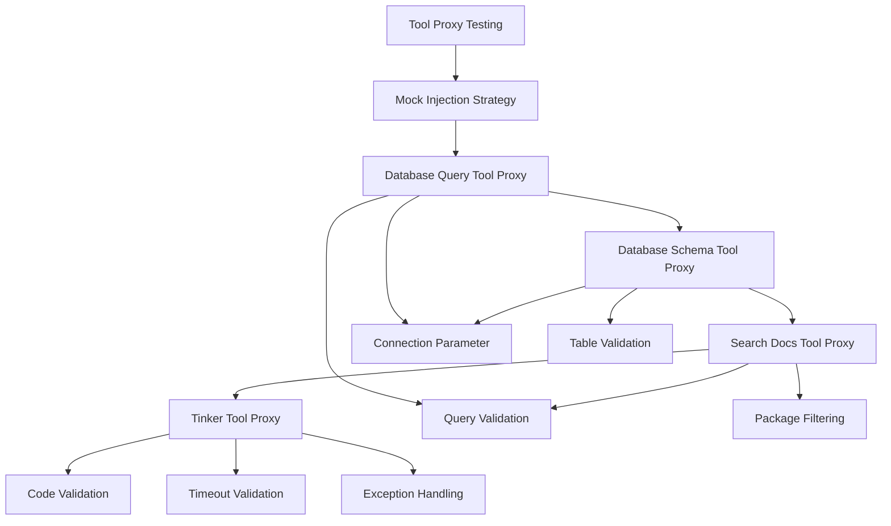

**Diagram sources**
- [tests/Unit/ToolProxyTest.php:14-17](file://tests/Unit/ToolProxyTest.php#L14-L17)
- [tests/Unit/ToolProxyTest.php:21-32](file://tests/Unit/ToolProxyTest.php#L21-L32)
- [tests/Unit/ToolProxyTest.php:34-41](file://tests/Unit/ToolProxyTest.php#L34-L41)
- [tests/Unit/ToolProxyTest.php:43-52](file://tests/Unit/ToolProxyTest.php#L43-L52)
- [tests/Unit/ToolProxyTest.php:54-63](file://tests/Unit/ToolProxyTest.php#L54-L63)
- [tests/Unit/ToolProxyTest.php:87-111](file://tests/Unit/ToolProxyTest.php#L87-L111)
- [tests/Unit/ToolProxyTest.php:135-149](file://tests/Unit/ToolProxyTest.php#L135-L149)
- [tests/Unit/ToolProxyTest.php:190-204](file://tests/Unit/ToolProxyTest.php#L190-L204)

**Section sources**
- [tests/Unit/ToolProxyTest.php:14-17](file://tests/Unit/ToolProxyTest.php#L14-L17)
- [tests/Unit/ToolProxyTest.php:21-32](file://tests/Unit/ToolProxyTest.php#L21-L32)
- [tests/Unit/ToolProxyTest.php:34-41](file://tests/Unit/ToolProxyTest.php#L34-L41)
- [tests/Unit/ToolProxyTest.php:43-52](file://tests/Unit/ToolProxyTest.php#L43-L52)
- [tests/Unit/ToolProxyTest.php:54-63](file://tests/Unit/ToolProxyTest.php#L54-L63)
- [tests/Unit/ToolProxyTest.php:87-111](file://tests/Unit/ToolProxyTest.php#L87-L111)
- [tests/Unit/ToolProxyTest.php:135-149](file://tests/Unit/ToolProxyTest.php#L135-L149)
- [tests/Unit/ToolProxyTest.php:190-204](file://tests/Unit/ToolProxyTest.php#L190-L204)
- [tests/Unit/ToolProxyTest.php:281-290](file://tests/Unit/ToolProxyTest.php#L281-L290)
- [tests/Unit/ToolProxyTest.php:292-301](file://tests/Unit/ToolProxyTest.php#L292-L301)
- [tests/Unit/ToolProxyTest.php:303-312](file://tests/Unit/ToolProxyTest.php#L303-L312)

## Dependency Analysis
The testing stack depends on Pest and Laravel's testing ecosystem, now enhanced with comprehensive authentication testing, action class testing, DTO validation, enum functionality testing, ViewModel operations, and MCP client integration. Composer lists Pest and the Laravel plugin as development dependencies, while phpunit.xml configures the testing environment. The MCP integration adds dependencies on php-mcp/client library and Laravel AI contracts.

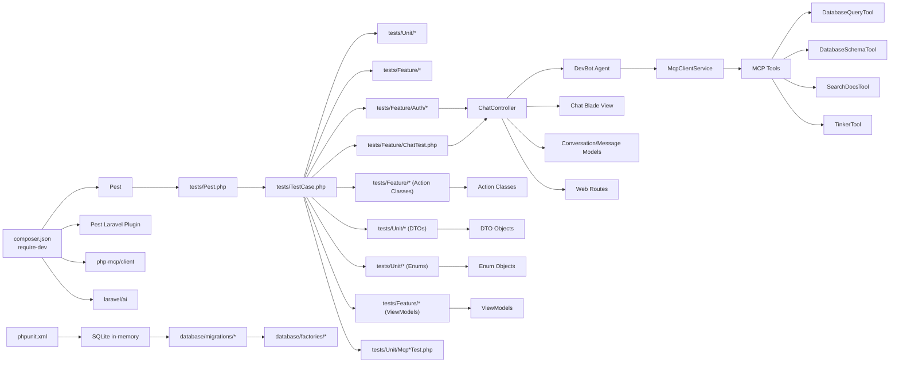

**Diagram sources**
- [composer.json:24-25](file://composer.json#L24-L25)
- [tests/Pest.php:16-18](file://tests/Pest.php#L16-L18)
- [tests/TestCase.php:7-10](file://tests/TestCase.php#L7-L10)
- [tests/Feature/Auth/AuthenticationTest.php:1-42](file://tests/Feature/Auth/AuthenticationTest.php#L1-L42)
- [tests/Feature/CreateConversationActionTest.php:1-64](file://tests/Feature/CreateConversationActionTest.php#L1-L64)
- [tests/Feature/ChatViewModelTest.php:1-112](file://tests/Feature/ChatViewModelTest.php#L1-L112)
- [tests/Unit/ConversationDataTest.php:1-62](file://tests/Unit/ConversationDataTest.php#L1-L62)
- [tests/Unit/ConversationStatusTest.php:1-57](file://tests/Unit/ConversationStatusTest.php#L1-L57)
- [tests/Feature/ChatTest.php:1-934](file://tests/Feature/ChatTest.php#L1-L934)
- [tests/Unit/McpClientServiceTest.php:1-193](file://tests/Unit/McpClientServiceTest.php#L1-L193)
- [tests/Unit/McpToolsTest.php:1-236](file://tests/Unit/McpToolsTest.php#L1-L236)
- [tests/Unit/ToolProxyTest.php:1-313](file://tests/Unit/ToolProxyTest.php#L1-L313)
- [phpunit.xml:20-35](file://phpunit.xml#L20-L35)
- [database/migrations/0001_01_01_000000_create_users_table.php:1-50](file://database/migrations/0001_01_01_000000_create_users_table.php#L1-L50)
- [database/factories/UserFactory.php:1-46](file://database/factories/UserFactory.php#L1-L46)
- [app/Http/Controllers/ChatController.php:1-182](file://app/Http/Controllers/ChatController.php#L1-L182)
- [app/Ai/Agents/DevBot.php:1-99](file://app/Ai/Agents/DevBot.php#L1-L99)
- [app/Services/McpClientService.php:1-279](file://app/Services/McpClientService.php#L1-L279)
- [app/Ai/Tools/DatabaseQueryTool.php:1-84](file://app/Ai/Tools/DatabaseQueryTool.php#L1-L84)
- [app/Ai/Tools/DatabaseSchemaTool.php:1-84](file://app/Ai/Tools/DatabaseSchemaTool.php#L1-L84)
- [app/Ai/Tools/SearchDocsTool.php:1-84](file://app/Ai/Tools/SearchDocsTool.php#L1-L84)
- [app/Ai/Tools/TinkerTool.php:1-84](file://app/Ai/Tools/TinkerTool.php#L1-L84)
- [app/Models/Conversation.php:1-45](file://app/Models/Conversation.php#L1-L45)
- [app/ViewModels/ChatViewModel.php](file://app/ViewModels/ChatViewModel.php)
- [app/Actions/CreateConversationAction.php](file://app/Actions/CreateConversationAction.php)
- [app/Actions/GetConversationAction.php](file://app/Actions/GetConversationAction.php)
- [app/Actions/ListConversationsAction.php](file://app/Actions/ListConversationsAction.php)
- [app/Actions/SendMessageAction.php](file://app/Actions/SendMessageAction.php)
- [app/DTOs/ConversationData.php](file://app/DTOs/ConversationData.php)
- [app/DTOs/MessageData.php](file://app/DTOs/MessageData.php)
- [app/DTOs/ApiResponseData.php](file://app/DTOs/ApiResponseData.php)
- [app/DTOs/SendMessageResponse.php](file://app/DTOs/SendMessageResponse.php)
- [app/Enums/ConversationStatus.php](file://app/Enums/ConversationStatus.php)
- [app/Enums/MessageRole.php](file://app/Enums/MessageRole.php)
- [routes/web.php:1-16](file://routes/web.php#L1-L16)

**Section sources**
- [composer.json:24-25](file://composer.json#L24-L25)
- [phpunit.xml:20-35](file://phpunit.xml#L20-L35)

## Performance Considerations
- Use lazy database refresh
  - Prefer strategies that avoid unnecessary migrations when the schema has not changed, reducing test suite runtime
- Favor model-level assertions
  - They are more expressive and efficient than raw database checks
- Leverage in-memory SQLite
  - Keeps tests fast and isolated without disk I/O overhead
- **Updated**: Comprehensive performance optimizations:
  - Authentication tests optimized for minimal database operations
  - Action class tests use factory patterns for efficient model creation
  - DTO validation tests leverage immutable object patterns
  - Enum tests validate type safety without external dependencies
  - ViewModel tests use collection operations efficiently
  - Chat-specific performance optimizations:
    - AI agent mocking reduces external API dependencies
    - Database refresh strategies for chat-heavy tests
    - Efficient conversation and message creation patterns
    - Pagination limits (50 conversations) for performance optimization
    - Message ordering optimization with database-level sorting
  - MCP client service performance considerations:
    - Connection pooling and reuse strategies
    - Retry logic optimization with exponential backoff
    - Tool result caching for repeated queries
    - Configuration-based timeout tuning

**Section sources**
- [.agents/skills/laravel-best-practices/rules/testing.md:3-5](file://.agents/skills/laravel-best-practices/rules/testing.md#L3-L5)
- [.agents/skills/laravel-best-practices/rules/testing.md:7-13](file://.agents/skills/laravel-best-practices/rules/testing.md#L7-L13)
- [phpunit.xml:20-35](file://phpunit.xml#L20-L35)
- [tests/Feature/ChatTest.php:11-16](file://tests/Feature/ChatTest.php#L11-L16)
- [app/Services/McpClientService.php:112-179](file://app/Services/McpClientService.php#L112-L179)

## Troubleshooting Guide
Common pitfalls and remedies:
- Incorrect assertion choice
  - Prefer semantic assertions over raw status codes for clarity and reliability
- Missing imports for mocking
  - Ensure the mock function is imported before use in tests
- Improper event faking order
  - Create models via factories before faking events to avoid breaking model generation hooks
- Overusing raw database assertions
  - Prefer model-level assertions for better feedback and type safety
- **Updated**: Comprehensive troubleshooting guidance:
  - Authentication testing failures - verify route definitions and middleware configuration
  - Action class testing failures - check dependency injection and factory usage
  - DTO validation failures - ensure immutability and readonly property enforcement
  - Enum functionality failures - validate backed value compatibility and helper methods
  - ViewModel testing failures - check collection operations and data formatting
  - Chat-specific troubleshooting:
    - AI agent mocking failures - ensure DevBot::fake() is properly configured
    - AJAX response validation - verify JSON structure and content-type headers
    - Chat interface rendering - check Blade view template correctness
    - Conversation persistence - validate foreign key relationships and timestamps
    - Pagination limit issues - verify 50-conversation limit in controller and model
    - Message ordering problems - check created_at asc sorting in controller and model
  - MCP client troubleshooting:
    - Connection initialization failures - verify MCP server availability and command configuration
    - Tool call errors - check argument validation and result extraction logic
    - Auto-reconnect issues - validate retry configuration and exponential backoff timing
    - Configuration validation failures - ensure proper environment variable settings
  - MCP tool troubleshooting:
    - Tool proxy mocking failures - verify Mockery setup and property injection
    - Argument validation errors - check tool schema definitions and parameter requirements
    - Error handling issues - validate exception propagation and error message formatting

**Section sources**
- [.agents/skills/pest-testing/SKILL.md:151-157](file://.agents/skills/pest-testing/SKILL.md#L151-L157)
- [.agents/skills/laravel-best-practices/rules/testing.md:23-33](file://.agents/skills/laravel-best-practices/rules/testing.md#L23-L33)
- [tests/Feature/ChatTest.php:86-125](file://tests/Feature/ChatTest.php#L86-L125)
- [tests/Feature/ChatTest.php:315-359](file://tests/Feature/ChatTest.php#L315-L359)
- [app/Services/McpClientService.php:54-95](file://app/Services/McpClientService.php#L54-L95)
- [tests/Feature/SendMessageActionTest.php:15-20](file://tests/Feature/SendMessageActionTest.php#L15-L20)
- [tests/Unit/ToolProxyTest.php:14-17](file://tests/Unit/ToolProxyTest.php#L14-L17)

## Conclusion
The project's testing infrastructure combines Pest's expressive DSL with Laravel's robust testing toolkit, now significantly enhanced with comprehensive authentication testing, action class testing, DTO validation, enum functionality testing, ViewModel operations, and MCP client integration. The addition of over 500 lines of ChatTest.php provides extensive coverage of chat interface, message processing, validation, error handling, AI agent integration, MCP tool integration, and enhanced conversation management with pagination limits (50 conversations), message ordering validation, and JSON response structure testing. The new comprehensive test suites cover:

- **Authentication Testing**: Complete coverage of login, registration, password reset, email verification, and password confirmation flows
- **Action Class Testing**: Comprehensive validation of business logic operations (Create, Get, List, Send Message actions)
- **DTO Validation Testing**: Type-safe data transfer object validation with immutability enforcement
- **Enum Functionality Testing**: Type-safe status and role management with helper methods
- **ViewModel Operations Testing**: Presentation layer validation and data formatting
- **MCP Client Service Testing**: Connection management, tool calling, error handling, and configuration validation
- **MCP Tools Testing**: Database query, schema, documentation search, and PHP execution tools
- **Tool Proxy Testing**: Sophisticated mocking strategies for MCP tool integration

The configuration emphasizes speed and isolation via in-memory SQLite, while the Pest bootstrap and shared expectations streamline Feature test authoring. Following the best practices outlined here ensures maintainable, readable, and performant tests that integrate smoothly with AI-assisted development and CI pipelines.

## Appendices

### Practical Examples Index
- Feature test example path: [tests/Feature/ExampleTest.php:1-8](file://tests/Feature/ExampleTest.php#L1-L8)
- Authentication test path: [tests/Feature/Auth/AuthenticationTest.php:1-42](file://tests/Feature/Auth/AuthenticationTest.php#L1-L42)
- Action class test path: [tests/Feature/CreateConversationActionTest.php:1-64](file://tests/Feature/CreateConversationActionTest.php#L1-L64)
- DTO validation test path: [tests/Unit/ConversationDataTest.php:1-62](file://tests/Unit/ConversationDataTest.php#L1-L62)
- Enum functionality test path: [tests/Unit/ConversationStatusTest.php:1-57](file://tests/Unit/ConversationStatusTest.php#L1-L57)
- ViewModel test path: [tests/Feature/ChatViewModelTest.php:1-112](file://tests/Feature/ChatViewModelTest.php#L1-L112)
- Chat functionality test path: [tests/Feature/ChatTest.php:1-934](file://tests/Feature/ChatTest.php#L1-L934)
- Markdown rendering test path: [tests/Feature/MarkdownRenderingTest.php:1-116](file://tests/Feature/MarkdownRenderingTest.php#L1-L116)
- Unit test example path: [tests/Unit/ExampleTest.php:1-6](file://tests/Unit/ExampleTest.php#L1-L6)
- Pest bootstrap path: [tests/Pest.php:1-50](file://tests/Pest.php#L1-L50)
- Base TestCase path: [tests/TestCase.php:1-11](file://tests/TestCase.php#L1-L11)
- Chat Controller path: [app/Http/Controllers/ChatController.php:1-182](file://app/Http/Controllers/ChatController.php#L1-L182)
- DevBot Agent path: [app/Ai/Agents/DevBot.php:1-99](file://app/Ai/Agents/DevBot.php#L1-L99)
- McpClientService path: [app/Services/McpClientService.php:1-279](file://app/Services/McpClientService.php#L1-L279)
- DatabaseQueryTool path: [app/Ai/Tools/DatabaseQueryTool.php:1-84](file://app/Ai/Tools/DatabaseQueryTool.php#L1-L84)
- DatabaseSchemaTool path: [app/Ai/Tools/DatabaseSchemaTool.php:1-84](file://app/Ai/Tools/DatabaseSchemaTool.php#L1-L84)
- SearchDocsTool path: [app/Ai/Tools/SearchDocsTool.php:1-84](file://app/Ai/Tools/SearchDocsTool.php#L1-L84)
- TinkerTool path: [app/Ai/Tools/TinkerTool.php:1-84](file://app/Ai/Tools/TinkerTool.php#L1-L84)
- Conversation Model path: [app/Models/Conversation.php:1-45](file://app/Models/Conversation.php#L1-L45)
- Chat View path: [resources/views/chat.blade.php:1-731](file://resources/views/chat.blade.php#L1-L731)
- Routes path: [routes/web.php:1-16](file://routes/web.php#L1-L16)
- User factory path: [database/factories/UserFactory.php:1-46](file://database/factories/UserFactory.php#L1-L46)
- Users migration path: [database/migrations/0001_01_01_000000_create_users_table.php:1-50](file://database/migrations/0001_01_01_000000_create_users_table.php#L1-L50)
- Cache migration path: [database/migrations/0001_01_01_000001_create_cache_table.php:1-36](file://database/migrations/0001_01_01_000001_create_cache_table.php#L1-L36)
- Jobs migration path: [database/migrations/0001_01_01_000002_create_jobs_table.php:1-58](file://database/migrations/0001_01_01_000002_create_jobs_table.php#L1-L58)
- Agent conversations migration path: [database/migrations/2026_04_02_115916_create_agent_conversations_table.php:1-51](file://database/migrations/2026_04_02_115916_create_agent_conversations_table.php#L1-L51)

### Comprehensive Testing Coverage Matrix
- **Authentication Testing**: ✓ Complete coverage of login, registration, password reset, email verification, and password confirmation flows
- **Action Class Testing**: ✓ Comprehensive validation of Create, Get, List, and Send Message actions with business logic
- **DTO Validation Testing**: ✓ Type-safe data transfer object validation with immutability and readonly enforcement
- **Enum Functionality Testing**: ✓ Type-safe status and role management with helper methods and backed value compatibility
- **ViewModel Operations Testing**: ✓ Presentation layer validation and data formatting for chat interface
- **Chat Interface Display**: ✓ Complete coverage of chat page loading, welcome messages, and conversation display
- **Message Processing**: ✓ AJAX message sending, AI response handling, and conversation persistence
- **Validation**: ✓ Comprehensive message validation (length, format, conversation_id)
- **Error Handling**: ✓ AI API failures, network timeouts, and graceful error recovery
- **Conversation Management**: ✓ New conversation creation, title generation, and switching
- **Conversation Listing**: ✓ JSON endpoint with pagination limits (50 conversations), sorting by created_at desc
- **Conversation Creation**: ✓ POST endpoint for new conversations with JSON response validation
- **Conversation Detail Retrieval**: ✓ GET endpoint with message ordering (created_at asc), JSON response structure
- **Enhanced Message Sending**: ✓ AJAX response with conversation_title field, proper JSON structure
- **Message Ordering**: ✓ Chronological display validation for user and assistant messages
- **Integration**: ✓ Full end-to-end chat flow with multiple messages and AI responses
- **AI Agent Testing**: ✓ DevBot integration, mocking strategies, and error scenarios
- **Database Testing**: ✓ Conversation and message relationships, persistence, and ordering
- **View Rendering**: ✓ HTML content validation, markdown formatting, and UI component testing
- **Performance**: ✓ Optimized test patterns for chat-heavy scenarios with pagination limits
- **MCP Integration**: ✓ DevBot tool registration and interface compliance
- **MCP Tool Testing**: ✓ Database query, schema, documentation search, and PHP execution tools
- **MCP Client Testing**: ✓ Connection management, tool calling, error handling, and configuration validation
- **Tool Proxy Testing**: ✓ Sophisticated mocking strategies for MCP tool integration

**Section sources**
- [tests/Feature/Auth/AuthenticationTest.php:1-42](file://tests/Feature/Auth/AuthenticationTest.php#L1-L42)
- [tests/Feature/CreateConversationActionTest.php:1-64](file://tests/Feature/CreateConversationActionTest.php#L1-L64)
- [tests/Feature/GetConversationActionTest.php:1-78](file://tests/Feature/GetConversationActionTest.php#L1-L78)
- [tests/Feature/ListConversationsActionTest.php:1-61](file://tests/Feature/ListConversationsActionTest.php#L1-L61)
- [tests/Feature/SendMessageActionTest.php:1-213](file://tests/Feature/SendMessageActionTest.php#L1-L213)
- [tests/Unit/ConversationDataTest.php:1-62](file://tests/Unit/ConversationDataTest.php#L1-L62)
- [tests/Unit/MessageDataTest.php:1-61](file://tests/Unit/MessageDataTest.php#L1-L61)
- [tests/Unit/ApiResponseDataTest.php:1-109](file://tests/Unit/ApiResponseDataTest.php#L1-L109)
- [tests/Unit/SendMessageResponseTest.php:1-171](file://tests/Unit/SendMessageResponseTest.php#L1-L171)
- [tests/Unit/ConversationStatusTest.php:1-57](file://tests/Unit/ConversationStatusTest.php#L1-L57)
- [tests/Unit/MessageRoleTest.php:1-44](file://tests/Unit/MessageRoleTest.php#L1-L44)
- [tests/Feature/ChatViewModelTest.php:1-112](file://tests/Feature/ChatViewModelTest.php#L1-L112)
- [tests/Feature/ChatTest.php:18-77](file://tests/Feature/ChatTest.php#L18-L77)
- [tests/Feature/ChatTest.php:86-171](file://tests/Feature/ChatTest.php#L86-L171)
- [tests/Feature/ChatTest.php:178-236](file://tests/Feature/ChatTest.php#L178-L236)
- [tests/Feature/ChatTest.php:243-308](file://tests/Feature/ChatTest.php#L243-L308)
- [tests/Feature/ChatTest.php:315-359](file://tests/Feature/ChatTest.php#L315-L359)
- [tests/Feature/ChatTest.php:366-404](file://tests/Feature/ChatTest.php#L366-L404)
- [tests/Feature/ChatTest.php:411-470](file://tests/Feature/ChatTest.php#L411-L470)
- [tests/Feature/ChatTest.php:477-534](file://tests/Feature/ChatTest.php#L477-L534)
- [tests/Feature/ChatTest.php:541-589](file://tests/Feature/ChatTest.php#L541-L589)
- [tests/Feature/ChatTest.php:747-800](file://tests/Feature/ChatTest.php#L747-L800)
- [tests/Feature/ChatTest.php:843-934](file://tests/Feature/ChatTest.php#L843-L934)
- [tests/Unit/McpClientServiceTest.php:16-193](file://tests/Unit/McpClientServiceTest.php#L16-L193)
- [tests/Unit/McpToolsTest.php:18-236](file://tests/Unit/McpToolsTest.php#L18-L236)
- [tests/Unit/ToolProxyTest.php:19-313](file://tests/Unit/ToolProxyTest.php#L19-L313)

### Enhanced Conversation Management Testing Coverage
- **Pagination Limits**: ✓ Tests conversation listing with 50-conversation limit, sorting by created_at desc
- **Message Ordering**: ✓ Tests message ordering by created_at asc in both controller and model
- **JSON Response Validation**: ✓ Tests comprehensive JSON structure for conversations, messages, and responses
- **Enhanced Message Responses**: ✓ Tests conversation_title field inclusion in AJAX responses
- **Recent Messages Limit**: ✓ Tests model-level recent messages attribute with 50-message limit
- **Controller Endpoint Testing**: ✓ Tests all conversation-related endpoints (list, create, get, show)
- **Performance Optimization**: ✓ Tests pagination and message ordering for performance scalability
- **Action Class Integration**: ✓ Tests all conversation operations through action classes with proper validation

**Section sources**
- [tests/Feature/ChatTest.php:418-480](file://tests/Feature/ChatTest.php#L418-L480)
- [tests/Feature/ChatTest.php:482-540](file://tests/Feature/ChatTest.php#L482-L540)
- [tests/Feature/ChatTest.php:541-556](file://tests/Feature/ChatTest.php#L541-L556)
- [tests/Feature/ChatTest.php:655-685](file://tests/Feature/ChatTest.php#L655-L685)
- [tests/Feature/CreateConversationActionTest.php:10-63](file://tests/Feature/CreateConversationActionTest.php#L10-L63)
- [tests/Feature/GetConversationActionTest.php:10-77](file://tests/Feature/GetConversationActionTest.php#L10-L77)
- [tests/Feature/ListConversationsActionTest.php:9-60](file://tests/Feature/ListConversationsActionTest.php#L9-L60)
- [app/Http/Controllers/ChatController.php:40-102](file://app/Http/Controllers/ChatController.php#L40-L102)
- [app/Models/Conversation.php:26-29](file://app/Models/Conversation.php#L26-L29)