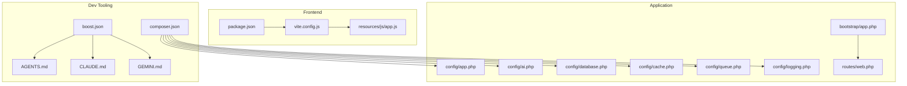
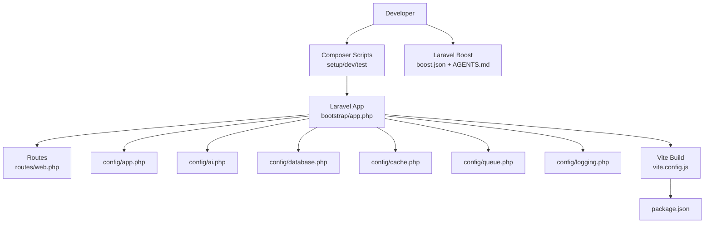
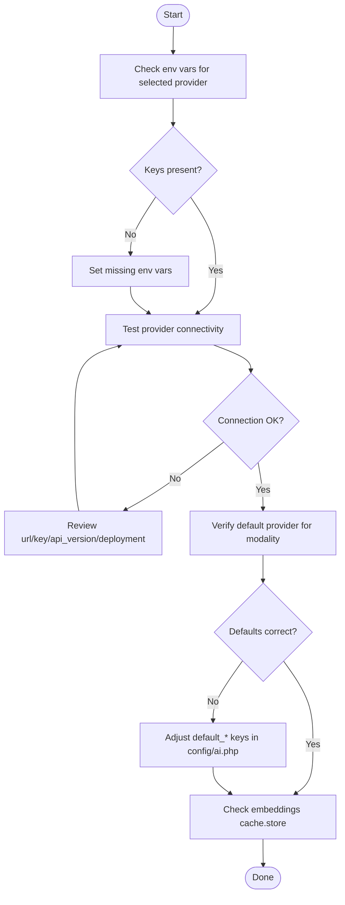
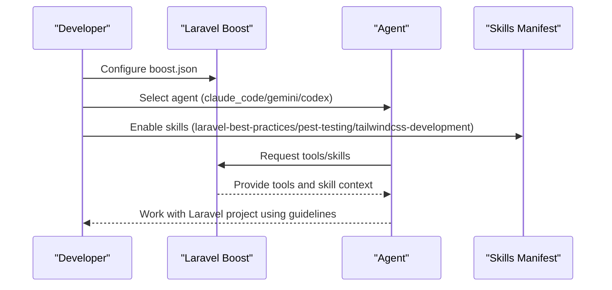
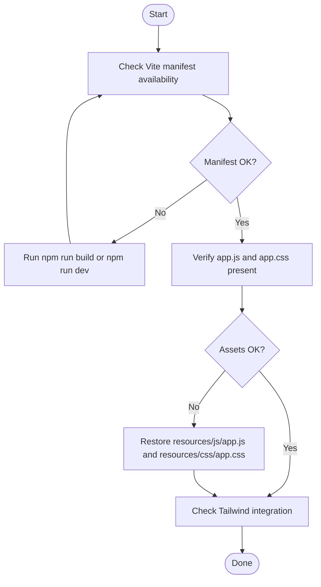
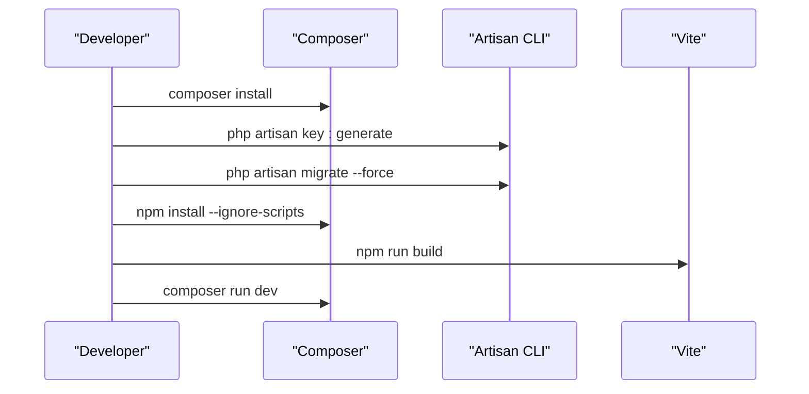
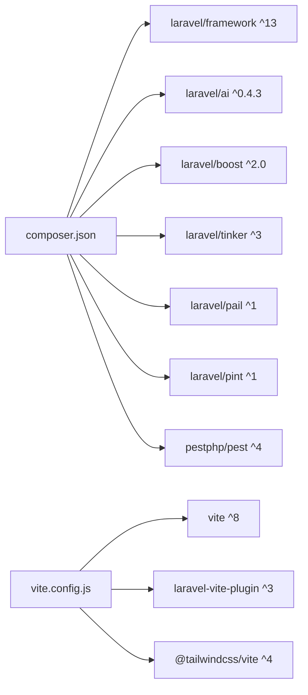

# Troubleshooting and FAQ

<cite>
**Referenced Files in This Document**
- [composer.json](file://composer.json)
- [package.json](file://package.json)
- [vite.config.js](file://vite.config.js)
- [config/app.php](file://config/app.php)
- [config/ai.php](file://config/ai.php)
- [config/services.php](file://config/services.php)
- [config/logging.php](file://config/logging.php)
- [config/database.php](file://config/database.php)
- [config/cache.php](file://config/cache.php)
- [config/queue.php](file://config/queue.php)
- [bootstrap/app.php](file://bootstrap/app.php)
- [routes/web.php](file://routes/web.php)
- [resources/js/app.js](file://resources/js/app.js)
- [AGENTS.md](file://AGENTS.md)
- [CLAUDE.md](file://CLAUDE.md)
- [GEMINI.md](file://GEMINI.md)
- [boost.json](file://boost.json)
- [README.md](file://README.md)
</cite>

## Table of Contents
1. [Introduction](#introduction)
2. [Project Structure](#project-structure)
3. [Core Components](#core-components)
4. [Architecture Overview](#architecture-overview)
5. [Detailed Component Analysis](#detailed-component-analysis)
6. [Dependency Analysis](#dependency-analysis)
7. [Performance Considerations](#performance-considerations)
8. [Troubleshooting Guide](#troubleshooting-guide)
9. [Conclusion](#conclusion)
10. [Appendices](#appendices)

## Introduction
This document provides a comprehensive troubleshooting and FAQ guide for Laravel Assistant development and deployment. It focuses on resolving environment setup issues, AI provider integration problems, agent development challenges, performance tuning, error resolution, and debugging techniques. It also explains how to diagnose and resolve common Laravel framework issues, AI service connectivity problems, and frontend build failures. Guidance is included for Laravel Boost integration, agent skill usage, and AI development workflows, along with diagnostic tools, log analysis techniques, and systematic approaches to problem resolution.

## Project Structure
Laravel Assistant is a Laravel 13 application with integrated AI capabilities and Laravel Boost. The structure emphasizes:
- Laravel core configuration under config/
- AI provider configuration under config/ai.php
- Frontend tooling via Vite and Tailwind CSS
- Laravel Boost integration via boost.json and agent skill manifests
- Scripts for setup and development in composer.json

**Diagram sources**
- [composer.json:1-93](file://composer.json#L1-L93)
- [vite.config.js:1-19](file://vite.config.js#L1-L19)
- [config/app.php:1-127](file://config/app.php#L1-L127)
- [config/ai.php:1-132](file://config/ai.php#L1-L132)
- [config/database.php:1-185](file://config/database.php#L1-L185)
- [config/cache.php:1-131](file://config/cache.php#L1-L131)
- [config/queue.php:1-130](file://config/queue.php#L1-L130)
- [config/logging.php:1-133](file://config/logging.php#L1-L133)
- [bootstrap/app.php:1-19](file://bootstrap/app.php#L1-L19)
- [routes/web.php:1-8](file://routes/web.php#L1-L8)
- [resources/js/app.js:1-2](file://resources/js/app.js#L1-L2)
- [AGENTS.md:1-155](file://AGENTS.md#L1-L155)
- [CLAUDE.md:1-155](file://CLAUDE.md#L1-L155)
- [GEMINI.md:1-155](file://GEMINI.md#L1-L155)
- [boost.json:1-17](file://boost.json#L1-L17)

**Section sources**
- [composer.json:1-93](file://composer.json#L1-L93)
- [vite.config.js:1-19](file://vite.config.js#L1-L19)
- [config/app.php:1-127](file://config/app.php#L1-L127)
- [config/ai.php:1-132](file://config/ai.php#L1-L132)
- [config/database.php:1-185](file://config/database.php#L1-L185)
- [config/cache.php:1-131](file://config/cache.php#L1-L131)
- [config/queue.php:1-130](file://config/queue.php#L1-L130)
- [config/logging.php:1-133](file://config/logging.php#L1-L133)
- [bootstrap/app.php:1-19](file://bootstrap/app.php#L1-L19)
- [routes/web.php:1-8](file://routes/web.php#L1-L8)
- [resources/js/app.js:1-2](file://resources/js/app.js#L1-L2)
- [AGENTS.md:1-155](file://AGENTS.md#L1-L155)
- [CLAUDE.md:1-155](file://CLAUDE.md#L1-L155)
- [GEMINI.md:1-155](file://GEMINI.md#L1-L155)
- [boost.json:1-17](file://boost.json#L1-L17)

## Core Components
- Laravel application bootstrap and routing are configured in bootstrap/app.php and routes/web.php.
- Application-wide settings (name, environment, debug, URL, timezone, encryption key) are defined in config/app.php.
- AI provider configuration and defaults are centralized in config/ai.php, including provider drivers, keys, and URLs.
- Database connections, Redis, and migration settings are defined in config/database.php.
- Cache store selection and driver configuration are in config/cache.php.
- Queue backends and failed job handling are configured in config/queue.php.
- Logging channels and levels are defined in config/logging.php.
- Frontend tooling uses Vite (laravel-vite-plugin) and Tailwind CSS in vite.config.js and package.json.
- Laravel Boost integration and agent skill activation are declared in boost.json and documented in AGENTS.md, CLAUDE.md, and GEMINI.md.

Key troubleshooting anchors:
- Environment variables for AI providers and services are loaded via env() in config files.
- Composer scripts orchestrate setup, development, and testing.
- Vite manifest and asset pipeline require npm run build or dev depending on environment.

**Section sources**
- [bootstrap/app.php:1-19](file://bootstrap/app.php#L1-L19)
- [routes/web.php:1-8](file://routes/web.php#L1-L8)
- [config/app.php:1-127](file://config/app.php#L1-L127)
- [config/ai.php:1-132](file://config/ai.php#L1-L132)
- [config/database.php:1-185](file://config/database.php#L1-L185)
- [config/cache.php:1-131](file://config/cache.php#L1-L131)
- [config/queue.php:1-130](file://config/queue.php#L1-L130)
- [config/logging.php:1-133](file://config/logging.php#L1-L133)
- [vite.config.js:1-19](file://vite.config.js#L1-L19)
- [package.json:1-18](file://package.json#L1-L18)
- [composer.json:1-93](file://composer.json#L1-L93)
- [boost.json:1-17](file://boost.json#L1-L17)
- [AGENTS.md:1-155](file://AGENTS.md#L1-L155)
- [CLAUDE.md:1-155](file://CLAUDE.md#L1-L155)
- [GEMINI.md:1-155](file://GEMINI.md#L1-L155)

## Architecture Overview
The system integrates Laravel’s framework with AI providers and a modern frontend toolchain. The development lifecycle is streamlined through Composer scripts and Vite.

**Diagram sources**
- [composer.json:1-93](file://composer.json#L1-L93)
- [bootstrap/app.php:1-19](file://bootstrap/app.php#L1-L19)
- [routes/web.php:1-8](file://routes/web.php#L1-L8)
- [config/app.php:1-127](file://config/app.php#L1-L127)
- [config/ai.php:1-132](file://config/ai.php#L1-L132)
- [config/database.php:1-185](file://config/database.php#L1-L185)
- [config/cache.php:1-131](file://config/cache.php#L1-L131)
- [config/queue.php:1-130](file://config/queue.php#L1-L130)
- [config/logging.php:1-133](file://config/logging.php#L1-L133)
- [vite.config.js:1-19](file://vite.config.js#L1-L19)
- [package.json:1-18](file://package.json#L1-L18)
- [boost.json:1-17](file://boost.json#L1-L17)
- [AGENTS.md:1-155](file://AGENTS.md#L1-L155)

## Detailed Component Analysis

### AI Provider Configuration and Connectivity
Common issues:
- Missing or invalid API keys per provider.
- Incorrect provider URL or endpoint overrides.
- Default provider mismatches for specific modalities (text, images, audio, embeddings).
- Embedding caching misconfiguration.

Resolution steps:
- Verify environment variables for each provider in config/ai.php.
- Confirm provider driver and key presence for the intended provider.
- Ensure default provider selections align with your workflow.
- Check cache.store for embeddings if caching is enabled.

**Diagram sources**
- [config/ai.php:1-132](file://config/ai.php#L1-L132)

**Section sources**
- [config/ai.php:1-132](file://config/ai.php#L1-L132)

### Laravel Boost Integration and Agent Skills
Common issues:
- Agent not recognized by Boost.
- Skills not activating or not visible to agents.
- MCP server not enabled or misconfigured.

Resolution steps:
- Confirm agent names and skills in boost.json.
- Ensure guidelines and MCP are enabled in boost.json.
- Verify agent-specific guidelines documents (CLAUDE.md, GEMINI.md) are present.
- Activate relevant skills in AGENTS.md when working in specific domains.

**Diagram sources**
- [boost.json:1-17](file://boost.json#L1-L17)
- [AGENTS.md:1-155](file://AGENTS.md#L1-L155)
- [CLAUDE.md:1-155](file://CLAUDE.md#L1-L155)
- [GEMINI.md:1-155](file://GEMINI.md#L1-L155)

**Section sources**
- [boost.json:1-17](file://boost.json#L1-L17)
- [AGENTS.md:1-155](file://AGENTS.md#L1-L155)
- [CLAUDE.md:1-155](file://CLAUDE.md#L1-L155)
- [GEMINI.md:1-155](file://GEMINI.md#L1-L155)

### Frontend Build Failures and Vite Issues
Common issues:
- Vite manifest not found during development.
- Missing assets or stale builds.
- Tailwind CSS not applied.

Resolution steps:
- Run npm run build or npm run dev as indicated by the Vite plugin configuration.
- Ensure resources/css/app.css and resources/js/app.js are present.
- Confirm Vite watch ignores storage/framework/views to avoid unnecessary rebuilds.
- Reinstall node_modules if dependencies appear inconsistent.

**Diagram sources**
- [vite.config.js:1-19](file://vite.config.js#L1-L19)
- [resources/js/app.js:1-2](file://resources/js/app.js#L1-L2)
- [package.json:1-18](file://package.json#L1-L18)

**Section sources**
- [vite.config.js:1-19](file://vite.config.js#L1-L19)
- [resources/js/app.js:1-2](file://resources/js/app.js#L1-L2)
- [package.json:1-18](file://package.json#L1-L18)

### Environment Setup and Composer Scripts
Common issues:
- Missing .env or ungenerated APP_KEY.
- Composer install failing due to PHP version or locked dependencies.
- Development server not starting or queue listener not running.

Resolution steps:
- Ensure .env exists and contains required keys for AI providers and services.
- Run composer install and key:generate as part of setup.
- Use composer run dev to start server, queue listener, logs, and Vite concurrently.
- For initial project creation, run post-create-project commands to generate key and migrate.

**Diagram sources**
- [composer.json:1-93](file://composer.json#L1-L93)

**Section sources**
- [composer.json:1-93](file://composer.json#L1-L93)

### Database and Queue Connectivity
Common issues:
- SQLite not initialized or permissions denied.
- MySQL/MariaDB/PostgreSQL connection failures.
- Redis connectivity or wrong connection names.
- Queue worker not processing jobs.

Resolution steps:
- Initialize sqlite database if using default connection.
- Verify host, port, database, username, and password for MySQL/MariaDB/PostgreSQL.
- Confirm Redis client, host, port, and database indices.
- Ensure QUEUE_CONNECTION is set appropriately and run queue:listen with proper tries and timeout.

**Section sources**
- [config/database.php:1-185](file://config/database.php#L1-L185)
- [config/queue.php:1-130](file://config/queue.php#L1-L130)

### Logging and Diagnostics
Common issues:
- Logs not written or rotated unexpectedly.
- Slack or Papertrail integrations not delivering notifications.
- Debug mode not enabling detailed error pages.

Resolution steps:
- Set LOG_CHANNEL and LOG_LEVEL appropriately.
- Configure Slack webhook URL and credentials for Slack channel logging.
- Configure Papertrail host/port if using remote syslog.
- Enable APP_DEBUG for detailed error pages during development.

**Section sources**
- [config/logging.php:1-133](file://config/logging.php#L1-L133)
- [config/app.php:1-127](file://config/app.php#L1-L127)

## Dependency Analysis
The application relies on Laravel 13, Laravel AI SDK, Laravel Boost, and Vite/Tailwind for frontend tooling. Composer scripts orchestrate setup and development. AI provider configuration is decoupled from framework configuration via config/ai.php.

**Diagram sources**
- [composer.json:1-93](file://composer.json#L1-L93)
- [vite.config.js:1-19](file://vite.config.js#L1-L19)

**Section sources**
- [composer.json:1-93](file://composer.json#L1-L93)
- [vite.config.js:1-19](file://vite.config.js#L1-L19)

## Performance Considerations
- Use appropriate CACHE_STORE and driver for production (Redis recommended).
- Tune queue retry_after and connection backoff settings for reliability.
- Enable database and job batching for large-scale operations.
- Monitor logs with daily rotation and critical-level alerts for production.
- Keep frontend assets optimized with Tailwind and Vite.

[No sources needed since this section provides general guidance]

## Troubleshooting Guide

### Environment Setup
- Missing .env or APP_KEY:
  - Copy .env.example to .env and run key:generate.
  - Ensure APP_DEBUG and APP_ENV are set appropriately.
- Composer install fails:
  - Verify PHP version meets minimum requirement.
  - Clear cache and reinstall dependencies.
- Initial migration failure:
  - Ensure database file exists for SQLite or credentials for MySQL/MariaDB/PostgreSQL.
  - Run migrate with graceful or force flags as needed.

**Section sources**
- [composer.json:1-93](file://composer.json#L1-L93)
- [config/app.php:1-127](file://config/app.php#L1-L127)
- [config/database.php:1-185](file://config/database.php#L1-L185)

### AI Provider Integration
- Provider not responding:
  - Confirm ANTHROPIC_API_KEY, OPENAI_API_KEY, GEMINI_API_KEY, etc., are set.
  - Verify provider URL and api_version for Azure OpenAI.
  - Check default provider assignments for text/images/audio/embeddings.
- Embeddings caching issues:
  - Disable cache or set cache.store to a valid database connection.

**Section sources**
- [config/ai.php:1-132](file://config/ai.php#L1-L132)

### Laravel Boost and Agent Skills
- Agent not recognized:
  - Verify agent names in boost.json.
- Skills not activating:
  - Ensure skills are enabled in boost.json and guidelines are present.
- MCP server issues:
  - Confirm MCP is enabled in boost.json.

**Section sources**
- [boost.json:1-17](file://boost.json#L1-L17)
- [AGENTS.md:1-155](file://AGENTS.md#L1-L155)
- [CLAUDE.md:1-155](file://CLAUDE.md#L1-L155)
- [GEMINI.md:1-155](file://GEMINI.md#L1-L155)

### Frontend Build Failures
- Vite manifest error:
  - Run npm run build or npm run dev.
  - Ensure resources/js/app.js and resources/css/app.css exist.
- Tailwind not applied:
  - Confirm @tailwind directives and Tailwind plugin are configured.
  - Reinstall node_modules if necessary.

**Section sources**
- [vite.config.js:1-19](file://vite.config.js#L1-L19)
- [resources/js/app.js:1-2](file://resources/js/app.js#L1-L2)
- [package.json:1-18](file://package.json#L1-L18)

### Database and Queue
- SQLite permission denied:
  - Ensure database/database.sqlite exists and is writable.
- MySQL/MariaDB/PostgreSQL connection refused:
  - Verify host, port, credentials, charset, and collation.
- Redis connectivity:
  - Check client, host, port, and database indices.
- Queue not processing:
  - Set QUEUE_CONNECTION and run queue:listen with appropriate tries and timeout.

**Section sources**
- [config/database.php:1-185](file://config/database.php#L1-L185)
- [config/queue.php:1-130](file://config/queue.php#L1-L130)

### Logging and Error Resolution
- Logs not appearing:
  - Set LOG_CHANNEL and LOG_LEVEL.
  - Configure Slack/Papertrail if using remote logging.
- Debug mode:
  - Enable APP_DEBUG for detailed error pages during development.

**Section sources**
- [config/logging.php:1-133](file://config/logging.php#L1-L133)
- [config/app.php:1-127](file://config/app.php#L1-L127)

### Development Workflow and Testing
- Running tests:
  - Use composer run test or php artisan test.
- Formatting and linting:
  - Use vendor/bin/pint to format PHP files.
- Pest tests:
  - Create and run tests with php artisan make:test and php artisan test.

**Section sources**
- [composer.json:1-93](file://composer.json#L1-L93)

### Reporting Bugs, Requests, and Contributing
- Security vulnerabilities:
  - Report to the maintainers via the contact described in README.
- Contributing:
  - Follow the contribution guidelines referenced in README.
- Code of Conduct:
  - Adhere to the Code of Conduct referenced in README.

**Section sources**
- [README.md:1-59](file://README.md#L1-L59)

## Conclusion
This guide consolidates actionable troubleshooting steps for Laravel Assistant across environment setup, AI provider integration, Laravel Boost usage, frontend builds, database and queue connectivity, logging, and development/testing workflows. Use the provided diagrams and section references to systematically diagnose and resolve issues, and adopt preventive measures such as validating environment variables, enabling debug mode during development, and keeping dependencies updated.

[No sources needed since this section summarizes without analyzing specific files]

## Appendices

### Quick Reference: Common Commands
- Setup: composer install, key:generate, migrate --force, npm install --ignore-scripts, npm run build
- Development: composer run dev
- Testing: composer run test or php artisan test
- Formatting: vendor/bin/pint --format agent

**Section sources**
- [composer.json:1-93](file://composer.json#L1-L93)

### Quick Reference: Environment Variables
- AI Providers: ANTHROPIC_API_KEY, OPENAI_API_KEY, GEMINI_API_KEY, AZURE_OPENAI_API_KEY, etc.
- Services: POSTMARK_API_KEY, RESEND_API_KEY, AWS_ACCESS_KEY_ID, etc.
- Database: DB_CONNECTION, DB_HOST, DB_PORT, DB_DATABASE, DB_USERNAME, DB_PASSWORD
- Cache: CACHE_STORE
- Queue: QUEUE_CONNECTION
- Logging: LOG_CHANNEL, LOG_LEVEL, LOG_SLACK_WEBHOOK_URL, PAPERTRAIL_URL, PAPERTRAIL_PORT

**Section sources**
- [config/ai.php:1-132](file://config/ai.php#L1-L132)
- [config/services.php:1-39](file://config/services.php#L1-L39)
- [config/database.php:1-185](file://config/database.php#L1-L185)
- [config/cache.php:1-131](file://config/cache.php#L1-L131)
- [config/queue.php:1-130](file://config/queue.php#L1-L130)
- [config/logging.php:1-133](file://config/logging.php#L1-L133)