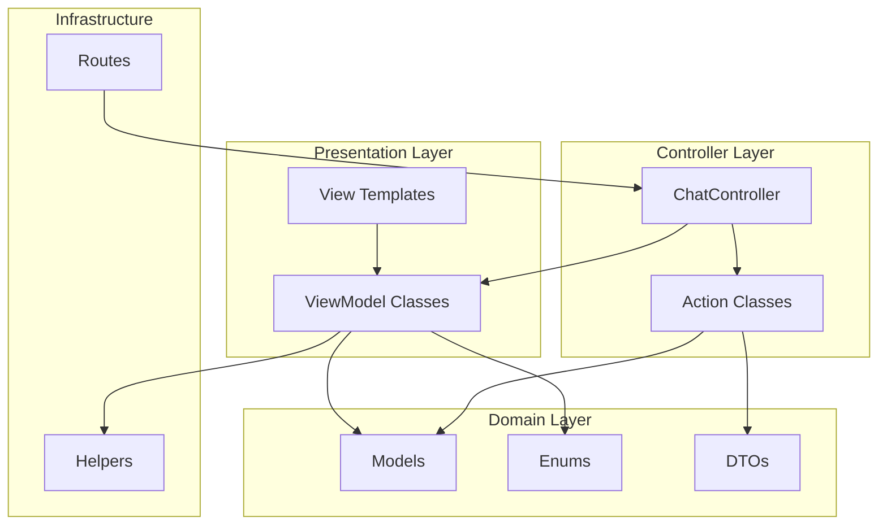
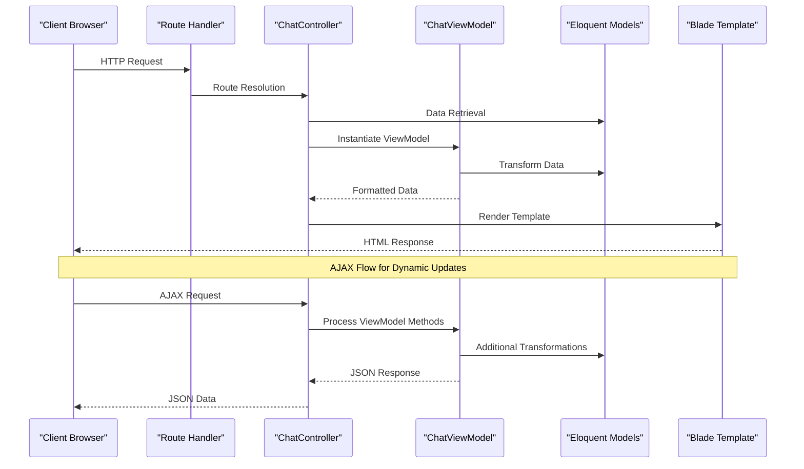
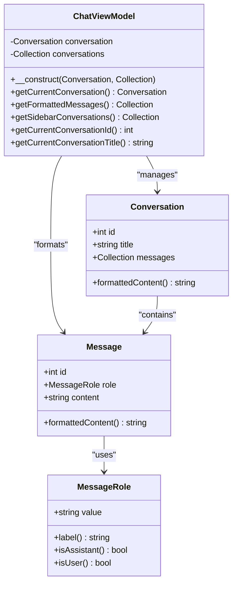
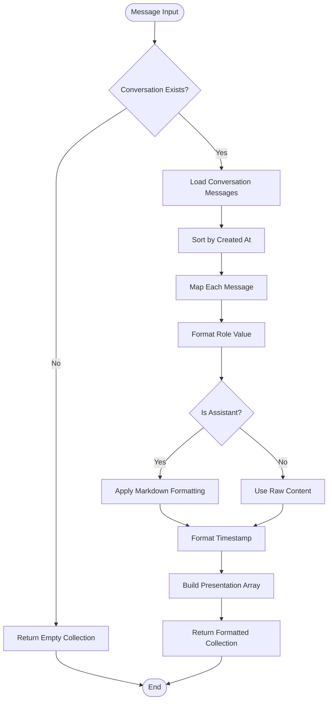

# ViewModel Specification

<cite>
**Referenced Files in This Document**
- [ChatViewModel.php](file://app/ViewModels/ChatViewModel.php)
- [ChatController.php](file://app/Http/Controllers/ChatController.php)
- [chat.blade.php](file://resources/views/chat.blade.php)
- [MessageRole.php](file://app/Enums/MessageRole.php)
- [Message.php](file://app/Models/Message.php)
- [Conversation.php](file://app/Models/Conversation.php)
- [web.php](file://routes/web.php)
- [ChatViewModelTest.php](file://tests/Feature/ChatViewModelTest.php)
</cite>

## Table of Contents
1. [Introduction](#introduction)
2. [Project Structure](#project-structure)
3. [Core Components](#core-components)
4. [Architecture Overview](#architecture-overview)
5. [Detailed Component Analysis](#detailed-component-analysis)
6. [ViewModel Implementation Details](#viewmodel-implementation-details)
7. [Data Transformation Patterns](#data-transformation-patterns)
8. [Integration Points](#integration-points)
9. [Testing Strategy](#testing-strategy)
10. [Performance Considerations](#performance-considerations)
11. [Best Practices](#best-practices)
12. [Conclusion](#conclusion)

## Introduction

This document provides a comprehensive specification for the ViewModel pattern implementation in the Laravel Assistant chat application. The ViewModel serves as a presentation layer abstraction that encapsulates data transformation logic, formatting operations, and computed properties specifically designed for the chat interface. It follows the principle of keeping controllers thin while providing rich, formatted data structures to the view layer.

The ViewModel pattern in this project focuses on transforming domain model data (Eloquent models) into presentation-ready formats, handling message formatting, conversation metadata computation, and UI-specific data transformations. This approach promotes separation of concerns, testability, and maintainability of the presentation logic.

## Project Structure

The ViewModel implementation is part of a larger MVC architecture with clear separation between presentation, business logic, and data access layers:



**Diagram sources**
- [ChatViewModel.php:1-120](file://app/ViewModels/ChatViewModel.php#L1-L120)
- [ChatController.php:1-154](file://app/Http/Controllers/ChatController.php#L1-L154)
- [web.php:1-16](file://routes/web.php#L1-L16)

**Section sources**
- [ChatViewModel.php:1-120](file://app/ViewModels/ChatViewModel.php#L1-L120)
- [ChatController.php:1-154](file://app/Http/Controllers/ChatController.php#L1-L154)
- [web.php:1-16](file://routes/web.php#L1-L16)

## Core Components

The ViewModel system consists of several interconnected components that work together to provide presentation-ready data:

### Primary ViewModel Class
The `ChatViewModel` class serves as the central orchestrator for chat interface data transformation, providing methods for:
- Message formatting and sorting
- Conversation metadata computation
- Current conversation identification
- Sidebar conversation preparation

### Supporting Infrastructure
- **MessageRole Enum**: Provides role-based formatting and labeling for chat participants
- **Message Model**: Handles content formatting and relationship management
- **Conversation Model**: Manages conversation lifecycle and message relationships
- **Action Classes**: Business logic orchestration for CRUD operations
- **Route Configuration**: Defines API endpoints for ViewModel integration

**Section sources**
- [ChatViewModel.php:29-120](file://app/ViewModels/ChatViewModel.php#L29-L120)
- [MessageRole.php:23-77](file://app/Enums/MessageRole.php#L23-L77)
- [Message.php:10-45](file://app/Models/Message.php#L10-L45)
- [Conversation.php:9-51](file://app/Models/Conversation.php#L9-L51)

## Architecture Overview

The ViewModel architecture follows a layered approach with clear boundaries between concerns:



**Diagram sources**
- [ChatController.php:24-43](file://app/Http/Controllers/ChatController.php#L24-L43)
- [ChatViewModel.php:59-102](file://app/ViewModels/ChatViewModel.php#L59-L102)
- [web.php:10-16](file://routes/web.php#L10-L16)

**Section sources**
- [ChatController.php:19-154](file://app/Http/Controllers/ChatController.php#L19-L154)
- [ChatViewModel.php:29-120](file://app/ViewModels/ChatViewModel.php#L29-L120)

## Detailed Component Analysis

### ChatViewModel Class Structure

The `ChatViewModel` class implements a comprehensive data transformation layer with specialized methods for different presentation needs:



**Diagram sources**
- [ChatViewModel.php:29-120](file://app/ViewModels/ChatViewModel.php#L29-L120)
- [Conversation.php:21-24](file://app/Models/Conversation.php#L21-L24)
- [Message.php:18-25](file://app/Models/Message.php#L18-L25)
- [MessageRole.php:23-77](file://app/Enums/MessageRole.php#L23-L77)

### Message Formatting Pipeline

The message formatting process involves multiple transformation steps:



**Diagram sources**
- [ChatViewModel.php:59-78](file://app/ViewModels/ChatViewModel.php#L59-L78)
- [Message.php:40-43](file://app/Models/Message.php#L40-L43)
- [MessageRole.php:64-75](file://app/Enums/MessageRole.php#L64-L75)

**Section sources**
- [ChatViewModel.php:59-102](file://app/ViewModels/ChatViewModel.php#L59-L102)
- [Message.php:40-43](file://app/Models/Message.php#L40-L43)
- [MessageRole.php:23-77](file://app/Enums/MessageRole.php#L23-L77)

## ViewModel Implementation Details

### Constructor and Initialization

The ViewModel constructor accepts optional parameters with intelligent defaults:

| Parameter | Type | Description | Default Behavior |
|-----------|------|-------------|------------------|
| `conversation` | `?Conversation` | Current conversation context | `null` - No active conversation |
| `conversations` | `?Collection` | Sidebar conversation list | `null` - Empty collection created |

### Method Signatures and Return Types

Each ViewModel method is designed with explicit return type declarations:

```php
// Message formatting method
public function getFormattedMessages(): Collection
{
    // Returns Collection<int, array{...}>
}

// Sidebar conversation method  
public function getSidebarConversations(): Collection
{
    // Returns Collection<int, array{...}>
}

// Identifier methods
public function getCurrentConversationId(): ?int
public function getCurrentConversationTitle(): ?string
```

**Section sources**
- [ChatViewModel.php:31-36](file://app/ViewModels/ChatViewModel.php#L31-L36)
- [ChatViewModel.php:59-118](file://app/ViewModels/ChatViewModel.php#L59-L118)

## Data Transformation Patterns

### Role-Based Content Formatting

The ViewModel implements sophisticated role-based content transformation:

| Role | Transformation Applied | Output Format |
|------|----------------------|---------------|
| `User` | Raw content preservation | Plain text |
| `Assistant` | Markdown to HTML conversion | Rich formatted content |

### Timestamp Formatting Strategy

Both user-visible and machine-readable timestamps are provided:

- **Human-readable**: Relative time expressions (e.g., "2 hours ago")
- **Machine-readable**: Standard time format (e.g., "3:45 PM")

### Active State Management

The sidebar conversation list includes active state detection:

```php
'is_active' => $this->conversation?->id === $conversation->id
```

**Section sources**
- [ChatViewModel.php:67-76](file://app/ViewModels/ChatViewModel.php#L67-L76)
- [ChatViewModel.php:93-101](file://app/ViewModels/ChatViewModel.php#L93-L101)

## Integration Points

### Controller Integration

The ViewModel integrates seamlessly with the controller layer:

```php
// Controller creates ViewModel with appropriate data
$viewModel = new ChatViewModel($conversation, $conversations);

// Controller passes ViewModel to view
return view('chat', [
    'viewModel' => $viewModel,
    'conversation' => $conversation,
    'messages' => $viewModel->getFormattedMessages(),
    'conversations' => $viewModel->getSidebarConversations(),
]);
```

### Route Configuration

The routing system supports both traditional and AJAX workflows:

| Route | Purpose | Response Type |
|-------|---------|---------------|
| `/chat` | Initial page load | HTML view |
| `/chat/{conversation}` | Specific conversation | HTML view |
| `/api/chat/{conversation}` | AJAX conversation load | JSON data |
| `/chat/message` | Message submission | JSON response |

**Section sources**
- [ChatController.php:24-43](file://app/Http/Controllers/ChatController.php#L24-L43)
- [web.php:10-16](file://routes/web.php#L10-L16)

## Testing Strategy

The ViewModel includes comprehensive test coverage focusing on:

### Core Functionality Tests

| Test Category | Coverage Area | Test Methods |
|---------------|---------------|--------------|
| Null State Handling | ViewModel initialization with no data | `testChatViewModelReturnsNullWhenNoConversation` |
| Message Formatting | Content transformation and role handling | `testChatViewModelFormatsMessagesCorrectly` |
| Sidebar Generation | Conversation list preparation | `testChatViewModelReturnsSidebarConversationsWithMetadata` |
| Active State Detection | Current conversation identification | `testChatViewModelMarksActiveConversationCorrectly` |

### Test Data Setup

Tests utilize Laravel's database refresh capabilities to ensure clean state:

```php
uses(RefreshDatabase::class);

// Test data creation
$conversation = Conversation::create(['title' => 'Test Chat']);
$userMsg = Message::create([...]);
$assistantMsg = Message::create([...]);
```

**Section sources**
- [ChatViewModelTest.php:12-119](file://tests/Feature/ChatViewModelTest.php#L12-L119)

## Performance Considerations

### Memory Optimization

The ViewModel employs lazy evaluation and collection-based processing to minimize memory overhead:

- **Deferred Loading**: Messages are processed only when requested
- **Collection Operations**: Efficient map/filter operations for data transformation
- **Minimal Object Creation**: Reuses existing model instances where possible

### Query Optimization

While the ViewModel itself doesn't execute queries, it works with pre-loaded data:

- **Eager Loading**: Controller ensures proper model loading
- **Single Responsibility**: Focuses solely on transformation, not retrieval
- **Caching Opportunities**: Potential for memoization of computed values

## Best Practices

### ViewModel Design Principles

1. **Single Responsibility**: Each ViewModel handles one presentation concern
2. **Immutable Data**: Transformations don't modify original model data
3. **Type Safety**: Explicit return types and parameter validation
4. **Testability**: Methods are easily unit testable in isolation

### Integration Guidelines

- **Controller Thin Principle**: Controllers delegate data transformation to ViewModels
- **Error Handling**: ViewModels should handle data validation and formatting errors
- **Performance Awareness**: Avoid expensive operations in frequently called methods
- **Extensibility**: Design allows for easy extension of formatting logic

### Security Considerations

- **Content Escaping**: Automatic escaping for user-generated content
- **Role Validation**: Proper role checking prevents unauthorized content access
- **Input Sanitization**: Markdown processing includes security configurations

## Conclusion

The ViewModel implementation in the Laravel Assistant chat application demonstrates a mature approach to presentation layer architecture. By encapsulating data transformation logic within dedicated ViewModel classes, the system achieves:

- **Clean Separation of Concerns**: Controllers remain thin, focused on request handling
- **Enhanced Testability**: Presentation logic is easily isolated and tested
- **Improved Maintainability**: Changes to presentation formatting don't affect business logic
- **Better Performance**: Optimized data transformation with efficient collection operations

The ChatViewModel serves as a robust foundation for the chat interface, providing flexible data transformation capabilities while maintaining strong type safety and comprehensive test coverage. This architecture pattern can serve as a blueprint for implementing similar presentation layer abstractions in other Laravel applications.